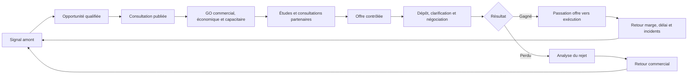

# SMART AO — CAHIER DIRECTEUR MÉTIER INTÉGRAL
## MASTER v2.0 — Source métier de profondeur du Product Freeze v2.0

**Date de consolidation : 24 septembre 2026**  
**Statut : RÉFÉRENCE MÉTIER ACTIVE — PROMUE AVEC LE PRODUCT FREEZE v2.0 LE 24 SEPTEMBRE 2026**  
**Nature : source métier de profondeur ; le Product Freeze v2.0 décide ce qui devient contrat produit**  
**Périmètre : besoin métier, décisions, risques, preuves, documents, règles d’applicabilité, économie, engagement contractuel, passation et retour d’expérience.**  
**Hors périmètre de ce document : choix de frameworks, bibliothèques, bases de données, modèles LLM, infrastructure détaillée, implémentation d’écran et code.**

> **RÈGLE DE SÉCURITÉ DOCUMENTAIRE.** Ce MASTER a été promu comme source métier de profondeur avec le Product Freeze v2.0. En cas de conflit de niveau produit, le Product Freeze v2.0 prévaut. Toute évolution ultérieure exige une décision propriétaire, une analyse d’impact, une mise à jour des références actives et des tests de non-régression métier.

---

# PARTIE I — RÉFÉRENCE MÉTIER ACTIVE

## 0. Pourquoi ce MASTER existe

Les documents historiques de SMART AO ont produit trois niveaux de connaissance différents :

1. le **cahier des charges métier v1.0**, très détaillé sur la réalité d’une PME BTP, le GO/NO-GO, l’économie, la capacité, les interfaces, les partenaires, le public/privé, l’offre, la passation et le retour d’expérience ;
2. l’**univers documentaire métier v1.0**, très détaillé sur les pièces, preuves, modèles, validités, documents nécessaires au prix et règles de constitution du pli ;
3. les **Owner Freeze / Decision Freeze / Owner Consolidated**, qui ont transformé une partie de cette matière en décisions produit et en règles de gouvernance destinées au futur Product Freeze et au cahier technique.

Le risque identifié en septembre 2026 est qu’une consolidation plus courte puisse préserver l’intention générale tout en perdant des subtilités métier capables de coûter de la marge, de la trésorerie ou un droit contractuel à l’entreprise.

Le présent MASTER adopte donc la doctrine inverse :

> **aucune simplification de produit ne doit faire disparaître un risque métier démontré.**

Lorsqu’une information n’est pas encore implémentable ou commercialisable, elle demeure dans le cahier avec un statut `À TESTER`, `VALIDATION EXTERNE`, `V1.x` ou `HORS PROMESSE`, plutôt que d’être supprimée.

### 0.1 Sources fusionnées

Le document absorbe comme sources de travail :

- `SMART_AO_Cahier_des_charges_Metier_v1.0.md` — colonne vertébrale métier ;
- `SMART_AO_Univers_documentaire_metier_v1.0.md` — référentiel documentaire et MIRP ;
- `SMART_AO_Cahier_Directeur_Produit_Metier_OWNER_CONSOLIDATED_v0.4.md` — arbitrages propriétaire et règles métier déjà figées ;
- `SMART_AO_Cahier_Directeur_Produit_Metier_OWNER_DECISION_FREEZE_v0.2.md` — historique de décisions ;
- `SMART_AO_Cahier_Directeur_Produit_Metier_OWNER_FREEZE_v0.1.md` — origine du socle directeur ;
- le contre-audit réglementaire et contractuel effectué les 23–24 septembre 2026 sur sources officielles françaises.

### 0.2 Règle de prévalence interne du présent MASTER

En cas de contradiction à l’intérieur de ce fichier :

1. les règles de la **Partie I** et les mises à jour 2026 prévalent ;
2. les décisions propriétaire explicitement marquées `FIGÉ` sont conservées sauf réouverture explicite ;
3. les textes historiques intégrés en Parties II et III servent de preuve de couverture et de détail ;
4. une règle juridique générique ne prévaut jamais silencieusement sur le contrat réellement applicable à l’affaire ;
5. une donnée inconnue reste inconnue ; une absence de preuve n’est jamais convertie en conformité.

### 0.3 Convention d’état

- **FIGÉ / HÉRITÉ OWNER** : décision déjà arbitrée dans Owner Consolidated v0.4 ;
- **ÉTABLI** : besoin métier confirmé par source officielle, corpus ou pratique documentée ;
- **PROPOSITION C1** : ajout recommandé comme blocage/risque majeur, à arbitrer ;
- **PROPOSITION C2** : ajout majeur mais pouvant suivre le socle ;
- **HYPOTHÈSE MÉTIER** : à tester sur affaires réelles ;
- **VALIDATION EXTERNE** : expert requis avant automatisation ou promesse ;
- **FUTURE** : règle publiée mais non encore applicable à la date de référence ;
- **REVIEW_REQUIRED** : le logiciel doit s’abstenir de conclure et demander une revue humaine.

---

# 1. Vision métier et promesse propriétaire

## 1.1 Question fondamentale

SMART AO doit aider le dirigeant à répondre de manière défendable à la question :

> **Cette affaire mérite-t-elle notre effort commercial, pouvons-nous la gagner, la financer, l’exécuter correctement, protéger nos droits et conserver la marge prévue ?**

L’ajout **« protéger nos droits »** est volontaire. Il complète le cahier historique : une affaire peut être techniquement bien étudiée et économiquement saine à l’offre, puis devenir déficitaire si l’entreprise perd un droit à paiement, une prolongation, une réclamation ou une preuve contractuelle pendant l’exécution.

## 1.2 Ce que SMART AO doit permettre

SMART AO doit permettre à une PME BTP de :

1. détecter ou recevoir une opportunité ;
2. comprendre exactement ce que le dossier exige ;
3. identifier ce qui manque, se contredit ou reste incertain ;
4. déterminer quelles règles et obligations sont réellement applicables à l’affaire ;
5. rapprocher les exigences des capacités réelles de l’entreprise ;
6. traduire les textes du DCE en impacts chantier, coûts, délais, moyens, responsabilités et preuves ;
7. détecter ce qui modifie prix, marge, trésorerie, capacité, assurance, planning ou exposition contractuelle ;
8. décider `GO`, `GO sous conditions`, `ATTENTE`, `NO-GO` ou `ABANDON` ;
9. organiser tâches, questions, consultations et validations ;
10. construire une offre cohérente, prouvée et chiffrée ;
11. transformer chaque promesse sensible de l’offre en engagement traçable ;
12. protéger la confidentialité Patron/Collaborateur ;
13. préparer et contrôler la version exacte remise ;
14. conserver la preuve de ce qui a effectivement été transmis ;
15. revalider tout changement lors des clarifications, négociations et mises au point ;
16. transmettre au chantier le contrat réellement vendu ;
17. transmettre aussi le **calendrier de préservation des droits** : OS, réserves, réclamations, décompte, réception, garanties et échéances sensibles ;
18. rapprocher prévu et réalisé pour améliorer les décisions futures.

## 1.3 Positionnement métier

SMART AO n’est pas :

- un chatbot documentaire ;
- un générateur générique de mémoire technique ;
- un ERP chantier ;
- un logiciel qui fixe seul le prix ;
- un avocat automatique ;
- un moteur qui déclare une conformité juridique universelle ;
- une simple GED ;
- un score opaque de GO/NO-GO ;
- une IA qui remplace le Patron, le métreur, le conducteur, le QSE, le DAF, le courtier ou le juriste.

SMART AO est :

> **un poste de commandement d’ingénierie DCE et de décision d’engagement pour PME BTP, centré sur l’Affaire, la preuve, l’applicabilité, l’impact chantier, la décision humaine, la protection de la marge et la préservation des droits.**

---

# 2. Client, cadre et frontières

## 2.1 Client initial — HÉRITÉ OWNER

- cœur de cible : **PME BTP françaises de 10 à 100 personnes** ;
- TPE et entreprises plus grandes restent compatibles mais ne pilotent pas les choix initiaux ;
- qualification terrain : au minimum un pilote entreprise générale/multi-métiers et un pilote entreprise spécialisée technique.

## 2.2 Public / privé — HÉRITÉ OWNER

- public et privé sont natifs dans le modèle ;
- la promesse V1 doit être prioritairement qualifiée sur la commande publique ;
- le privé existe nativement mais aucune équivalence de couverture ne doit être promise avant corpus privé diversifié et validation construction.

## 2.3 Frontière avec le chantier

SMART AO ne devient pas un ERP d’exécution. En revanche il doit aller assez loin pour protéger la décision d’engagement :

- ce qui est vendu ;
- ce qui doit être mobilisé ;
- ce qui doit être prouvé ;
- ce qui doit être surveillé ;
- ce qui doit être réservé ou notifié ;
- ce qui doit être transmis au conducteur ;
- ce qui devra revenir au REX.

Cette frontière est essentielle : **ne pas gérer le chantier ne signifie pas ignorer les conséquences chantier.**

---

# 3. Modèle d’autorité et confidentialité

## 3.1 Patron

Le Patron :

- définit les orientations ;
- arbitre GO/NO-GO ;
- contrôle prix, marge, prix plancher, trésorerie et exposition ;
- accepte ou refuse les hypothèses critiques ;
- décide les dérogations ;
- valide les engagements sensibles ;
- approuve solidarités, garanties, risques partenaires et expositions inhabituelles ;
- autorise l’offre et le dépôt ;
- arbitre les risques contractuels qui dépassent les seuils internes ;
- décide si une validation juridique, assurantielle ou financière externe est nécessaire.

## 3.2 Collaborateur / responsable d’offre

Le Collaborateur prépare, contrôle, coordonne, documente et remonte. Il n’obtient jamais par simple nécessité opérationnelle le droit de lire les marges, prix d’achat sensibles, scénarios de trésorerie Direction, notes privées Patron ou évaluations confidentielles de partenaires.

## 3.3 Experts internes et externes

Métreur, conducteur, QSE, DAF, administratif, achats, juriste, courtier, assureur, laboratoire ou autre expert ne reçoit que le périmètre nécessaire. Leur avis ne se transforme pas automatiquement en décision Patron.

## 3.4 Règle d’autorité

Une décision critique doit porter : auteur, rôle, date, objet, portée, version de l’affaire, preuve consultée, conditions, éventuelle date d’expiration et motif de réouverture.

---

# 4. L’Affaire et la Mémoire Entreprise

## 4.1 L’Affaire

L’Affaire est l’unité de décision. Elle contient ou relie au minimum :

- acheteur / maître d’ouvrage ;
- consultation, lots, tranches, PSE, options et variantes ;
- versions DCE et rectificatifs ;
- sources, preuves et applicabilité ;
- inconnus, hypothèses et contradictions ;
- MIRP ;
- critères et stratégie ;
- prix et facteurs de coût ;
- cash et garanties ;
- capacité et charge ;
- partenaires ;
- engagements de l’offre ;
- risques contractuels ;
- profil réglementaire ;
- tâches, questions et échéances ;
- décisions P0–P7 ;
- paquet remis et preuve ;
- résultat ;
- passation ;
- événements de préservation des droits ;
- retour d’expérience.

## 4.2 Mémoire Entreprise

La Mémoire Entreprise contient les faits réutilisables avec leur preuve, contexte, validité et confidentialité : identité, pouvoirs, assurances, qualifications, références, personnel, compétences, matériel, QSE, fournisseurs, sous-traitants, méthodes, produits, modèles, historiques, prix internes, rendements, incidents et REX.

Une information historique ne devient jamais une vérité universelle. Un rendement, un prix ou une appréciation doit conserver son contexte : métier, zone, type d’ouvrage, quantité, période, site, équipe, conditions et niveau de confiance.

---

# 5. Cycle P0–P7 et décisions

Le cycle P0–P7 historique est conservé.

| Porte | Décision Patron | Enrichissement MASTER v2.0 |
|---|---|---|
| P0 — Cibler | l’opportunité mérite-t-elle une action ? | légalité/éthique de l’intelligence commerciale, valeur stratégique |
| P1 — Ouvrir | investir dans ce DCE ? | complétude initiale, échéance, versions, incompatibilité immédiate |
| P2 — GO de principe | voie crédible pour candidater et gagner ? | profil réglementaire, assurance de principe, dépendances, partenaires, régime contractuel |
| P3 — GO économique | rentable, finançable et soutenable ? | exposition pénalités, garanties, résiliation, post-réception, HSE, mismatch indices/fournisseurs, portefeuille cash/charge |
| P4 — Autoriser l’offre | offre cohérente et réalisable ? | engagements mesurables, assurance/prestation, obligations environnement/social, dérogations acceptées |
| P5 — Autoriser le dépôt | cette version exacte peut partir ? | manifeste, empreinte, signataire, formats, preuve et marge de temps |
| P6 — Accepter mise au point | changements encore acceptables ? | revalidation prix/cash/capacité/contrat/assurance/droits |
| P7 — Lancer l’exécution | chantier connaît-il exactement le contrat vendu ? | calendrier droits/OS/DGD, pénalités, engagements, paiement, réception, conditions du GO |

Chaque porte conclut `GO`, `GO_SOUS_CONDITIONS`, `ATTENTE`, `NO_GO` ou `ABANDON`. Aucun score ne franchit une porte à lui seul.

---

# 6. La Carte d’Engagement de l’Affaire — sortie patronale centrale

Le résultat de SMART AO ne doit pas être une liste d’alertes ni une note sur 100. Le dirigeant doit recevoir une **Carte d’Engagement de l’Affaire**.

## 6.1 Douze axes obligatoires

1. intérêt commercial ;
2. éligibilité et candidature ;
3. périmètre technique ;
4. constructibilité et logistique ;
5. contrat et exposition juridique/contractuelle ;
6. prix, marge et sensibilité ;
7. trésorerie, garanties et financement ;
8. capacité, charge et ressources ;
9. fournisseurs, sous-traitants et cotraitants ;
10. HSE, environnement et réglementation ;
11. obligations documentaires et engagements de l’offre ;
12. préservation des droits, réception et sortie du contrat.

## 6.2 Anatomie d’un risque

Chaque point critique doit afficher :

- **fait/source** ;
- version du document ;
- locator/page/article/cellule lorsque disponible ;
- applicabilité ;
- certitude / inconnu ;
- conséquence technique ;
- conséquence prix/marge ;
- conséquence délai ;
- conséquence trésorerie ;
- conséquence contractuelle ;
- responsable ;
- action ;
- échéance ;
- preuve attendue ;
- décision humaine nécessaire ;
- risque résiduel après traitement.

## 6.3 GO sous conditions

Le logiciel doit être capable de restituer, par exemple :

> **GO SOUS CONDITIONS** : rentable dans le scénario central, mais sous réserve d’obtenir la prolongation du devis fournisseur, de confirmer la couverture assurantielle de la technique X, de clarifier l’interface lot 05/07, d’intégrer le pic de trésorerie lié à la retenue, de réserver l’équipe critique, d’obtenir le RAT applicable, de chiffrer l’engagement d’astreinte et de faire arbitrer la dérogation au plafond de pénalités.

Chaque condition doit avoir responsable, date et preuve de levée. Une condition critique non levée réouvre la porte correspondante.

---

# 7. Réception du DCE, versions et rectificatifs

Les règles historiques sont maintenues et renforcées :

- inventaire de toutes les archives et sous-archives ;
- détection des pièces annoncées mais absentes ;
- classification sans présumer la lisibilité ;
- conservation de l’original ;
- hash/version/locator ;
- rectificatif non destructif ;
- analyse d’impact ciblée ;
- invalidation des conclusions dépendantes ;
- refus d’affirmer « dossier analysé » si une pièce critique est illisible ou non extraite.

Le rectificatif tardif doit pouvoir invalider un statut `PRÊT` et rouvrir P3/P4/P5 si prix, délai, engagement, garantie, critère ou pièce de remise sont touchés.

---

# 8. Profil réglementaire dynamique de l’affaire — PROPOSITION C1

## 8.1 Finalité

SMART AO ne doit pas chercher seulement des mots comme « amiante », « RE2020 », « insertion » ou « PPSPS ». Il doit d’abord qualifier **le contexte d’applicabilité**.

Créer l’objet métier `REGULATORY_PROFILE`.

## 8.2 Faits d’entrée

- public / privé ;
- objet et nature des travaux ;
- bâtiment / ouvrage de génie civil / infrastructure / réseau ;
- neuf / existant / réhabilitation / démolition ;
- année de construction ;
- destination/usage ;
- surface ;
- ERP, site occupé, établissement sensible ;
- localisation ;
- montant et durée ;
- nombre d’entreprises ;
- sous-traitance ;
- substances/diagnostics connus ;
- permis, déclaration ou date de consultation lorsque pertinent ;
- statut de l’acheteur et procédure.

## 8.3 Contrat de règle vivante

Chaque règle réglementaire doit porter :

`source_authority`, `source_url`, `source_version`, `publication_date`, `effective_from`, `effective_until`, `scope`, `exceptions`, `required_facts`, `human_validator`, `last_reviewed`, `next_review`.

La règle peut être `ACTIVE`, `FUTURE`, `EXPIRED`, `UNKNOWN_APPLICABILITY` ou `REVIEW_REQUIRED`.

## 8.4 Exemples vérifiés 2026

- seuil européen travaux/concessions : **5 404 000 € HT** pour 2026–2027 ;
- seuil de dispense de publicité et mise en concurrence pour certains marchés de travaux : **100 000 € HT** depuis le 1er janvier 2026, sans supprimer les autres obligations de bonne utilisation des deniers publics ni les règles particulières ;
- extension RE2020 au **1er mai 2026** à plusieurs catégories : hôtels, restaurants, commerces, crèches, universités, hôpitaux, EHPAD, gymnases, bâtiments industriels/artisanaux et aérogares ;
- entrée en vigueur au **1er juillet 2026** de l’arrêté RAT amiante pour certains ouvrages de génie civil, infrastructures de transport et réseaux divers ;
- nouvelles exigences environnementales/sociales de l’article 35 de la loi Climat et résilience à partir du **22 août 2026** ;
- réforme de facturation électronique B2B démarrée le **1er septembre 2026** ;
- future obligation de vigilance du maître d’ouvrage envers certains sous-traitants acceptés : article L.8222-1-1, entrée en vigueur fixée par décret et au plus tard le **26 décembre 2026** ; à la date du MASTER, traiter comme `FUTURE` tant que la date réglementaire effective n’est pas confirmée autrement.

Aucune de ces règles ne doit être appliquée sans qualification de son champ et de ses exceptions.

---

# 9. Éligibilité, candidature et portefeuille de preuves

Le dossier administratif fonctionne comme un portefeuille de preuves, non comme un dossier de PDF réutilisés aveuglément.

Chaque exigence candidature doit être reliée à : source, titulaire, autorité émettrice, date, expiration, périmètre, lot, entreprise/groupement concerné, dépendance à un tiers et statut.

Contrôles : motifs d’exclusion, chiffre d’affaires, références, effectifs, qualifications, moyens, assurances, pouvoirs, capacités tierces, groupement, sous-traitance déclarée, limitation de lots, signature et tout document propre au RC.

Une preuve est `VALID_FOR_SCOPE`, `EXPIRED`, `WRONG_HOLDER`, `WRONG_SCOPE`, `MISSING`, `NOT_REQUIRED`, `REVIEW_REQUIRED` ; le logiciel ne déclare jamais « conforme » par simple présence du fichier.

---

# 10. Analyse technique, constructibilité et réalité chantier

SMART AO doit traduire le dossier en réalité d’exécution.

Pour chaque prescription importante :

`exigence → méthode → moyens → interfaces → séquence → contraintes → coût → délai → preuve → responsable`.

## 10.1 Constructibilité

Revoir notamment :

- accès et emprises ;
- base vie et installations ;
- stockage ;
- circulation ;
- levage et manutention ;
- ouvrages provisoires ;
- protections ;
- préfabrication ;
- temps de cure/séchage ;
- fenêtres de coupure ;
- consignations ;
- continuité de service ;
- horaires ;
- phasage ;
- remise en état ;
- essais et mise en service ;
- formation client ;
- DOE/DIUO.

Une solution techniquement possible mais incompatible avec l’accès, le calendrier ou les autorisations reste un risque de GO.

---

# 11. MIRP — minimum d’information requis pour un prix défendable

Le principe du cahier historique est conservé : la complétude documentaire légale et la complétude nécessaire au prix sont deux choses différentes.

Une information absente peut ne pas rendre l’offre irrégulière mais rendre le prix dangereux.

SMART AO doit déterminer pour chaque corps d’état quelles données sont :

- `R` : requises pour comprendre le périmètre ;
- `C` : critiques pour chiffrer ;
- `P1/P2/P3` : niveaux croissants de précision selon la taxonomie historique ;
- disponibles ;
- absentes ;
- contradictoires ;
- remplacées par hypothèse Patron ;
- à questionner à l’acheteur.

Les matrices détaillées par corps d’état du référentiel documentaire historique restent intégrées en Partie III du présent MASTER.

---

# 12. Interfaces de lots et coûts invisibles

Créer une matrice transversale : prestation, localisation, phase, lot présumé responsable, lot dépendant, texte source, plan source, inclusion dans prix, responsable de contrôle, contradiction et état de clarification.

Familles obligatoires :

- percements, rebouchages et réservations ;
- supports et scellements ;
- alimentations électriques ;
- régulation ;
- raccordements ;
- essais ;
- levage ;
- protections ;
- nettoyage ;
- évacuation ;
- synthèse ;
- DOE ;
- remise en état ;
- branchements ;
- installation commune ;
- signalisation ;
- maintien des accès/réseaux ;
- études et visas ;
- contrôles ;
- exploitation.

Une prestation décrite dans le CCTP mais absente de la DPGF ne devient jamais automatiquement « hors prix ».

---

# 13. GO économique, marge et trésorerie

## 13.1 Quatre décisions séparées

1. **marge** après coûts, frais chantier, frais généraux affectés, risques et financement ;
2. **trésorerie** : pic négatif, date, durée, causes ;
3. **résistance** : sensibilité à achats, délai, paiement, productivité, ressource, variante ;
4. **valeur attendue** : effort de réponse, intérêt stratégique et probabilité utilisée comme hypothèse, jamais comme certitude.

## 13.2 Cash-flow affaire

Décaissements : paie, intérim, matériaux, énergie, matériel, transport, levage, sous-traitance, études, essais, assurance, banques, installations, stocks, acomptes fournisseurs, TVA pertinente et aléas.

Encaissements : avance, acomptes/situations, retenues, paiement direct/délégation, révision/actualisation, solde et garanties.

Le résultat Patron est le pic de trésorerie négative, pas seulement la marge finale.

## 13.3 Portefeuille

**PROPOSITION C2.** Simuler les combinaisons d’attribution : A ; A+B ; A+B+C. Agréger cash, garanties, encadrement, équipes, engins, mêmes fournisseurs, même période de pointe et engagements nominaux.

---

# 14. Prix, révision et exposition fournisseurs

## 14.1 Audit de la clause de prix

Pour chaque famille de prix : ferme, actualisable ou révisable ; date/mois zéro ; index ; source ; formule ; part fixe ; périodicité ; coefficient ; arrondi ; remplacement d’indice ; publication tardive ; révision négative ; déclencheur ; exclusions ; date d’effet.

L’article R.2112-14 du Code de la commande publique impose notamment une clause de révision pour certains marchés de plus de trois mois nécessitant une part importante de fournitures dont le prix est directement affecté par les cours mondiaux.

## 14.2 Mismatch de couverture

Comparer :

`PROTECTION_CONTRACTUELLE_CLIENT` ↔ `EXPOSITION_ACHATS_RÉELLE`.

Un indice BT/TP ne « protège » pas automatiquement une entreprise si son panier d’achat réel, sa période d’achat ou son fournisseur évolue différemment.

Un devis fournisseur expirant avant notification ou achat doit rester incertain.

---

# 15. Capacité réelle à exécuter

Comparer le calendrier probable avec :

- chantiers signés ;
- affaires probables ;
- réponses en cours ;
- bureau d’études ;
- conducteurs ;
- chefs et compagnons ;
- compétences rares ;
- congés ;
- formation ;
- maintenance engins ;
- astreintes ;
- distance et déplacements ;
- matériels spécifiques ;
- fournisseurs/sous-traitants réellement réservés.

Une ressource nommée dans l’offre est un engagement potentiel et doit être distinguée d’une ressource générique remplaçable.

---

# 16. Fournisseurs, sous-traitants et groupements

## 16.1 Comparaison à périmètre constant

Conserver : version DCE envoyée, postes/quantités, exclusions, variantes, performances, marques, délais, validité, transport, levage, emballage, stockage, mise en service, paiement, garanties, révision, disponibilité et conformité.

## 16.2 Sous-traitance

Suivre : prestation, montant, acceptation, agrément de paiement, paiement direct/garantie lorsque applicable, capacité, assurances, vigilance, travail détaché, carte BTP, remplacement et dépendance planning.

La collecte d’une attestation ne vaut jamais validation juridique du montage.

## 16.3 Vigilance 2026

La future obligation issue de la loi n°2026-534 concernant le maître d’ouvrage doit rester versionnée et datée. SMART AO doit être capable de gérer une règle publiée mais `FUTURE` sans la déclencher avant son entrée en vigueur.

## 16.4 Groupement

Afficher forme, mandat, solidarité, répartition, paiements, responsabilités, assurances, pouvoirs, gouvernance, réclamations et cas de défaillance. Toute solidarité hors périmètre propre requiert arbitrage Patron.

---

# 17. Marchés publics et privés : reconstruire le contrat réellement accepté

SMART AO doit reconstruire le contrat, pas importer des habitudes.

## 17.1 Public

Identifier : procédure, pièces contractuelles, CCAG réellement visé et sa version, CCTG/fascicules cités, CCAP/CCP, AE, prix, calendrier, réponses acheteur, mise au point et avenants.

## 17.2 Privé

Identifier : qui contracte avec qui, devis/offre, commande, marché, conditions particulières/générales, plans, planning, échanges acceptés, norme contractuelle seulement si incorporée, sous-traitance, garantie de paiement, retenue, réception et hiérarchie.

NF P 03-001 n’est jamais présumée applicable et ses contenus protégés ne sont pas ingérés sans droit approprié.

---

# 18. Moteur « règle de référence → dérogation → impact » — PROPOSITION C1

Une règle générale n’est jamais appliquée avant confirmation que le contrat l’intègre.

Créer la chaîne :

`REFERENCE_RULE → CONTRACT_REFERENCE → PARTICULAR_OVERRIDE → APPLICABILITY → BUSINESS_IMPACT → HUMAN_DECISION`.

Exemples de catégories :

- délais ;
- pénalités ;
- avances ;
- retenues ;
- garanties ;
- prix ;
- OS ;
- modifications ;
- réception ;
- règlement des comptes ;
- réclamations ;
- assurance ;
- résiliation ;
- propriété intellectuelle ;
- environnement/social.

Si le CCAP déroge explicitement au CCAG, la sortie Patron doit montrer la protection par défaut et la dérogation, puis recalculer l’exposition.

---

# 19. Registre complet des pénalités et sanctions — PROPOSITION C1

Le mot « pénalité » est insuffisant. Créer un objet `CONTRACTUAL_SANCTION`.

## 19.1 Familles

- retard global ;
- jalons intermédiaires ;
- documents ;
- études/plans/visas ;
- DOE/DIUO ;
- réserves ;
- réunions ;
- remplacement de personnel ;
- SLA/astreinte ;
- disponibilité ;
- sécurité ;
- insertion ;
- environnement ;
- déchets/traçabilité ;
- propreté ;
- reporting ;
- preuve sous-traitant ;
- autres sanctions contractuelles.

## 19.2 Fiche

- source ;
- déclencheur ;
- unité ;
- formule ;
- base ;
- franchise ;
- plafond ;
- exonération ;
- cumul ;
- contradictoire/mise en demeure ;
- dérogation ;
- événement exonératoire ;
- responsable ;
- recours partenaire ;
- exposition centrale ;
- stress ;
- maximum contractuel identifiable ;
- incertitudes.

## 19.3 Garde-fou

Les plafonds et franchises des CCAG récents sont des stipulations contractuelles lorsque le CCAG concerné est applicable, pas une loi générale. Ne jamais coder « 10 % » ou « 1 000 € » comme vérité universelle.

---

# 20. Préservation des droits, forclusion et calendrier contractuel — PROPOSITION C1 PRIORITAIRE

## 20.1 Pourquoi ce domaine devient central

L’entreprise peut avoir raison économiquement et techniquement et perdre un droit faute de forme, destinataire ou délai.

Les règles varient selon le texte incorporé et sa version. Exemple vérifié : la DAJ rappelle que les CCAG Travaux/MOE 2021 prévoient un mémoire portant sur le décompte général dans les trente jours ; une décision du Conseil d’État de 2024 concernant un marché sous CCAG Travaux 2009 rappelle un délai contractuel de quarante-cinq jours et l’exigence de notification aux destinataires prévus.

Aucun délai générique ne doit être codé sans source de l’affaire.

## 20.2 Objet `RIGHT_PRESERVATION_EVENT`

Champs :

- type d’événement ;
- source contractuelle ;
- version ;
- dérogation ;
- date de réception/constat ;
- trigger date ;
- méthode de calcul du délai ;
- deadline ;
- destinataires ;
- forme ;
- contenu minimal ;
- chef de réclamation ;
- montant si applicable ;
- pièces justificatives ;
- responsable ;
- preuve d’envoi ;
- preuve de réception ;
- statut ;
- conséquence potentielle ;
- avis externe requis.

États : `OPEN`, `DUE_SOON`, `DUE`, `SENT`, `ACKED`, `DISPUTED`, `EXPIRED`, `REVIEW_REQUIRED`.

## 20.3 Événements à couvrir

- ordre de service ;
- réserve à OS ;
- OS non valorisé ;
- prix nouveau/provisoire ;
- prolongation de délai ;
- événement perturbateur ;
- prestation supplémentaire ;
- circonstance imprévisible ;
- mise en demeure ;
- projet de décompte final ;
- décompte général ;
- DGD/DGD tacite ;
- mémoire en réclamation ;
- réception avec ou sous réserves ;
- levée ;
- garantie ;
- libération de retenue/caution ;
- résiliation ;
- recours/contestation.

## 20.4 Sortie P7

Le dossier de passation doit fournir au conducteur/gestionnaire un **calendrier des droits à ne pas perdre**.

---

# 21. Ordres de service, modifications et travaux supplémentaires — PROPOSITION C1

Avant l’offre, SMART AO doit savoir extraire :

- qui peut prescrire ;
- canal et forme ;
- obligation éventuelle d’exécuter ;
- droits de réserve ;
- délai de réaction ;
- prix provisoire/nouveau ;
- méthode de fixation ;
- effet délai ;
- seuil de modification/avenant ;
- preuve de réception ;
- recours fournisseur/ST ;
- conséquence de l’absence de valorisation.

La DAJ consacre une fiche spécifique aux prestations supplémentaires/modificatives et les CCAG prévoient des mécanismes propres. SMART AO ne doit pas résumer ce sujet par « avenant possible ».

---

# 22. Résiliation, substitution et exécution aux frais et risques — PROPOSITION C1

Analyser :

- causes de résiliation ;
- faute / intérêt général / circonstance / demande titulaire selon texte ;
- mise en demeure ;
- délai de remède ;
- résiliation simple ou aux frais et risques ;
- marché de substitution ;
- surcoût potentiellement imputable ;
- mesures conservatoires ;
- droit de suivi ;
- décompte de liquidation ;
- conséquences sur garanties, sous-traitants et données ;
- droit de contestation ;
- indemnisation éventuelle selon régime.

La sortie est un **stress de rupture**, pas une opinion juridique automatique.

---

# 23. Réception, règlement des comptes, DGD et coût post-réception — PROPOSITION C1

## 23.1 Chaîne

`OPR → réception → réserves/sous-réserves → projet décompte final → décompte final → décompte général → DGD → garanties/libérations`.

Les différences entre réception « avec réserves » et « sous réserves » peuvent modifier les dates et séquences ; elles doivent être sourcées au contrat applicable.

## 23.2 DGD

Le CCAG Travaux 2021 prévoit un processus de DGD et une procédure pouvant conduire à un décompte général et définitif tacite lorsque les conditions sont remplies. SMART AO doit gérer les séquences et délais à partir du texte applicable, sans présumer le résultat.

## 23.3 Coût post-réception

Chiffrer dès l’offre :

- OPR ;
- essais ;
- mise en service ;
- formations ;
- DOE/DIUO ;
- corrections ;
- levée réserves ;
- GPA ;
- stock pièces ;
- maintenance initiale ;
- astreintes ;
- garanties commerciales ;
- clôture administrative ;
- immobilisation/libération des garanties.

La marge à la réception n’est pas nécessairement la marge finale.

---

# 24. HSE : obligation → compétence → délai → coût — PROPOSITION C1

Détecter une obligation n’est pas suffisant. Il faut la traduire en ressource et en capacité.

Pour chaque obligation HSE :

`source → applicabilité → document → compétence → personne → matériel → délai obtention → coût → planning → preuve → responsable`.

Domaines : SPS/PGC/PPSPS, inspection commune, travail en hauteur, échafaudage, levage, consignations, habilitations, DT-DICT/AIPR, amiante, plomb, silice, chimique, espace confiné, secours, nuit/week-end, accès sécurisé.

Le corpus réglementaire doit rester versionné ; les interprétations et jurisprudences évoluent. Les blocages automatiques exigent validation QSE pour les cas sensibles.

---

# 25. Assurances : attestation ≠ couverture réelle — PROPOSITION C1

Pour chaque prestation sensible, comparer :

- activité proposée ;
- activité déclarée ;
- technique/procédé ;
- ouvrage ;
- territoire ;
- période ;
- plafond/conditions lorsque pertinent ;
- exclusions ;
- sous-traitance ;
- attestation ;
- date d’ouverture probable.

États : `COVERED`, `PROBABLY_COVERED`, `NOT_ESTABLISHED`, `OUTSIDE_DECLARED_ACTIVITY`, `BROKER_REVIEW_REQUIRED`.

La doctrine officielle rappelle notamment que la garantie décennale, lorsqu’elle est applicable, couvre les travaux relevant des activités déclarées au contrat d’assurance. SMART AO oriente, ne tranche pas seul le contrat d’assurance.

---

# 26. Environnement, social, déchets et engagements mesurables

## 26.1 Commande publique durable 2026

À partir du 22 août 2026, les obligations issues de l’article 35 de la loi Climat et résilience renforcent l’intégration systématique de considérations environnementales et sociales dans la commande publique, selon les contrats, seuils et exceptions applicables.

Conséquence produit : une promesse « verte » ou sociale ne peut rester un paragraphe de mémoire.

## 26.2 Objet `MEASURABLE_COMMITMENT`

Champs :

- source critère/condition ;
- valeur promise ;
- KPI ;
- méthode de calcul ;
- période ;
- preuve ;
- coût ;
- ressource ;
- partenaire concerné ;
- obligation de cascade ;
- fréquence de reporting ;
- responsable ;
- risque de non-atteinte ;
- pénalité/conséquence éventuelle.

Exemples : insertion, réemploi, valorisation, déchets, engins/véhicules, consommation, carbone, approvisionnement, bruit, poussières.

## 26.3 PEMD / REP / traçabilité

Construire la chaîne :

`applicabilité → diagnostic → matériau/produit → réemploi → flux → tri → opérateur → transport → exutoire → coût → prise en charge REP → BSD/BSDA/Trackdéchets si applicable → preuve finale → engagement offre`.

Les règles REP PMCB étant évolutives en 2026, elles doivent rester versionnées et non codées en dur.

---

# 27. Circuit réel de paiement et trésorerie

Créer un graphe de validation :

`production → situation → pièces → MOE/contrôle → service fait → MOA → plateforme/circuit → payeur → encaissement`.

Pour chaque nœud : acteur, document, délai, suspension/rejet, preuve, retenue, sous-traitant, échéance contractuelle, hypothèse prudente.

La facturation B2B électronique démarrée en septembre 2026 ne doit pas être confondue avec les modalités propres de facturation des marchés publics, notamment Chorus Pro.

Le scénario de cash doit distinguer : délai juridique/contractuel et délai prudent observé/hypothétique.

---

# 28. Production de l’offre et registre des engagements

Tout texte de l’offre pouvant devenir une promesse mesurable devient un engagement :

- résultat ;
- moyen ;
- fréquence ;
- délai ;
- personne ;
- matériel ;
- marque ;
- performance ;
- stock ;
- réunion ;
- intervention ;
- méthode ;
- taux environnemental/social ;
- outil ou reporting.

Chaque engagement doit relier texte offert, source de la demande, coût, planning, preuve de capacité, responsable futur et conditions.

Un engagement non chiffré ou non prouvé peut bloquer P4.

---

# 29. Dépôt, preuve et paquet autorisé

Le dépôt externe reste sous autorité humaine tant qu’une intégration qualifiée n’existe pas.

SMART AO doit :

- contrôler manifeste et formats ;
- figer une candidate ;
- identifier le signataire ;
- conserver empreinte ;
- réserver une marge de temps ;
- distinguer `PRÉPARÉ`, `TRANSMISSION_EN_COURS`, `RÉCEPTION_PARTIELLE`, `RÉCEPTION_CONFIRMÉE`, `UNKNOWN`, `ÉCHEC` ;
- rapprocher paquet autorisé et paquet reçu/déposé ;
- ne jamais appeler « déposé » une simple action locale ou un clic sans preuve externe suffisante.

---

# 30. Clarification, négociation, BAFO et mise au point

Chaque échange après dépôt crée une nouvelle version et déclenche une analyse d’impact :

- prix ;
- marge ;
- trésorerie ;
- capacité ;
- délai ;
- assurance ;
- engagement ;
- pénalité ;
- profil réglementaire ;
- partenaire ;
- droit contractuel.

Une baisse de prix doit expliquer sa source : marge, optimisation, devis, périmètre, hypothèse. Une économie dépendante d’une dérogation non obtenue reste hypothétique.

---

# 31. Attribution, rejet, recours et apprentissage

Conserver notification, date de réception, classement, notes, motifs, attributaire/montant lorsque communicables, écart, anomalies et échéances.

Le logiciel prépare les faits et les délais ; toute décision contentieuse exige revue professionnelle selon enjeu.

Les données ouvertes enrichissent l’historique mais ne remplacent jamais notification et dossier interne.

---

# 32. Passation offre → exécution renforcée

Le conducteur doit recevoir le **contrat vendu**, pas la seule DPGF.

Dossier minimal :

- contrat et ordre des pièces ;
- offre finale ;
- budget ;
- hypothèses ;
- exclusions/réserves ;
- interfaces ;
- engagements mémoire ;
- fournisseurs/ST ;
- planning ;
- garanties ;
- pénalités ;
- obligations HSE/environnement/social ;
- documents post-attribution ;
- conditions du GO ;
- calendrier de paiement ;
- calendrier `RIGHT_PRESERVATION_EVENT` ;
- risques résiduels et responsables.

La passation est acceptée par études + travaux + autorité Patron/DAF selon sujet.

---

# 33. Retour d’expérience et capital métier

Rapprocher prévu/réalisé : heures, rendement, achats, sous-traitance, délai, pénalités, révision, cash, réserves, garanties, réclamations, marge et satisfaction.

Ajouter au REX :

- droits préservés/perdus ;
- OS et modifications ;
- dérogations ayant réellement coûté ;
- pénalités évitées/subies ;
- engagements de mémoire difficiles ;
- règles réglementaires faussement déclenchées ;
- assurances/partenaires problématiques ;
- documents post-attribution sous-estimés.

Une observation de chantier devient `CASE_ONLY`, `LOT_PATTERN` ou `ENTERPRISE_PATTERN` seulement après validation et contexte.

---

# 34. Univers documentaire — doctrine intégrée

Il n’existe pas de liste nationale fermée de documents à remettre. Le système doit combiner :

`référentiel standard + découverte dynamique du DCE + MIRP + patrimoine validé entreprise/partenaires = registre affaire + manifeste`.

Chaque document a : raison, source, portée, moment, condition, émetteur, titulaire, mode de traitement, données source, modèle, signature, format, nom/emplacement, validité, sensibilité, responsable, échéances, état, criticité, conséquence, action et preuve de sortie.

Les matrices détaillées, catalogues et recettes documentaires sont conservés intégralement en Partie III.

---

# 35. IA, provenance et abstention

L’IA peut extraire, classer, rapprocher, rechercher et proposer. Elle ne doit jamais seule :

- franchir une porte ;
- fixer un prix ;
- déclarer une conformité ;
- interpréter définitivement une assurance ;
- décider un recours ;
- accepter une solidarité ;
- signer ;
- déposer ;
- transformer un inconnu en zéro ;
- effacer une contradiction ;
- extrapoler une règle juridique au mauvais cadre.

Chaque fait critique doit garder source/version/locator. Les documents externes sont des données non fiables ; prompt injection et contenu hostile ne sont jamais des instructions système.

La meilleure réponse lorsque la preuve manque est `NON ÉTABLI` / `UNKNOWN` / `REVIEW_REQUIRED` avec la plus courte action pour lever le doute.

---

# 36. Éthique commerciale et concurrence — PROPOSITION C2

SMART AO doit distinguer groupement licite et concertation anticoncurrentielle.

Red flags :

- échange de prix entre concurrents supposés indépendants ;
- offre de couverture ;
- coordination artificielle de réponses ;
- utilisation d’informations non publiques obtenues irrégulièrement ;
- génération de fausses offres concurrentes.

Le produit alerte et oriente vers validation humaine ; il ne qualifie pas automatiquement une infraction.

---

# 37. Packs sectoriels d’applicabilité — PROPOSITION C2

Prévoir des overlays métier activant des questions et contrôles, jamais des règles aveugles :

- hôpital/EHPAD ;
- école/site occupé ;
- pénitentiaire/sécurisé ;
- industrie/ICPE ;
- patrimoine ;
- route/VRD ;
- ferroviaire ;
- eau/assainissement ;
- logement ;
- tertiaire ;
- maintenance multi-sites.

Chaque pack doit indiquer pourquoi une question est activée et rester désactivable/non applicable avec justification.

---

# 38. Autorisations et dépendances tierces — PROPOSITION C2

Registre : occupation domaine public, circulation, coupure, concessionnaire, grutage/survol, badges, consignations, horaires, autorisation exploitant et délais d’obtention.

Le but est de détecter les plannings impossibles même lorsque la durée pure des travaux paraît correcte.

---

# 39. Normes, DTU, CCTG et licences documentaires

Pour chaque référence externe : titre, numéro, édition/amendement, source, statut contractuel, droit d’accès, disponibilité et exigence associée.

SMART AO ne reproduit ni n’ingère illicitement une norme protégée. Si le texte complet n’est pas licitement accessible, il conserve la référence et demande un accès/une validation.

---

# 40. Recettes de non-régression ajoutées

- **REC-29 — CCAG versions différentes** : deux affaires proches utilisent deux versions ; délais et règles sortent de leurs sources respectives.
- **REC-30 — Dérogation pénalités** : le CCAP déroge ; SMART AO n’applique pas le plafond standard.
- **REC-31 — OS non valorisé** : procédure et délai sourcés ; aucune conclusion sans contrat.
- **REC-32 — Décompte / forclusion** : ouverture d’une échéance de réclamation avec destinataires et preuve.
- **REC-33 — Résiliation aux frais et risques** : stress financier sans avis juridique automatique.
- **REC-34 — Engagement environnemental** : KPI, coût, preuve et responsable sont créés.
- **REC-35 — RE2020** : activation par date/usage, pas par mot-clé.
- **REC-36 — RAT infrastructure** : cadre applicable au bon type d’ouvrage/date.
- **REC-37 — Assurance hors activité déclarée** : blocage de la conclusion « assuré ».
- **REC-38 — HSE non capacitaire** : obligation connue mais ressource absente → `REVIEW_REQUIRED`.
- **REC-39 — Circuit facturation public** : ne pas confondre flux travaux publics et B2B standard.
- **REC-40 — Règle future** : une règle publiée mais future ne bloque pas l’affaire avant sa date.
- **REC-41 — DGD tacite** : séquence uniquement si toutes les conditions contractuelles sont prouvées.
- **REC-42 — Pénalités cumulatives** : exposition agrégée avec doublons/cumul explicités.
- **REC-43 — Engagement mémoire non chiffré** : P4 bloquée ou dérogation Patron.
- **REC-44 — Portefeuille** : A rentable seul mais A+B provoque un pic de cash interdit.
- **REC-45 — Rectificatif et droit** : nouvelle pièce modifie une clause de délai/réclamation et invalide la passation précédente.

---

# 41. Validation externe renforcée

Avant toute promesse ou blocage automatique sur les sujets suivants :

- commande publique : juriste spécialisé ;
- construction privée : juriste construction + corpus privé ;
- trésorerie/calcul : DAF BTP ;
- assurance : courtier/assureur construction ;
- HSE/amiante : QSE/spécialiste ;
- MIRP : métreurs/conducteurs par corps d’état ;
- dépôt : essais réels multi-profils acheteurs ;
- formats/plans : banc de lecture ;
- IA : jeu annoté et métriques ;
- accessibilité et données : spécialistes lorsque promesse légale ;
- valeur : pilotes avec affaires réelles.

Aucune « validation externe » ne peut être remplacée par un consensus de LLM.

---

# 42. Priorisation recommandée

## P0 — protéger la première offre et la première passation

- ingestion/version/rectificatif ;
- exigences/preuves/inconnus ;
- MIRP ;
- interfaces ;
- éligibilité ;
- GO économique simplifié mais fiable ;
- confidentialité ;
- engagements ;
- manifeste/dépôt ;
- profil réglementaire minimal ;
- dérogations/risques contractuels essentiels ;
- calendrier de préservation des droits ;
- dossier P7 renforcé.

## P1 — profondeur différenciante

- pénalités scénarisées ;
- OS/modifications ;
- DGD/réclamation ;
- résiliation/frais et risques ;
- assurance matrice ;
- HSE capacitaire ;
- partenaires avancés ;
- portefeuille cash/charge ;
- REX prévu/réalisé ;
- veille impactée.

## P2 — extension

- intelligence commerciale amont ;
- packs sectoriels ;
- connecteurs ;
- stratégie portefeuille ;
- spécialisations corps d’état avancées.

---

# 43. Critères de succès métier

Le produit est jugé sur des DCE réels, pas sur une démonstration fluide.

Mesurer séparément :

- rappel des exigences critiques ;
- faux positifs ;
- source/locator ;
- contradictions ;
- inconnus conservés ;
- dérogations détectées ;
- pénalités structurées ;
- conditions GO correctement reportées ;
- droits/échéances contractuelles extraits ;
- couverture du prix ;
- cash ;
- charge ;
- séparation Patron/Collaborateur ;
- engagement mémoire → passation ;
- version autorisée → preuve de dépôt ;
- passation → compréhension conducteur.

Zéro échec acceptable sur : fuite financière inter-rôles/tenant, mauvaise version autorisée, faux reçu, conclusion juridique inventée, engagement critique silencieusement perdu et délai contractuel présenté comme certain sans source.

---

# 44. Veille réglementaire 2026 — registre minimum

| Sujet | Date/état au 24/09/2026 | Comportement |
|---|---|---|
| Seuil travaux/concessions européen | 5,404 M€ HT, 2026–2027 | versionner procédure |
| Dispense publicité/mise en concurrence travaux | 100 k€ HT depuis 01/01/2026 | ne pas confondre avec absence de toute obligation |
| RE2020 nouvelles destinations | 01/05/2026 | profil réglementaire |
| RAT amiante génie civil/infrastructures/réseaux | 01/07/2026 | profil ouvrage + revue |
| Commande publique environnement/social | 22/08/2026 | engagement mesurable |
| Facturation électronique B2B réception | 01/09/2026 | distinguer B2B et Chorus marchés publics |
| Émission PME/TPE | 01/09/2027 | `FUTURE` |
| Vigilance maître d’ouvrage / sous-traitants acceptés | entrée fixée par décret, au plus tard 26/12/2026 | `FUTURE` tant que nécessaire |
| REP PMCB | évolution/refondation 2026 | jamais coder le schéma historique comme permanent |

---

# 45. Sources officielles vérifiées pour le delta 2026

- DAJ — considérations environnementales et sociales, 22 août 2026 : https://www.economie.gouv.fr/daj/considerations-environnementales-et-sociales-dans-les-marches-publics-publication-de-fiches-pratiques-pour-repondre-aux-nouvelles-exigences-de-la
- DAJ — seuils européens 2026–2027 : https://www.economie.gouv.fr/daj/commande-publique-nouveaux-seuils-europeens-applicables-au-1er-janvier-2026
- DAJ — décrets et seuil travaux 100 k€ : https://www.economie.gouv.fr/daj/publication-de-deux-decrets-relatifs-la-commande-publique
- Ministère Transition écologique — RE2020 : https://www.ecologie.gouv.fr/politiques-publiques/reglementation-environnementale-re2020
- Légifrance — RAT amiante génie civil/infrastructures/réseaux, article 15 : https://www.legifrance.gouv.fr/jorf/article_jo/JORFARTI000049834874
- Légifrance — future vigilance maître d’ouvrage, article L8222-1-1 : https://www.legifrance.gouv.fr/codes/article_lc/LEGIARTI000054335512
- Bercy — facturation électronique 1er septembre 2026 : https://www.economie.gouv.fr/actualites/facturation-electronique-entre-entreprises-coup-denvoi-de-la-reforme
- DAJ — guide d’utilisation des CCAG : https://www.economie.gouv.fr/daj/guide-dutilisation-des-ccag
- DAJ — règlement des différends / mémoire en réclamation : https://www.economie.gouv.fr/files/files/directions_services/daj/marches_publics/textes/guideCCAG/Fiche1_14_Reglement_des_differends.pdf
- DAJ — décision 2024, CCAG Travaux 2009, délai de 45 jours : https://www.economie.gouv.fr/daj/lettre-de-la-daj-le-titulaire-du-marche-doit-notifier-son-memoire-en-reclamation-dans-le-delai
- DAJ — règlement des comptes CCAG Travaux/MOE : https://www.economie.gouv.fr/files/files/directions_services/daj/marches_publics/textes/guideCCAG/Fiche24-Reglement-Comptes-CCAG-travaux-MOE130624.pdf
- DAJ — DGD tacite : https://www.economie.gouv.fr/daj/lettre-de-la-daj-possibilite-pour-le-titulaire-dun-marche-public-de-se-prevaloir-du-decompte
- DAJ — exécution aux frais et risques : https://www.economie.gouv.fr/files/files/directions_services/daj/marches_publics/textes/guideCCAG/Fiche1_13_Execution_aux_frais_et_risques.pdf
- Légifrance — article R2112-14 : https://www.legifrance.gouv.fr/codes/article_lc/LEGIARTI000037730955

---

# PARTIE II — CAHIER DES CHARGES MÉTIER v1.0 INTÉGRÉ EN TOTALITÉ

> **Raison de cette intégration intégrale :** aucune profondeur historique n’est perdue par la fusion. Lorsque la Partie I enrichit ou actualise un sujet, elle prévaut ; le texte ci-dessous reste la preuve de la couverture métier initiale et sert au futur diff contre le Product Freeze.

## SMART AO — Cahier des charges métier

**Version de référence : 1.0 — 12 septembre 2026**  
**Statut : socle métier stabilisé pour arbitrage du propriétaire**

Cette version clôt la phase de recherche générale. Elle décrit les problèmes à résoudre, les décisions, les preuves et les résultats attendus dans le langage d’une PME française du BTP. Elle ne définit ni architecture informatique, ni écrans, ni navigation. Les points non établis sont isolés dans le backlog de validation externe au lieu d’être présentés comme des règles acquises.

### 1. Synthèse exécutive

SMART AO doit sécuriser une décision plus large que la simple réponse conforme à un appel d’offres. La question complète du dirigeant est :

> **Cette affaire mérite-t-elle notre effort commercial, pouvons-nous la gagner, la financer, l’exécuter correctement et conserver la marge prévue ?**

La première étude a correctement posé le cœur documentaire : versions du DCE, exigences, applicabilité, preuves, contradictions, GO/NO-GO, prix, engagements, questions à l’acheteur et dépôt. La seconde passe révèle huit extensions indispensables au modèle métier :

1. **anticiper les affaires avant leur publication** et organiser une stratégie commerciale licite et traçable ;
2. **calculer la soutenabilité économique**, notamment la marge à risque et le besoin maximal de trésorerie dans le temps ;
3. **tester la capacité réelle d’exécution** contre le carnet de commandes, les équipes, le matériel, les partenaires et les contraintes calendaires ;
4. **sécuriser fournisseurs, sous-traitants et co-traitants**, y compris la validité et les conditions de leurs offres ;
5. **gérer toute la vie de l’offre après le premier dépôt** : précisions, négociation, offre finale, prolongation et mise au point ;
6. **apprendre de l’attribution ou du rejet** à partir de faits vérifiables ;
7. **transmettre à l’exécution le contrat réellement vendu**, ses hypothèses, ses risques et toutes les promesses de l’offre ;
8. **communiquer avec l’écosystème existant** de l’entreprise sans devenir un nouvel ERP, un logiciel comptable ou un outil complet de chantier.

Le risque le plus grave n’est pas toujours de perdre un marché. Une PME peut gagner une affaire qui consomme trop de trésorerie, surcharge ses équipes, dépend d’un fournisseur non sécurisé, impose des garanties coûteuses, expose des prix fermes à une hausse des intrants ou transforme une promesse commerciale non chiffrée en obligation de chantier. Le GO/NO-GO doit donc devenir une décision **commerciale, administrative, technique, capacitaire, financière et contractuelle**.

La veille concurrentielle confirme que plusieurs fonctions sont déjà courantes : détection, alertes, recherche dans le DCE, synthèse, génération de mémoire, workflow et import des pièces de prix. Spigao relie détection, chiffrage, fournisseurs et outils BTP ; Explain, DoubleTrade et Vecteur Plus investissent fortement l’intelligence commerciale en amont ; Tenderbolt étend son offre au rapprochement BPU–catalogue–ERP/PIM ; Wanao couvre le suivi des rectificatifs et le dépôt ; des ERP BTP couvrent déjà devis, achats, planning, facturation et marge chantier.[^1][^2][^3][^4][^5]

La différenciation défendable de SMART AO doit combiner :

- preuve et applicabilité de chaque conclusion ;
- impact des versions et rectificatifs ;
- décision économique par scénario et dans le temps ;
- capacité réelle d’exécution ;
- interfaces techniques et coûts invisibles ;
- registre des engagements vendus ;
- dossier de passation offre → exécution ;
- boucle d’apprentissage gain/perte/marge réalisée ;
- gouvernance prudente de l’IA, des données et des licences documentaires.

### 2. Méthode, périmètre et force des preuves

Cette version consolide le rapport métier initial historique (`SMART_AO_Cahier_des_charges_Metier_Grandes_Lignes_v0.1.md`) et les analyses documentaires menées depuis, en ne conservant ici que les besoins, règles de décision et résultats métier.

Elle repose sur :

- l’inventaire des 379 fichiers sources du corpus DCE Type externe, complété par l’inspection des archives, soit environ 519 fichiers ou entrées documentaires et plus de 6 000 pages PDF ;
- une lecture détaillée de dossiers hospitaliers, de réhabilitation, de maintenance multi-sites et d’infrastructure routière ;
- des sources officielles françaises et européennes ;
- des fédérations et organismes professionnels du BTP ;
- les pages produit, centres d’aide, webinaires, tarifs et conditions publiés par des éditeurs ;
- quelques avis ou retours tiers, utilisés seulement lorsqu’ils apportent une information identifiable et avec un niveau de confiance faible.

La veille est arrêtée au **11 septembre 2026**. Les faits conjoncturels sont séparés des exigences structurelles.

#### 2.1 Échelle utilisée pour les concurrents

| Niveau | Signification dans ce rapport |
|---|---|
| Revendiqué | Affirmation publiée par l’éditeur sur une page commerciale |
| Documenté | Parcours visible dans une aide, un webinaire, une documentation, une démonstration publiée ou des conditions contractuelles |
| Vérifié indépendamment | Fonction testée ou décrite par une source indépendante suffisamment précise |
| Non établi | Information non trouvée ou preuve trop faible ; cela ne signifie pas que la fonction n’existe pas |

Aucun des principaux concurrents français n’a été testé avec un compte client au cours de cette étude. Une référence client publiée par l’éditeur reste une preuve commerciale. Les pourcentages de gain de temps, de ROI ou de taux de succès sont donc attribués à leur auteur et ne sont pas repris comme vérités mesurées.

### 3. Angles morts du document initial

| Angle mort | Pourquoi il est dangereux pour une PME BTP | Correction apportée au cahier des charges |
|---|---|---|
| Affaire avant publication | L’entreprise découvre trop tard le besoin, le décideur, le titulaire sortant et les partenaires possibles | Créer un continuum signal → opportunité → consultation → offre → résultat |
| Attractivité commerciale | Une affaire techniquement compatible peut avoir une probabilité de gain très faible | Intégrer historique acheteur, présence du sortant, relations, concurrence et coût de réponse |
| Besoin en fonds de roulement de l’affaire | Une marge comptable positive peut masquer un pic de trésorerie insoutenable | Construire une courbe mensuelle d’encaissements et décaissements par scénario |
| Coût des garanties et du financement | Retenue, caution, garantie à première demande, mobilisation et frais bancaires diminuent la marge | Chiffrer ces coûts et leur durée avant le GO |
| Charge future de l’entreprise | Les mêmes équipes ou matériels peuvent être promis sur plusieurs affaires | Comparer scénario d’attribution, carnet signé, probabilités et capacités disponibles |
| Validité des offres fournisseurs | Un prix fournisseur peut expirer avant notification ou exclure transport, levage et conditions de site | Enregistrer périmètre, réserves, délai, incoterms, révision et dépendances |
| Risque de défaillance d’un partenaire | Le mandataire ou membre solidaire peut supporter une défaillance d’un cotraitant | Qualifier santé, conformité, capacité, responsabilité et solution de remplacement |
| Marchés privés | Les règles du public ne doivent pas être appliquées mécaniquement aux contrats privés | Maintenir deux cadres avec règles d’applicabilité et pièces contractuelles propres |
| Vie après le premier dépôt | Négociation, BAFO, prolongation et mise au point peuvent modifier le prix et les engagements | Versionner chaque offre et refaire les contrôles d’impact |
| Rejet et attribution | Sans analyse structurée, l’entreprise répète les mêmes erreurs et surestime son taux de succès | Créer un dossier de résultat avec notes, prix, gagnant, motifs et enseignements |
| Passage vers l’exécution | Le conducteur découvre tard une promesse, une réserve ou un coût oublié | Produire un dossier de passation obligatoire avant ouverture du chantier |
| Frontière avec l’ERP | La ressaisie détruit la traçabilité et crée des divergences entre offre et budget chantier | Définir les données à échanger et le système maître de chaque donnée |
| Conjoncture et tension des intrants | Un prix ou un délai historiquement acceptable peut devenir dangereux | Ajouter des signaux économiques datés, ciblés par métier et territoire |
| Confidentialité interne | Marge cible, prix planchers, sinistres et appréciation des partenaires ne doivent pas être visibles par tous | Définir des droits par rôle, affaire et catégorie de donnée |
| Coût complet de la réponse | Mobiliser plusieurs jours d’études sur une faible probabilité de gain a un coût d’opportunité | Suivre effort prévu/réel et valeur attendue de l’affaire |

### 4. Vision métier et cycle complet de l’affaire



#### 4.1 Les portes de décision

| Porte | Décision du patron | Condition minimale pour avancer |
|---|---|---|
| P0 — Cibler | Cette opportunité mérite-t-elle une action commerciale ? | Besoin plausible, zone et métier compatibles, acteur et horizon identifiés |
| P1 — Ouvrir l’affaire | Devons-nous investir du temps dans ce DCE ? | Dossier reçu, périmètre et échéance connus, absence d’incompatibilité immédiate |
| P2 — GO de principe | Avons-nous une voie crédible pour candidater et gagner ? | Éligibilité, capacité, partenaires, charge d’étude et intérêt commercial examinés |
| P3 — GO économique | Le marché reste-t-il rentable et finançable selon les scénarios réalistes ? | Marge à risque, trésorerie, garanties, prix et aléas examinés |
| P4 — Autoriser l’offre | Les documents, prix et engagements sont-ils cohérents et réalisables ? | Contrôles critiques levés ou acceptés nominativement |
| P5 — Autoriser le dépôt final | Cette version exacte peut-elle être remise ? | Paquet figé, empreinte, signataire, plateforme et marge de temps validés |
| P6 — Accepter la mise au point | Les changements après classement restent-ils acceptables ? | Impact juridique, économique, technique et capacitaire revalidé |
| P7 — Lancer l’exécution | L’équipe chantier connaît-elle exactement ce qui a été vendu ? | Passation formelle réalisée et risques affectés |

Chaque porte doit pouvoir conclure **GO**, **GO sous conditions**, **ATTENTE**, **NO-GO** ou **ABANDON** avec auteur, date, raisons, hypothèses, preuves et conditions de réexamen.

### 5. Exigences métier par domaine

Le tableau suivant applique le format demandé à chaque domaine ajouté. La criticité signifie : **C1 bloquant**, **C2 majeur**, **C3 utile**.

| Domaine | Problème métier → décision du patron | Conséquence si omission | Données et sources nécessaires | Comportement attendu de SMART AO | Validation humaine | Criticité |
|---|---|---|---|---|---|---|
| Signaux avant publication | Faut-il approcher ce donneur d’ordre maintenant ? | Opportunité manquée ou prospection trop tardive | Délibérations, budgets, études, permis, AMO/MOE, marchés arrivant à terme, presse locale | Relier chaque signal à une opportunité, dater sa source, estimer l’horizon et créer une action commerciale | Commercial ou dirigeant confirme la pertinence et la licéité de l’action | C3 puis C2 |
| Qualification commerciale | Avons-nous une chance et une raison stratégique de répondre ? | Coût de réponse gaspillé ou marché important ignoré | Historique client, attributions, prix, avenants, concurrents, taux de succès, relations | Expliquer les facteurs favorables/défavorables sans transformer une corrélation en certitude | Direction commerciale | C2 |
| Réception du DCE | Le dossier reçu est-il complet et actuel ? | Analyse fausse sur une pièce absente ou obsolète | Avis, liste des pièces, archives, empreintes, rectificatifs, Q/R | Inventorier, versionner, signaler les manques et propager les changements | Chargé d’études | C1 |
| Éligibilité et candidature | Pouvons-nous candidater seuls, groupés ou avec capacités tierces ? | Exclusion ou montage trop risqué | RC, DC1/DC2/DC4/DUME, capacités, exclusions, preuves, pouvoirs | Comparer l’exigence à une preuve valide et proposer les montages possibles à examiner | Administratif, dirigeant, conseil si nécessaire | C1 |
| GO économique | Avons-nous intérêt à gagner ? | Marge insuffisante, pic de trésorerie ou risque disproportionné | Prix, planning, achats, paie, avances, acomptes, garanties, retenues, fiscalité, coûts financiers | Calculer marge et trésorerie par scénario, montrer les hypothèses et seuils de rupture | Dirigeant/DAF | C1 |
| Capacité d’exécution | Pouvons-nous tenir nos promesses au moment prévu ? | Retards, sous-performance, pénalités, sous-traitance d’urgence | Carnet signé, probabilités, équipes, congés, matériel, sites, phasage, astreintes | Afficher conflits de charge et ressources critiques dans le temps | Responsable technique/conducteur | C1 |
| Analyse technique | Que devons-nous réellement exécuter ? | Oubli, non-conformité ou méthode impossible | CCTP, plans, diagnostics, planning, normes citées, réponses acheteur | Structurer exigences et performances par lot/site/phase avec preuve | Expert du corps d’état | C1 |
| Interfaces et frais indirects | Qui paie et réalise les prestations transversales ? | Coût invisible, doublon, litige entre lots | CCTP communs/lot, plans, PGC, DPGF, règlement de chantier | Construire matrice inclus/exclu/coordonné/à confirmer et rattacher chaque point au prix | Études + travaux | C1 |
| Fournisseurs et sous-traitants | Les partenaires sécurisent-ils prix, délai, conformité et capacité ? | Prix expiré, rupture, offre incomplète, partenaire défaillant | Consultations, devis, fiches techniques, conformité, capacité, conditions de paiement | Normaliser les offres sans perdre réserves, comparer périmètres et maintenir alternatives | Achats/études/dirigeant | C1 |
| Cotraitance et groupement | Quel engagement prenons-nous envers les autres membres et l’acheteur ? | Solidarité non maîtrisée, rôle ambigu, réclamation irrégulière | Convention, mandat, répartition, assurances, paiements, responsabilités | Visualiser responsabilités, montants, pouvoirs, dépendances et cas de défaillance | Dirigeant + conseil selon enjeu | C1 |
| Construction de l’offre | Que promettons-nous et comment marquer des points ? | Offre générique, engagement non prouvé ou non chiffré | Critères, trame, preuves entreprise, stratégie, prix, planning | Produire depuis des faits validés, couvrir chaque critère et ouvrir la source | Responsable d’offre | C1 |
| Dépôt | Cette version exacte arrivera-t-elle à temps et au bon format ? | Offre tardive ou techniquement irrecevable | Profil acheteur, formats, certificats, paquet final, débit, preuve de dépôt | Contrôler, figer, signer si requis, réserver une marge et archiver la preuve | Signataire/déposant | C1 |
| Clarification et négociation | Le changement demandé altère-t-il prix, risque ou promesse ? | Acceptation d’une concession dangereuse ou incohérence entre versions | Demande acheteur, offre déposée, BAFO, validité, nouveaux devis | Créer une nouvelle version, comparer et refaire les portes P3 à P5 | Dirigeant + responsables concernés | C1 |
| Attribution ou rejet | Qu’avons-nous gagné, perdu et appris ? | Répétition des erreurs, mauvaise lecture du marché | Notification, notes, classement, motifs, attributaire, montant, données ouvertes | Créer une analyse factuelle, distinguer donnée publique, information demandée et hypothèse | Direction commerciale ; juridique pour recours | C2 |
| Passation vers l’exécution | Que doit connaître le conducteur avant de démarrer ? | Promesse oubliée, budget faux, réserve perdue | Offre finale, contrat, prix, sous-détails, engagements, risques, partenaires | Générer et faire signer un dossier de passation minimal | Études + conducteur + dirigeant | C1 |
| Retour d’expérience | Quelles hypothèses étaient justes et où la marge a-t-elle dérivé ? | Les futurs GO/NO-GO restent mal calibrés | Coûts réels, temps, incidents, achats, pénalités, marge, satisfaction | Réconcilier prévu/réalisé par facteurs sans remplacer l’ERP | DAF/travaux/direction | C2 |
| Veille conjoncturelle | Quelles tensions doivent modifier le prix ou le risque aujourd’hui ? | Prix historique obsolète ou délai fournisseur irréaliste | Indices, enquêtes, prix internes, délais, défaillances, territoires | Alerter seulement si un signal touche le métier, la zone ou le calendrier | Études/achats/dirigeant | C2 |

#### 5.1 Justification des domaines ajoutés

| Domaine | Éléments ayant justifié le besoin |
|---|---|
| Intelligence commerciale | Données DECP, TED, Sitadel et finances locales disponibles ; fonctions amont Explain, DoubleTrade, Vecteur Plus et Stotles[^6][^7][^8][^9][^42][^44][^51] |
| Décision économique | Guides officiels sur prix, avances, paiements et marchés privés ; signaux Banque de France, FFB, CAPEB et FNTP[^10][^11][^12][^13][^28][^57][^58] |
| Capacité d’exécution | DCE du corpus imposant phasage, sites occupés, astreintes, délais et moyens ; continuité estimation–exécution visible chez ConWize et les ERP BTP[^37][^48][^52] |
| Interfaces et environnement chantier | Régimes amiante, PPSPS, réseaux, PEMD et REP PMCB ; pièces multi-lots du corpus[^14][^15][^16][^17] |
| Partenaires et groupements | Loi de 1975, vigilance, détachement, règles de capacités tierces et guide des GME[^18][^19][^20][^21][^22] |
| Public/privé | Règles et formulaires DAJ, norme contractuelle privée sur renvoi, guide de trésorerie privé[^23][^24][^26][^28] |
| Offre, engagements et dépôt | Règles de transmission et fonctions de suivi/dépôt des acteurs spécialisés[^4][^29][^41] |
| Après-dépôt et résultat | Procédures avec échanges, information des évincés, secret des affaires et données d’attribution[^29][^30][^31][^6] |
| Passation et retour chantier | Formalisme des différends CCAG, besoins de facturation travaux et continuité offerte par ERP/outils d’estimation[^32][^33][^37][^52][^61] |
| Écosystème | Passerelles et API publiées par Spigao, Sage, EBP, Graneet, Once For All et Provigis[^34][^35][^36][^37][^49][^50] |
| IA, données et licences | Recommandations CNIL/ANSSI, calendrier AI Act et conditions des sources normatives[^27][^63][^64][^65][^66] |

### 6. Intelligence commerciale avant publication

#### 6.1 Finalité

L’anticipation ne doit pas produire une masse d’alertes. Elle doit aider l’entreprise à préparer son territoire commercial, identifier les donneurs d’ordre et comprendre quand une action peut améliorer sa probabilité de succès.

Les données ouvertes rendent une partie de cette intelligence possible : les données essentielles de la commande publique décrivent les attributions et certaines modifications ; TED fournit une API de recherche des avis européens ; Sitadel diffuse mensuellement des autorisations d’urbanisme ; les données financières locales permettent d’observer les dépenses d’investissement.[^6][^7][^8][^9]

#### 6.2 Objets métier à ajouter

- **signal** : fait public daté, sourcé et géolocalisé ;
- **projet pressenti** : besoin possible avec maturité et horizon ;
- **compte donneur d’ordre** : acheteur, maître d’ouvrage, groupe privé ou prescripteur ;
- **contrat sortant** : titulaire, objet, montant publié, durée et date de renouvellement estimée ;
- **acteur d’influence** : AMO, maître d’œuvre, économiste, bureau d’études, exploitant ou décideur ;
- **action commerciale** : contact, rendez-vous, partenaire à rechercher, démonstration ou veille renforcée ;
- **hypothèse commerciale** : interprétation distincte du fait source.

#### 6.3 Garde-fous

SMART AO doit :

- conserver le lien vers la publication d’origine et sa date ;
- marquer toute date de renouvellement calculée comme **estimée** tant qu’elle n’est pas confirmée ;
- distinguer budget voté, autorisation de programme, dépense réalisée et simple annonce politique ;
- éviter toute notation opaque d’une personne ;
- respecter les règles de prospection et de protection des données ;
- ne jamais présenter une relation historique ou une attribution passée comme garantie de résultat ;
- permettre au patron de masquer des comptes, concurrents ou territoires sans valeur pour lui.

#### 6.4 Place dans le produit

Le moteur d’anticipation complet n’est pas indispensable au premier produit. Le modèle métier doit néanmoins relier dès le départ une consultation à une opportunité antérieure, à un compte, à des concurrents, à des partenaires et à un résultat. Cette continuité empêchera la future création d’un second silo commercial.

### 7. GO/NO-GO économique et financier

#### 7.1 Décision attendue

Le GO économique doit répondre à quatre questions séparées :

1. **Marge** : quel résultat prévisionnel reste-t-il après coûts directs, frais de chantier, frais généraux affectés, risque et financement ?
2. **Trésorerie** : quel montant maximal l’entreprise doit-elle avancer et pendant combien de temps ?
3. **Résistance** : que se passe-t-il si les achats augmentent, le démarrage glisse, le paiement tarde ou la production baisse ?
4. **Valeur attendue** : la probabilité de gain et l’intérêt stratégique justifient-ils le coût de la réponse et la consommation de capacité ?

Le guide DAJ sur le prix distingue notamment prix ferme, actualisation et révision, traite avances, acomptes, retenues, pénalités, variantes et offres anormalement basses.[^10] Les règles d’avance varient selon l’acheteur et la qualité de PME ; les délais maximaux de paiement sont eux aussi liés à la catégorie d’acheteur.[^11] SMART AO doit lire le contrat précis et éviter les valeurs par défaut non justifiées.

#### 7.2 Courbe de trésorerie de l’affaire

Le système doit construire, au minimum par mois :

**Décaissements**

- paie chargée et intérim ;
- matériaux, fournitures et énergie ;
- engins, locations, transport et levage ;
- sous-traitants et cotraitants selon leurs propres échéanciers ;
- études, essais, contrôles, assurances et frais bancaires ;
- installation, mobilisation, stocks, préfabrication et acomptes fournisseurs ;
- TVA et autres décaissements pertinents ;
- provisions pour aléas identifiés.

**Encaissements**

- avance et calendrier de remboursement ;
- acomptes ou situations ;
- délai contractuel et délai prudent observé ;
- retenue de garantie ou remplacement par caution ;
- libération des garanties ;
- solde et DGD ;
- révision ou actualisation estimée ;
- paiements directs n’entrant pas dans la trésorerie du titulaire.

Le résultat principal est le **pic de trésorerie négative**, sa date, sa durée et sa cause. Le dirigeant doit pouvoir fixer un plafond d’exposition par affaire et pour le portefeuille complet.

Les retards clients augmentent le risque financier des entreprises ; la Banque de France relie les retards importants à une hausse mesurable de la probabilité de défaillance.[^12] En 2026, la FFB signale encore des délais publics trop longs et des tensions de trésorerie dans le bâtiment.[^13]

#### 7.3 Scénarios minimaux

| Scénario | Hypothèses à modifier | Décision produite |
|---|---|---|
| Central | Planning et prix les plus probables | Marge et besoin de trésorerie de référence |
| Tension achats | Hausse ou indisponibilité des ressources critiques | Prix plancher, variante fournisseur ou NO-GO |
| Démarrage tardif | Notification ou ordre de service décalé | Effet de l’actualisation, validité des devis et disponibilité |
| Paiement tardif | Délai prudent supérieur au délai contractuel | Besoin de financement et coût associé |
| Productivité basse | Rendement ou heures dégradés | Marge à risque et seuil de rupture |
| Ressource indisponible | Équipe, engin ou sous-traitant critique absent | Plan de remplacement et surcoût |
| Variante/option | Base, PSE, tranche ou variante activée différemment | Rentabilité propre de chaque combinaison |

Les scénarios ne doivent jamais masquer les hypothèses. Chaque paramètre doit indiquer son origine : DCE, ERP, devis fournisseur, historique interne, indice officiel, estimation utilisateur ou recommandation du système.

#### 7.4 Règles de décision

- Une marge positive ne suffit pas si le pic de trésorerie dépasse la capacité autorisée.
- Une avance améliore la trésorerie initiale mais son remboursement doit être simulé.
- Une retenue remplacée par une garantie peut libérer de la trésorerie tout en créant un coût bancaire.
- Un prix révisable protège seulement selon la formule, les indices, la périodicité et la part fixe prévues.
- Un prix fournisseur sans validité jusqu’à la date probable d’achat doit être traité comme une incertitude.
- Les pénalités doivent être simulées selon des événements plausibles sans être automatiquement considérées comme plafonnées.
- Le coût de préparation de l’offre et le coût d’opportunité des équipes doivent entrer dans la décision de poursuite, même s’ils ne figurent pas dans le prix remis.

### 8. Capacité réelle à exécuter

Le plan de charge doit combiner les marchés signés, les travaux probables, les affaires en réponse pondérées par leur probabilité et les contraintes incompressibles : congés, formations, maintenance d’engins, astreintes, compétences rares et déplacements.

#### 8.1 Ressources à confronter au calendrier

| Ressource | Points à vérifier |
|---|---|
| Direction et encadrement | Nombre de chantiers simultanés, présence requise, délégations, réunions multi-sites |
| Bureau d’études | Études d’exécution, synthèse, visas, méthodes, plans, DOE et charge avant démarrage |
| Production | Effectifs par qualification, rendement, équipe de nuit/week-end, habilitations, remplacements |
| Matériel | Quantité, localisation, disponibilité, entretien, transport, homologation |
| Partenaires | Capacité réservée, exclusivité éventuelle, dépendance, délai de décision |
| Logistique | Bases vie, stockage, circulation, accès, grutage, livraison, occupation du domaine public |
| Fonctions support | QSE, achats, administratif, facturation, paie, gestion documentaire |

SMART AO doit détecter les doubles promesses. Il doit aussi distinguer une ressource **nommée dans l’offre**, donc potentiellement engagée, d’une ressource générique remplaçable sous conditions.

#### 8.2 Risques opérationnels souvent invisibles au GO initial

- démarrage simultané de plusieurs lots ou sites ;
- phasage incertain dépendant d’une autorisation de l’acheteur ou d’un autre lot ;
- intervention en milieu occupé, hospitalier, scolaire, pénitentiaire ou sécurisé ;
- coupure, consignation, travail de nuit, week-end ou astreinte ;
- accès, stationnement, stockage et levage insuffisants ;
- délai d’approvisionnement supérieur au délai contractuel ;
- qualification portée par une seule personne ;
- sous-traitant annoncé mais non réservé ;
- éloignement géographique et temps improductif ;
- climat, intempéries, nappe, pollution, géotechnique ou réseaux existants ;
- volume maximal d’un accord-cadre incompatible avec la capacité, même sans garantie de commande.

### 9. Interfaces techniques et coûts invisibles

Un DCE répartit rarement toutes les prestations sans ambiguïté. Les pertes viennent souvent des limites de lot : alimentation électrique d’un équipement CVC, percements et rebouchages, réservations, supports, calorifuge, régulation, raccordement, essais, levage, protection provisoire, nettoyage, évacuation, synthèse, DOE ou remise en état.

SMART AO doit construire une **matrice d’interfaces** dont chaque ligne contient : prestation, localisation, phase, lot supposé responsable, lot dépendant, texte source, plan source, inclusion au prix, responsable du contrôle et état de clarification.

Les états possibles sont :

- inclus et chiffré ;
- inclus mais coût non localisé ;
- exclu explicitement ;
- fourni par un tiers mais posé ou raccordé par l’entreprise ;
- partagé ou coordonné ;
- contradictoire entre pièces ;
- silencieux ou à confirmer auprès de l’acheteur.

Le contrôle doit traverser les documents. Une prestation décrite dans un CCTP mais absente de la DPGF reste potentiellement due ; une ligne de prix sans description technique doit aussi être expliquée. Le logiciel ne doit jamais déduire automatiquement qu’un silence signifie une exclusion.

#### 9.1 Familles transversales à rechercher

| Famille | Exemples de coûts oubliés |
|---|---|
| Installation et logistique | Base vie, branchements, clôtures, signalisation, gardiennage, stockage, manutention, grue |
| Site occupé | Phasage, protections, bruit, poussière, nettoyage quotidien, maintien des accès et réseaux |
| Études | Relevés, notes de calcul, plans d’exécution, synthèse BIM, visas, prototypes et échantillons |
| Sécurité | PPSPS, accueil, consignation, habilitations, moyens d’accès, secours, coordination SPS |
| Environnement | Tri, bennes, traçabilité, filières, diagnostic PEMD, réemploi, REP PMCB |
| Qualité et réception | Autocontrôles, essais, mise en service, formation, OPR, levée des réserves, DOE/DIUO |
| Aléas existants | Amiante, plomb, réseaux, pollution, géotechnique, supports non conformes, diagnostics incomplets |
| Exploitation | Coupures, continuité de service, astreinte, interventions de nuit, autorisations et accès sensibles |

Le PPSPS, les interventions amiante, les DT-DICT, le diagnostic PEMD et la traçabilité des déchets relèvent de régimes distincts ; SMART AO doit identifier les indices d’applicabilité, présenter la source officielle à jour et demander une validation métier.[^14][^15][^16][^17]

### 10. Fournisseurs, sous-traitants et groupements

#### 10.1 Consultation et comparaison des partenaires

Une consultation fournisseur ou sous-traitant n’est comparable qu’après normalisation de son périmètre. Chaque proposition doit conserver :

- la version des documents transmise au partenaire ;
- les quantités et postes couverts ;
- les exclusions, réserves et variantes ;
- les marques, performances, fiches techniques et équivalences ;
- les délais d’étude, fabrication, approvisionnement, livraison et pose ;
- la validité du prix et les conditions de révision ;
- le transport, déchargement, levage, emballage, stockage et retours ;
- les conditions de paiement, acompte, garantie et retenue ;
- la disponibilité réellement confirmée ;
- la conformité administrative, sociale, assurantielle et métier.

SMART AO doit présenter une comparaison à périmètre constant et conserver les écarts. Le « moins-disant » apparent peut devenir le plus cher lorsque les accessoires, essais, transport ou risques de délai sont réintégrés.

#### 10.2 Sous-traitance

La loi du 31 décembre 1975 organise l’acceptation du sous-traitant, l’agrément de ses conditions de paiement et, dans certaines situations, le paiement direct ou une garantie de paiement.[^18] La décision métier doit répondre à quatre questions :

1. quelle prestation et quel montant sont sous-traités ;
2. le sous-traitant est-il déclaré au bon moment et selon le bon circuit ;
3. ses capacités, assurances et obligations de vigilance sont-elles valides pendant la période utile ;
4. que se passe-t-il s’il refuse, retarde ou défaille ?

Pour les contrats atteignant le seuil légal de vigilance, le donneur d’ordre doit organiser des contrôles à la conclusion puis périodiquement ; le travail détaché ajoute des formalités, notamment SIPSI et carte BTP selon le cas.[^19][^20] Le logiciel doit dater les contrôles, relancer avant échéance et éviter de confondre collecte d’une attestation et validation juridique du montage.

#### 10.3 Cotraitance et groupement momentané

Le recours aux capacités d’un autre opérateur est possible dans les conditions prévues par la commande publique. Le groupement conjoint, le groupement solidaire et le rôle du mandataire créent des expositions différentes.[^21][^22]

Avant tout engagement, SMART AO doit produire une fiche de décision indiquant :

- forme du groupement et possibilité de modification ;
- mandataire, étendue du mandat et rémunération ;
- répartition technique et financière ;
- solidarité éventuelle et limite réelle du risque ;
- facturation, paiements, retenues, garanties et avances ;
- propriété des études et confidentialité ;
- responsabilité des erreurs d’interface ;
- remplacement ou défaillance d’un membre ;
- gouvernance des décisions, négociations et réclamations ;
- cohérence entre convention interne et acte d’engagement.

Le patron doit approuver nominativement toute solidarité ou exposition dépassant le seul périmètre de son entreprise.

### 11. Candidature et différences entre marchés publics et privés

#### 11.1 Commande publique

Le dossier administratif doit fonctionner comme un **portefeuille de preuves datées**, et non comme un répertoire où l’on reprend le dernier PDF trouvé. Il relie chaque exigence du règlement de consultation à une preuve, son titulaire, sa période de validité, son périmètre et l’autorité qui l’a délivrée.

Le DUME, les formulaires DC et l’expérimentation Passe Marché montrent une tendance à la réutilisation de données et à la candidature simplifiée, mais leur applicabilité dépend de la consultation et du dispositif disponible.[^23][^24][^25] SMART AO doit préparer et contrôler ; la règle du DCE reste prioritaire.

Les contrôles comprennent au minimum : motifs d’exclusion, chiffre d’affaires demandé, références, effectifs, qualifications, moyens, assurances, pouvoirs, capacités de tiers, groupement, sous-traitance déclarée, signature si requise et limitation du nombre de lots. Toute preuve manquante doit être classée en **introuvable**, **expirée**, **inadaptée**, **à obtenir** ou **non exigée**.

#### 11.2 Marchés privés

Un marché privé peut incorporer une norme contractuelle, un cahier particulier, des plans, une offre, des conditions générales, un planning ou des documents du maître d’œuvre selon un ordre propre. La norme NF P 03-001 ne s’applique que si le contrat la vise ; son contenu ne peut donc pas être supposé ni librement ingéré sans vérifier les droits d’usage.[^26][^27]

Le logiciel doit demander explicitement :

- qui contracte avec qui et selon quelle chaîne ;
- quelle est la hiérarchie des documents ;
- quels mécanismes régissent acompte, avance, délai de paiement, retenue et garantie ;
- qui valide les situations et à quelle date ;
- quelles pénalités, assurances, réception et garanties s’appliquent ;
- si les travaux relèvent d’une VEFA, d’une sous-traitance, d’un marché d’entreprise générale ou d’un contrat direct ;
- quelles clauses doivent être examinées par le conseil de l’entreprise.

Le guide publié en juillet 2026 par le Médiateur des entreprises confirme l’enjeu spécifique de la trésorerie dans les marchés privés de travaux.[^28]

Le principe directeur est de reconstruire **le contrat réellement proposé**, puis **le contrat réellement accepté**. Les contrats légalement formés obligent les parties ; SMART AO ne peut donc pas importer les habitudes du public ni choisir silencieusement entre devis, bon de commande, cahier particulier, conditions générales, offre négociée et échanges postérieurs.[^71]

| Situation privée | Documents à rapprocher | Risque à rendre visible | Décision humaine attendue |
|---|---|---|---|
| Entreprise en direct avec un maître d’ouvrage professionnel | consultation, devis/offre, commande ou marché, clauses particulières, plans, planning, échanges acceptés | clause non chiffrée, délai de paiement, pénalité, garantie, ordre de priorité incertain | accepter, réserver, négocier ou refuser la clause |
| Lot confié par une entreprise générale | contrat principal utile, sous-traité, périmètre, prix, planning, acceptation et agrément, caution ou délégation | travaux commencés sans protection de paiement, transfert excessif de risque, interfaces oubliées | autoriser le démarrage seulement avec protections vérifiées |
| Promotion, foncière ou VEFA | marché, échéancier, conditions de validation, appels de fonds, retenues, garanties, réception | trésorerie longue, validation en chaîne, solde retardé | valider exposition financière et circuit de paiement |
| Copropriété, particulier ou client assimilé | devis, informations précontractuelles, commande, plans, modifications, procès-verbal de réception | régime protecteur ou formalisme propre au client, travaux supplémentaires non prouvés | faire qualifier le régime et formaliser l’accord |
| Maintenance ou accord-cadre privé | contrat-cadre, bordereau, niveaux de service, bons de commande, astreintes, indexation | volume non garanti, prix durablement exposé, délais incompatibles avec la capacité | fixer hypothèses de volume et seuil de renégociation |

La retenue de garantie d’un marché privé de travaux, lorsqu’elle est contractuellement prévue dans le champ de la loi du 16 juillet 1971, est plafonnée à 5 %, doit être consignée et peut être remplacée par une caution personnelle et solidaire ; sa libération suit le mécanisme impératif de cette loi.[^72] SMART AO doit vérifier les pièces et les dates sans transformer ce contrôle en avis juridique.

La protection inverse doit aussi être examinée : l’article 1799-1 du code civil prévoit, sous ses conditions et exceptions, une garantie du paiement dû à l’entrepreneur au-dessus d’un seuil fixé par décret ; ce seuil est de 12 000 € HT après déduction des arrhes et acomptes versés à la conclusion.[^73][^74] Le dossier privé doit donc faire apparaître financement spécifique, caution éventuelle, exceptions, montant restant garanti et validation juridique avant toute conclusion.

Pour la sous-traitance, l’acceptation du sous-traitant, l’agrément de ses conditions de paiement et la protection par caution ou délégation de paiement constituent des points de décision documentaires majeurs.[^18] Une absence ou une ambiguïté produit une alerte critique et une validation humaine avant engagement.

#### 11.3 Formes d’affaires et procédures à distinguer

| Forme | Question décisive pour la PME | Conséquence métier dans SMART AO |
|---|---|---|
| MAPA | Quelles règles particulières l’acheteur a-t-il fixées ? | Lire la consultation sans supposer le formalisme d’un appel d’offres |
| Appel d’offres ouvert | Pouvons-nous remettre candidature et offre complètes dans le même délai ? | Contrôler les deux dossiers avant dépôt |
| Appel d’offres restreint | Sommes-nous sélectionnés avant d’investir dans l’offre ? | Séparer phase candidature et phase offre |
| Procédure avec négociation/dialogue | Qu’est-ce qui peut évoluer et qui autorise les concessions ? | Versionner échanges, solutions, prix et offres finales |
| Accord-cadre à bons de commande | Quel volume minimal, maximal ou sans engagement devons-nous absorber ? | Distinguer valeur probable, plafond de capacité et conditions de commande |
| Accord-cadre multi-attributaire | Comment seront distribués les bons ou remis en concurrence les marchés subséquents ? | Modéliser effort futur, probabilité et règles de classement |
| Marché subséquent | Quelles clauses sont héritées de l’accord-cadre et lesquelles changent ? | Relier les deux dossiers et contrôler les écarts |
| Lots et limitation d’attribution | Quelles combinaisons pouvons-nous gagner et exécuter ? | Simuler prix, capacité et priorité par combinaison de lots |
| Tranches | Quel coût supportons-nous si une tranche optionnelle n’est jamais affermie ou l’est tardivement ? | Séparer rentabilité et validité des prix par tranche |
| PSE, options et variantes | Quelle combinaison sera évaluée, retenue et contractualisée ? | Maintenir exigences, prix et engagements propres à chaque scénario |
| Conception-réalisation ou marché global | Quels risques d’étude, performance et partenaires dépassent notre métier habituel ? | Renforcer revue de responsabilité, groupement, interfaces et coût de conception |
| Marché privé négocié | Quelle version des échanges devient contractuelle ? | Geler l’offre acceptée et établir la hiérarchie convenue |

#### 11.4 Situations administratives sensibles

SMART AO doit ouvrir une alerte spécialisée pour : document étranger et traduction, capacité empruntée à un tiers, assurance ne couvrant pas l’activité exacte, décennale potentiellement applicable, changement de structure en cours de procédure, conflit d’intérêts, condamnation ou motif d’exclusion, obligation déclarative particulière et incohérence entre SIRET, signataire, groupement et facturation.

Depuis le 1er janvier 2026, certaines obligations de durabilité peuvent alimenter une interdiction de soumissionner pour les opérateurs concernés ; cette règle doit être qualifiée selon la taille, le statut et la situation réelle de l’entreprise, sans alerter indistinctement toutes les PME.[^67] La jurisprudence récente sur les effets persistants d’un conflit d’intérêts confirme aussi le besoin d’un examen factuel et humain.[^68]

### 12. Production, contrôle et dépôt de l’offre

Le chantier spécialisé [SMART AO — Univers documentaire métier v1.0 archivé](../_ARCHIVE/produit_metier/SMART_AO_Univers_documentaire_metier_v1.0.md) précise le catalogue extensible, le registre des documents requis, les informations minimales nécessaires au chiffrage par corps d’état, les preuves externes, les modèles acheteur et le manifeste de remise. Il constitue le référentiel détaillé de la présente section.

#### 12.1 Dossier de production

La production doit partir d’une matrice **critère → attente → preuve → réponse → engagement → responsable → coût**. Une réponse élégante mais sans preuve ou sans prix est dangereuse. Une preuve doit être utilisée seulement si elle appartient à l’entreprise ou au partenaire concerné, reste valable et s’applique au marché.

Les documents générés doivent conserver une distinction visible entre :

- fait extrait du DCE ;
- donnée vérifiée de l’entreprise ;
- proposition de rédaction ;
- hypothèse ;
- engagement nécessitant une décision ;
- information manquante.

#### 12.2 Registre des engagements

Tout élément promettant un résultat, un moyen, une fréquence, un délai, une personne, un matériel, une marque ou une performance devient une entrée du registre. L’entrée est reliée au texte offert, au coût, au planning, à la preuve de capacité et au futur responsable d’exécution.

Exemples : délai inférieur au délai demandé, taux de réemploi, nombre de réunions, responsable nominatif, stock de secours, intervention sous deux heures, logiciel de suivi, prototype, cadence, véhicule électrique, contrôle supplémentaire ou formation du client.

Avant le dépôt, SMART AO doit détecter :

- un engagement sans coût ni ressource ;
- une personne ou un matériel promis sur deux affaires incompatibles ;
- une valeur différente entre mémoire, planning, AE, DPGF et annexe ;
- une réserve partenaire contredite par le mémoire ;
- une référence ou certification expirée ;
- une variante décrite mais non chiffrée ;
- une donnée inventée ou dont la source ne peut être ouverte.

#### 12.3 Dépôt

Le dépôt reste un événement opérationnel à haut risque. Le service public rappelle les règles de transmission électronique et les différences de procédure ; les profils d’acheteur peuvent ajouter leurs contraintes pratiques.[^29]

Le protocole métier doit prévoir :

1. gel de la version autorisée ;
2. inventaire exact des fichiers et contrôle des formats ;
3. signature seulement lorsqu’elle est requise ou décidée ;
4. contrôle antivirus, taille, lisibilité, liens et mots de passe ;
5. désignation d’un déposant et d’un remplaçant ;
6. dépôt assez tôt pour permettre un second essai ;
7. archivage de l’horodatage, du reçu et de l’empreinte du paquet ;
8. rapprochement entre paquet autorisé et paquet effectivement déposé.

Un statut « prêt » est interdit tant qu’un point bloquant subsiste ou qu’une pièce obligatoire n’a pas été contrôlée.

### 13. Clarification, négociation et mise au point

Après le premier dépôt, SMART AO doit traiter chaque échange comme un événement de version : demande de précision, régularisation, audition, négociation, offre finale, prolongation de validité, mise au point ou demande de pièces à l’attributaire pressenti.

Chaque événement déclenche :

- une copie contrôlée de la dernière offre ;
- la date limite et le canal de réponse ;
- une comparaison avant/après ;
- l’identification des concessions ;
- une nouvelle analyse marge, trésorerie, capacité et risque ;
- la validation des personnes autorisées ;
- l’archivage de la réponse et de sa preuve de transmission.

Une baisse de prix doit indiquer sa source : marge réduite, optimisation technique, nouvelle offre partenaire, changement de périmètre ou hypothèse. SMART AO doit refuser de présenter comme une économie certaine ce qui dépend encore d’une dérogation ou d’un accord non obtenu.

### 14. Attribution, rejet et décision de recours

Le résultat clôt une version de l’offre mais ouvre une phase d’apprentissage. Pour une procédure publique, les informations accessibles dépendent de la procédure, du classement et du respect du secret des affaires. Les candidats évincés disposent de voies pour demander certains motifs et caractéristiques ; le logiciel doit préparer les faits et échéances, puis orienter vers un professionnel pour toute décision contentieuse.[^30][^31]

Le dossier de résultat contient :

- notification et date de réception ;
- classement, notes, motifs et commentaires ;
- attributaire et montant lorsque communicables ;
- écart au gagnant et au budget estimé, avec origine de la donnée ;
- points de réponse valorisés ou insuffisants ;
- anomalies factuelles et échéances à examiner ;
- décision de demander des informations, de contester ou de clôturer ;
- enseignements commerciaux, techniques et économiques.

Les données essentielles publiées après attribution peuvent enrichir l’historique, mais elles ne remplacent pas la notification ni le dossier interne de l’affaire.[^6]

### 15. Passation de l’offre vers l’exécution

Le chantier doit recevoir le **contrat vendu**, pas seulement la DPGF. Avant lancement, une réunion de passation valide un dossier minimal :

| Contenu | Décision attendue |
|---|---|
| Pièces contractuelles et ordre de priorité | Quelle version gouverne chaque obligation ? |
| Périmètre et interfaces | Que faisons-nous, que fait chaque tiers, quels points restent ouverts ? |
| Budget d’objectif | Quels coûts, heures, achats et aléas ont construit le prix ? |
| Planning contractuel et planning vendu | Quelles dates, dépendances, marges et jalons sont engagés ? |
| Engagements du mémoire | Qui porte chaque promesse et comment prouver sa réalisation ? |
| Partenaires retenus | Quelles offres, réserves, validités, déclarations et solutions de remplacement ? |
| Risques acceptés | Qui surveille le déclencheur et quelle action est prévue ? |
| Questions et réponses acheteur | Quelles ambiguïtés ont été levées ou subsistent ? |
| Trésorerie et facturation | Quand facturer, quelles pièces fournir, quels contrôles et garanties ? |
| Réclamations potentielles | Quels faits et délais documenter dès le premier jour ? |

Le CCAG Travaux prévoit un formalisme et des délais précis pour certaines réclamations ; perdre les hypothèses et événements de l’offre compromet la défense ultérieure de l’entreprise.[^32][^33]

La passation est close par une acceptation conjointe études–travaux. Les écarts découverts sont affectés, chiffrés et remontés au dirigeant avant qu’ils ne deviennent des habitudes de chantier.

### 16. Retour d’expérience et capital métier

À la clôture ou à des jalons importants, SMART AO rapproche le prévu et le réel : heures, rendements, achats, sous-traitance, aléas, délais, pénalités, révisions, trésorerie, réserves et marge. Il ne refait pas la comptabilité ; il importe les valeurs validées et explique l’écart par cause.

Le capital réutilisable comprend :

- ratios de production avec contexte et plage de validité ;
- prix obtenus, dates, quantités et conditions ;
- risques survenus et mesures efficaces ;
- exigences rencontrées par acheteur, ouvrage et corps d’état ;
- preuves d’entreprise et références autorisées ;
- performance des partenaires ;
- résultats des offres et raisons documentées ;
- erreurs de préparation à ne pas reproduire.

Une donnée historique ne devient jamais une vérité universelle. Elle doit porter métier, région, type d’ouvrage, taille, période, quantité, conditions de site et niveau de confiance. Les appréciations sensibles sur une personne ou un partenaire sont restreintes, factuelles et conservées selon une durée justifiée.

### 17. Frontières de SMART AO dans l’écosystème de la PME

SMART AO doit devenir le système de décision et de preuve de l’affaire. Il ne doit pas dupliquer les outils qui tiennent déjà la comptabilité, les coûts réels, le planning détaillé ou la conformité légale des partenaires.

| Domaine | Système maître attendu | Rôle de SMART AO | Échange indispensable |
|---|---|---|---|
| Comptes, contacts et actions commerciales | CRM, s’il existe | Qualifier l’opportunité et rattacher les signaux | Compte, contact, étape, action, résultat |
| DCE, exigences, décisions et engagements | SMART AO | Tenir la version de référence de l’analyse d’offre | Documents, preuves, décisions, paquet remis |
| Bibliothèque documentaire d’entreprise | GED ou coffre existant | Utiliser une copie maîtrisée et son statut | Identifiant, version, droit d’usage, validité |
| Déboursés, prix de vente et budget | Outil de chiffrage/ERP | Contrôler couverture, hypothèses et risques | Ouvrage, quantité, coût, prix, version |
| Fournisseurs et articles | ERP/PIM/catalogue | Comparer les offres au besoin du DCE | Article, fournisseur, prix, délai, équivalence |
| Facturation, comptabilité et trésorerie réelle | ERP/comptabilité/banque | Simuler avant GO puis rapprocher le réalisé | Échéancier, situations, règlements, coûts |
| Conformité fournisseurs et sous-traitants | Plateforme spécialisée ou GED | Signaler la preuve requise et son échéance | Statut, date, périmètre, lien vers la preuve |
| Signature et profil acheteur | Service de signature/plateforme | Orchestrer le contrôle et archiver la preuve | Paquet, signataire, empreinte, reçu |
| Exécution et planning chantier | ERP/outil travaux | Transmettre le contrat vendu et recevoir les écarts | Budget, engagements, jalons, coûts réels |
| Facturation publique | Chorus Pro | Préparer les données de passation | Identifiants marché, acteurs, échéancier, statut |

Spigao communique déjà avec des outils de chiffrage et de gestion ; Sage relie e-Appel d’Offre à ses produits BTP ; EBP publie une plateforme d’intégration ; Graneet se positionne sur le pilotage économique du chantier.[^34][^35][^36][^37] La capacité d’échange est donc une exigence de marché, même si chaque connecteur particulier doit être priorisé selon les clients réels.

#### 17.1 Principes d’échange

- une donnée a un système maître clairement désigné ;
- tout import indique sa date, son origine et la version de l’affaire ;
- un export peut être rapproché de ce qui a été importé dans le système destinataire ;
- la ressaisie reste possible pour une petite entreprise sans intégration ;
- un fichier tableur documenté constitue un premier contrat d’échange acceptable ;
- l’absence d’intégration ne doit jamais conduire à inventer un coût, un paiement ou un statut.

### 18. Acteurs, droits et responsabilités

| Acteur | Décisions et usages principaux | Données sensibles à restreindre |
|---|---|---|
| Dirigeant | GO/NO-GO, marge plancher, trésorerie maximale, solidarité, dépôt final | Marge, prix plancher, risques partenaires, stratégie |
| Commercial | Signaux, comptes, partenaires, probabilité de gain, retour de rejet | Contacts, appréciations et stratégie de compte |
| Responsable d’offre | Organisation de la réponse, critères, engagements et validations | Ensemble de l’affaire selon délégation |
| Chargé d’études/prix | Analyse, consultations, déboursés, variantes, interfaces | Prix d’achat, coefficients et marges selon droit |
| Expert métier | Validation des exigences, solutions, normes et rendements | Documents de son lot et commentaires internes |
| Administratif | Candidature, attestations, pouvoirs, dépôt | Données personnelles, fiscales, sociales et bancaires |
| Acheteur/approvisionneur | Consultation et comparaison des partenaires | Prix et performance des fournisseurs |
| Conducteur de travaux | Revue de constructibilité et dossier de passation | Budget d’objectif et engagements attribués |
| DAF/comptable | Trésorerie, garanties, délais de paiement, retour financier | Données bancaires et portefeuille complet |
| Conseil externe | Question juridique ciblée avec dossier figé | Seulement les pièces nécessaires au mandat |
| Auditeur/lecture | Contrôle sans modification | Accès limité, journalisé et éventuellement expurgé |

Une même personne peut cumuler plusieurs rôles dans une TPE. Le modèle de responsabilité doit néanmoins conserver qui a proposé, qui a contrôlé et qui a décidé. Les délégations, absences et remplacements doivent être explicites avant l’échéance.

### 19. Veille concurrentielle et écosystème

#### 19.1 Concurrents directs et adjacents

| Acteur | Couverture documentée ou revendiquée | Force apparente | Limite de preuve ou espace non établi |
|---|---|---|---|
| Spigao | Veille public/privé, DCE, DPGF/BPU, mémoire, consultations partenaires, BI, passerelles vers chiffrage et gestion | Couverture BTP très large de la détection au chantier | Profondeur du raisonnement économique, de la preuve et de la passation à vérifier en essai réel[^1][^34][^38] |
| Explain | Signaux amont, budgets, délibérations, marchés, concurrents, DCE, scoring et réponse | Intelligence commerciale publique et continuité territoire → marché → réponse | Fonctions de chiffrage BTP, capacité chantier et interfaces techniques non établies publiquement[^2][^39] |
| Tenderbolt | Analyse DCE, GO/NO-GO, matrice de conformité, rédaction sourcée, questionnaires et rapprochement RFQ/BPU-catalogue | Travail collaboratif et connexion aux sources de connaissance | Adaptation réglementaire française BTP et passage à l’exécution à vérifier[^3][^40] |
| Wanao / Sendao | Veille, DCE, rectificatifs, organisation de réponse, reporting, signature et dépôt assisté | Maîtrise du dernier kilomètre et suivi des évolutions | Analyse économique/capacitaire et capital de chantier non établis[^4][^41] |
| DoubleTrade | Renouvellements, projets, délibérations, attributions, DCE, CRM/API et analyse de marché | Détection amont, profondeur de données et pilotage commercial | Production technique/prix et passation chantier moins visibles[^42][^43] |
| Vecteur Plus | Signaux publics/privés, projets BTP avant publication, renouvellements, attributions et qualification humaine | Prospection BTP et anticipation | Réponse complète, contrôle de prix et exécution non établis[^5][^44] |
| Airchitect | Analyse/rédaction de pièces techniques et fonctions IA annoncées pour AO/chiffrage | Positionnement BTP et ergonomie récente | Produit AO annoncé en bêta et références publiques limitées ; preuves à renforcer[^45][^46] |
| Sage e-AO / e-Tarif | Veille, import vers gestion BTP et tarifs de fabricants/distributeurs | Continuité avec chiffrage/facturation et prix articles | Gouvernance des exigences et décision multidimensionnelle non établies[^35][^47] |
| EBP, Graneet, Onaya | Devis, déboursés, achats, planning, facturation, trésorerie et marge chantier selon produit | Systèmes déjà proches de la réalité économique | DCE, preuve et réponse réglementaire hors cœur principal[^36][^37][^48] |
| Once For All / Provigis | Collecte, contrôle et diffusion de conformité fournisseurs/sous-traitants | Réseau de conformité et pièces légales | Analyse d’affaire, prix et offre hors périmètre[^49][^50] |

##### Niveau de preuve atteint par acteur

| Acteur | Revendiqué | Documenté publiquement | Vérifié indépendamment dans cette étude | Points contractuels, sécurité ou intégration visibles |
|---|---|---|---|---|
| Spigao | Oui | Oui : webinaires, parcours fournisseurs, connexions et CGU | Non | Abonnement lié notamment au territoire/volume selon l’offre ; passerelles BTP publiées[^34][^38][^69] |
| Explain | Oui | Oui : modules, cas d’usage et tarifs | Non | Hébergement souverain et absence d’entraînement annoncés par l’éditeur ; offres segmentées par volume[^2][^54] |
| Tenderbolt | Oui | Oui : pages fonctionnelles RFQ/analyse et page légale | Non | Hébergement européen, SSO, connecteurs et API revendiqués ; conditions à vérifier au contrat[^3][^40] |
| Wanao | Oui | Oui : parcours DCE, démonstration et Sendao | Non | Signature/dépôt, rectificatifs et reporting publiés[^4][^41] |
| DoubleTrade | Oui | Oui : parcours anticipation, détection, BI et CRM | Non | API/intégration CRM publiée ; profondeur du modèle d’offre non testée[^42][^43] |
| Vecteur Plus | Oui | Partiel : méthodologie commerciale décrite | Non | Intervention humaine et volumes annoncés ; contrat et API non évalués[^5][^44] |
| Airchitect | Oui | Partiel : pages produit et articles | Non | Hébergement européen revendiqué ; maturité AO encore à éprouver[^45][^46] |
| Once For All | Oui | Oui : offre conformité et contrat-cadre public | Non | Cadre de service et diffusion documentaire publiés[^49][^70] |
| ERP BTP étudiés | Oui | Oui : fonctions produit et certaines API | Non | Continuité coûts–achats–facturation documentée selon l’éditeur[^35][^36][^37][^48] |

L’absence de vérification indépendante signifie que l’étude ne peut conclure sur précision, disponibilité, temps réel, taux d’erreur ou aptitude à traiter les dossiers hostiles. Elle ne signifie pas que la fonction est absente.

#### 19.2 Repères internationaux et substituts

Stotles illustre une approche de vente au secteur public fondée sur les signaux d’achat, échéances de contrats, dépenses, titulaires et contacts.[^51] ConWize relie pipeline d’appels d’offres, chiffrage, offres de sous-traitants, coûts indirects et transfert du budget gagné vers l’exécution.[^52] Les plateformes de construction nord-américaines rapprochent détection de projets, invitation à soumissionner, takeoff, estimation et gestion de chantier.[^53]

Ces offres ne prouvent pas leur conformité au droit français. Elles montrent cependant que l’utilisateur attend une continuité commerciale et économique, pas un simple lecteur de PDF.

#### 19.3 Tarifs publics observés

Les prix sont datés du 11 septembre 2026, hors taxes lorsqu’indiqué, et ne sont que des repères :

| Offre | Prix public observé | Prudence |
|---|---:|---|
| Explain Réponse Pro | 299 €/mois, 36 réponses/an | Page tarifaire éditeur[^54] |
| Explain Réponse Plus | 499 €/mois, 70 réponses/an | Page tarifaire éditeur[^54] |
| Explain Réponse Business | 699 €/mois, 100 réponses/an | Page tarifaire éditeur[^54] |
| Spigao via offre partenaire FFB | 990 €/an pour 3 départements ; 1 200 €/an pour 8 | Offre partenaire pouvant différer du tarif général[^55] |
| EBP Bâtiment ACTIV | 453,60 €/an affichés | ERP adjacent, niveau d’entrée et conditions à vérifier[^36] |
| Once For All Attestation Légale | à partir de 449 €/an affichés | Service de conformité adjacent[^49] |

Tenderbolt, DoubleTrade, Vecteur Plus, Wanao, Graneet et plusieurs offres entreprise fonctionnent sur devis. SMART AO ne doit pas construire son positionnement sur des prix non publics obtenus par estimation.

### 20. Ce qui est devenu standard et les espaces encore défendables

#### 20.1 Fonctions devenues courantes

- recherche et alertes sur les consultations ;
- centralisation ou prévisualisation du DCE ;
- résumé et recherche conversationnelle ;
- extraction de critères et exigences ;
- génération assistée de réponses et mémoires ;
- workflow, tâches, dates limites et tableaux de bord ;
- import ou traitement de DPGF/BPU ;
- bibliothèque de contenus et de preuves ;
- suivi des rectificatifs ;
- premiers scores GO/NO-GO.

Ces fonctions restent nécessaires, mais aucune ne suffit seule à différencier durablement SMART AO.

#### 20.2 Espaces de différenciation prioritaires

| Espace | Valeur métier défendable | Preuve attendue chez SMART AO |
|---|---|---|
| Graphe preuve–exigence–applicabilité | Empêche une réponse correcte en apparence mais fondée sur une mauvaise pièce | Toute conclusion critique ouvre sa source exacte et explique où elle s’applique |
| Impact des rectificatifs | Évite qu’une modification tardive invalide prix, planning ou mémoire | Liste des objets touchés et revalidation ciblée |
| GO marge–trésorerie–capacité | Évite de gagner un marché économiquement dangereux | Scénarios, pic de trésorerie, ressource critique et décision signée |
| Interfaces multi-lots | Rend visibles les coûts qui circulent entre métiers | Matrice d’interface reliée au prix et aux questions |
| Comparaison fidèle des partenaires | Protège contre prix incomplets et délais non engagés | Réserves conservées, comparaison à périmètre constant, validité visible |
| Registre des engagements | Empêche les promesses gratuites ou irréalisables | Chaque promesse a coût, responsable, preuve et destination chantier |
| Passation offre–exécution | Préserve la marge et la position contractuelle après l’attribution | Dossier accepté par études et travaux avant lancement |
| Boucle prévu–réalisé | Améliore les futurs prix et GO à partir des chantiers | Écart expliqué par cause et contexte, sans généralisation automatique |
| Public/privé explicitement séparés | Évite d’appliquer une règle dans le mauvais contrat | Cadre applicable affiché et source juridique contextualisée |
| Abstention maîtrisée de l’IA | Évite le faux sentiment de complétude | Incertitude visible, source absente signalée, validation humaine obligatoire |

#### 20.3 Positionnement proposé

> **SMART AO est le poste de commandement métier qui permet à une PME BTP de choisir les bonnes affaires, construire une offre prouvée et rentable, déposer la bonne version, puis transmettre au chantier exactement ce qui a été vendu.**

Ce positionnement place la fiabilité de la décision avant la quantité de texte généré. Il demeure compatible avec les ERP, outils de chiffrage, CRM, GED et plateformes de conformité que le client possède déjà.

### 21. Matrice de couverture du cycle complet

Cette matrice sert de contrôle de complétude. Chaque ligne doit être couverte par un processus, un responsable et une preuve ; une case vide devient une décision de périmètre explicite.

| Étape | Décision propriétaire | Risque principal | Acteurs | Marché | Documents/données | Preuve de sortie |
|---|---|---|---|---|---|---|
| Signal amont | Commercial : créer une opportunité ? | Fausse alerte, action tardive | Commercial, dirigeant | Public/privé | Budget, délibération, permis, presse, contrat sortant | Signal sourcé + horizon qualifié |
| Qualification compte | Direction : investir commercialement ? | Faible chance ou conflit | Commercial, direction | Public/privé | Historique, attributions, acteurs, CRM | Motifs favorables/défavorables |
| Réception consultation | Responsable offre : dossier analysable ? | Pièce ou rectificatif manquant | Offre, administratif | Public/privé | Avis, RC/consultation, liste des pièces | Inventaire versionné et écarts |
| Candidature | Dirigeant : seul, groupé, tiers, abandon ? | Exclusion ou engagement excessif | Administratif, direction, partenaires | Surtout public | RC, DUME/DC, attestations, capacités | Matrice exigence–preuve validée |
| GO de principe | Direction : engager les études ? | Effort gaspillé | Commercial, études, direction | Public/privé | Critères, délai, concurrence, charge | Décision et conditions |
| Analyse technique | Expert : solution réalisable ? | Non-conformité ou oubli | Études, méthodes, travaux | Public/privé | CCTP, plans, diagnostics, normes | Exigences applicables sourcées |
| Interfaces | Études/travaux : qui fait quoi ? | Coût invisible | Tous lots, partenaires | Public/privé | Pièces communes, CCTP, plans, DPGF | Matrice d’interface chiffrée |
| Consultations | Achats : quelle offre partenaire retenir ? | Prix incomplet ou expiré | Achats, études, partenaire | Public/privé | RFQ, devis, fiches, réserves | Comparatif à périmètre constant |
| Chiffrage | Direction : quel prix et quelle marge ? | Oubli, incohérence, prix fragile | Études, DAF, direction | Public/privé | Quantités, déboursés, frais, aléas | Contrôle couverture + scénario |
| Capacité/trésorerie | Direction : pouvons-nous gagner maintenant ? | Surcharge ou BFR insoutenable | Travaux, DAF, direction | Public/privé | Carnet, ressources, échéancier | P3 signé et seuils visibles |
| Offre technique | Responsable offre : réponse probante ? | Texte générique, promesse gratuite | Offre, experts | Public/privé | Critères, preuves, solution, prix | Couverture critère et engagements |
| Contrôle final | Signataire : autoriser cette version ? | Contradiction ou pièce invalide | Offre, admin, direction | Public/privé | Paquet complet | P4 signée + anomalies acceptées |
| Dépôt/remise | Déposant : transmission réussie ? | Retard, mauvais paquet | Admin, signataire | Public/privé | Fichiers, plateforme, reçu | Empreinte + preuve de remise |
| Clarification/BAFO | Direction : quelle concession accepter ? | Marge ou périmètre dégradé | Direction, offre, études | Selon procédure/contrat | Demande, offre précédente, devis | Comparaison et nouvelle validation |
| Attribution/rejet | Direction : accepter, demander, contester ? | Perdre un droit ou mal apprendre | Direction, commercial, conseil | Surtout public | Notification, notes, motifs, DECP | Décision datée et dossier résultat |
| Passation | Travaux : accepter le contrat vendu ? | Engagement oublié | Études, travaux, DAF | Public/privé | Offre finale, marché, budget | Procès-verbal de passation |
| Exécution/REX | Direction : que corriger pour l’avenir ? | Répéter la dérive | Travaux, DAF, études | Public/privé | Réel ERP/chantier, incidents | Écarts causés et données requalifiées |

#### 21.1 Axes de filtrage obligatoires

Chaque exigence, risque ou engagement doit pouvoir être filtré par : affaire, version, marché public/privé, lot, corps d’état, bâtiment/ouvrage, site, zone, phase, option/tranche/PSE/variante, responsable, criticité, échéance, état de validation et source.

La portée doit autoriser les cas complexes : exigence commune à tous les lots, exigence propre à un seul équipement, règle valable uniquement pendant les travaux, option activable séparément, bâtiment occupé différent d’un bâtiment neuf ou prescription locale contredisant une règle générale.

### 22. Cas hostiles et scénarios extrêmes

SMART AO doit être évalué sur des dossiers qui cherchent ses limites, pas seulement sur un marché simple et bien rédigé.

1. **Rectificatif tardif** : nouveau DPGF deux heures avant l’échéance, ligne ajoutée et mémoire inchangé. Le système identifie la différence, invalide le statut prêt et exige une nouvelle autorisation.
2. **Archive imbriquée et pièce illisible** : des plans sont dans plusieurs ZIP, un scan est retourné et un fichier est corrompu. Le système inventorie tout, signale l’illisible et n’affirme pas avoir analysé le dossier complet.
3. **Contradiction entre pièces** : délai de huit semaines au CCAP, dix au planning et six dans un cadre de mémoire. Le système présente les trois sources, l’ordre contractuel possible et ouvre une décision.
4. **Multi-sites avec règles différentes** : hôpital, école et logement dans un même accord-cadre. Les exigences communes et locales restent séparées.
5. **Accord-cadre sans volume garanti** : montant maximal élevé, commandes incertaines et délai d’intervention court. La capacité maximale et la valeur attendue sont évaluées séparément.
6. **Prix ferme, achat lointain** : équipement importé livrable dans neuf mois, devis valable trente jours. Le GO reste conditionnel tant qu’un mécanisme de couverture ou un prix prudent n’est pas validé.
7. **Cotraitant défaillant** : groupement solidaire et membre fragile. Le scénario mesure l’exposition du mandataire et prévoit une solution de remplacement.
8. **Offre anormalement attractive** : prix inférieur au seuil interne après négociation. Le logiciel montre l’origine de l’écart et empêche une validation par simple baisse uniforme.
9. **Exigence de marque** : le CCTP cite un produit et l’entreprise propose un équivalent. Les performances, preuves, procédure de validation et risque de refus sont explicités, conformément au cadre applicable aux spécifications techniques.[^56]
10. **Amiante découvert ou diagnostic incomplet** : le système ne propose pas une méthode générique ; il identifie le régime potentiel, le manque et la décision spécialisée.[^14]
11. **Norme sous licence** : une pièce cite une norme non fournie. SMART AO crée une tâche d’accès licite et interdit de reconstituer le texte depuis une source non autorisée.[^27]
12. **Question sans réponse** : un coût majeur dépend d’une clarification restée ouverte. Le chiffrage porte une hypothèse visible et le signataire l’accepte ou abandonne.
13. **Fausse preuve IA** : une certification est mentionnée dans un ancien mémoire mais absente du coffre actuel. Elle est bloquée jusqu’à preuve valide.
14. **Dépôt réussi du mauvais paquet** : le reçu existe mais l’empreinte diffère de la version autorisée. L’incident est critique.
15. **Offre gagnée et modifiée à la mise au point** : le délai est réduit. La capacité et la trésorerie sont recalculées avant acceptation.

### 23. Veille réglementaire, documentaire et conjoncturelle

#### 23.1 Séparer le structurel du conjoncturel

| Type | Exemples | Traitement |
|---|---|---|
| Structurel | Loi sous-traitance, règles de candidature, hiérarchie contractuelle, obligations de sécurité, protection des données | Règle versionnée, date d’effet, champ d’application, source officielle, revue juridique |
| Document contractuel | Clause particulière, réponse de l’acheteur, ordre des pièces, délai, pénalité, formule de prix | Prime sur la règle générique pour l’affaire, avec contrôle de contradiction |
| Conjoncturel | Indice de coût, délai de câble, taux de défaillance, carnet de commandes, tension de recrutement | Signal daté, durée de pertinence courte, segment et territoire |
| Interne | Rendement réel, délai fournisseur constaté, sinistre, marge réalisée | Source interne validée, contexte et confidentialité |

#### 23.2 Photographie économique au 11 septembre 2026

Les travaux publics connaissent sur janvier–juillet 2026 un recul de 7,4 % des travaux en euros constants et de 25,5 % des marchés conclus, tandis que l’indice de coûts TP01 progresse de 4,2 % sur un an selon la FNTP.[^57] La CAPEB décrit au deuxième trimestre 2026 un treizième trimestre consécutif de baisse de l’activité artisanale du bâtiment et des tensions d’emploi et de défaillances.[^58] La FFB signale une trésorerie dégradée, des délais de paiement publics persistants et un niveau élevé de défaillances.[^13]

Ces chiffres ne deviennent pas des coefficients automatiques. Ils justifient des scénarios plus prudents sur la probabilité de gain, les délais de paiement, le coût des intrants et la solidité des partenaires. Les indices BT et TP officiels doivent être rattachés à la formule contractuelle réellement citée, jamais utilisés comme une hausse générale arbitraire.[^59]

#### 23.3 Registre de veille

Chaque règle ou signal vivant doit conserver : propriétaire, source primaire, date de publication, date d’effet, champ, affaires potentiellement touchées, dernière revue et prochaine échéance. Une modification déclenche une analyse d’impact, pas une mise à jour silencieuse.

Les thèmes suivis comprennent :

- seuils et procédures de commande publique ;
- formulaires, DUME, données essentielles et profils acheteurs ;
- CCAG, guides DAJ, prix, avances, facturation et paiements ;
- droit de la sous-traitance, vigilance, détachement et carte BTP ;
- santé-sécurité, amiante, réseaux, déchets, REP PMCB et PEMD ;
- accessibilité, RE2020 et attestations de fin de travaux lorsque pertinentes ;
- facturation électronique et Chorus Pro ;
- indices BT/TP, enquêtes de conjoncture et tensions d’approvisionnement ;
- protection des données, sécurité de l’IA et calendrier du règlement européen sur l’IA.

La réforme de facturation électronique commence pour la réception par toutes les entreprises le 1er septembre 2026, tandis que l’émission des PME et microentreprises suit le 1er septembre 2027 ; les marchés publics restent liés à Chorus Pro.[^60][^61] La loi de simplification de 2026 et l’expérimentation Passe Marché montrent aussi que les circuits de candidature et plateformes continueront d’évoluer.[^25][^62]

### 24. Gouvernance de l’IA, des données et des documents

L’IA assiste l’extraction, le rapprochement, la recherche, la rédaction et la détection d’incohérences. Elle ne décide pas seule d’un GO, d’un prix, d’une conformité réglementaire, d’une signature, d’un dépôt, d’une concession ou d’un recours.

#### 24.1 Exigences non négociables

- chaque fait critique renvoie à une source consultable et à son emplacement ;
- l’incertitude, le document absent et l’échec de lecture sont visibles ;
- un contenu généré n’entre pas dans l’offre sans validation ;
- les données client ne servent pas à entraîner un modèle sans base claire, information et accord approprié ;
- le rôle juridique de chaque fournisseur est qualifié et contractualisé ;
- les journaux permettent de reconstruire import, extraction, modification, validation et export ;
- les secrets d’affaires sont séparés par affaire, client, rôle et besoin d’en connaître ;
- la durée de conservation et la suppression sont configurées selon la finalité ;
- les licences et conditions d’utilisation sont respectées, notamment pour les normes et bases documentaires.

La CNIL recommande d’encadrer finalités, données, rôles et maîtrise des sorties avant le déploiement d’une IA générative ; l’ANSSI publie des recommandations de sécurité spécifiques à ces systèmes.[^63][^64][^65] Le calendrier du règlement européen sur l’IA doit être suivi à partir de la qualification réelle des usages de SMART AO, sans déclarer par défaut le produit « conforme » ou « à haut risque ».[^66]

#### 24.2 Règle d’abstention

Lorsque la confiance est insuffisante, SMART AO doit répondre : **non établi**, expliquer pourquoi et proposer l’action la plus courte pour lever le doute. Cette abstention vaut mieux qu’une synthèse fluide qui cache une pièce manquante.

### 25. Priorisation métier

#### P0 — Socle qui doit protéger la première offre réelle

- ingestion complète, inventaire, versions et rectificatifs ;
- classification des pièces et portée lot/site/phase ;
- exigences sourcées, contradictions et questions ;
- candidature et portefeuille de preuves ;
- analyse technique, interfaces et couverture DPGF ;
- registre des risques, hypothèses et engagements ;
- GO/NO-GO avec marge, trésorerie et capacité simplifiées mais explicites ;
- production contrôlée, paquet final, dépôt et preuve ;
- rôles, validation, audit, confidentialité et abstention IA ;
- dossier minimal de passation vers l’exécution.

#### P1 — Valeur forte après sécurisation du socle

- comparaison structurée fournisseurs/sous-traitants ;
- groupements et capacités tierces ;
- scénarios économiques complets et portefeuille de charge ;
- clarification, négociation, offre finale et mise au point ;
- analyse attribution/rejet ;
- import/export avec chiffrage et ERP par fichiers documentés ;
- retour prévu/réalisé ;
- veille réglementaire avec impact sur les affaires.

#### P2 — Extension commerciale et écosystème

- signaux avant publication, renouvellements, budgets et projets ;
- connaissance comptes, concurrents et partenaires ;
- connecteurs directs CRM, ERP, GED, conformité, signature et Chorus ;
- analyses de portefeuille, territoires et stratégie commerciale ;
- enrichissements spécialisés par corps d’état.

L’ordre ne signifie pas que l’amont et le retour chantier sont secondaires dans le modèle. Ils sont conçus dès maintenant, mais un produit crédible doit d’abord sécuriser une offre complète avec des données réelles avant d’élargir les sources et connecteurs.

### 26. Critères d’acceptation métier

Le produit ne sera pas jugé sur une démonstration fluide, mais sur des résultats reproductibles dans les DCE réels du corpus.

| Test | Résultat acceptable |
|---|---|
| Complétude documentaire | 100 % des fichiers et entrées d’archives inventoriés ; échecs et formats non lus explicitement listés |
| Traçabilité | 100 % des exigences C1, chiffres et engagements critiques ouvrent la pièce, la version et l’emplacement source |
| Portée | Un expert peut confirmer ou corriger lot, site, phase, option et applicabilité sans modifier le texte source |
| Rectificatif | Toute pièce remplacée déclenche la liste des exigences, prix, risques, questions et livrables potentiellement touchés |
| Contradiction | Les valeurs incompatibles restent visibles ; aucune n’est choisie silencieusement |
| Candidature | Chaque exigence obligatoire possède une preuve valide, une action ou un blocage accepté nominativement |
| Couverture prix | Toute prestation détectée est reliée à une ligne, un déboursé, une inclusion justifiée, une question ou un risque accepté |
| Trésorerie | Le pic négatif, sa date et ses hypothèses peuvent être recalculés après changement d’avance, paiement ou planning |
| Capacité | Une ressource critique promise simultanément sur deux scénarios d’attribution produit une alerte explicable |
| Partenaires | La comparaison conserve exclusions, validité et délai ; elle ne classe pas seulement par total |
| Engagements | Toute promesse mesurable de l’offre finale est affectée à un responsable et transmise au chantier |
| Offre finale | Le paquet déposé peut être rapproché bit à bit du paquet autorisé et de son reçu |
| IA | Une question sans preuve suffisante aboutit à « non établi » ; aucune référence ou certification n’est créée |
| Passation | Le conducteur retrouve prix, hypothèses, risques et engagements sans relire seul l’ensemble du DCE |
| Retour d’expérience | Un écart réel enrichit les futurs dossiers avec contexte, validation et niveau de confiance |

Les seuils de qualité précis seront étalonnés sur un jeu représentatif de dossiers : un dossier simple par lot, un dossier multi-lots, un accord-cadre multi-sites, une réhabilitation en site occupé, une infrastructure, un dossier avec nombreux rectificatifs et un marché privé.

### 27. Décisions de périmètre à prendre par le propriétaire de SMART AO

Ces décisions déterminent le service rendu et la responsabilité métier. Elles restent **OUVERTES** jusqu’à arbitrage explicite du propriétaire ; la recommandation prépare la décision sans la remplacer.

| ID | Décision | Options principales | Bénéfice de l’option recommandée | Risque ou renoncement | Dépendances avant décision | Recommandation | Statut |
|---|---|---|---|---|---|---|---|
| DEC-01 | Client initial | artisan/TPE ; PME mono-métier ; PME multi-métiers ; entreprise générale ; bureau d’études | besoin récurrent, rôles de validation identifiables et dossiers assez complexes pour démontrer la valeur | marché initial moins large | entretiens dirigeant, études, administratif et travaux | PME BTP de 10 à 100 personnes répondant régulièrement, avec un pilote mono-métier et un pilote multi-métiers | OUVERT |
| DEC-02 | Cycle initial vendu | DCE → dépôt ; opportunité → dépôt ; opportunité → chantier | concentre la première promesse sur l’élimination, le prix et le contrat vendu, tout en assurant la passation | l’amont commercial et le REX complet arrivent plus tard | recettes sur DCE réels et test de passation conducteur | DCE → dépôt, décision GO/NO-GO et passation minimale | OUVERT |
| DEC-03 | Public et privé | simultané ; public d’abord ; privé d’abord | le cadre est qualifié dès l’entrée, sans prétendre appliquer les mêmes règles | couverture privée limitée tant que le corpus n’est pas validé | corpus privé anonymisé et revue juriste | reconnaître les deux dès le départ ; garantir le public puis ouvrir le privé après validation | OUVERT |
| DEC-04 | Profondeur du chiffrage | calcul complet ; contrôle d’un chiffrage importé ; seule complétude documentaire | apporte de la valeur sans remplacer prématurément les outils de devis et déboursés | dépendance aux imports et aux pratiques existantes | pilotes Excel/ERP et validation MIRP | contrôler et compléter un chiffrage importé, avec rapprochement des pièces | OUVERT |
| DEC-05 | Dépôt | paquet contrôlé ; assistance guidée ; dépôt automatique | réduit le risque de mauvais fichier et conserve une preuve sans porter trop tôt la responsabilité du canal | geste final encore humain | essais multi-profils, signature, pannes, copies de sauvegarde | préparer, contrôler, autoriser et prouver ; automatiser seulement plateforme par plateforme | OUVERT |
| DEC-06 | Veille amont | sources ouvertes ; fournisseur spécialisé ; agrégation propre exhaustive | apprend le besoin à faible coût et évite de reconstruire immédiatement un métier déjà couvert | couverture initiale moins exhaustive | mesure rappel/précision et coûts fournisseurs | sources ouvertes ciblées, puis connecteur spécialisé si la valeur est démontrée | OUVERT |
| DEC-07 | Normes et contenus payants | licence SMART AO ; licence client ; simple référencement | respecte les droits et permet une traçabilité source par source | couverture dépendante des licences disponibles | audit contractuel AFNOR/CSTB/bases de prix/fabricants | utiliser seulement les contenus dont le droit d’usage est prouvé ; référencer les autres | OUVERT |
| DEC-08 | Limite juridique | conseil intégré ; détection et dossier préparé ; simple avertissement | aide concrètement sans faire décider l’outil à la place d’un juriste | une partie des cas reste en attente d’expert | protocole d’escalade et panel juridique | détecter, citer, expliquer l’enjeu et préparer les pièces ; juriste pour l’applicabilité sensible | OUVERT |
| DEC-09 | Données et IA | service mutualisé ; options selon sensibilité ; environnement dédié systématique | adapte confidentialité, localisation, sous-traitance et coût au dossier réel | offre et exploitation plus complexes | analyse de risques, contrats fournisseurs, besoins clients | définir des niveaux de sensibilité et faire découler la solution retenue de chaque niveau | OUVERT |
| DEC-10 | Valeur mesurée | temps gagné ; taux de succès ; risques et marge protégée ; combinaison | évite d’optimiser le volume de réponses au détriment de la rentabilité | mesure plus exigeante et besoin de données après chantier | consentement client, données avant/après, règles d’attribution causale | tableau combiné : temps, erreurs évitées, NO-GO justifiés, marge à risque et qualité de passation | OUVERT |

### 28. Registre de validation externe

Trois statuts s’appliquent à toute affirmation importante : **ÉTABLI** lorsqu’une source officielle, le corpus ou plusieurs faits concordants la soutiennent ; **HYPOTHÈSE MÉTIER** lorsqu’elle est plausible mais doit être testée ; **VALIDATION EXTERNE** lorsqu’un expert, un contrat, une licence ou un essai réel est indispensable.

| ID | Sujet à valider | Statut actuel | Pourquoi la v1.0 ne peut pas conclure | Validateur ou preuve attendue | Livrable de clôture | Échéance métier |
|---|---|---|---|---|---|---|
| VAL-01 | Règles actives de commande publique | ÉTABLI sous réserve de veille | les textes évoluent et chaque DCE précise la règle | juriste commande publique + registre daté | règles validées, exceptions et date de revue | avant mise en service puis veille |
| VAL-02 | Marchés privés et hiérarchie contractuelle | VALIDATION EXTERNE | corpus actuel presque entièrement public | juriste construction + 15 dossiers privés diversifiés | matrice B2B, sous-traitance, VEFA, copropriété/particulier | avant promesse de couverture privée |
| VAL-03 | MIRP par corps d’état | HYPOTHÈSE MÉTIER | aucune liste universelle ne suffit à déclarer un prix fiable | métreurs et conducteurs GO, VRD, électricité, CVC, second œuvre | MIRP corrigées et cas de dérogation | avant contrôle de prix garanti |
| VAL-04 | Modèle marge–trésorerie | HYPOTHÈSE MÉTIER | fiscalité, garanties et pratiques varient selon l’entreprise | DAF BTP + affaires réelles | modèle de calcul, hypothèses et seuils | avant GO financier commercialisé |
| VAL-05 | Assurances, qualifications et diagnostics | VALIDATION EXTERNE | applicabilité liée à l’activité et à l’opération | assureur/courtier, QSE, spécialistes | règles d’orientation et cas d’escalade | avant blocages automatiques |
| VAL-06 | Dépôt et preuve de remise | HYPOTHÈSE MÉTIER | comportements réels diffèrent selon les profils acheteurs | essais supervisés sur plusieurs plateformes et incidents | protocole par canal et limites | avant toute automatisation |
| VAL-07 | Formats anciens, protégés et plans lourds | HYPOTHÈSE MÉTIER | certains XLS, macros, DWG/IFC et PDF graphiques restent partiellement inspectés | banc d’essai représentatif + experts métier | taux de lecture et règle d’abstention | avant annonce de formats garantis |
| VAL-08 | Performance IA | VALIDATION EXTERNE | aucune mesure indépendante commune aux outils trouvés | jeu de référence annoté par deux experts | rappel, précision, désaccords et seuils d’abstention | avant engagement qualité |
| VAL-09 | Concurrents | HYPOTHÈSE MÉTIER | fonctions et gains proviennent surtout des éditeurs | essais comparatifs réels et contrats | fiche vérifiée par produit | avant positionnement commercial final |
| VAL-10 | Licences documentaires | VALIDATION EXTERNE | le droit dépend de chaque source et contrat | AFNOR, CSTB, éditeurs, conseil PI | matrice des usages permis | avant ingestion de contenu payant |
| VAL-11 | Confidentialité, RGPD et fournisseurs IA | VALIDATION EXTERNE | dépend des flux et prestataires finalement retenus | DPO, RSSI, contrats et analyse d’impact si nécessaire | politique par niveau de sensibilité | avant pilote contenant des données réelles |
| VAL-12 | Valeur pour la PME et passation chantier | HYPOTHÈSE MÉTIER | les bénéfices doivent être observés sur des affaires terminées | dirigeants, études, travaux, administratif | bilan avant/après et causes d’écart | pendant les pilotes puis chaque trimestre |

Les points non clos restent dans ce registre. Ils ne rouvrent pas la recherche générale : chaque ligne possède une preuve de sortie et une échéance liée à une promesse métier.

### 29. Cohérence avec l’univers documentaire métier v1.0

| Notion | Sens commun retenu | Diagnostic | Action de stabilisation |
|---|---|---|---|
| Exigence | obligation, attente ou donnée demandée, conservée avec son texte source et sa portée | Cohérent | définition commune ci-dessous |
| Preuve | élément vérifiable qui soutient une conclusion, une capacité, une conformité ou une remise | Cohérent | conserver source, version, titulaire et date |
| Engagement | promesse de l’offre ou obligation acceptée qui devra être tenue et transmise | Duplication utile | relier au coût, responsable et phase |
| Phase | moment auquel une pièce ou une action devient applicable | Cohérent | vocabulaire commun : candidature, offre, attributaire, préparation, exécution, réception/DOE |
| Criticité | conséquence métier d’une erreur ou absence | Divergence résolue | adopter C1 élimination/prix/engagement majeur, C2 décision requise, C3 information |
| Document tiers | preuve émise ou détenue par une autorité, un assureur, un client ou autre tiers que SMART AO ne peut fabriquer | Duplication utile | employer « preuve tierce » comme terme principal |
| Blocage | impossibilité de franchir une porte sans pièce, décision ou dérogation nominative | Cohérent | toujours indiquer cause, responsable et levée attendue |
| Validation | décision humaine nommée attestant qu’un résultat peut être utilisé pour l’étape suivante | Cohérent | distinguer validation et simple lecture |
| Applicabilité | portée réelle d’une exigence selon affaire, lot, site, phase, option, rôle et cadre | Cohérent | aucune application par mot-clé seul |
| MIRP | minimum d’informations requises pour établir un prix défendable | Duplication utile | niveaux R, C, P1, P2, P3 conservés |
| Emplacement du glossaire à terme | définitions aujourd’hui répétées dans les deux documents pour qu’ils restent autonomes | Décision nécessaire après recettes | conserver la duplication en v1.0 ; décider d’un référentiel unique seulement si l’usage révèle des dérives |

#### 29.1 Définitions de référence

- **Exigence** : élément demandé, imposé ou nécessaire, avec sa formulation source, son applicabilité et sa criticité.
- **Preuve** : document, passage, donnée, calcul, validation ou reçu vérifiable qui permet de défendre une conclusion.
- **Engagement** : promesse mesurable ou obligation acceptée dans l’offre ou le contrat ; il doit porter un coût, une phase et un responsable lorsqu’ils existent.
- **Blocage** : état empêchant la poursuite normale jusqu’à fourniture d’une preuve, correction ou dérogation décidée par la personne autorisée.
- **Validation** : acte humain nominatif qui accepte un résultat, une hypothèse ou une dérogation pour une étape déterminée.
- **Applicabilité** : réponse prouvée à « cette règle concerne-t-elle cette entreprise, cette affaire, ce lot, ce site, cette option et cette phase ? ».

La duplication restante est volontaire : le présent document porte la décision d’entreprise ; l’univers documentaire porte la pièce, sa provenance, son état et son emploi. Leur fusion sera décidée seulement après les recettes métier.

### 30. Catalogue de recettes métier

Une recette est réussie lorsqu’un professionnel peut constater le résultat sans connaître la technique employée. Les scénarios suivants forment le noyau d’acceptation de la v1.0.

| ID | Situation initiale | Résultat métier attendu | Conclusion interdite | Décision ou blocage attendu | Validateur |
|---|---|---|---|---|---|
| REC-01 | ZIP contenant des sous-archives et un fichier illisible | inventaire complet, fichier illisible nommé et conséquences listées | « dossier complet » | blocage si la pièce peut porter prix ou remise | chargé d’études |
| REC-02 | RC annonce une pièce absente | écart annoncé/reçu avec source et question proposée | inventer ou ignorer la pièce | demander ou accepter le risque nominativement | responsable offre |
| REC-03 | rectificatif remplace BPU et CCTP | exigences, prix, risques et livrables touchés sont rouverts | conserver silencieusement l’ancienne conclusion | nouvelle validation avant dépôt | chargé d’études + dirigeant si prix |
| REC-04 | deux pièces donnent des délais différents | les deux valeurs et leur hiérarchie possible restent visibles | choisir la valeur la plus probable | question ou validation contractuelle | responsable offre |
| REC-05 | obligation cachée dans un CCTP | elle rejoint le registre avec page, lot, phase et criticité | limiter la recherche au RC | blocage si omission éliminatoire ou coûteuse | expert du lot |
| REC-06 | exigence réservée à une PSE ou un site | la portée reste limitée à cette option ou ce site | généraliser à toute l’offre | confirmation si portée ambiguë | chargé d’études |
| REC-07 | attestation expirée ou activité mal couverte | état exact, titulaire et démarche d’obtention | fabriquer, corriger ou déclarer valide | remplacement ou validation assureur | administratif/assureur |
| REC-08 | groupement avec capacité empruntée | preuve du tiers, rôle, engagement et signatures nécessaires reliés | attribuer la capacité sans engagement prouvé | blocage jusqu’aux preuves | responsable candidature |
| REC-09 | prix saisi dans deux pièces avec totaux différents | écart localisé et valeur source de chaque total | harmoniser sans décision | correction puis double validation | métreur + direction |
| REC-10 | donnée MIRP P1 absente | impossibilité de défendre le poste expliquée par la cause | produire un prix « prêt » | question, hypothèse approuvée ou NO-GO | expert du lot |
| REC-11 | diagnostic amiante limité à certaines zones | limites d’investigation et zones non couvertes visibles dans le prix | conclure « absence d’amiante » | provision, question ou réserve | expert amiante/QSE |
| REC-12 | plan lourd sans texte exploitable | document déclaré non interprété et inspection requise | conclure à partir de l’absence de texte | contrôle visuel/métier | métreur |
| REC-13 | devis fournisseur moins cher avec exclusions | comparaison prix, exclusions, validité, délai et interfaces | classer seulement par total | choix partenaire justifié | acheteur/études |
| REC-14 | sous-traitant privé sans preuve de protection du paiement | acceptation, agrément et garantie/délégation examinés | déclarer la chaîne sécurisée | blocage avant engagement | dirigeant/juriste |
| REC-15 | planning exige une ressource déjà engagée | conflit daté et scénarios d’attribution visibles | considérer chaque affaire isolément | arbitrage capacité ou NO-GO | travaux + dirigeant |
| REC-16 | marge positive mais pic de trésorerie excessif | montant, date, durée et cause du pic présentés | recommander GO sur la seule marge | arbitrage DAF/dirigeant | DAF |
| REC-17 | offre négociée change prix et délai | nouvelle version complète, concessions et impacts rapprochés | mélanger les versions | nouvelle autorisation de l’offre | dirigeant |
| REC-18 | marché privé cite NF P 03-001 | citation et version identifiées, accès licite vérifié | appliquer la norme parce que le marché est privé | revue des clauses et droits | responsable contrat/juriste |
| REC-19 | devis, commande et CGV se contredisent | ordre contractuel non établi signalé, textes opposés rapprochés | choisir automatiquement les CGV ou la commande | mise au point écrite | dirigeant/juriste |
| REC-20 | retenue privée de 7 % stipulée | clause signalée face au plafond légal applicable à confirmer | accepter la clause comme normale | validation juridique avant signature | juriste |
| REC-21 | mémoire promet astreinte et délai sans coût | engagement transmis, charge et responsable manquants visibles | laisser la promesse hors chiffrage | chiffrer, modifier ou faire accepter | études + travaux |
| REC-22 | modèle Excel protégé imposé | formules, feuilles et cellules non autorisées préservées ; échec visible | livrer une copie altérée silencieusement | reprise manuelle ou blocage | responsable offre |
| REC-23 | nouveau dépôt avant échéance | paquet complet autorisé, version et empreinte distinctes | envoyer seulement les fichiers modifiés si règle contraire | autorisation puis reçu conservé | signataire |
| REC-24 | échantillon physique exigé | objet, lieu, heure, responsable et récépissé suivis | déclarer complet sur les seuls fichiers | blocage jusqu’à preuve de remise | responsable offre |
| REC-25 | affaire gagnée avec mise au point | contrat final comparé à l’offre, écarts de prix/délai/engagements validés | transmettre la seule offre initiale | acceptation puis dossier chantier | direction + travaux |
| REC-26 | affaire perdue | motifs établis séparés des suppositions, pièces accessibles | inventer la cause de perte | validation du REX | commercial + études |
| REC-27 | retour chantier contredit un rendement type | écart contextualisé et validé avant réemploi | remplacer automatiquement le référentiel | décision de capitalisation | conducteur + métreur |
| REC-28 | question sans preuve suffisante | réponse « non établi », sources manquantes et personne à consulter | citation, certification ou conformité inventée | escalade humaine | expert désigné |

Ces recettes devront être exécutées sur les six familles du corpus, un dossier hostile et un corpus privé dédié. Une recette ne réussit pas si le bon résultat est obtenu sans preuve consultable ou si un blocage peut être levé anonymement.

### 31. Conclusion métier

SMART AO doit protéger la PME contre trois erreurs : **répondre à une affaire qu’elle ne devrait pas gagner, déposer une offre incohérente, puis exécuter un contrat différent de celui qu’elle croit avoir vendu**.

Le cœur du produit n’est donc pas la génération d’un mémoire. C’est une chaîne de décisions prouvées qui relie opportunité, DCE, éligibilité, technique, prix, trésorerie, capacité, partenaires, engagements, dépôt, résultat et chantier. L’IA accélère cette chaîne à condition de citer, d’expliquer, de s’abstenir et de laisser les décisions économiques et contractuelles aux responsables désignés.

Le premier succès mesurable sera atteint lorsqu’un dirigeant pourra ouvrir une affaire et comprendre, en quelques minutes, ce qui est certain, ce qui manque, ce qui peut lui coûter de l’argent, qui doit décider et quelle preuve permet de défendre la décision.

La recherche générale est close avec cette v1.0. Les travaux suivants partent des recettes, des arbitrages DEC et des validations VAL ; une nouvelle veille large ne sera ouverte qu’en présence d’un changement réglementaire, d’un corpus nouveau ou d’un échec de recette inexpliqué.

### Sources

[^1]: Spigao, [Logiciel d’appels d’offres pour le BTP](https://www.spigao.com/), pages produit consultées le 11 septembre 2026.
[^2]: Explain, [Plateforme Explain](https://explain.fr/plateforme) et [site produit](https://www.explain.fr/), consultés le 11 septembre 2026.
[^3]: Tenderbolt, [Plateforme IA pour appels d’offres](https://www.tenderbolt.ai/fr) et [analyse des consultations](https://www.tenderbolt.ai/fr/features/analysis), consultés le 11 septembre 2026.
[^4]: Wanao, [Solution de gestion des appels d’offres](https://wanao.com/) et [prévisualisation, recherche et analyse du DCE](https://wanao.com/nos-solutions/logiciel-de-gestion-des-appels-doffres-publics/dce-previsualisation-recherches-et-analyse/), consultés le 11 septembre 2026.
[^5]: Vecteur Plus, [Intelligence commerciale](https://www.vecteurplus.com/), chiffres et fonctions revendiqués par l’éditeur, consultés le 11 septembre 2026.
[^6]: data.gouv.fr, [API des données essentielles de la commande publique](https://www.data.gouv.fr/datasets/api-decp) et [jeu consolidé](https://www.data.gouv.fr/datasets/donnees-essentielles-de-la-commande-publique-consolidees-format-tabulaire), consultés le 11 septembre 2026.
[^7]: Office des publications de l’Union européenne, [TED Search API](https://docs.ted.europa.eu/api/latest/search.html), documentation consultée le 11 septembre 2026.
[^8]: data.gouv.fr, [Base Sitadel des permis et autorisations d’urbanisme](https://www.data.gouv.fr/en/datasets/base-des-permis-de-construire-et-autres-autorisations-durbanisme-sitadel/), consultée le 11 septembre 2026.
[^9]: Direction générale des collectivités locales, [Ouverture des données financières des collectivités locales](https://www.collectivites-locales.gouv.fr/gerer-les-finances-publiques-locales/dematerialisation-des-comptes-locaux-et-open-data/ouverture-des-donnees-financieres-des-collectivites-locales), consultée le 11 septembre 2026.
[^10]: DAJ/OECP, [Guide pratique « Le prix dans les marchés publics », version 2023](https://www.economie.gouv.fr/daj/publication-de-la-version-2023-du-guide-pratique-de-loecp-le-prix-dans-les-marches-publics), consulté le 11 septembre 2026.
[^11]: Médiateur des entreprises, [Les outils de trésorerie dans les marchés publics](https://www.economie.gouv.fr/mediateur-des-entreprises/les-outils-de-tresorerie-dans-les-marches-publics), consulté le 11 septembre 2026.
[^12]: Banque de France, [Les retards de paiement des clients impactent-ils la probabilité de défaillance des entreprises ?](https://www.banque-france.fr/fr/publications-et-statistiques/publications/les-retards-de-paiement-des-clients-impactent-ils-la-probabilite-de-defaillance-des-entreprises), consulté le 11 septembre 2026.
[^13]: Fédération française du bâtiment, [Conférence de presse, juin 2026](https://www.ffbatiment.fr/actualites-batiment/presse/conf-de-presse-juin-2026), consultée le 11 septembre 2026.
[^14]: INRS, [Amiante : réglementation](https://www.inrs.fr/risques/amiante/reglementation.html), consultée le 11 septembre 2026.
[^15]: Prévention BTP, [Préparer et rédiger un PPSPS](https://www.preventionbtp.fr/ressources/focus/preparer-et-rediger-un-ppsps_enms6LD9xfvPJW9g2kEcNA), consulté le 11 septembre 2026.
[^16]: INERIS, [Guide d’application de la réglementation relative aux travaux à proximité des réseaux](https://www.reseaux-et-canalisations.ineris.fr/gu-presentation/userfile?path=%2Ffichiers%2FGuides_techniques%2FFascicule1.pdf), consulté le 11 septembre 2026.
[^17]: Ministère de la Transition écologique, [Diagnostic produits, équipements, matériaux et déchets — PEMD](https://www.ecologie.gouv.fr/politiques-publiques/diagnostic-produits-equipements-materiaux-dechets-pemd) et [REP PMCB](https://www.ecologie.gouv.fr/politiques-publiques/produits-materiaux-construction-du-secteur-du-batiment-pmcb), consultés le 11 septembre 2026.
[^18]: Légifrance, [Loi n° 75-1334 du 31 décembre 1975 relative à la sous-traitance](https://www.legifrance.gouv.fr/loda/id/LEGITEXT000006068498/2018-07-10/), version consultée le 11 septembre 2026.
[^19]: Ministère du Travail, [Responsabilité du maître d’ouvrage ou du donneur d’ordre en matière de lutte contre le travail illégal](https://travail-emploi.gouv.fr/la-responsabilite-du-maitre-douvrage-ou-du-donneur-dordre-en-matiere-de-lutte-contre-le-travail-illegal), consulté le 11 septembre 2026.
[^20]: Ministère du Travail, [Formalités préalables au détachement de salariés en France](https://travail-emploi.gouv.fr/employeurs-vos-formalites-prealables-obligatoires-pour-detacher-des-salaries-en-france), consulté le 11 septembre 2026.
[^21]: Légifrance, [Code de la commande publique, capacités d’autres opérateurs et groupements](https://www.legifrance.gouv.fr/codes/section_lc/LEGITEXT000037701019/LEGISCTA000037724004/2026-02-22), version consultée le 11 septembre 2026.
[^22]: Direction des achats de l’État, [Guide pratique des groupements momentanés d’entreprises](https://www.economie.gouv.fr/files/files/directions_services/dae/doc/gme.pdf), consulté le 11 septembre 2026.
[^23]: DAJ, [Document unique de marché européen — DUME](https://www.economie.gouv.fr/daj/document-unique-de-marche-europeen-dume), consulté le 11 septembre 2026.
[^24]: DAJ, [Formulaires de déclaration du candidat](https://www.economie.gouv.fr/daj/les-formulaires-de-declaration-du-candidat), consultés le 11 septembre 2026.
[^25]: DAJ, [Lancement de Passe Marché, dispositif de candidature simplifiée](https://www.economie.gouv.fr/daj/la-daj-lance-passe-marche-un-nouveau-dispositif-de-candidature-simplifiee-aux-marches-publics), consulté le 11 septembre 2026.
[^26]: Fédération française du bâtiment, [Présentation de la révision 2026 de la NF P 03-001](https://www.ffbatiment.fr/pdf/%7BDAA5C1B6-E28A-45E1-A207-086C49E5DEA2%7D), consultée le 11 septembre 2026.
[^27]: AFNOR, [Questions fréquentes sur les normes](https://www.afnor.org/normes/faq/) ; Batipedia/CSTB, [conditions générales d’utilisation](https://www.batipedia.com/document/conditions/cgu.pdf), consultées le 11 septembre 2026.
[^28]: Médiateur des entreprises, [Guide pratique pour améliorer la trésorerie dans les marchés privés de travaux](https://www.economie.gouv.fr/mediateur-des-entreprises/guide-pratique-ameliorer-la-tresorerie-dans-les-marches-prives-de-travaux), publié le 7 juillet 2026.
[^29]: Service Public Entreprendre, [Répondre au marché : dépôt et transmission de l’offre](https://entreprendre.service-public.fr/vosdroits/F32106), consulté le 11 septembre 2026.
[^30]: DAJ, [L’achèvement de la procédure : information des candidats évincés](https://www.economie.gouv.fr/files/files/directions_services/daj/marches_publics/conseil_acheteurs/fiches-techniques/mise-en-oeuvre-procedure/achevement-procedure-2020.pdf), consulté le 11 septembre 2026.
[^31]: DAJ, [Vade-mecum sur l’accès aux documents administratifs en matière de marchés publics](https://www.economie.gouv.fr/files/files/directions_services/daj/media-document/Vade-mecum_march%C3%A9s.pdf), consulté le 11 septembre 2026.
[^32]: Légifrance, [CCAG Travaux, article 55 — différends et litiges](https://www.legifrance.gouv.fr/loda/article_lc/LEGIARTI000043315640), version consultée le 11 septembre 2026.
[^33]: DAJ, [Guide d’utilisation des CCAG](https://www.economie.gouv.fr/daj/guide-dutilisation-des-ccag), consulté le 11 septembre 2026.
[^34]: Spigao, [Connexion avec Excel](https://www.spigao.com/services-connectes/excel/), [intégration avec QDV](https://www.spigao.com/webinaires/spigao-qdv/) et plaquette des services connectés, consultés le 11 septembre 2026.
[^35]: Sage, [Sage e-Appel d’Offre](https://www.sage.com/fr-fr/produits/sage-e-appel-offre/), consulté le 11 septembre 2026.
[^36]: EBP, [Logiciel Devis & Facturation Bâtiment](https://www.ebp.com/logiciel-devis-facture-batiment/) et [espace développeurs](https://developpeurs.ebp.com/), tarifs et fonctions consultés le 11 septembre 2026.
[^37]: Graneet, [ERP de gestion pour les entreprises du BTP](https://www.graneet.com/fr) et [fonction chiffrage/devis](https://www.graneet.com/fr/fonctionnalite/chiffrage-devis), consultés le 11 septembre 2026.
[^38]: Spigao, [Émettre et analyser des consultations fournisseurs et sous-traitants](https://www.spigao.com/blog/emettre-et-analyser-des-consultations-fournisseurs-et-sous-traitants-en-quelques-clics/) et [connexion Batigest](https://www.spigao.com/webinaires/replay-webinaire-spigao-batigest/), consultés le 11 septembre 2026.
[^39]: Explain, [Solution pour le BTP](https://www.explain.fr/btp) et [outil marchés](https://www.explain.fr/outil-marches), consultés le 11 septembre 2026.
[^40]: Tenderbolt, [Réponse aux bordereaux de prix et RFQ](https://www.tenderbolt.ai/fr/features/rfq) et [informations légales](https://www.tenderbolt.ai/fr/legal), consultés le 11 septembre 2026.
[^41]: Wanao, [Sendao, réponse dématérialisée aux marchés publics](https://wanao.com/nos-solutions/reponse-dematerialisee-aux-marches-publics/) et [demande de démonstration Wanao Web](https://wanao.com/demande-de-demonstration-de-wanao-web/), consultés le 11 septembre 2026.
[^42]: DoubleTrade, [Anticiper les appels d’offres](https://www.doubletrade.com/solution/anticiper-les-appels-doffres/) et [pilotage de l’activité marché public](https://www.doubletrade.com/solution/pilotage-activite-marche-public/), consultés le 11 septembre 2026.
[^43]: DoubleTrade, [Détecter les offres en cours](https://www.doubletrade.com/solution/detecter-les-offres-en-cours/), [intégration CRM](https://www.doubletrade.com/integration-crm/) et [sélection des appels d’offres](https://www.doubletrade.com/solution/selectionner-les-appels-doffres/), consultés le 11 septembre 2026.
[^44]: Vecteur Plus, [Prescription BTP](https://www.vecteurplus.com/prescription-btp/), fonctions et chiffres revendiqués par l’éditeur, consultés le 11 septembre 2026.
[^45]: Airchitect, [Plateforme Airchitect](https://www.airchitect.fr/) et [solution entreprises BTP](https://www.airchitect.fr/solutions/entreprises-btp), consultées le 11 septembre 2026.
[^46]: Airchitect, [Mémoire technique et appels d’offres BTP](https://www.airchitect.fr/blog/memoire-technique-appel-offres-btp), page éditeur consultée le 11 septembre 2026.
[^47]: Sage, [Sage e-Tarif](https://www.sage.com/fr-fr/produits/sage-e-tarif/), consulté le 11 septembre 2026.
[^48]: Onaya, [Onaya V8 : nouveautés](https://extranet.onaya.com/Bienvenue/V8-zoom-sur-les-nouveautes-Onaya), consulté le 11 septembre 2026.
[^49]: Once For All, [Plateforme de conformité BTP](https://onceforall.fr/) et [Attestation Légale](https://onceforall.fr/solutions/conformite/attestation-legale-par-once-for-all/), consultées le 11 septembre 2026.
[^50]: Provigis, [Documentation de l’API Provigis](https://api.provigis.com/api/), consultée le 11 septembre 2026.
[^51]: Stotles, [Public-sector sales intelligence](https://www.stotles.com/), [buying signals](https://help.stotles.com/find-buying-signals) et [supplier intelligence](https://help.stotles.com/supplier-intelligence), consultés le 11 septembre 2026.
[^52]: ConWize, [Construction bidding and estimating software](https://conwize.io/) et [centre d’aide](https://help.conwize.io/), consultés le 11 septembre 2026.
[^53]: ConstructConnect, [Construction bidding software comparison for 2026](https://www.constructconnect.com/blog/best-construction-bidding-software-for-contractors-in-2026), comparaison publiée par un éditeur du secteur, consultée le 11 septembre 2026.
[^54]: Explain, [Tarifs](https://explain.fr/tarifs), consultés le 11 septembre 2026.
[^55]: Spigao/FFB, [Offre e-BTP](https://info.spigao.com/e-btp), tarif partenaire consulté le 11 septembre 2026.
[^56]: DAJ, [Précisions de la CJUE sur les spécifications techniques et les marques](https://www.economie.gouv.fr/daj/lettre-de-la-daj-la-cjue-precise-les-conditions-dans-lesquelles-un-pouvoir-adjudicateur-peut), consulté le 11 septembre 2026.
[^57]: FNTP, [Conjoncture mensuelle, bulletin du 7 septembre 2026](https://www.fntp.fr/conjoncture-mensuelle/), consulté le 11 septembre 2026.
[^58]: CAPEB, [Bâtiment : une reprise toujours introuvable](https://www.capeb.fr/actualites/batiment-face-a-une-reprise-toujours-introuvable-la-capeb-appelle-a-un-veritable-sursaut-pour-les-entreprises-artisanales), publié le 2 septembre 2026.
[^59]: INSEE, [Indices de coûts de production dans la construction — juin 2026](https://www.insee.fr/en/statistiques/9036547), consultés le 11 septembre 2026.
[^60]: Ministère de l’Économie, [Tout savoir sur la facturation électronique pour les entreprises](https://www.economie.gouv.fr/tout-savoir-sur-la-facturation-electronique-pour-les-entreprises), consulté le 11 septembre 2026.
[^61]: Service Public Entreprendre, [Facturation dans un marché public](https://entreprendre.service-public.fr/vosdroits/F23386) ; Chorus Pro, [spécifications externes et marchés de travaux](https://portail.chorus-pro.gouv.fr/aife_documentation?id=kb_article_view&sysparm_article=KB0011471), consultés le 11 septembre 2026.
[^62]: Ministère de l’Économie, [Loi de simplification de la vie économique : changements pour les entreprises](https://www.economie.gouv.fr/actualites/loi-de-simplification-de-la-vie-economique-ce-qui-change-pour-les-entreprises), consulté le 11 septembre 2026.
[^63]: CNIL, [Comment déployer une IA générative : premières précisions](https://www.cnil.fr/fr/comment-deployer-une-ia-generative-la-cnil-apporte-de-premieres-precisions), consulté le 11 septembre 2026.
[^64]: CNIL, [Questions-réponses sur l’utilisation d’un système d’IA générative](https://www.cnil.fr/fr/les-questions-reponses-de-la-cnil-sur-lutilisation-dun-systeme-dia-generative), consulté le 11 septembre 2026.
[^65]: CNIL, [Qualifier juridiquement les fournisseurs de systèmes d’IA](https://www.cnil.fr/fr/determiner-la-qualification-juridique-des-fournisseurs-de-systemes-dia) ; ANSSI, [Recommandations de sécurité pour un système d’IA générative](https://messervices.cyber.gouv.fr/guides/recommandations-de-securite-pour-un-systeme-dia-generative), consultés le 11 septembre 2026.
[^66]: Commission européenne, [EU AI Act implementation timeline](https://ai-act-service-desk.ec.europa.eu/en/ai-act/eu-ai-act-implementation-timeline), consultée le 11 septembre 2026.
[^67]: DAJ, [Nouvelle interdiction de soumissionner liée à certaines obligations de durabilité](https://www.economie.gouv.fr/daj/lettre-de-la-daj-une-nouvelle-interdiction-de-soumissionner-pour-les-operateurs-economiques-qui), consultée le 11 septembre 2026.
[^68]: DAJ, [Effets persistants d’un conflit d’intérêts et exclusion d’un candidat](https://www.economie.gouv.fr/daj/les-effets-persistants-dun-conflit-dinteret-peuvent-creer-lobligation-pour-lacheteur-dexclure-un-candidat), consulté le 11 septembre 2026.
[^69]: Spigao, [Conditions générales d’utilisation](https://btp.spigao.com/Pages/cgu.aspx), consultées le 11 septembre 2026.
[^70]: Once For All, [Contrat-cadre de services 2026](https://onceforall.fr/wp-content/uploads/Contrat-cadre-de-service-MSA-GC-OFA_2026-01.pdf), consulté le 11 septembre 2026.
[^71]: Légifrance, [Code civil, article 1103 — force obligatoire du contrat](https://www.legifrance.gouv.fr/codes/article_lc/LEGIARTI000032040777/2026-04-27), version consultée le 12 septembre 2026.
[^72]: Légifrance, [Loi n° 71-584 du 16 juillet 1971 relative aux retenues de garantie dans les marchés de travaux](https://www.legifrance.gouv.fr/loda/id/JORFTEXT000000687670), version en vigueur consultée le 12 septembre 2026.
[^73]: Légifrance, [Code civil, article 1799-1 — garantie de paiement de l’entrepreneur](https://www.legifrance.gouv.fr/codes/article_lc/LEGIARTI000027645885/2024-09-01), version en vigueur consultée le 12 septembre 2026.
[^74]: Légifrance, [Décret n° 99-658 du 30 juillet 1999 fixant le seuil de garantie de paiement](https://www.legifrance.gouv.fr/loda/id/JORFTEXT000000578018/2024-04-21), version en vigueur consultée le 12 septembre 2026.

---

# PARTIE III — UNIVERS DOCUMENTAIRE MÉTIER v1.0 INTÉGRÉ EN TOTALITÉ

> Le référentiel documentaire est incorporé au MASTER afin que la notion de métier ne soit jamais séparée de la pièce, de la preuve, de la validité et du minimum d’information nécessaire au prix.

## SMART AO — Univers documentaire métier

**Version de référence : 1.0 — 12 septembre 2026**  
**Statut : référentiel documentaire métier stabilisé**

Ce document décrit les pièces, preuves, informations minimales et décisions documentaires nécessaires à une PME BTP pour étudier et remettre une offre défendable. Il complète le [cahier des charges métier v1.0 archivé](../_ARCHIVE/produit_metier/SMART_AO_Cahier_des_charges_Metier_v1.0.md). Il ne constitue ni une architecture informatique ni une liste fermée de documents.

Les affirmations portent l’un des trois statuts suivants : **ÉTABLI** par un texte, une source officielle ou le corpus ; **HYPOTHÈSE MÉTIER** à tester sur des cas réels ; **VALIDATION EXTERNE** lorsqu’un expert, une licence ou un corpus complémentaire est nécessaire.

### 1. Décision métier

SMART AO doit piloter la chaîne documentaire complète d’une affaire BTP. Pour une consultation donnée, il doit pouvoir répondre à cinq questions distinctes :

1. **Le DCE contient-il les informations nécessaires pour comprendre et chiffrer raisonnablement les travaux ?**
2. **Quelles pièces l’entreprise doit-elle remettre, à quelle phase et selon quel modèle ?**
3. **Quelles pièces SMART AO peut-il produire ou préremplir à partir de données validées ?**
4. **Quelles preuves doivent provenir de l’entreprise, d’une autorité ou d’un tiers ?**
5. **Le paquet exact remis à l’acheteur correspond-il à la version autorisée de l’offre ?**

Il n’existe pas de liste nationale fermée des documents à remettre. Le Code de la commande publique définit les documents de la consultation comme l’ensemble des documents fournis par l’acheteur ou auxquels il se réfère pour définir son besoin et la procédure. Le règlement et les autres pièces peuvent imposer des documents supplémentaires permettant d’apprécier l’offre, y compris des échantillons, maquettes ou prototypes.[^1][^2] Une offre qui ne respecte pas les exigences de la consultation, notamment parce qu’elle est incomplète, est irrégulière ; sa régularisation n’est ni automatique ni toujours possible.[^3]

Le modèle métier retenu est donc :

```text
RÉFÉRENTIEL DOCUMENTAIRE STANDARD
        +
DÉCOUVERTE DYNAMIQUE DANS TOUTES LES PIÈCES ET VERSIONS DU DCE
        +
EXIGENCES MINIMALES D’INFORMATION POUR ÉTABLIR LE PRIX
        +
PATRIMOINE DOCUMENTAIRE VALIDÉ DE L’ENTREPRISE ET DE SES PARTENAIRES
        =
REGISTRE DOCUMENTAIRE ET MANIFESTE DE REMISE PROPRES À L’AFFAIRE
```

Le résultat attendu dépasse une checklist. Chaque document devient un objet de décision relié à une source, une phase, un lot, un responsable, un mode d’obtention, une validité et une conséquence s’il manque.

### 2. Périmètre et méthode

Cette étude constitue le référentiel documentaire spécialisé du cahier des charges métier v1.0 archivé. Elle ne décrit ni base de données, ni service logiciel, ni choix de modèle d’IA.

Elle repose sur :

- le corpus DCE Type externe, soit 379 fichiers au niveau des dossiers et 140 fichiers supplémentaires contenus dans une archive ZIP et une archive 7z ;
- l’extraction textuelle de 212 documents PDF, DOC, DOCX, XLSX et ODT ; deux grands plans ont dépassé la limite d’extraction, un plan était sans texte exploitable et un ancien formulaire DOC était vide à l’extraction ;
- l’inventaire des 152 classeurs XLS historiques et des 55 classeurs XLSX supplémentaires contenus dans le BPU AP-HP ;
- une recherche ciblée dans toutes les pièces pour les expressions d’obligation documentaire et les familles de livrables ;
- les sources officielles françaises à jour consultées le **11 septembre 2026** ;
- une veille des éditeurs français et étrangers sur la production et le contrôle des dossiers de réponse.

#### 2.1 Résultats mesurés dans le corpus

Les occurrences ci-dessous servent à démontrer la dispersion des exigences. Elles ne représentent pas un nombre de documents obligatoires : un mot peut apparaître dans une pièce fournie, une exigence d’offre ou un livrable d’exécution.

| Famille recherchée | Occurrences | Documents concernés |
|---|---:|---:|
| Formulations « à fournir/joindre/remettre/compléter » | 279 | 52 |
| Mémoire ou cadre de réponse technique | 60 | 24 |
| BPU, DPGF, DQE, décomposition ou sous-détail | 153 | 35 |
| Visite ou attestation de visite | 35 | 10 |
| Planning, calendrier ou phasage | 132 | 35 |
| Échantillon, prototype, maquette ou catalogue | 615 | 58 |
| CV, organigramme, moyens ou qualifications | 199 | 40 |
| Environnement, déchets, réemploi ou PEMD | 486 | 55 |
| Insertion ou heures sociales | 140 | 12 |
| RGPD, données personnelles ou cybersécurité | 13 | 6 |
| Assurance | 52 | 26 |
| Signature | 72 | 24 |
| Amiante, plomb ou diagnostic avant travaux | 3 641 | 66 |
| Géotechnique, sondage ou étude de sol | 961 | 31 |
| Topographie, réseaux ou DT-DICT | 13 | 6 |
| PGC SPS, PPSPS ou coordination SPS | 98 | 29 |
| DOE, DIUO, exécution, calcul ou mise en service | 211 | 34 |

L’analyse a également rencontré des formats anciens, scans, fichiers graphiques lourds, tableurs structurés, fichiers protégés ou susceptibles de contenir des macros, ZIP imbriqué, 7z, bases système inutiles et documents sans couche texte. « Présent » ne signifie donc ni « lisible », ni « exploitable », ni « suffisant pour chiffrer ».

### 3. Les quatre univers documentaires

#### 3.1 Documents fournis ou référencés par l’acheteur

Ils décrivent le besoin, le contrat et la procédure : avis, RC, AE ou projet de marché, CCAP/CCP, CCTP et prescriptions communes, plans, détails, BPU/DPGF/DQE vierges, calendriers, diagnostics, études, annexes et réponses aux questions.

SMART AO doit les inventorier, reconnaître leur version, détecter les renvois vers une pièce absente et distinguer :

- pièce contractuelle ou destinée à le devenir ;
- information de consultation ;
- modèle à remplir ;
- donnée indicative ou non contractuelle ;
- pièce remplacée par un rectificatif ;
- référence externe à consulter licitement ;
- document technique incomplet ou illisible.

#### 3.2 Documents à remettre par le candidat ou le soumissionnaire

Ils couvrent candidature, offre administrative, prix, technique, environnement, social, annexes et preuves. Leur liste est ouverte et propre à la consultation. Une même famille change de statut selon le DCE : l’acte d’engagement peut être demandé signé avec l’offre, prérempli sans signature, ou transmis uniquement à l’attributaire pressenti. Le planning peut être fourni par l’acheteur, noté dans l’offre ou dû après notification.

#### 3.3 Preuves externes que SMART AO ne fabrique pas

Elles proviennent d’une administration, d’un assureur, d’une banque, d’un certificateur, d’un client, d’un fabricant, d’un laboratoire, d’un fournisseur ou d’un partenaire. SMART AO peut les réclamer, contrôler, classer et joindre lorsque le DCE le demande. Il ne peut ni les créer, ni prolonger leur validité, ni modifier leur titulaire ou leur portée.

#### 3.4 Documents nécessaires à l’étude ou au prix

Ils permettent à l’entreprise de mesurer quantités, méthode, moyens, interfaces et risques. Ils ne sont pas toujours légalement obligatoires et ne sont pas nécessairement à remettre. Leur absence peut pourtant rendre un prix dangereux : étude de sol, repérage amiante, plans de réseaux, diagnostic de structure, relevé topographique, phasage de site occupé ou données de puissance électrique.

SMART AO doit appliquer une question simple :

> **Peut-on établir un prix fiable et une méthode réalisable sans cette donnée ?**

Si la réponse est non, l’absence produit un blocage de chiffrage, une question à l’acheteur, une hypothèse approuvée par le dirigeant ou un NO-GO.

### 4. Registre des exigences documentaires

Chaque affaire possède un registre unique, alimenté par le référentiel standard puis enrichi par la découverte du DCE. Une entrée représente un document complet, une annexe, un tableau, une preuve, un échantillon matériel ou un livrable attendu.

#### 4.1 Fiche métier minimale

| Champ | Question couverte |
|---|---|
| Intitulé normalisé | Quel document ou livrable est attendu ? |
| Intitulé exact acheteur | Comment est-il nommé dans le DCE ? |
| Raison | Candidature, notation, engagement, chiffrage, contrat, exécution ou réception ? |
| Source de l’exigence | Pièce, version, page/section/cellule et extrait exact |
| Autres sources | Exigence répétée, précisée ou contredite ailleurs ? |
| Portée | Consultation, lot, site, bâtiment, phase, tranche, PSE, variante ou groupement |
| Moment requis | Candidature, offre, attributaire pressenti, avant démarrage, exécution, réception/DOE |
| Condition | Toujours, si candidat seul/groupé, si variante, si sous-traitant, si travaux concernés, etc. |
| Émetteur attendu | Entreprise, acheteur, administration, assureur, banque, certificateur, fabricant, partenaire |
| Titulaire | Entreprise, établissement, salarié, matériel, produit, sous-traitant ou cotraitant concerné |
| Mode de traitement | Remplir modèle, générer, récupérer, demander, compléter manuellement, signer, remettre physiquement |
| Données sources | Données d’entreprise, décision, DCE, devis, CV, prix, métrés, preuve tierce |
| Modèle imposé | Fichier et version à préserver |
| Signature | Non, requise, facultative, à l’attribution ou indéterminée |
| Format final | DOCX, XLSX, PDF, XML, support physique, archive ou autre format autorisé |
| Nom et emplacement | Nom exact et position dans le pli/manifeste |
| Validité | Date d’émission, expiration, période couverte et date minimale requise |
| Sensibilité | Public interne, affaire, direction, données personnelles, prix/marge, bancaire |
| Responsable | Producteur, contrôleur, valideur et signataire |
| Échéance interne/externe | Date de disponibilité et date de remise |
| État | Statut normalisé du cycle documentaire |
| Criticité | C1 : élimination, prix ou engagement majeur ; C2 : décision requise ; C3 : information utile |
| Conséquence d’absence | Irrégularité, perte de points, prix incertain, engagement impossible, retard ou autre risque |
| Action suivante | Produire, demander, corriger, questionner, accepter l’hypothèse ou abandonner |
| Preuve de sortie | Version, empreinte, validation, signature et reçu de remise |

#### 4.2 États du cycle

```text
DÉTECTÉ → QUALIFIÉ → AFFECTÉ → EN ATTENTE DE DONNÉES → EN PRODUCTION
        → À CONTRÔLER → À VALIDER → À SIGNER → PRÊT
        → INCLUS AU MANIFESTE → REMIS → ACCUSÉ
```

États d’exception : **absent du DCE**, **introuvable en interne**, **illisible**, **incomplet**, **expiré**, **hors portée**, **mauvais titulaire**, **mauvais modèle**, **remplacé**, **contradictoire**, **non applicable**, **dérogation à décider**, **bloqué**.

Un document n’est jamais « valide » uniquement parce qu’un fichier porte le bon nom. La validité combine contenu, titulaire, portée, date, modèle, version, format, signature et contrôle humain.

#### 4.3 Vocabulaire commun de référence

| Terme | Définition documentaire retenue |
|---|---|
| Exigence | élément demandé, imposé ou nécessaire, conservé avec formulation source, portée et criticité |
| Preuve | élément vérifiable soutenant une conclusion, une capacité, une conformité ou une remise |
| Engagement | promesse mesurable ou obligation acceptée, reliée au coût, à la phase et au responsable lorsqu’ils existent |
| Phase | candidature, offre, attributaire, préparation, exécution ou réception/DOE |
| Criticité | C1 : élimination, prix ou engagement majeur ; C2 : décision requise ; C3 : information utile |
| Preuve tierce | document émis ou détenu par une autorité, un assureur, un client ou un autre tiers que SMART AO ne fabrique pas |
| Blocage | impossibilité de poursuivre sans preuve, correction ou dérogation nominative |
| Validation | décision humaine nommée autorisant l’usage d’un résultat pour une étape donnée |
| Applicabilité | portée selon l’affaire, l’entreprise, le lot, le site, la phase, l’option, le rôle et le cadre contractuel |
| MIRP | minimum d’informations requises pour établir un prix défendable, qualifié R, C, P1, P2 ou P3 |

Le [tableau de cohérence du cahier métier archivé](../_ARCHIVE/produit_metier/SMART_AO_Cahier_des_charges_Metier_v1.0.md#29-cohérence-avec-lunivers-documentaire-métier-v10) conclut à une divergence mineure sur la criticité, désormais levée par cette définition. Les doublons restants sont utiles : ici la notion est portée par une pièce ; dans le cahier métier elle sert une décision d’entreprise.

### 5. Classification commune produire–remplir–récupérer–demander

| Code métier | Signification | Exemple | Limite de SMART AO |
|---|---|---|---|
| ACHETEUR_FOURNI | Pièce mise à disposition ou référencée | CCTP, plans, diagnostic | Inventorier, lire, signaler manque/illisibilité |
| ACHETEUR_ATTENDU | Donnée nécessaire qui devrait venir du projet | repérage amiante applicable, plans existants | Demander ou faire approuver une hypothèse ; ne pas fabriquer |
| REMPLIR_MODÈLE | Modèle acheteur à conserver | CRT, DPGF, questionnaire | Remplir sans altérer structure, formules ni consignes |
| GÉNÉRER | Aucun modèle imposé | mémoire libre, note méthodologique | Produire depuis sources validées |
| GÉNÉRER_SOUS_VALIDATION | Le contenu dépend d’une décision | planning engagé, taux de réemploi | Préparer puis bloquer jusqu’à validation responsable |
| BIBLIOTHÈQUE_ENTREPRISE | Preuve ou contenu réutilisable | référence, CV, assurance | Sélectionner la version applicable ; ne pas transformer |
| DOCUMENT_TIERS | Preuve à obtenir | fiscal, social, banque, fabricant | Relancer et vérifier ; génération interdite |
| PARTENAIRE | Pièce d’un cotraitant/sous-traitant | DC4, capacité, assurance | Conserver titulaire et responsabilité propres |
| MANUEL | Saisie ou geste non automatisable de manière sûre | déclaration spécifique, échantillon | Guider, tracer et contrôler |
| SIGNER | Signature d’une personne habilitée | AE si requis, DC4 selon stade | Préparer et vérifier pouvoir ; ne pas signer sans autorité |
| SUPPORT_PHYSIQUE | Remise hors plateforme | échantillon, prototype | Organiser étiquetage, lieu, délai et récépissé |
| POST_ATTRIBUTION | Document non remis avec l’offre mais à anticiper | PPSPS, plans EXE, DOE | Chiffrer et transmettre à l’exécution |

Un même document peut cumuler plusieurs codes. Un CRT est **REMPLIR_MODÈLE**, **GÉNÉRER_SOUS_VALIDATION** et éventuellement **SIGNER**. Une attestation d’assurance est **DOCUMENT_TIERS** et **BIBLIOTHÈQUE_ENTREPRISE**.

### 6. Catalogue documentaire métier extensible

Le catalogue décrit les familles connues. Il ne remplace jamais la lecture dynamique du DCE.

#### 6.1 Pièces fournies par l’acheteur ou le maître d’ouvrage

| Famille | Contenu possible | Contrôles SMART AO |
|---|---|---|
| Publicité et procédure | avis, invitation, RC, calendrier, questions-réponses, rectificatifs | cohérence objet/lot/date, version, visite, canal, formats, critères et pièces attendues |
| Engagement et contrat | AE/ATTRI1, projet de marché, CCAP/CCP, CCAG cité, annexes, clauses RGPD | hiérarchie, signature, dérogations, données à compléter, pièces à joindre ou accepter |
| Technique | CCTP, CCTC, spécifications, programmes, notices, fiches de site | périmètre, performances, interfaces, livrables offre/exécution, normes citées |
| Prix | BPU, DPGF, DQE/DE, bordereaux, simulations, affaires fictives, catalogues | modèle original, cellules autorisées, formules, totalité des lignes, scénarios et formats |
| Graphique et numérique | plans, coupes, détails, synoptiques, DWG/DXF, IFC/BIM, SIG, photos | inventaire des feuilles, indices, échelles, repères, liens vers exigences et quantités |
| Calendrier et logistique | planning directeur, phasage, plan d’installation, contraintes d’accès | jalons, site occupé, coupures, coactivité, heures autorisées, emprises |
| Sol et existants | topographie, bornage, géotechnique, sondages, structure, réseaux, recollement | zone couverte, date, limites, hypothèses, investigations complémentaires |
| Risques sanitaires | amiante, plomb, radon, pollution, agents biologiques, diagnostics divers | périmètre réellement investigué, parties inaccessibles, date, travaux concernés |
| Sécurité et contrôle | PGC/PGCSPS, RICT, rapports de bureau de contrôle, SSI, incendie | prescriptions, avis suspendus/défavorables, documents à produire et coûts induits |
| Environnement | étude d’impact, autorisations, PEMD, données déchets/terres, acoustique, hydraulique | seuil/applicabilité, mesures compensatoires, filières, suivi et livrables |
| Exploitation | procédures du site, hygiène, sûreté, continuité, permis de travail, consignation | contraintes par site, habilitations, délais d’accès, astreinte et interlocuteurs |
| Annexes de réponse | trame mémoire/CRT, questionnaires, fiches CV/matériel, tableau références | obligation, notation, modèle, nombre par lot, limites de pages et justificatifs |

L’article R. 2132-1 exige des informations assez précises pour permettre aux opérateurs de déterminer la nature et l’étendue du besoin et de décider de participer.[^1] Cette exigence juridique ne permet pas au logiciel de conclure automatiquement qu’une donnée technique particulière doit toujours exister ; elle justifie de signaler ce qui empêche une décision ou un prix raisonnable.

#### 6.2 Candidature et capacité

L’arrêté du 22 mars 2019 encadre les renseignements et documents que l’acheteur peut demander pour apprécier les capacités économiques, financières, techniques et professionnelles.[^4] Les formulaires DAJ sont des modèles actualisés, mais le DCE détermine ce qui est exigé dans la procédure.[^5]

| Document ou information | Phase habituelle | Mode | Points de contrôle |
|---|---|---|---|
| DUME | candidature | remplir service ou fichier fourni | entreprise/membre, exclusions, capacités, lots, réutilisation et date |
| DC1 | candidature | préremplir modèle DAJ/acheteur | candidat, membres, lots, mandataire, habilitations, déclaration |
| DC2 | candidature, un par opérateur | préremplir + joindre preuves | identité, SIRET, forme, pouvoirs, CA, effectifs, capacité et annexes |
| DC4 | offre, attribution ou exécution selon cas | remplir modèle applicable | sous-traitant, prestations, montant, paiement, signature et agrément |
| Déclaration sur l’honneur | candidature ou attributaire selon texte/DCE | modèle acheteur ou rédaction contrôlée | texte exact, périmètre, signataire et date |
| Pouvoir du signataire | candidature/offre/attribution | bibliothèque ou tiers interne | personne, société, délégation, limites, durée et chaîne de pouvoir |
| Extrait d’immatriculation / identifiant | selon DCE et attribution | source officielle ou donnée vérifiable | établissement, statut, actualité ; ne pas imposer une durée universelle |
| Jugement de redressement | candidature si concerné | document juridictionnel | capacité à poursuivre l’activité pendant l’exécution |
| Chiffres d’affaires | candidature | DC2/tableau acheteur/comptes | exercices disponibles, global/domaine, unité et entité concernée |
| Bilans ou extraits | candidature si demandé et applicable | document comptable validé | années, confidentialité, entité et cohérence avec CA |
| Déclaration ou attestation bancaire | si demandé | tiers bancaire | objet, date, titulaire, formulation demandée |
| Assurance des risques professionnels | candidature/attribution | tiers assureur | activité, garanties, plafond, zone, période, exclusions |
| Références de travaux | candidature/offre | tableau acheteur ou fiche | objet comparable, montant, date, destinataire, rôle exact, autorisation d’usage |
| Attestation de bonne exécution | si demandée | tiers client/MOE | titulaire, prestation, dates, montant, résultat et signature |
| Effectifs et encadrement | candidature/offre | cadre acheteur | années, catégories, intérim/salariés, cohérence avec moyens proposés |
| CV, titres et diplômes | capacité ou offre | modèle acheteur/bibliothèque | consentement, actualité, rôle, disponibilité, anonymisation si permise |
| Qualifications/certifications | capacité/offre | organisme tiers | code exact, niveau, établissement titulaire, validité et équivalence admise |
| Moyens matériels | capacité/offre | tableau/texte | propriété/location, disponibilité, caractéristiques et affectation réelle |
| Qualité/environnement | capacité/offre | certificats ou moyens équivalents | périmètre, organisme, version, équivalence et application au lot |
| Chaîne d’approvisionnement | capacité/offre | déclaration/preuve partenaire | source, délai, dépendance, stock et engagement du tiers |
| Capacité d’un tiers | candidature | engagement écrit + preuves du tiers | ressources réellement mises à disposition et durée |
| Pièces de chaque cotraitant | candidature | propre à chaque membre | aucune fusion abusive des titulaires, pouvoirs et capacités |

Les renseignements autorisés incluent notamment chiffre d’affaires, banques ou assurance, bilans, travaux exécutés, effectifs, techniciens, moyens, qualité, environnement, chaîne d’approvisionnement, échantillons et certificats.[^4] SMART AO doit comparer l’exigence réelle à cette base et signaler une demande atypique pour examen, sans rendre un avis juridique automatique.

#### 6.3 Offre administrative et contractuelle

| Document | Variantes rencontrées | Comportement attendu |
|---|---|---|
| Acte d’engagement / ATTRI1 | joint au DCE, demandé complété, signé avec l’offre ou seulement à l’attribution | suivre exclusivement le RC et les rectificatifs ; vérifier prix, lots, membres, compte et signataire |
| Acceptation CCAP/CCTP | simple adhésion par l’offre ou pièces datées/signées à remettre | ne jamais joindre par habitude ; respecter la liste exacte |
| Attestation de visite | obligatoire, facultative, dispense conditionnelle, une par site | contrôler identité, date, lot, représentant, preuve ou motif de dispense |
| Déclaration de sous-traitance | sous-traitant présenté, envisagé ou ajouté après attribution | relier DC4, offre du sous-traitant, capacité, paiement et validations |
| Engagement insertion | formulaire, volume d’heures, méthode ou organisme facilitateur | cohérence heures–planning–prix–personnel et lot applicable |
| Engagement environnemental | questionnaire, charte, SOGED/SOPRE, taux ou indicateurs | transformer chaque réponse notée en engagement chiffré et transmissible |
| Annexe RGPD/cybersécurité | clauses à compléter, questionnaire, mesures et sous-traitants | validation par responsable compétent ; aucune promesse générique non vérifiée |
| RIB/IBAN | parfois offre, souvent attribution/facturation | document restreint, titulaire cohérent avec candidat et compte contractuel |
| Variante/PSE/tranche | acte, annexe et prix séparés | manifeste et contrôles propres à chaque combinaison |
| Dérogation/réserve autorisée | tableau imposé ou note | décision nominative, impact prix/notation/recevabilité et formulation contrôlée |

La signature n’est pas présumée. Dans le corpus, l’AP-HP impose une signature électronique de l’AE dans l’offre, alors que Filieris l’encourage au dépôt puis l’exige à l’attribution. Le service public rappelle que la réponse comporte candidature et offre et que les règles de dépôt viennent du profil et des documents de la consultation.[^6]

#### 6.4 Documents financiers

| Famille | Fonction | Contrôles métier |
|---|---|---|
| BPU | prix unitaires contractuels | toutes lignes attendues, unité, prix, décimales, cohérence avec mémoire et fournisseurs |
| DQE/DE | simulation avec quantités estimées | formule de calcul, postes BPU, quantités non modifiées, total et caractère contractuel ou non |
| DPGF | décomposition d’un prix global forfaitaire | couverture du CCTP, quantités indicatives, cellules vides, sous-totaux et total AE |
| Sous-détail de prix | justification d’un prix ou poste | déboursé, rendement, frais, cohérence et confidentialité |
| Bordereau de remise/coefficient | application à catalogue ou base | périmètre de la remise, version du tarif, date et formule |
| Catalogue/tarif | référence des produits/prix | version, articles couverts, évolution et licence d’usage |
| Affaire fictive/panier-type | simulation de commandes | scénario, quantités, rattachement BPU et formule de notation |
| Prix de variante/PSE/tranche | prix alternatif ou optionnel | autonomie économique, impacts communs, validité et total correspondant |
| Cadre de coût environnemental | coût carbone/cycle de vie ou données transport | méthode imposée, preuves et absence de double comptage |

Service Public distingue notamment BPU et DPGF et rappelle que l’offre financière doit être établie à partir des cadres de la consultation.[^7] Dans le corpus GHUC, chaque site et chaque corps d’état possède un BPU et une affaire fictive ; cette volumétrie interdit de traiter le prix comme un seul tableur annexe.

SMART AO doit préserver : noms des feuilles, ordre des lignes, formules, protections, cellules fusionnées, listes de validation, unités, formats numériques, colonnes cachées, liens, commentaires et éventuelles macros autorisées. Il ne renseigne que les cellules identifiées comme saisissables. Toute conversion susceptible d’altérer le calcul produit une copie de travail et conserve l’original intact.

#### 6.5 Offre technique et mémoire

La page officielle de préparation de l’offre cite offre technique, offre financière et autres pièces comme planning, catalogue, échantillon, maquette ou prototype ; l’absence d’une pièce demandée peut rendre l’offre irrégulière.[^2]

| Famille | Livrables possibles |
|---|---|
| Compréhension | note de compréhension, enjeux, contraintes, risques, interfaces et propositions |
| Organisation | organigramme, rôles, gouvernance, contacts, délégations et continuité |
| Moyens humains | effectifs, CV, compétences, habilitations, disponibilité, astreinte |
| Moyens matériels | parc, outillage, véhicules, logiciels, stocks, moyens provisoires |
| Méthodes | modes opératoires, procédures, séquences, contrôles, rendements et interfaces |
| Planning | calendrier, phasage, jalons, chemin critique, approvisionnements, études et visas |
| Site occupé | accès, zonage, confinement, nuisances, continuité, communication, hygiène et sûreté |
| Qualité | SOPAQ/PAQ, autocontrôles, points d’arrêt, traçabilité, non-conformités |
| Sécurité | analyse des risques, organisation, prévention, urgence, consignations, SPS |
| Environnement | déchets, réemploi, filières, transports, énergie, carbone, produits et nuisances |
| Social | insertion, apprentissage, égalité, emploi local et suivi des engagements |
| Produits | fiches, performances, équivalences, certificats, échantillons et provenance |
| Études | EXE, synthèse, BIM, calculs, visas, relevés et processus de modification |
| Essais/réception | essais, mise en service, formation, OPR, réserves, DOE/DIUO et maintenance |
| SAV/garanties | délais d’intervention, pièces, interlocuteur, maintenance et reporting |

La production part de la matrice **critère → sous-critère → attente → preuve → réponse → engagement → coût → responsable**. Le cadre acheteur prévaut sur un mémoire libre. Les limites de pages, tailles, renvois autorisés et annexes comptées doivent être contrôlés.

#### 6.6 Annexes spécifiques et objets inhabituels

Le moteur de découverte recherche dans toutes les pièces et rectificatifs : « à fournir », « à joindre », « à compléter », « remet », « produit », « obligatoirement », « cadre », « attestation », « fiche », « planning », « certificat », « échantillon », « sous-détail » et formulations équivalentes.

Il doit pouvoir découvrir :

- fiches CV, fiches références et tableaux de moyens ;
- liste nominative d’intervenants ou qualifications individuelles ;
- liste de matériels, flotte et taux de véhicules propres ;
- questionnaire environnemental, SOGED/SOPRE-SED ou bilan carbone ;
- questionnaire RGPD, sécurité, hébergement ou plan d’assurance sécurité ;
- tableau de produits, origine, COV, FDES/PEP, contenu recyclé ou recyclabilité ;
- engagement de délai, astreinte, continuité ou stock de secours ;
- cadre de planning, planning détaillé ou note de phasage ;
- tableau insertion, heures, métiers et suivi ;
- attestation de visite ou formulaire de dispense ;
- certificat, autorisation, agrément, accréditation ou équivalence ;
- démonstration, maquette, prototype, échantillon ou dépôt physique ;
- fichier de simulation, affaire fictive, scénario de commande ou catalogue remisé ;
- déclaration d’absence de conflit d’intérêts ou engagement éthique ;
- lettre de confidentialité, accord de traitement des données ou annexe cyber ;
- fichiers natifs BIM, plans, vidéos, photographies ou démonstrateurs.

Le registre conserve l’expression exacte et ne classe « facultatif » qu’avec une preuve. « Invité à fournir », « peut joindre » et « devra produire » n’ont pas la même conséquence.

#### 6.7 Marchés privés : reconstruire le dossier contractuel

**Statut : ÉTABLI pour les principes légaux cités ; VALIDATION EXTERNE pour la fréquence et les usages documentaires.** Le corpus local examiné ne permet pas encore de mesurer les pratiques privées. Le catalogue ci-dessous est donc un cadre de découverte, jamais une checklist universelle.

Dans un marché privé, la première question n’est pas « où est le RC ? », mais « quelles pièces forment l’accord et dans quel ordre ? ». Les contrats légalement formés obligent les parties ; devis, bon de commande, marché, cahier particulier, conditions générales, plans, planning, compte rendu ou offre négociée ne peuvent être hiérarchisés par leur seul nom.[^35]

| Famille | Pièces possibles à découvrir | Ce que SMART AO doit établir | Si non établi |
|---|---|---|---|
| Consultation | lettre ou courriel de consultation, règlement privé, liste de pièces, calendrier, questions/réponses | périmètre demandé, date, modalités et règles librement fixées | demander confirmation au donneur d’ordre |
| Besoin technique | cahier technique, descriptif, plans, diagnostics, quantitatifs, planning, contraintes de site | version, lot, limites de prestation et informations MIRP | question, hypothèse validée ou impossibilité de prix |
| Offre de l’entreprise | devis, DPGF/BPU, mémoire, réserves, exclusions, variantes, validité, planning | contenu exact proposé et conditions du prix | bloquer l’acceptation finale |
| Formation du contrat | marché signé, devis accepté, bon/lettre de commande, notification, mise au point | date d’acceptation, parties, montant, version et pouvoir du signataire | validation contractuelle |
| Clauses | conditions particulières, CGA/CGV, norme citée, annexes assurance/RGPD/cyber, charte chantier | ordre de priorité, clauses incorporées et accès licite | contradiction ou document inaccessible |
| Prix et trésorerie | avance/acompte, situations, validation, délai, révision/indexation, retenue, caution, garantie de paiement | échéancier, conditions et coût financier | validation DAF/juriste |
| Sous-traitance | sous-traité, acceptation, agrément des conditions de paiement, caution ou délégation, attestations | chaîne contractuelle et protection de paiement | blocage avant engagement ou démarrage |
| Modifications | courriels acceptés, avenants, commandes complémentaires, comptes rendus, ordres écrits | qui a demandé, qui a accepté, prix/délai et version du contrat | travaux supplémentaires non sécurisés |
| Réception et clôture | demande de réception, procès-verbal, réserves, levées, décompte, solde, DOE | départ des délais, sommes retenues et obligations restantes | dossier de clôture incomplet |

La NF P 03-001 n’est pas applicable à un marché privé par sa seule existence : elle doit être citée dans les pièces contractuelles et sa version doit être identifiée.[^36] Son contenu reste soumis aux droits d’accès et d’usage.

Lorsqu’une retenue de garantie contractuelle entre dans le champ de la loi du 16 juillet 1971, le contrôle documentaire doit rechercher le taux, la consignation, la caution de substitution, la réception, une éventuelle opposition motivée et la date de libération. La loi plafonne la retenue à 5 % et rend nulles les stipulations qui font échec à ses protections.[^37]

Le dossier doit aussi rechercher la garantie de paiement due à l’entrepreneur dans les situations couvertes par l’article 1799-1 du code civil. Le seuil réglementaire est de 12 000 € HT après déduction des arrhes et acomptes payés à la conclusion ; le type de financement et les exceptions doivent être qualifiés avant de conclure à l’existence d’une caution ou d’un droit de suspension.[^40][^41]

La sous-traitance impose une vigilance distincte : acceptation du sous-traitant, agrément des conditions de paiement et garantie par caution ou délégation dans les situations prévues. La loi de 1975 couvre des obligations applicables aux marchés privés comme publics.[^38] SMART AO détecte et prépare le dossier ; un juriste tranche les conséquences d’une irrégularité.

Le guide 2026 du Médiateur des entreprises ajoute des leviers contractuels concrets autour des délais, soldes, garanties, délégations de paiement, cautionnements et index BT/TP.[^39] Ils doivent être extraits comme paramètres de l’affaire et non appliqués comme valeurs par défaut.

### 7. Matrice réglementaire et procédurale publique

| Sujet | Règle utile au candidat | Décision documentaire SMART AO | Source |
|---|---|---|---|
| Définition du DCE | ensemble des documents fournis ou référencés ; information assez précise pour comprendre le besoin | inventorier fichiers et références externes ; signaler ce qui manque à la décision | Code R. 2132-1[^1] |
| Capacité | liste encadrée de renseignements économiques, techniques et professionnels | référentiel de preuves possibles, toujours filtré par le RC | Arrêté du 22 mars 2019[^4] |
| Formulaires | DC1, DC2, DC4 et notices maintenus par la DAJ | partir de la version officielle applicable ou du modèle imposé | DAJ[^5] |
| DUME | moyen de candidature déclarative accepté selon le cadre européen | importer/préremplir sans exiger simultanément une modalité exclusive contraire au RC | DUME/Service Public[^8] |
| Preuves d’exclusion | l’acheteur peut ne demander les justificatifs qu’au candidat pressenti ; défaut dans le délai peut éliminer | distinguer candidature initiale et dossier attributaire ; anticiper sans joindre inutilement | Code R. 2144-1 à R. 2144-9[^9] |
| Documents d’offre | l’acheteur peut exiger tout document permettant d’apprécier l’offre et certains objets matériels | découverte ouverte, logistique séparée pour supports physiques | Code R. 2151-15 et R. 2151-16[^10] |
| Offre irrégulière | offre non conforme ou incomplète ; régularisation possible seulement dans certaines conditions | absence bloquante selon exigence ; ne jamais compter sur une régularisation | Code L. 2152-2 et R. 2152-2[^3] |
| Transmission | plateforme, formats et exceptions définis par le cadre et le DCE | produire un manifeste propre au canal, pas un ZIP systématique | Service Public et arrêté copie de sauvegarde[^6][^11] |
| Signature | modalités électroniques encadrées ; moment et pièces viennent de la consultation | statut par document et signataire habilité, sans signature par défaut | Arrêté signature électronique[^12] |
| Nouveau dépôt | une offre modifiée avant échéance doit être redéposée complète selon les règles du profil | reconstituer le paquet entier et archiver les deux empreintes | Service Public[^6] |
| Échantillons | peuvent être requis et suivre une remise non dématérialisée | gérer support, étiquette, lieu, heure et récépissé séparément | Code/Service Public[^2][^10] |
| Sous-traitance | déclaration et agrément des conditions de paiement selon le stade | DC4, pièces du tiers, signatures et montants reliés au lot | DAJ DC4[^5] |

Les formulaires officiels ne forment pas une liste de remise automatique. La notice DC1 elle-même invite à vérifier les exigences de la consultation.[^13]

### 8. Documents externes, validité et interdiction de génération

| Document | Émetteur/titulaire | Validité à contrôler | Sensibilité | Si absent |
|---|---|---|---|---|
| Attestation fiscale | administration fiscale / entreprise | situation et date prévues, souvent dossier attributaire | fiscale | obtenir via espace officiel ; ne pas réécrire |
| Attestation de vigilance | Urssaf / entreprise | authenticité ; contrôle à la conclusion puis tous les six mois pour contrats concernés | sociale | demander et vérifier le code d’authenticité[^14] |
| Assurance RC professionnelle | assureur / entreprise ou établissement | période, activités, plafonds, exclusions, territoire | contractuelle | demander avenant/attestation adaptée ou bloquer |
| Assurance décennale | assureur / entreprise | obligation selon travaux, activité déclarée, chantier, période d’ouverture et géographie | contractuelle | validation spécialiste ; aucune affirmation universelle[^15] |
| Attestation bancaire/caution/GAPD | banque/garant / entreprise | objet, plafond, date, bénéficiaire et texte | bancaire | demande au tiers avec délai d’obtention |
| Qualification QUALIBAT | organisme / établissement | code/niveau et certificat annuel ; qualification attribuée pour durée limitée avec suivi | commerciale | vérifier annuaire/certificat et équivalence admise[^16] |
| QUALIFELEC, FNTP, MASE ou autre | organisme / entité | catégorie exacte, périmètre, date et établissement | commerciale | traiter selon exigence et moyens équivalents permis |
| ISO/accréditation | certificateur / périmètre certifié | norme, version, sites, activités et expiration | qualité | ne pas étendre à une filiale ou activité non couverte |
| Attestation de bonne exécution | client/MOE / opérateur ayant exécuté | opération, rôle, date, montant et signataire | commerciale | demander au client ou utiliser une autre preuve admise |
| Diplôme/titre/habilitation | organisme / personne | personne, niveau, domaine et éventuel recyclage | personnelle | affecter une autre personne ou renouveler |
| AIPR/CACES/habilitation électrique | organisme/employeur / personne | catégorie, poste, date et autorisation interne associée | personnelle | incapacité de promettre la ressource concernée |
| Attestation amiante/formation | organisme / entreprise ou personne | sous-section, activité, personne, processus et date | santé-sécurité | examen spécialisé et blocage de la méthode concernée |
| Certificat fabricant/agrément poseur | fabricant / entreprise ou personne | produit, système, territoire et durée | commerciale | demander au fabricant ou proposer solution conforme |
| Déclaration de performances/CE | fabricant / produit | référence exacte, version, norme harmonisée, caractéristiques | produit | pièce fournisseur ; génération interdite |
| FDES/PEP/EPD | programme/fabricant / produit | produit, configurateur, unité fonctionnelle, période et vérification | produit | ne pas substituer un produit voisin |
| Fiche technique/FDS | fabricant / produit | référence, révision et composition | produit/santé | obtenir la version exacte et contrôler la solution offerte |
| PV feu/acoustique/essai | laboratoire/organisme / système testé | montage, dimensions, support, domaine d’application | technique | équivalence à valider ; ne pas résumer au seul classement |
| Pièces sous-traitant/cotraitant | sources propres / partenaire | mêmes contrôles, titulaire conservé | confidentielle | relance, alternative ou modification du montage |
| RIB | banque / titulaire du compte | cohérence titulaire/IBAN et circuit sécurisé | bancaire critique | obtenir par canal fiable et contrôler anti-fraude |

L’attestation fiscale sert à prouver la régularité auprès du Trésor ; l’attestation de vigilance est présentée pour les contrats concernés à partir de 5 000 € HT et renouvelée tous les six mois pendant l’exécution.[^14][^17] Les qualifications QUALIBAT ont une durée limitée et un suivi annuel ; le certificat en cours, plutôt qu’une date théorique, fait foi pour le dossier.[^16]

Pour chaque preuve, SMART AO conserve **émetteur, titulaire, identifiant vérifiable, date, expiration, périmètre, document original et contrôle effectué**. Une date de validité ne suffit pas si l’activité, le produit, la personne ou le lot ne correspond pas.

### 9. Bibliothèque des pièces réellement rencontrées dans le corpus

#### 9.1 AP-HP Sorbonne Université — entretien et modernisation multi-sites

Le dossier associe un RC, un AE, un CCAP, un CCTP multi-corps d’état, un cadre de mémoire technique, un cadre de présentation de candidature et une archive de prix contenant 55 classeurs XLSX, un XLS et une liste de fiches techniques à fournir.

Pièces et particularités observées :

- un mémoire par lot selon la trame acheteur ;
- organigramme nominatif, liste des sous-traitants, CV détaillés et expériences hospitalières ;
- organisation en périodes sensibles, astreinte, sites multiples et moyens minimums ;
- méthodologie, produits, fiches techniques et performance environnementale ;
- cadre XLSX de capacité : chiffres d’affaires, effectifs, qualifications et références ;
- BPU distincts par lot et parfois par site ;
- liste autonome de fiches techniques obligatoires pour le lot faux plafonds ;
- AE signé électroniquement avec l’offre selon ce RC ;
- distinction entre documents obligatoires, documents nécessaires à l’évaluation et documents souhaités.

**Enseignement :** l’exigence « fiche technique » peut être décrite dans un document niché à l’intérieur de l’archive de prix, pas seulement dans le RC.

#### 9.2 Groupement hospitalier universitaire de Champagne — accord-cadre d’entretien

Le dossier comprend notamment DC1, DC2, ATTRI1, BPU, affaires fictives, CRT, questionnaires environnementaux, données financières antérieures, aide au dépôt, règles de copie de sauvegarde, référents amiante et annexe Chorus.

Les 152 classeurs XLS/XLSX visibles au niveau du corpus déclinent de nombreux corps d’état et sites : VRD, gros œuvre, couverture-étanchéité, menuiseries, carrelage, peinture, occultation, marquage, haute tension, CFO, CFA, GTC, CVC, plomberie, fluides médicaux et désamiantage. Chaque famille peut comporter le bordereau et une affaire fictive.

Le CRT exige notamment moyens matériels, moyens humains, CV, pilotage multi-sites, interventions en établissement occupé et prise en compte de l’amiante. Le questionnaire environnemental exige des réponses concrètes sur tri, filières, BSD/BSDA, produits, mobilité, nuisances, poussières, certifications et formation.

**Enseignement :** une « réponse technique » est un ensemble de cadres notés qui créent des engagements d’exécution. Leur contenu doit alimenter le registre des engagements et le dossier de passation.

#### 9.3 Centre médical Filieris — réhabilitation et mise aux normes

Le RC distingue clairement :

- contenu du DCE : ATTRI1, DPGF, CRT, CCTP par lot et commun, CCAP, planning, plans et RICT ;
- candidature selon documents nationaux ou DUME ;
- offre : ATTRI1, DPGF intégralement complétée en Excel, CRT, mémoire complémentaire éventuel, attestation ou dispense de visite et RIB ;
- attributaire pressenti : justificatifs, certificats sociaux/fiscaux, pièces du Code du travail, assurance et signature requise.

**Enseignement :** phase, format et signature sont trois attributs indépendants. Un document présent mais au mauvais format ou au mauvais stade ne satisfait pas l’exigence.

#### 9.4 Centrale de groupes électrogènes et sécurisation électrique

Le DCE annonce : RC, CCAP, AE/DPGF, CCTC et CCTP, pièces graphiques, rapports amiante, planning prévisionnel, attestation de visite, annexe RGPD, RICT et études G2 PRO. L’offre demande notamment AE/DPGF, pièces contractuelles datées/signées, planning, attestation de visite, mémoire technique et annexe RGPD.

Les annexes techniques couvrent électricité, groupes électrogènes, gros œuvre/VRD, étanchéité, bardage-serrurerie et peinture. L’annexe RGPD contient des engagements sur finalités, sous-traitants, sécurité, violations, transferts, durée, audits et, selon les traitements, hébergement de données de santé.

**Enseignement :** une annexe apparemment administrative peut contenir des obligations techniques, organisationnelles et économiques qui exigent un contrôle expert avant signature.

#### 9.5 Réhabilitation du bâtiment d’hôtellerie du cercle mixte de la Gendarmerie de Dijon

Le RC cite DPGF par lot, mémoire technique, note méthodologique, mémoire environnemental, fiches techniques, planning détaillé et plusieurs documents fournis : plans, PGCSPS, RICT, diagnostic structurel, amiante et autres diagnostics. La visite, l’insertion selon le lot, les variantes et l’absence de certaines pièces ont des règles propres.

Les CCTP électricité et CVC imposent le remplissage du fichier Excel DPGF joint. Les documents d’exécution détaillent ensuite plans, notes, matériels, visas, essais et DOE.

**Enseignement :** SMART AO doit distinguer la pièce remise avec l’offre du livrable futur décrit dans le même CCTP, tout en chiffrant dès l’offre le coût du futur livrable.

#### 9.6 RN12 — déviation d’Ernée, terrassements, assainissement, chaussées et équipements

L’archive 7z ajoute 83 fichiers : AE base et variante, CCAP, CCTP en nombreux fascicules, BPU, détail estimatif XLSX, cadres SOPAQ et SOPRE-SED, note d’enjeu sécurité et continuité, dossier d’autorisation environnementale, étude d’impact, incidence IOTA, documents hydrauliques, chaussées, topographie, diagnostic amiante-plomb et un grand ensemble de plans. Trois notes additives modifient le dossier.

Le RC prévoit candidature, documents de l’attributaire, offre de base et variante, valeur environnementale, formats admis et absence de macros. L’archive contient pourtant deux fichiers XLSM : cette contradiction de format est précisément le type de point à qualifier au niveau de chaque fichier et de sa destination.

**Enseignement :** la complétude d’un dossier d’infrastructure exige un manifeste hiérarchique, la lecture des notes additives et une couverture croisée des données terrain, environnement, géométrie, prix, qualité et sécurité.

#### 9.7 Typologie consolidée des annexes du corpus

| Type rencontré | Exemples réels | Action SMART AO |
|---|---|---|
| Cadre administratif | DC1, DC2, DC4, ATTRI1, cadre capacité | préremplir, contrôler par entité/lot, signer si requis |
| Cadre technique | mémoire imposé, CRT, note méthodologique | remplir dans l’original, couvrir chaque item et preuve |
| Cadre environnemental | CQE, mémoire, SOPRE-SED | répondre, rattacher coûts et engagements |
| Cadre prix | BPU, DPGF, DE/DQE, affaire fictive | remplir cellules autorisées, contrôler formules/totaux |
| Visite | attestation ou dispense | obtenir, vérifier lot/site/date et joindre à la bonne phase |
| Référence/amiante | référents, compétences, modes opératoires | sélectionner personnes valides et documents applicables |
| Données personnelles/cyber | annexe RGPD | qualifier obligations, faire valider et signer |
| Facturation | SIRET/Chorus/comptables assignataires | transmettre à l’attribution/exécution, accès restreint |
| Diagnostics | amiante, plomb, structure, géotechnique, RICT | vérifier zone/date/limites et relier aux postes risqués |
| Plans et données | PDF, DWG annoncés, topo, hydraulique, réseaux | inventaire par feuille/indice et contrôle de lisibilité |
| Exécution future | planning, EXE, calculs, PAQ, PPSPS, DOE | chiffrer, planifier et passer au chantier |

### 10. Niveaux d’exigence pour les informations de prix

Chaque donnée nécessaire au chiffrage reçoit un niveau :

| Niveau | Définition | Effet par défaut |
|---|---|---|
| R — réglementairement requise | un texte impose le document dans les conditions remplies | demander la pièce et validation spécialisée ; blocage si les travaux exposés ne peuvent commencer légalement |
| C — contractuellement requise | le DCE impose sa remise, son utilisation ou un livrable | respecter exactement la clause ; question si pièce annoncée absente |
| P1 — indispensable au prix | absence empêchant une quantité, une méthode ou un risque raisonnablement maîtrisé | blocage prix ou hypothèse exceptionnelle approuvée par le patron |
| P2 — fortement recommandée | prix possible mais exposition importante ou réserve nécessaire | question acheteur, scénario prudent et provision |
| P3 — utile | améliore la précision sans modifier normalement la décision | information et tâche non bloquante |

Le niveau est conditionnel. Une topographie peut être P1 pour des terrassements et P3 pour une peinture intérieure. Un repérage amiante devient R lorsqu’il entre dans le champ réglementaire des travaux concernés ; ailleurs, il peut être non applicable.

### 11. Matrice des exigences minimales d’information pour établir le prix

#### 11.1 Tous travaux

| Document ou donnée | Condition d’applicabilité | Niveau habituel | Risque d’absence | Action SMART AO |
|---|---|---|---|---|
| Périmètre et limites de prestation | toujours | P1/C | oubli, doublon ou interface non chiffrée | croiser CCTP, plans et prix ; matrice inclus/exclu/tiers |
| Plans et dimensions utiles | ouvrages quantifiables ou interfaces géométriques | P1 | quantité et méthode impossibles à fiabiliser | demander plan/relevé ou faire accepter métrés provisoires |
| Quantités/cadre de prix | prix forfaitaire ou unitaire selon DCE | C/P1 | total incohérent ou exposition quantité | conserver cadre, signaler quantité indicative et contrôler toutes lignes |
| État de l’existant | rénovation, raccordement, dépose | P1/P2 | découverte, reprise et arrêt de chantier | plans/relevé/visite/diagnostic ; hypothèses par zone |
| Conditions d’accès et logistique | accès limité, site occupé ou urbain | P1/P2 | moyens, temps improductif et autorisations oubliés | qualifier accès, stockage, levage, horaires et domaine public |
| Planning et phasage | délai imposé, coactivité, sites multiples | P1/C | surcharge, travail décalé, approvisionnement impossible | modéliser jalons, coupures, visas, interfaces et marges |
| Prescriptions communes | marché multi-lots | C/P1 | frais communs et obligations transversales oubliés | appliquer à chaque lot concerné et chiffrer |
| Répartition des études/essais/DOE | travaux nécessitant études ou réception technique | C/P1 | coût futur non inclus | registre des livrables post-attribution et charge associée |
| Visite et questions-réponses | selon RC | C/P2 | irrecevabilité ou hypothèse non mise à jour | suivre preuve, compte rendu interne et réponses tardives |

#### 11.2 Terrassement et VRD

| Information | Condition | Niveau | Conséquence possible | Action |
|---|---|---|---|---|
| Levé topographique, altimétrie, emprises | terrassement, nivellement, réseaux | P1 | volumes, pentes et implantation non fiables | demander fichier exploitable, indice, système de coordonnées |
| Étude géotechnique et sondages | comportement du sol influençant méthode/portance | P1 ; R seulement dans champs légaux précis | engins, traitement, talus, portance, évacuation ou apport mal estimés | vérifier mission, zone, profondeur, limites et scénarios |
| Hydrogéologie/nappe | excavation, pompage, ouvrage enterré | P1/P2 | rabattement, blindage, rejet et délai | demander niveau saisonnier, débits, autorisations et exutoire |
| Plans/réponses réseaux | travaux à proximité de réseaux | R/C/P1 selon stade | casse, arrêt, sondages et protection | vérifier DT, récépissés, classe de précision et investigations complémentaires[^18] |
| Pollution sols/terres | site ancien, suspicion ou évacuation | P1/P2 | filière et coût d’évacuation majeurs | demander diagnostics/analytiques, volumes, statut et filières |
| Bilan déblais-remblais | terrassement important | P1 | transport, dépôt, emprunt et carbone | contrôler volumes, foisonnement, réemploi et distances |
| Hydraulique/assainissement | réseaux, bassins, traversées | P1 | dimensions, pompage, exutoires et autorisations | demander données de calcul, profils, niveaux et contraintes |
| Circulation et signalisation | voirie circulée | P1/C | phasage, balisage et rendement | plans de circulation, arrêtés, maintien trafic et horaires |

La réglementation anti-endommagement distingue documents du responsable de projet, DT, investigations, marquage-piquetage et DICT ; SMART AO doit déterminer le stade et les responsabilités, pas demander indistinctement une DICT finalisée dès l’offre.[^18]

#### 11.3 Fondations, gros œuvre et structure

| Information | Condition | Niveau | Conséquence possible | Action |
|---|---|---|---|---|
| Géotechnique de conception | fondations/interaction sol-structure | P1 ; R pour certains contrats et zones argileuses définis au CCH | type de fondation, profondeur, blindage et aléas | vérifier que l’étude concerne l’implantation et le projet réels[^19] |
| Descente de charges et hypothèses | reprise/extension/fondation | P1 | sous-dimensionnement ou étude supplémentaire | demander données structure et distinguer calcul offre/EXE |
| Diagnostic structure | réhabilitation, percements, changement de charge | P1/P2 | renforcement et méthode inconnus | vérifier zones sondées, matériaux, pathologies et limites |
| Plans coffrage/ferraillage/existant | quantité ou interface structurelle | P1/C | métrés et connexions non fiables | rattacher chaque plan à l’ouvrage et à son indice |
| Relevés et tolérances | raccordement à existant | P1/P2 | préfabrication/reprises | visite technique, scan/relevé ou provision validée |
| RICT/avis contrôle | ouvrage soumis à contrôle ou DCE le fournissant | C/P2 | prescriptions/avis suspendus non chiffrés | extraire avis par lot et réponse attendue |
| Amiante/plomb avant percements/déposes | matériaux/ouvrages susceptibles d’être affectés | R si champ rempli | exposition, arrêt et surcoût | contrôler périmètre du repérage et parties inaccessibles[^20] |

La réglementation géotechnique liée au retrait-gonflement des argiles concerne des situations définies, notamment certains terrains et bâtiments ; elle ne rend pas une G2 universellement obligatoire dans tous les marchés BTP.[^19]

#### 11.4 Réhabilitation, démolition et désamiantage

| Information | Condition | Niveau | Risque | Action |
|---|---|---|---|---|
| Plans/relevés de l’existant | toute transformation | P1 | quantités et interfaces inconnues | demander, visiter, relever et marquer les zones non vérifiées |
| Repérage amiante avant travaux | opération susceptible d’affecter matériaux concernés | R | santé, arrêt, méthode et déchets | exiger rapport adapté à la nature et au périmètre des travaux ; lire réserves/parties inaccessibles[^20] |
| Diagnostic plomb/autres polluants | bâtiments/ouvrages et travaux concernés | R ou P1/P2 selon régime | protection, déchets, mode opératoire | déclencher règle conditionnelle et validation QSE |
| Diagnostic structure | déconstruction, ouverture ou reprise | P1 | effondrement, étaiement et séquence | demander stabilité, sondages et méthodologie |
| PEMD | démolition/rénovation significative entrant dans le champ | R | gisements, réemploi, filières et traçabilité ignorés | vérifier seuils/usage, diagnostic avant marché et récolement futur[^21] |
| Inventaire des réseaux actifs | site occupé ou déconstruction partielle | P1 | coupure et danger | plans, consignation, repérage et maintien de service |
| Phasage/occupation | maintien d’activité | P1/C | protections, nettoyage, nuisances et rendement | zones, horaires, déménagements, itinéraires et remises en service |
| Filières et traçabilité | déchets dangereux, amiante, terres | R/C/P1 | prix d’évacuation et non-conformité | volumes, codes, filières, BSD/BSDA et Trackdéchets[^22] |

Pour les ouvrages de génie civil, infrastructures et réseaux, l’arrêté du 4 juin 2024 précise le repérage amiante avant certaines opérations et le traitement des parties techniquement inaccessibles.[^20] SMART AO ne doit jamais traduire « rapport présent » par « totalité du périmètre investiguée ».

#### 11.5 Enveloppe, étanchéité et façades

| Information | Condition | Niveau | Risque | Action |
|---|---|---|---|---|
| Relevés façades/toitures et supports | rénovation ou raccords | P1 | surfaces, accessoires et reprises | plans + visite/relevé, état des supports |
| Complexes existants et diagnostics | dépose, recouvrement, percement | P1/R selon substances | épaisseur, fixation, amiante et déchets | identifier chaque couche et périmètre diagnostiqué |
| Performances thermique/acoustique/feu | exigence programme/réglementation applicable | C/P1 | solution non conforme | valeur cible, méthode de preuve et système complet |
| Vent/neige/exposition | façade, couverture, éléments rapportés | P1/P2 | dimensionnement et fixation | données site et notes futures à chiffrer |
| Accès, échafaudage, nacelle, levage | hauteur/site occupé | P1 | installation, autorisation et rendement | emprises, portance, occupation domaine, protections |
| Échantillons, teintes et prototypes | exigés/notés/visés | C/P2 | coût, délai et approbation | registre physique, quantité, destinataire et récépissé |

#### 11.6 Électricité, SSI, GTC et groupes électrogènes

| Information | Condition | Niveau | Risque | Action |
|---|---|---|---|---|
| Schéma unifilaire et architecture existante | modification/raccordement | P1 | quantité, compatibilité et coupure | indice, source, départs, réserves et zones |
| Bilan de puissance et régimes | alimentation/extension | P1 | dimensionnement et abonnement | charges, simultanéité, secours, court-circuit, sélectivité |
| Relevés tableaux/câbles/cheminements | rénovation | P1 | métrés et raccordement | visite, photos autorisées, plans et hypothèses |
| Stratégie de coupure/continuité | hôpital, industrie, site occupé | P1/C | moyens temporaires et travail de nuit | fenêtres, groupes provisoires, consignation, essais |
| SSI et interfaces | travaux affectant sécurité incendie | P1 | incompatibilité, essais et coordination | catégorie, scénario, zones, coordonnateur SSI et réception |
| Protocoles GTC/CFA | intégration numérique | P1/P2 | licences, passerelles et programmation | liste points, protocoles, marques existantes, accès et cyber |
| Terre, foudre, CEM | installations concernées | P1/P2 | protections/mesures non chiffrées | études existantes, mesures et essais attendus |
| Habilitations et qualifications | personnel promis | C/P1 | incapacité à intervenir | vérifier personnes, niveaux, disponibilité et recyclages |

#### 11.7 CVC, plomberie, fluides et équipements techniques

| Information | Condition | Niveau | Risque | Action |
|---|---|---|---|---|
| Bilans thermiques/aérauliques/hydrauliques | conception ou remplacement fonctionnel | P1 | puissance, débit et performance inconnus | obtenir calculs/hypothèses et responsabilités d’étude |
| Plans/synoptiques/réseaux existants | raccordement/rénovation | P1 | longueurs, diamètres, arrêts et accessoires | plans + relevé, zones non accessibles |
| Régimes, qualité d’eau/air et données fluides | raccordement/process/hôpital | P1 | matériaux, traitement et essais | valeurs source et critères d’acceptation |
| Locaux techniques, accès et manutention | remplacement équipement | P1 | démontage, levage, grutage, renfort | relevés, chemin d’accès, masses et moyens provisoires |
| Continuité et fenêtres d’arrêt | site occupé | P1/C | by-pass, production provisoire, nuits | scénario de bascule, autorisations et essais |
| Régulation/GTC | intégration | P1/P2 | programmation et compatibilité | marque, version, points, licences, protocoles |
| Acoustique/vibrations | locaux sensibles ou limites | C/P1/P2 | supports, pièges, écrans et mesures | objectifs, points de mesure et état initial |
| Mise en service/commissionnement | systèmes techniques | C/P1 | charge d’essais et documents | protocoles, organismes, durée, formation et DOE |

#### 11.8 Second œuvre et aménagement

| Information | Condition | Niveau | Risque | Action |
|---|---|---|---|---|
| Plans, carnets de détails et tableaux de finitions | quantités/produits par local | P1 | mélange de gammes, surfaces ou accessoires | rattacher local–ouvrage–finition–ligne prix |
| État/humidité/planéité des supports | rénovation et finitions | P1/P2 | préparation et reprise | diagnostic/visite, tolérances et responsabilités |
| Exigences feu, acoustique, hygiène, COV | ERP, santé, locaux spécifiques | C/P1 | système non conforme | preuve du système complet, pas du produit seul |
| Échantillons et nuanciers | choix esthétique ou exigence | C/P2 | temps, quantités et validation | organiser remise et conserver décision |
| Mobilier/équipements/interfaces | agencement | P1 | raccords, réservations, quincaillerie | plans, nomenclature, fourniture/pose et tolérances |
| Site occupé/protections/nettoyage | rénovation en activité | P1 | rendement et moyens oubliés | phasage, horaires, poussière, stockage et repli quotidien |

#### 11.9 Opérations multi-sites et accords-cadres

| Information | Condition | Niveau | Risque | Action |
|---|---|---|---|---|
| Liste et typologie des sites | multi-sites | P1 | déplacement, accès et astreinte | profil par site et règle commune/locale |
| Historique ou affaires fictives | accord-cadre | P2/C | mauvais panier économique | simuler mix réaliste sans le présenter comme volume garanti |
| Minimum/maximum et nombre d’attributaires | accord-cadre | C/P1 | capacité maximale ou chiffre incertain | dissocier exposition maximale et revenu probable |
| Délais de chiffrage/intervention | bons/marchés subséquents | C/P1 | encadrement et astreinte sous-estimés | charge administrative, équipes de secours et distance |
| Règles de remise en concurrence | multi-attributaire | C/P1 | coût de réponses futures | modéliser documents et effort par marché subséquent |

### 12. Documents après attribution à anticiper dans le prix

| Phase | Documents possibles | Règle métier |
|---|---|---|
| Mise au point/notification | AE signé, pièces fiscales/sociales, assurances, RIB, DC4, garanties | préparer le dossier attributaire sans le joindre prématurément |
| Préparation | planning détaillé, PPSPS, plan de prévention, PAQ, plan environnement/SOGED, procédures, demandes d’agrément | chiffrer charge, délais, contributeurs et validations |
| Études d’exécution | relevés, plans EXE, notes de calcul, synthèse/BIM, fiches techniques, échantillons | identifier qui produit, qui vise et le nombre d’itérations prévu |
| Réseaux et autorisations | DICT, arrêtés, occupation domaine, consignations, permis de feu/travail | distinguer responsabilité entreprise/maître d’ouvrage/exploitant |
| Approvisionnements | dossiers fournisseurs, conformité produits, provenance, certificats, traçabilité | rattacher au produit réellement chiffré |
| Travaux | contrôles, essais, fiches autocontrôle, rapports, constats, photos, BSD/BSDA | prévoir effort documentaire continu et preuve de l’engagement |
| Mise en service | protocoles, mesures, réglages, commissions, formation, notices | vérifier critères d’acceptation et présence des organismes |
| Réception | DOE, plans de récolement, DIUO, notices, garanties, PV, dossier maintenance | établir la liste dès l’offre, formats et délais contractuels |
| Clôture | levée de réserves, récolement PEMD, traçabilité déchets, dossiers finaux | transmettre au chantier les obligations et retenues liées |

Lorsque le CCAG Travaux est expressément applicable, son article 29 prévoit notamment plans d’exécution, notes de calcul, études de détail, relevés et transmission d’éléments pour le DIUO ; les documents particuliers répartissent les responsabilités et peuvent déroger.[^23] Le PGC est établi dans les situations de coordination prévues et le PPSPS est produit par l’entreprise dans les cas applicables.[^24][^25]

Un document dû après attribution n’est pas automatiquement un document d’offre. Il devient toutefois une **obligation à budgéter**, un besoin de ressource, une échéance future et un élément de passation.

### 13. Contrôle de complétude du DCE avant chiffrage

Le contrôle se déroule en six passages.

#### 13.1 Inventaire technique

- compter fichiers, dossiers et entrées d’archives ;
- reconnaître type réel, extension, taille, mot de passe, corruption et doublon ;
- détecter archives imbriquées, macros, liens externes et pièces sans texte exploitable ;
- établir une empreinte de chaque original ;
- conserver les noms et arborescences d’origine.

Sortie : **présent et lisible**, **présent mais partiellement lisible**, **présent non exploité**, **corrompu/protégé**, **référence sans fichier**.

#### 13.2 Inventaire annoncé contre inventaire reçu

SMART AO compare les sommaires et listes de pièces du RC, AE, CCAP, CCTP et éventuel bordereau de téléchargement à l’inventaire réel. Une différence peut être : pièce manquante, nom différent, version inattendue, pièce supplémentaire, doublon ou annexe annoncée seulement par renvoi.

#### 13.3 Découverte des exigences de remise

Toutes les formulations d’obligation sont extraites avec leur phrase complète, puis rapprochées des critères de notation, formats, signatures, lots et phases. Le logiciel distingue :

- obligation ferme ;
- exigence conditionnelle ;
- document seulement souhaité ou valorisant ;
- pièce fournie pour information ;
- livrable postérieur ;
- formulation ambiguë à valider.

#### 13.4 Analyse des données minimales pour le prix

À partir des corps d’état, ouvrages, travaux et contraintes détectés, SMART AO applique la matrice MIRP. Il ne signale pas toutes les études imaginables ; il explique le lien causal :

> « Terrassement sous nappe identifié, mais aucun niveau de nappe ou débit exploitable n’a été trouvé. Le pompage, le blindage et le rejet ne peuvent pas être chiffrés de manière fiable. »

#### 13.5 Contradictions et limites

La présence d’un rapport ne clôt pas le besoin si :

- il ne couvre pas le bâtiment, la zone, la profondeur ou les matériaux touchés ;
- il est antérieur à une modification du projet ;
- ses annexes, sondages ou plans manquent ;
- il annonce des investigations complémentaires ;
- une autre pièce présente une donnée différente ;
- il est seulement indicatif ou explicitement non contractuel.

#### 13.6 Décision de préparation

| État | Signification | Autorisation |
|---|---|---|
| PRÊT À ÉTUDIER | pièces critiques présentes, lisibles et applicables | étude détaillée autorisée |
| PRÊT SOUS CONDITIONS | manques couverts par hypothèses bornées ou questions en cours | étude autorisée, prix final bloqué selon criticité |
| INSUFFISANT | données P1 manquantes ou périmètre non maîtrisé | chiffrage fiable non autorisé |
| NON ANALYSABLE | fichier critique illisible, protégé ou absent | action technique/acheteur obligatoire |
| NO-GO À DÉCIDER | l’incertitude résiduelle dépasse le seuil accepté | décision du dirigeant |

Une absence produit l’une des actions suivantes : information, tâche interne, demande de pièce, question à l’acheteur, visite/relevé, consultation d’un expert, hypothèse de chiffrage, provision, réserve si autorisée, blocage du prix ou NO-GO.

### 14. Règles de traitement des modèles propriétaires

#### 14.1 Principe de fidélité

Lorsque l’acheteur fournit un modèle, le fichier original est l’autorité de forme. SMART AO travaille sur une copie identifiée et :

- conserve structure, titres, ordre, feuilles, lignes, colonnes, formules et consignes ;
- respecte cellules ou zones prévues pour le candidat ;
- ne supprime aucun texte acheteur sans décision explicite et preuve que cela est permis ;
- ne déverrouille pas une protection pour contourner une restriction ;
- ne convertit pas silencieusement un DOCX/XLSX en PDF ou inversement ;
- préserve les métadonnées ou macros nécessaires lorsque le format est autorisé ;
- signale tout élément externe, lien cassé ou fonction non recalculée ;
- compare le fichier produit avec l’original et liste les modifications.

Spigao documente le retour des prix dans les pièces originales DPGF, DQE ou BPU fournies par le maître d’ouvrage, y compris en PDF, Excel ou Word.[^26] Cette fonction est une attente de marché. SMART AO doit l’étendre aux cadres techniques et administratifs avec un contrôle de fidélité explicable.

#### 14.2 Document libre

En l’absence de trame, SMART AO peut générer un document selon la charte de l’entreprise. Il doit néanmoins respecter plan de réponse, critères, limite de pages, annexes et formats du RC. Aucun modèle interne ne prévaut sur une consigne acheteur.

#### 14.3 Formulaire tiers ou portail

Pour un DUME en ligne, un formulaire de plateforme, une signature ou une preuve officielle, SMART AO prépare les données et guide le responsable. Il conserve l’accusé ou l’export obtenu. Il n’affirme pas avoir rempli un portail sans preuve du résultat.

#### 14.4 Objets physiques

Pour échantillon, prototype ou maquette, le registre ajoute : quantité, référence, dimensions, conditionnement, étiquette, destinataire, lieu, créneau, transporteur, récépissé, retour et coût. Le manifeste distingue remise électronique et remise physique.

### 15. Patrimoine documentaire de l’entreprise

#### 15.1 Données stables mais contrôlées

- raison sociale, forme, SIREN/SIRET, adresse et établissements ;
- dirigeants, fonctions et coordonnées professionnelles ;
- identifiants de facturation et informations générales ;
- charte graphique et descriptions institutionnelles validées ;
- métiers et zones d’intervention.

Un changement d’établissement, de dirigeant ou de structure invalide les contenus dérivés concernés.

#### 15.2 Données périodiques ou expirables

- chiffres d’affaires, bilans et effectifs par année ;
- assurances ;
- qualifications et certifications ;
- attestations fiscales/sociales et vigilance ;
- pouvoirs et délégations ;
- habilitations, formations et visites médicales selon usage ;
- parc matériel, contrôles et locations ;
- tarifs, accords fournisseurs et fiches produits ;
- CV et disponibilités ;
- politiques, objectifs et indicateurs QSE.

Chaque donnée possède un propriétaire interne, une date de revue et une règle de renouvellement. « Document récent » ne remplace pas une date vérifiée.

#### 15.3 Contenus réutilisables avec contexte

- références d’opérations et attestations ;
- méthodes, procédures, contrôles et exemples ;
- photographies avec droits et autorisation client ;
- ratios, rendements et retours de chantier ;
- partenaires et fournisseurs approuvés ;
- engagements environnementaux mesurés ;
- modèles de planning, organigramme et dossiers de passation.

La réutilisation est interdite si elle change l’entreprise qui a réalisé la référence, attribue une compétence à une personne indisponible, promet un matériel non réservé ou présente un résultat non mesuré comme acquis.

#### 15.4 Confidentialité et exclusion des sorties candidat

| Classe | Exemples | Règle |
|---|---|---|
| Direction uniquement | marge, prix plancher, trésorerie, note partenaire, risque contentieux | jamais injecté dans un livrable sans décision du dirigeant |
| Prix/achats restreints | prix fournisseur, coefficients, sous-détails | accès études/DAF ; export seulement si demandé et autorisé |
| Bancaire/fiscal/social | RIB, bilans, attestations, masse salariale | accès minimal et remise seulement à la phase utile |
| Personnel | CV, diplômes, habilitations, coordonnées | finalité, minimisation, autorisation et durée adaptées |
| Secret commercial | méthodes, partenaires, références sensibles | marquage, accès affaire et contrôle avant partage |
| Public réutilisable | présentation validée, certifications publiques | version et périmètre toujours contrôlés |

La base de connaissance destinée à la rédaction doit être séparée des données de décision économique. Une instruction de génération ne doit jamais permettre à un mémoire technique de récupérer une marge ou une appréciation interne.

### 16. Constitution du dossier final et manifeste de remise

#### 16.1 Le manifeste

Le manifeste est la vérité opérationnelle de la remise. Il contient, pour chaque élément :

- identifiant d’exigence et source DCE ;
- phase et enveloppe logique ;
- lot, variante, PSE, tranche et opérateur ;
- nom exact du fichier ou objet physique ;
- format, taille et empreinte ;
- version documentaire et statut de validation ;
- signature requise, signataire et résultat de vérification ;
- emplacement : fichier individuel, répertoire, archive autorisée, plateforme ou adresse physique ;
- date/heure limite et heure interne de sécurité ;
- preuve de transmission ou récépissé.

La sortie de contrôle doit être lisible par le patron :

```text
VERSION D’OFFRE V7 — LOT 11A
Pièces requises : 18
Présentes et validées : 14
À obtenir : 2
En attente de décision : 1
Bloquantes : 1
Pièces physiques : 0
Statut : DÉPÔT NON AUTORISÉ
```

#### 16.2 Aucune hypothèse ZIP

Le dossier final peut exiger : fichiers individuels, dossiers virtuels, PDF et fichier natif simultanés, archive ZIP, absence d’archive, support physique, signature de certains fichiers ou signature seulement à l’attribution. Le RC RN12 accepte certains formats et ZIP mais exclut les macros ; le dossier Centrale exige au contraire l’insertion individuelle des pièces clairement nommées. Le manifeste applique la règle propre à l’affaire.

#### 16.3 Contrôles avant autorisation

1. toutes les exigences bloquantes de la version sont satisfaites ;
2. le modèle acheteur et le format demandé sont conservés ;
3. aucun fichier obsolète ou remplacé n’est inclus ;
4. les totaux AE, BPU, DQE et DPGF concordent ;
5. les engagements techniques concordent avec prix, planning et partenaires ;
6. signatures et pouvoirs sont corrects pour cette phase ;
7. noms, tailles, macros, mots de passe, liens et antivirus sont contrôlés ;
8. données confidentielles internes et commentaires de travail sont absents ;
9. les objets physiques ont leur propre preuve ;
10. l’empreinte du paquet autorisé est conservée.

#### 16.4 Après transmission

Le reçu du profil acheteur est rapproché du manifeste et de l’empreinte. Un reçu sans correspondance avec le paquet autorisé ne vaut pas succès métier. Si un nouveau dépôt est nécessaire avant échéance, SMART AO reconstruit un paquet complet ; le service public précise qu’une nouvelle offre complète remplace la précédente selon les règles applicables.[^6]

### 17. Blocages et décisions humaines

| Situation | Blocage par défaut | Décideur |
|---|---|---|
| Pièce d’offre explicitement obligatoire absente | dépôt | responsable d’offre puis signataire |
| Modèle acheteur altéré hors zones autorisées | dépôt | responsable d’offre |
| Preuve tierce inventée, modifiée ou mauvais titulaire | dépôt | administratif/dirigeant |
| Attestation expirée à la date utile | phase concernée | administratif/organisme émetteur |
| Document P1 absent pour le prix | validation du prix | chargé d’études + dirigeant |
| Contradiction non résolue affectant prix/périmètre | prix et dépôt | expert + dirigeant |
| Signature requise sans pouvoir valable | dépôt/attribution | dirigeant/juridique |
| Fichier critique illisible ou protégé | analyse/remplissage | responsable d’offre/acheteur |
| Question acheteur sans réponse avant remise | selon impact | dirigeant accepte hypothèse ou NO-GO |
| Engagement technique sans donnée, coût ou responsable | validation offre | responsable technique/dirigeant |
| Donnée confidentielle détectée dans une sortie | export | propriétaire de la donnée |

SMART AO peut recommander une action, jamais lever seul un blocage C1. Toute dérogation conserve auteur, date, raison, conséquence et durée.

### 18. Veille concurrentielle documentaire

#### 18.1 Fonctions observées

| Acteur | Fonctions documentaires publiées | Niveau de preuve de cette étude | Limite non établie |
|---|---|---|---|
| Spigao | enveloppe administrative préremplie, DC1/DC2/ATTRI1, DCI, mémoire, retour des prix dans DPGF/DQE/BPU originaux | documenté par pages et parcours éditeur[^26][^27] | complétude dynamique de toutes annexes et MIRP par corps d’état non démontrées |
| Tenderbolt | analyse DCE, matrices, questionnaires, cadres Word/Excel, RFQ/BPU reliés aux catalogues | documenté sur pages fonctionnelles éditeur[^28] | fidélité aux modèles et preuve de paquet final non testées indépendamment |
| Wanao/Sendao | DCE, rectificatifs, bibliothèque administrative, organisation, signature et dépôt | documenté par pages et démonstration éditeur[^29] | documents nécessaires au chiffrage et portée technique non établis |
| Libel | formulaires officiels, espace numérique, mises à jour d’attestations, échéances et réponse électronique | documenté par centre d’aide public[^30] | production technique BTP et analyse de données manquantes non établies |
| Doaken | DPGF, mémoire, DC1/DC2/DC4, base documentaire, expiration et contrôles avant export | revendiqué sur page commerciale publique[^31] | produit, précision, couverture et résultats non vérifiés indépendamment |
| BâtiOffre | coffre documentaire, expiration, mémoire, formulaires et ZIP/checklist | revendiqué sur page commerciale publique[^32] | qualité, exactitude juridique et respect de paquets non-ZIP non vérifiés |
| Titulis | report dans Word acheteur, prix dans Excel, documents administratifs et livrables BTP | revendiqué sur page commerciale publique[^33] | profondeur de découverte et préservation des fichiers non testées |
| Avalanch | extraction PDF/Word/Excel, questionnaires, mémoire et documents réglementaires | revendiqué sur page commerciale publique[^34] | spécialisation BTP, exactitude et portée des preuves non établies |

Les revendications commerciales ne sont pas des essais. Aucun de ces outils n’a été soumis dans cette étude au corpus de 379 fichiers, aux 152 anciens XLS, au ZIP AP-HP ou au 7z RN12.

#### 18.2 Fonctions devenues standard

- bibliothèque de pièces administratives ;
- alertes d’expiration ;
- préremplissage DC1/DC2/DC4 ;
- mémoire technique assisté ;
- extraction ou remplissage de DPGF/BPU ;
- checklist avant export ;
- gestion basique des versions et rectificatifs ;
- export d’un dossier de réponse.

#### 18.3 Espaces de différenciation documentaire

| Espace | Différence SMART AO |
|---|---|
| Registre unifié | relie chaque document à sa source, phase, portée, mode, validité et conséquence |
| Quatre univers | ne confond pas pièce acheteur, pièce de remise, preuve tierce et donnée nécessaire au prix |
| MIRP par corps d’état | détecte une donnée absente susceptible de rendre le prix dangereux |
| Preuve d’applicabilité | explique pourquoi une géotechnique, un RAT, un PGC ou un PEMD est attendu dans ce cas précis |
| Fidélité au modèle | compare le fichier rempli à l’original et explique chaque modification |
| Phase dynamique | sait qu’un même document peut être offre, attribution ou exécution selon le RC |
| Manifeste multi-canal | gère fichiers individuels, natifs, PDF, archives et objets physiques sans imposer ZIP |
| Engagement futur | transforme les livrables après attribution en coûts, charge et passation chantier |
| Abstention | affiche illisible, absent et non établi au lieu d’un faux statut complet |

### 19. Priorisation métier

#### P0 — Indispensable au premier produit documentaire

- inventaire de tous fichiers et archives avec détection d’illisibilité ;
- registre des exigences avec source exacte, phase, lot, criticité et état ;
- découverte des obligations dans RC, CCAP/CCP, CCTP, annexes, prix, rectificatifs et Q/R ;
- distinction acheteur fourni / à remettre / tiers / nécessaire au prix / post-attribution ;
- remplissage fidèle des DOCX/XLSX acheteur et conservation de l’original ;
- candidature de base, bibliothèque entreprise, validité et titulaire ;
- BPU/DPGF/DQE avec contrôle cellules, formules et totaux ;
- mémoire/CRT relié aux critères, preuves et engagements ;
- contrôle de complétude DCE et premier MIRP multi-métiers ;
- manifeste exact, signature, version, empreinte et preuve de dépôt ;
- blocages, dérogations nominatives, confidentialité et abstention IA.

#### P1 — Important après validation du socle

- profondeur MIRP par corps d’état et type d’ouvrage ;
- documents des sous-traitants/cotraitants et capacités tierces ;
- qualification réglementaire assistée des diagnostics conditionnels ;
- bibliothèques produits, FDES/PEP, PV et équivalences ;
- supports physiques, échantillons et prototypes ;
- dossiers attributaire et pré-démarrage ;
- passation structurée des livrables futurs vers l’exécution ;
- import/export avec GED, ERP/chiffrage et plateformes de conformité.

#### P2 — Spécialisations avancées

- lecture métier approfondie DWG/IFC/SIG et métrés graphiques ;
- remplissage robuste des formats anciens, macros autorisées et formulaires propriétaires complexes ;
- contrôles spécialisés hospitalier, industrie, infrastructure, désamiantage et fluides médicaux ;
- intégration directe DUME, signature, profils acheteurs et services de preuves ;
- connaissance documentaire issue du retour réel de chantier.

Le modèle complet est défini dès maintenant. La réalisation commence par ce qui empêche une élimination, une erreur de prix ou un dépôt du mauvais dossier.

### 20. Critères d’acceptation métier

| Test | Résultat exigé |
|---|---|
| Inventaire | 100 % des fichiers et membres d’archives comptés ; toute impossibilité de lecture visible |
| Liste annoncée/reçue | chaque pièce annoncée est présente, manquante ou justifiée par un renvoi |
| Découverte | chaque pièce explicitement demandée dans les dossiers tests apparaît dans le registre avec sa source |
| Phase | offre, attributaire, pré-démarrage, exécution et DOE restent séparés |
| Portée | lot/site/variante/tranche correctement affectés ou marqués à confirmer |
| Modèle Word | titres, trame et consignes acheteur préservés ; ajouts identifiables |
| Modèle Excel | aucune formule, protection, feuille, ordre ou cellule non autorisée altérée silencieusement |
| Preuve tierce | aucune attestation ou certification fabriquée ; titulaire, périmètre et date contrôlés |
| Prix | tous postes attendus renseignés ou bloquants ; totaux entre pièces rapprochés |
| MIRP | l’absence d’une donnée P1 produit une explication causale et empêche un prix « prêt » sans dérogation |
| Diagnostic | la zone couverte et les limites d’investigation sont prises en compte, pas seulement le titre du rapport |
| Engagement | tout livrable post-attribution promis possède coût/charge, responsable et phase |
| Confidentialité | aucune marge, prix d’achat ou appréciation interne ne sort sans autorisation |
| Manifeste | nombre requis, présents, à obtenir, à décider et bloquants exact pour la version |
| Remise | l’empreinte des fichiers accusés correspond au paquet autorisé |
| Abstention | un fichier non lu ne peut contribuer à un statut « dossier complet » |

#### 20.1 Dossiers de validation minimaux

1. AP-HP : mémoire par lot, cadre capacité et BPU ZIP avec liste de fiches techniques cachée dans l’archive ;
2. GHUC : 152 tableurs, affaire fictive, CRT, CQE, multi-sites et amiante ;
3. Filieris : phases offre/attribution, DPGF Excel, visite/dispense et RIB ;
4. Centrale : annexe RGPD, G2 PRO, RICT, amiante, plans et signature ;
5. Gendarmerie : multi-lots, méthode, environnement, planning, insertion et diagnostics ;
6. RN12 : 7z, notes additives, base/variante, SOPAQ/SOPRE, études environnementales, topo et plans lourds ;
7. cas artificiel hostile : pièce obligatoire citée uniquement dans un CCTP, modèle protégé, diagnostic hors périmètre, signature contradictoire et rectificatif tardif.

#### 20.2 Recettes documentaires de clôture

Le [catalogue complet des recettes métier REC-01 à REC-28 archivé](../_ARCHIVE/produit_metier/SMART_AO_Cahier_des_charges_Metier_v1.0.md#30-catalogue-de-recettes-métier) est la référence d’acceptation historique. Pour l’univers documentaire, les preuves minimales sont :

| Famille | Recettes de référence | Preuve attendue |
|---|---|---|
| Inventaire et versions | REC-01 à REC-04 | inventaire, source, version et liste d’impacts |
| Exigences et portée | REC-05 à REC-08 | extrait exact, applicabilité, titulaire et phase |
| Prix et MIRP | REC-09 à REC-13 | rapprochement, manque causal, décision et validateur |
| Privé et sous-traitance | REC-14, REC-18 à REC-20 | chaîne contractuelle, clause, source légale et arbitrage |
| Engagements et modèles | REC-21, REC-22 | engagement chiffré ou décidé ; original préservé |
| Remise et transmission | REC-23 à REC-25 | manifeste, empreinte, reçu et contrat final transmis |
| REX et abstention | REC-26 à REC-28 | fait séparé de l’hypothèse et absence d’invention |

### 21. Décisions de périmètre du propriétaire

Les dix arbitrages historiques qui ont alimenté le produit sont tenus dans le [registre DEC-01 à DEC-10 du cahier métier archivé](../_ARCHIVE/produit_metier/SMART_AO_Cahier_des_charges_Metier_v1.0.md). Leur autorité actuelle est remplacée par le Product Freeze v2.0 promu.

Le présent référentiel en déduit quatre arbitrages documentaires à rendre lors de ces décisions : profondeur initiale du catalogue par corps d’état ; formats dont le traitement est garanti ; lieu et responsabilité de la bibliothèque entreprise ; licences permettant d’exploiter normes, bases produits et bases de prix. Aucun choix technique n’est arrêté dans ce document.

### 22. Backlog de validation externe

Le [registre VAL-01 à VAL-12 du cahier métier archivé](../_ARCHIVE/produit_metier/SMART_AO_Cahier_des_charges_Metier_v1.0.md#28-registre-de-validation-externe) constitue le backlog historique. Les cinq validations documentaires prioritaires sont :

| Priorité | Objet | Sortie exigée avant clôture de la ligne |
|---|---|---|
| 1 | corpus privé représentatif | au moins 15 dossiers anonymisés couvrant direct B2B, entreprise générale/sous-traitance, promotion/VEFA, maintenance et client protégé, avec avenants et clôture lorsque disponibles |
| 2 | MIRP multi-métiers | revue contradictoire par métreurs et conducteurs GO/réhabilitation, VRD, électricité, CVC-plomberie et second œuvre |
| 3 | formats difficiles | mesure sur XLS historiques, classeurs protégés, macros, PDF graphiques lourds, DWG/IFC ; limites publiées |
| 4 | règles conditionnelles | matrices validées assurance, amiante, géotechnique, SPS, PEMD, accessibilité et preuves de fin de travaux |
| 5 | licences et validités | droits d’usage et règles de fraîcheur contractualisés source par source |

Les constats suivants restent visibles : la preuve concurrentielle provient surtout des éditeurs ; les durées de validité ne sont pas généralisables ; deux plans lourds du corpus ont dépassé le temps d’extraction et un autre ne contenait pas de texte exploitable. Ils empêchent une promesse absolue de couverture, mais ne rouvrent pas l’exploration générale.

### 23. Conclusion

Le produit documentaire de SMART AO doit être défini comme un **système de complétude prouvée**. Il ne promet pas de connaître à l’avance tous les documents possibles. Il combine un catalogue extensible, une lecture dynamique de chaque DCE, les informations minimales nécessaires au prix et les preuves réelles de l’entreprise.

Le test décisif est atteint lorsqu’un patron peut charger un dossier inconnu et obtenir une réponse défendable :

> **Voici ce que l’acheteur a fourni, ce qui manque pour chiffrer, ce que vous devez remettre, ce que SMART AO peut remplir, ce qui doit venir d’un tiers, qui doit décider ou signer, et la preuve exacte que le paquet final est complet pour cette version.**

La recherche documentaire générale est close avec cette v1.0. Les inconnues restantes sont des lignes de validation identifiées ; elles seront levées par corpus, expert ou recette, et non par une nouvelle collecte indifférenciée.

### Sources

[^1]: Légifrance, [Code de la commande publique, article R. 2132-1 — définition et précision des documents de la consultation](https://www.legifrance.gouv.fr/jorf/article_jo/JORFARTI000037698313), version consultée le 11 septembre 2026.
[^2]: Service Public Entreprendre, [Répondre au marché : préparer le dossier offre](https://entreprendre.service-public.gouv.fr/vosdroits/F32154), mis à jour en 2026, consulté le 11 septembre 2026.
[^3]: Légifrance, [Code de la commande publique — offre irrégulière, articles L. 2152-2 et R. 2152-2](https://www.legifrance.gouv.fr/codes/article_lc/LEGIARTI000037730501/2026-04-22), version consultée le 11 septembre 2026.
[^4]: Légifrance, [Arrêté du 22 mars 2019 fixant la liste des renseignements et documents pouvant être demandés aux candidats](https://www.legifrance.gouv.fr/loda/id/JORFTEXT000038318577/2026-02-09), version consultée le 11 septembre 2026.
[^5]: Direction des affaires juridiques, [Les formulaires de déclaration du candidat](https://www.economie.gouv.fr/daj/les-formulaires-de-declaration-du-candidat), versions DC1, DC2 et DC4 consultées le 11 septembre 2026.
[^6]: Service Public Entreprendre, [Remettre la réponse à un marché public et échanger avec l’acheteur](https://entreprendre.service-public.fr/vosdroits/F32106), version consultée le 11 septembre 2026.
[^7]: Service Public Entreprendre, [Préparer l’offre — présentation de l’offre financière](https://entreprendre.service-public.gouv.fr/vosdroits/F32154), consulté le 11 septembre 2026.
[^8]: Service Public Entreprendre, [Utiliser le service Document unique de marché européen](https://entreprendre.service-public.fr/vosdroits/R44043) ; DAJ, [Document unique de marché européen](https://www.economie.gouv.fr/daj/document-unique-de-marche-europeen-dume), consultés le 11 septembre 2026.
[^9]: Légifrance, [Code de la commande publique, examen des candidatures, articles R. 2144-1 à R. 2144-9](https://www.legifrance.gouv.fr/codes/id/LEGISCTA000037730577), version consultée le 11 septembre 2026.
[^10]: Légifrance, [Code de la commande publique, informations et documents à produire dans l’offre, articles R. 2151-12 à R. 2151-16](https://www.legifrance.gouv.fr/jorf/id/JORFSCTA000037696948), version consultée le 11 septembre 2026.
[^11]: Légifrance, [Arrêté du 22 mars 2019 sur la mise à disposition des documents et la copie de sauvegarde, article 2](https://www.legifrance.gouv.fr/loda/article_lc/LEGIARTI000047480156), version consultée le 11 septembre 2026.
[^12]: Légifrance, [Arrêté du 22 mars 2019 relatif à la signature électronique des contrats de la commande publique](https://www.legifrance.gouv.fr/jorf/id/JORFTEXT000038318621/), version consultée le 11 septembre 2026.
[^13]: DAJ, [Notice explicative du formulaire DC1](https://www.economie.gouv.fr/files/files/directions_services/daj/marches_publics/formulaires/DC/dc1.pdf?v=1588857792), consultée le 11 septembre 2026.
[^14]: Urssaf, [Obtenir et vérifier une attestation de vigilance](https://www.urssaf.fr/accueil/attestation-vigilance.html), mise à jour du 17 avril 2025, consultée le 11 septembre 2026.
[^15]: Service Public Entreprendre, [Garantie décennale et responsabilité professionnelle — exemple d’un métier du bâtiment](https://entreprendre.service-public.fr/vosdroits/F39038), consulté le 11 septembre 2026. Cette source illustre la nécessité de qualifier l’activité et ne constitue pas une règle uniforme pour tous les travaux.
[^16]: QUALIBAT, [Processus de qualification](https://www.qualibat.com/processus-qualification), durée, suivi annuel et renouvellement consultés le 11 septembre 2026.
[^17]: Service Public Entreprendre, [Attestation de régularité fiscale](https://entreprendre.service-public.fr/vosdroits/R14636), vérifiée le 3 février 2026, consultée le 11 septembre 2026.
[^18]: INERIS, [Guide d’application de la réglementation relative aux travaux à proximité des réseaux](https://www.reseaux-et-canalisations.ineris.fr/gu-presentation/userfile?path=%2Ffichiers%2Ftextes_reglementaires%2FGUIDE_LIVRET1v1_20220905.pdf) et [formulaires pratiques, marquage-piquetage](https://www.reseaux-et-canalisations.ineris.fr/gu-presentation/userfile?path=%2Ffichiers%2FGuides_techniques%2FFascicule3-Formulairesetautresdocumentspratiques-dcembre2016-version1-2017-04-14.pdf), consultés le 11 septembre 2026.
[^19]: Légifrance, [Code de la construction et de l’habitation, risques liés aux sols argileux, articles L. 132-4 à L. 132-9](https://www.legifrance.gouv.fr/codes/section_lc/LEGITEXT000006074096/LEGISCTA000041565555/2025-12-05) et [articles R. 132-3 à R. 132-8](https://www.legifrance.gouv.fr/codes/section_lc/LEGITEXT000006074096/LEGISCTA000043818703/2026-04-28/), versions consultées le 11 septembre 2026.
[^20]: Légifrance, [Arrêté du 4 juin 2024 relatif au repérage de l’amiante avant certaines opérations sur ouvrages de génie civil, infrastructures et réseaux](https://www.legifrance.gouv.fr/loda/id/JORFTEXT000049834826/2024-09-24) ; INRS, [Amiante : réglementation](https://www.inrs.fr/risques/amiante/reglementation.html), consultés le 11 septembre 2026.
[^21]: Ministère de la Transition écologique, [Diagnostic produits, équipements, matériaux et déchets — PEMD](https://www.ecologie.gouv.fr/politiques-publiques/diagnostic-produits-equipements-materiaux-dechets-pemd), consulté le 11 septembre 2026.
[^22]: Ministère de la Transition écologique, [Traçabilité des déchets, terres excavées et sédiments](https://www.ecologie.gouv.fr/politiques-publiques/tracabilite-dechets-terres-excavees-sediments), consulté le 11 septembre 2026.
[^23]: Légifrance, [CCAG Travaux 2021, article 29 — études d’exécution](https://www.legifrance.gouv.fr/loda/article_lc/LEGIARTI000043315638), version consultée le 11 septembre 2026.
[^24]: Légifrance, [Code du travail, article L. 4532-8 — plan général de coordination SPS](https://www.legifrance.gouv.fr/codes/section_lc/LEGITEXT000006072050/LEGISCTA000006189736/2026-06-23), version consultée le 11 septembre 2026.
[^25]: Légifrance, [Code du travail, coordination des opérations de bâtiment et génie civil, articles R. 4532-1 à R. 4532-98](https://www.legifrance.gouv.fr/codes/section_lc/LEGITEXT000006072050/LEGISCTA000018491754/2026-02-21/), version consultée le 11 septembre 2026.
[^26]: Spigao, [Étapes de fabrication du dossier d’appel d’offres](https://www.spigao.com/blog/les-etapes-de-fabrication-du-dossier-dappel-doffres-spigao/), page éditeur consultée le 11 septembre 2026.
[^27]: Spigao, [Plateforme de gestion des appels d’offres BTP](https://www.spigao.com/) et [plaquette produit](https://www.spigao.com/wp-content/uploads/2022/09/Plaquette-SPIGAO.pdf), fonctions revendiquées/documentées par l’éditeur, consultées le 11 septembre 2026.
[^28]: Tenderbolt, [Analyse des consultations](https://www.tenderbolt.ai/fr/features/analysis) et [réponse aux bordereaux/RFQ](https://www.tenderbolt.ai/fr/features/rfq), pages éditeur consultées le 11 septembre 2026.
[^29]: Wanao, [Prévisualisation, recherche et analyse du DCE](https://wanao.com/nos-solutions/logiciel-de-gestion-des-appels-doffres-publics/dce-previsualisation-recherches-et-analyse/) et [Sendao, réponse dématérialisée](https://wanao.com/nos-solutions/reponse-dematerialisee-aux-marches-publics/), pages éditeur consultées le 11 septembre 2026.
[^30]: Libel, [Aide du logiciel de gestion des réponses aux appels d’offres publics](https://www.libel.fr/aide-GC/Bienvenue.html), centre d’aide public consulté le 11 septembre 2026.
[^31]: Doaken, [Logiciel de réponse aux appels d’offres](https://doaken.fr/), revendications commerciales consultées le 11 septembre 2026.
[^32]: BâtiOffre, [Copilote de réponse aux appels d’offres BTP](https://batioffre.fr/), revendications commerciales consultées le 11 septembre 2026.
[^33]: Titulis, [Dossier d’appel d’offres et remplissage des fichiers acheteur](https://titulis.fr/), revendications commerciales consultées le 11 septembre 2026.
[^34]: Avalanch, [Logiciel de réponse aux appels d’offres](https://avalanch.io/), revendications commerciales consultées le 11 septembre 2026.

[^35]: Légifrance, [Code civil, article 1103 — force obligatoire du contrat](https://www.legifrance.gouv.fr/codes/article_lc/LEGIARTI000032040777/2026-04-27), version en vigueur consultée le 12 septembre 2026.
[^36]: Fédération française du bâtiment, [Présentation de la révision 2026 de la NF P 03-001](https://www.ffbatiment.fr/pdf/%7BDAA5C1B6-E28A-45E1-A207-086C49E5DEA2%7D), consultée le 12 septembre 2026.
[^37]: Légifrance, [Loi n° 71-584 du 16 juillet 1971 relative aux retenues de garantie dans les marchés de travaux](https://www.legifrance.gouv.fr/loda/id/JORFTEXT000000687670), version en vigueur consultée le 12 septembre 2026.
[^38]: Légifrance, [Loi n° 75-1334 du 31 décembre 1975 relative à la sous-traitance](https://www.legifrance.gouv.fr/loda/id/JORFTEXT000000889241/2021-02-22), version consultée le 12 septembre 2026.
[^39]: Médiateur des entreprises, [Guide pratique pour améliorer la trésorerie dans les marchés privés de travaux](https://www.economie.gouv.fr/mediateur-des-entreprises/guide-pratique-ameliorer-la-tresorerie-dans-les-marches-prives-de-travaux), publié le 7 juillet 2026.
[^40]: Légifrance, [Code civil, article 1799-1 — garantie de paiement de l’entrepreneur](https://www.legifrance.gouv.fr/codes/article_lc/LEGIARTI000027645885/2024-09-01), version en vigueur consultée le 12 septembre 2026.
[^41]: Légifrance, [Décret n° 99-658 du 30 juillet 1999 fixant le seuil de garantie de paiement](https://www.legifrance.gouv.fr/loda/id/JORFTEXT000000578018/2024-04-21), version en vigueur consultée le 12 septembre 2026.

#### Sources locales du corpus

- AP-HP Sorbonne Université — dossier APHPSU26-023, corpus externe consulté le 11 septembre 2026.
- Accord-cadre travaux d’entretien GHUC, corpus externe consulté le 11 septembre 2026.
- Centre médical Filieris, corpus externe consulté le 11 septembre 2026.
- Centrale de groupes électrogènes et sécurisation électrique, corpus externe consulté le 11 septembre 2026.
- Réhabilitation du bâtiment d’hôtellerie de la Gendarmerie de Dijon, corpus externe consulté le 11 septembre 2026.
- RN12 — marché TACES, corpus externe consulté le 11 septembre 2026.

---

# PARTIE IV — ARBITRAGES PROPRIÉTAIRE MÉTIER ABSORBÉS DE OWNER CONSOLIDATED v0.4

> Cette partie conserve les extraits Owner qui ont une portée directement métier : vision, client/périmètre, rôles, risques, chiffrage, décisions propriétaires et règles fonctionnelles P0–P7. Les sections purement UX, navigation, rendu visuel, administration technique ou implémentation ne sont pas dupliquées ici ; elles seront contrôlées lors de l’audit séparé contre le Product Freeze.

## 3. Vision propriétaire

### 3.1 Question fondamentale

SMART AO doit aider le dirigeant à répondre de manière défendable à la question :

> **Cette affaire mérite-t-elle notre effort commercial, pouvons-nous la gagner, la financer, l’exécuter correctement et conserver la marge prévue ?**

**Statut : F**

### 3.2 Promesse produit

SMART AO doit permettre à une PME BTP de :

1. trouver ou recevoir une opportunité ;
2. comprendre exactement ce que le dossier exige ;
3. identifier ce qui manque, se contredit ou reste incertain ;
4. rapprocher les exigences des capacités réelles de l’entreprise ;
5. détecter ce qui modifie prix, délai, trésorerie, capacité ou risque ;
6. décider GO / GO sous conditions / ATTENTE / NO-GO / ABANDON ;
7. organiser les tâches et validations ;
8. produire ou compléter les pièces de réponse ;
9. protéger les engagements et la confidentialité ;
10. préparer et contrôler le paquet de remise ;
11. conserver la preuve de ce qui a réellement été déposé ;
12. transmettre au chantier ce qui a réellement été vendu.

**Statut : F**

### 3.3 Positionnement

SMART AO n’est pas :
- un chatbot documentaire ;
- un générateur générique de mémoire technique ;
- un ERP chantier ;
- un logiciel qui “donne le prix” ;
- un avocat automatique ;
- un outil qui remplace le patron ;
- une simple GED ;
- un score opaque de GO/NO-GO.

SMART AO est :

> **un poste de commandement métier de l’appel d’offres BTP, centré sur l’Affaire, la preuve, la décision humaine et la protection de la marge.**

**Statut : F**

---

## 4. Client initial et périmètre commercial

### 4.1 Client initial

Décision propriétaire :
- cœur de cible commercial : **PME BTP françaises de 10 à 100 personnes** ;
- le produit ne bloque pas les TPE ni les entreprises plus grandes, mais elles ne pilotent pas les choix V1 ;
- validation terrain recherchée avec au moins **un pilote multi-métiers/entreprise générale** et **un pilote entreprise spécialisée technique**, afin de tester à la fois interfaces inter-lots et profondeur métier.

**Statut : F — DEC-01**

### 4.2 Public / privé

Décision propriétaire :
- les marchés publics et privés sont reconnus dans le modèle produit ;
- la **garantie fonctionnelle V1 est prioritairement qualifiée sur la commande publique** ;
- le privé dispose dès V1 d’un parcours minimal natif, sans prétendre à une couverture exhaustive tant qu’un corpus privé n’a pas été qualifié.

**Statut : F — DEC-03**

### 4.3 Cycle vendu

Décision propriétaire :
- opportunité / invitation ;
- analyse ;
- GO/NO-GO ;
- préparation de l’offre ;
- autorisation ;
- remise et preuve ;
- résultat ;
- passation minimale si gagné.

SMART AO s’arrête avant la gestion opérationnelle complète du chantier et ne devient pas un ERP chantier.

**Statut : F — DEC-02**

---

## 5. Les deux piliers du produit

### 5.1 L’Affaire

L’Affaire est le centre opérationnel.

Elle répond à :

> **Que devons-nous comprendre, décider, produire et remettre pour cette consultation précise ?**

Elle contient ou relie : acheteur, objet, lot/périmètre, responsables, versions DCE, échéances, exigences, preuves, inconnus, hypothèses, contradictions, MIRP, risques, prix et facteurs de coût, partenaires, tâches, questions, engagements, documents de réponse, décisions, manifeste, reçu, résultat et passation.

**Statut : F**

### 5.2 La Mémoire Entreprise

La Mémoire Entreprise est le patrimoine privé gouverné de la société.

Elle répond à :

> **Que savons-nous réellement sur notre entreprise, avec quelles preuves, quelle validité, quels droits et quelle possibilité de réemploi ?**

Elle couvre notamment : identité société, établissements, pouvoirs et signataires, assurances, qualifications, certifications, références, CV/compétences, personnel, moyens matériels, méthodes, QSE, partenaires, fournisseurs, sous-traitants, produits/références, modèles, prix internes, données de marge et trésorerie selon droits, historiques et REX.

Une information n’est pas vraie parce qu’un LLM l’a formulée.

**Statut : F**

## 7. Modèle d’autorité et séparation Patron / Collaborateur

### 7.1 Patron / dirigeant

Le Patron :
- définit les orientations commerciales ;
- décide GO / GO sous conditions / ATTENTE / NO-GO / ABANDON ;
- contrôle prix, marge, prix plancher, trésorerie et exposition ;
- arbitre les risques ;
- accepte les hypothèses critiques ;
- valide les engagements sensibles ;
- autorise l’offre ;
- autorise la remise ;
- décide les dérogations ;
- gère ou délègue la confidentialité ;
- approuve les engagements financiers, solidarités et expositions sensibles.

Son interface est orientée **décision, exception et arbitrage**.

**Statut : F**

### 7.2 Responsable d’offre / collaborateur

Le collaborateur :
- prend en charge l’affaire ;
- contrôle les pièces ;
- vérifie les règles de consultation ;
- traite les exigences ;
- prépare questions, tâches et consultations ;
- assemble les preuves ;
- coordonne experts et partenaires ;
- prépare les documents ;
- remonte les inconnus ;
- soumet au Patron un dossier prêt à arbitrer.

Par défaut, il ne voit pas : marge, prix d’achat sensibles, prix plancher, scénarios de trésorerie Direction, notes privées Direction, évaluations confidentielles partenaires.

**Statut : F**

### 7.3 Experts internes

Métreur, conducteur, QSE, administratif, DAF, achats ou autre expert :
- accèdent uniquement au périmètre nécessaire ;
- peuvent apporter un avis ;
- peuvent valider un point si habilités ;
- ne gagnent pas automatiquement l’autorité Patron.

**Statut : F**

### 7.4 Administrateur

L’administrateur :
- gère techniquement utilisateurs, rôles et paramètres ;
- ne possède pas automatiquement l’autorisation de lire les marges, RIB, prix confidentiels ou affaires restreintes.

**Statut : F**

### 7.5 Tiers externes

Fournisseur, sous-traitant, cotraitant, conseil :
- ne voit jamais l’Affaire complète par défaut ;
- reçoit un paquet ciblé ;
- accès limité en objet, durée et action ;
- révocation possible pour l’accès futur ;
- le produit explique qu’un fichier déjà téléchargé ne peut pas être “rappelé”.

**Statut : F**

## 19. Risques métier et facteurs de coût

SMART AO recherche transversalement notamment : installation/logistique, site occupé, études, sécurité, environnement, qualité/réception, géotechnique, amiante/plomb, réseaux, supports existants, interventions de nuit, continuité de service, accès, levage, essais, DOE/DIUO, délais, pénalités, garanties, retenues, paiement, hors-site et obligations spécifiques.

Une prestation présente dans un CCTP mais absente du DPGF ne devient pas automatiquement “hors prix”.

**Statut : F**

---

## 20. Fournisseurs, sous-traitants, cotraitants

Les offres partenaires doivent être comparées à périmètre constant en tenant compte notamment de : postes/quantités, exclusions, variantes, performances/marques, délais, validité prix, transport/levage/stockage, paiement, garanties, disponibilité et conformité administrative/assurantielle.

Le moins-disant apparent n’est pas forcément le coût complet le plus faible.

**Statut : F**

Les solidarités, engagements de groupement et expositions inhabituelles nécessitent décision Patron.

**Statut : F**

---

## 21. Chiffrage, marge, capacité, trésorerie

### 21.1 Doctrine

SMART AO :
- rapproche le besoin et la couverture du chiffrage ;
- signale prestations/facteurs non couverts ;
- permet l’import/export ;
- conserve hypothèses ;
- permet scénarios ;
- protège les informations Direction.

SMART AO ne fixe pas seul le prix final.

**Statut : F**

### 21.2 Orientation actuelle

Le premier produit doit **contrôler et compléter un chiffrage importé**, plutôt que devenir immédiatement un logiciel de chiffrage complet.

**Statut : F — DEC-04 / OWN-07**

### 21.3 Minimum économique V1 consolidé

SMART AO V1 doit :
- identifier le fichier de chiffrage, sa version, son type, monnaie, HT/TTC, unités, quantités, prix unitaires, sous-totaux, formules, options, variantes, tranches, validité, exclusions et auteur de revue ;
- rapprocher besoin et postes de prix sans supposer une relation 1:1 ;
- conserver la justification des correspondances afin d’éviter doubles comptes et faux manquants ;
- considérer toute quantité non prouvée comme hypothèse ;
- considérer toute composante de coût inconnue comme **inconnue**, jamais comme zéro ;
- exposer séparément couverture du prix, capacité et trésorerie ;
- ne pas produire de métré automatique généralisé.

Terminologie canonique :
- **contribution prévisionnelle = prix de vente HT − coût prévisionnel couvert** ;
- **taux sur vente = contribution / vente HT** ;
- un taux sur coût, s’il existe, nomme explicitement son dénominateur ;
- la contribution n’est pas assimilée à un résultat net comptable.

Capacité minimale V1 : périodes et ressources critiques, autres engagements agrégés autorisés, disponibilité et responsable.

Trésorerie minimale V1 : échéancier sommaire encaissements/décaissements, avances, approvisionnements, retenues/garanties, délais de paiement, variation des prix et besoin maximal estimé de financement. Aucune connexion bancaire, écriture comptable ou paiement.

**Statut : F — consolidation A05 / R09**

---

## 22. GO / NO-GO et portes P0–P7

SMART AO n’attribue pas un score final qui décide à la place du Patron.

Décisions possibles : GO, GO SOUS CONDITIONS, ATTENTE, NO-GO, ABANDON.

Chaque décision engageante conserve : auteur habilité, date/heure, version/contexte, faits et preuves, inconnus, conditions, motif, éventuelle date de revue et supersession.

**Statut : F**

---

## 23. Production de la réponse

SMART AO prépare : candidature, mémoire technique, cadres acheteur, questionnaires, références, CV, organigrammes, tableaux, réponses administratives, documents libres et documents à obtenir auprès d’un tiers.

Chaque document distingue : ce qui vient de l’acheteur, ce qui vient de l’entreprise, ce que l’IA propose, ce que l’humain a validé et ce qui manque.

**Statut : F**

---

## 24. Engagements

Une phrase d’offre qui crée une obligation doit pouvoir devenir un Engagement avec : formulation, source de création, coût/impact, responsable futur, phase, validation et lien vers passation.

L’IA ne doit pas créer silencieusement un engagement contractuel.

**Statut : F**

---

## 25. Coffre, manifeste et remise

Le Coffre est la zone de contrôle final.

Il gère : liste des livrables, versions, formats, signatures, nommage, organisation du pli, blocages, version candidate, autorisation et manifeste.

Aucune hypothèse “tout en ZIP”.

**Statut : F**

Le geste final de dépôt reste humain pendant toute la V1, conformément à DEC-05 et OWN-11. Toute automatisation future exige une décision propriétaire séparée.

**Statut : F — DEC-05 / OWN-11**

SMART AO distingue : préparé, tentative, envoyé, réception prouvée et accepté lorsque le tiers le prouve.

Aucune remise n’est déclarée réussie sans preuve externe cohérente.

**Statut : F**

---

## 26. Rectificatifs et versions

Une nouvelle version :
- ne remplace pas silencieusement l’ancienne ;
- déclenche comparaison/impact ;
- rouvre les validations dépendantes ;
- signale ce qui doit être revu ;
- peut invalider prix, engagement, décision ou document candidat.

Une décision historique validée reste historique ; elle ne change pas silencieusement après évolution du modèle ou des règles.

**Statut : F**

---

## 27. Marchés privés

SMART AO doit reconnaître un parcours privé avec notamment : invitation, dossier/demande client, devis/offre, contrat proposé, négociation/mise au point, version acceptée, contradictions commande/devis/contrat, preuve d’envoi et réception.

La profondeur minimale V1 est figée par OWN-08. Les comportements détaillés proposés en R12 doivent être qualifiés à partir d’un corpus privé réel, sans déplacer ce minimum hors V1.

**Statut : F — OWN-08 sur le minimum ; P / W sur les compléments et la qualification**

---

## 28. IA visible : une seule identité SMART AO

## 45. Registre propriétaire — décisions verrouillées

### DEC-01 — Client initial — FIGÉ
**Décision :** cœur de cible PME BTP françaises 10–100 personnes. Les TPE et entreprises plus grandes peuvent être servies si compatibles, mais ne pilotent pas la V1. Validation avec un pilote multi-métiers/entreprise générale et un pilote spécialisé technique.

### DEC-02 — Cycle vendu — FIGÉ
**Décision :** opportunité/invitation → DCE → analyse → décision → réponse → remise/preuve → résultat → passation minimale. Pas d’ERP chantier.

### DEC-03 — Public / privé — FIGÉ
**Décision :** les deux sont natifs dans le modèle. La commande publique est qualifiée en premier ; le privé V1 est volontairement borné tant que son corpus n’est pas suffisamment testé.

### DEC-04 — Chiffrage — FIGÉ
**Décision :** V1 contrôle, rapproche et complète un chiffrage importé. SMART AO détecte les prestations/facteurs non couverts, gère hypothèses/scénarios et expose marge/trésorerie selon droits. Il ne devient pas un logiciel de chiffrage complet et ne fixe pas le prix final.

### DEC-05 — Dépôt — FIGÉ
**Décision :** SMART AO prépare, contrôle, fige le manifeste et autorise. **Le geste final de dépôt reste humain pendant toute la V1.** Toute future automatisation sera une décision séparée.

### DEC-06 — Veille — FIGÉ
**Décision :** BOAMP est la source native de lancement. TED est la deuxième source publique, prévue en V1.x après stabilisation du Radar BOAMP. Les autres sources sont ajoutées selon valeur et droits.

### DEC-07 — Contenus payants — FIGÉ
**Décision :** aucune ingestion ou réutilisation de contenu payant/licencié sans droit démontré. Les droits d’usage font partie des métadonnées du contenu.

### DEC-08 — Juridique — FIGÉ
**Décision :** SMART AO détecte, source, explique, prépare une question ou une escalade. Il ne rend pas seul un avis juridique engageant ; l’expert ou le décideur humain tranche.

### DEC-09 — Données / IA — FIGÉ
**Décision :** sensibilité, minimisation, finalité et droits gouvernent les données. Aucune donnée client n’est réutilisée pour entraîner/améliorer un modèle sans base contractuelle et information/choix explicites. Les secrets Direction ne transitent pas vers un rôle non autorisé, y compris via l’IA.

### DEC-10 — Valeur — FIGÉ
**Décision :** la valeur se mesure notamment par temps gagné, erreurs/oubli évités, NO-GO utiles, marge protégée, meilleure préparation, qualité de remise et qualité de passation.

### DEC-11 — Service — FIGÉ
**Décision :** SaaS opéré par SMART AO, environnement dédié par entreprise cliente, application tenant-aware, code produit unique.

---

## 46. Arbitrages propriétaire OWN-01 à OWN-13 — décisions finales

### OWN-01 — Premier compte — FIGÉ / AMENDÉ v0.4
Le premier compte est un **Propriétaire d’organisation nominatif**, créé/invité lors du provisioning de l’environnement. Il active lui-même son accès.

Une organisation conserve toujours au moins un **Propriétaire nominatif désigné**. En fonctionnement normal, au moins un Propriétaire est actif. En cas de compromission, perte d’accès ou incident de sécurité, l’accès du dernier Propriétaire peut être suspendu immédiatement sans supprimer son identité ni son historique. Les opérations réservées restent alors bloquées jusqu’à récupération ou réattribution après preuve d’autorité organisationnelle. Le support SMART AO ne reçoit aucun pouvoir métier automatique lors de cette procédure.

### OWN-02 — Multi-Patron — FIGÉ
Plusieurs utilisateurs peuvent avoir le rôle Patron/Dirigeant.  
En revanche :
- la propriété administrative de l’organisation est distincte du rôle métier Patron ;
- au moins un Propriétaire d’organisation existe ;
- les délégations P0–P7 sont explicites ;
- le transfert de propriété est une action sensible tracée.

### OWN-03 — MFA — FIGÉ
MFA obligatoire pour **tous les utilisateurs internes** de SMART AO.  
Les actions à très fort impact peuvent exiger une authentification renforcée supplémentaire.  
Les tiers externes utilisent un mécanisme d’accès borné adapté à leur paquet partagé.

### OWN-04 — Réauthentification — FIGÉ
Réauthentification/step-up obligatoire avant :
- autorisation P5/remise ;
- transfert de propriété ;
- modification de droits sensibles ;
- export complet ;
- suppression/destruction d’organisation ;
- partage exceptionnel de données fortement restreintes.

### OWN-05 — SSO — FIGÉ
Le SSO n’est **pas un prérequis de lancement V1**. Il est prévu en V1.x pour les clients qui le justifient. La V1 doit cependant éviter toute architecture d’identité qui rendrait son ajout coûteux ou destructif.

### OWN-06 — Onboarding — FIGÉ
Deux niveaux :
1. **onboarding accompagné** par SMART AO pour les premiers clients et pilotes ;
2. parcours produit guidé permettant progressivement un onboarding autonome.

Pas d’inscription libre grand public non contrôlée au lancement.

### OWN-07 — Profondeur Prix V1 — FIGÉ
V1 :
- importe un chiffrage depuis des formats convenus ;
- rapproche prix et exigences ;
- signale postes/facteurs non couverts ;
- gère hypothèses/scénarios ;
- calcule/présente les indicateurs autorisés de marge/exposition ;
- aide à préparer la décision Patron.

V1 ne fait pas :
- métré automatique généralisé ;
- bibliothèque tarifaire universelle ;
- chiffrage complet natif remplaçant le logiciel métier ;
- fixation autonome du prix final.

### OWN-08 — Marché privé V1 — FIGÉ
V1 prend en charge :
- invitation privée ;
- création manuelle d’une Affaire ;
- import du dossier ;
- analyse documentaire ;
- GO/NO-GO ;
- réponse ;
- preuve d’envoi/réception lorsqu’elle existe ;
- contradiction devis/commande/contrat visible.

La négociation contractuelle avancée et les cas privés très spécialisés sont V1.x après constitution d’un corpus privé.

### OWN-09 — Tiers externes V1 — FIGÉ
V1 inclut un **partage externe minimal et ciblé** :
- paquet limité ;
- lien ou accès expirant ;
- droits téléchargement/dépôt bornés ;
- journalisation ;
- révocation future ;
- aucune vue globale de l’Affaire.

Un portail partenaire riche, conversationnel ou multi-projets est V1.x.

### OWN-10 — Mobile V1 — FIGÉ
V1 mobile = **compagnon terrain responsive**, pas poste d’étude :
- consultation ciblée ;
- visite ;
- notes ;
- photos ;
- constats ;
- tâches/checklists ;
- état local/en attente/synchronisé.

Pas d’édition complète de l’Affaire sur mobile comme exigence V1.

### OWN-11 — Dépôt — FIGÉ
Le geste final de dépôt reste humain pour toute la V1. SMART AO peut préparer, contrôler, guider et rapprocher le reçu, mais ne se substitue pas au signataire/opérateur.

### OWN-12 — Frontend / surface UX — FIGÉ / ÉTENDU v0.4-R1
La validation visuelle ne porte plus uniquement sur les 12 écrans structurants. **Toute la surface fonctionnelle V1 de SMART AO doit être inventoriée dans un catalogue écran/parcours et conçue visuellement avant Product Freeze.**

Les 12 écrans E01–E12 restent les pivots et reçoivent le niveau de détail le plus élevé. Les écrans de support, sécurité, administration, Mémoire Entreprise, partage, export, erreur et reprise sont également prototypés à un niveau adapté à leur criticité.

Le gel exige pour chaque écran/parcours :
- question métier ;
- contenu ;
- action principale ;
- états ;
- droits ;
- erreurs/reprise ;
- preuve/source ;
- comportement IA ;
- accessibilité ;
- comportement responsive/mobile lorsque pertinent.

Le pixel-perfect n’est pas une condition préalable au cahier technique, mais **aucun écran V1 ne doit être inventé par Codex faute de décision produit**.

### OWN-13 — Greenfield fonctionnel / V8 — FIGÉ
Doctrine officielle :

> **SMART AO est un nouveau produit défini par le cahier propriétaire. V8 est un réservoir de composants, tests et comportements à réemployer sélectivement.**

Chaque composant V8 est évalué `KEEP / ADAPT / REPLACE / DELETE`.  
Aucun comportement historique ne prime sur le présent cahier.

---


### R04 — Portes P0–P7 : contrat minimal

Les noms ci-dessous reprennent les tableaux métier antérieurs LOC-02/03. La portée, les sorties et invalidations sont consolidées ici. Les portes sont des décisions explicites ; elles n'imposent pas huit écrans ou huit réunions. Des validations successives peuvent être réalisées dans une même séance tout en gardant leurs effets et traces distincts.

| Porte | Condition d'entrée / pièces minimales | Qui décide ; résultat observable | Ce qui rouvre ou invalide |
|---|---|---|---|
| P0 Cibler | Opportunité identifiée ; critères commerciaux ou inconnus visibles | Patron ou délégataire P0 : suivre/qualifier/écarter avec motif ; affectation | Modification substantielle de périmètre ou de cible ; réouverture humaine |
| P1 Ouvrir | Dossier reçu ou phase candidature documentée ; lots, responsable et échéance connue ou manquante signalée | Patron ou délégataire P1 : autorise l'effort d'étude ; Affaire ouverte avec manques | Changement d'entreprise candidate, de procédure ou périmètre qui invalide le choix initial |
| P2 GO de principe | Éligibilité par phase/lot, visite, charge d'étude, partenaires et MIRP examinés | Patron/délégataire P2 : GO, condition, attente ou renoncement ; préparation autorisée dans les limites enregistrées | Nouvelle exclusion, visite impossible, partenaire critique retiré, rectificatif touchant le périmètre |
| P3 GO économique | Chiffrage identifié, couverture coûts, marge définie, capacité et trésorerie revues | Patron/délégataire P3 avec droits financiers : accepte scénario et risques économiques | Prix, quantité, validité fournisseur, engagement, trésorerie ou ressource critique modifiés |
| P4 Autoriser l'offre | Réponse de la phase courante, critères, engagements, pièces et contrôles de contenu revus | Patron/délégataire P4 : autorise le contenu et désigne version candidate ; pour candidature seule, P3 non applicable avec motif | Tout contenu engageant/prix/pièce/lot modifié ; nouvelle dépendance critique |
| P5 Autoriser la remise | P4 courant, paquet exact, manifeste, destinataire/canal, signataires et échéance revérifiés | Patron/délégataire P5 + step-up : autorise ce paquet pour ce tour ; opérateur humain remet | Modification d'un fichier, signature, manifeste, destinataire, droits nécessaires ou échéance pertinente |
| P6 Accepter une modification | Demande de clarification/négociation/mise au point identifiée et autorisée dans la procédure | Patron/délégataire P6 : accepte/refuse les impacts ; P3/P4/P5 rejouées selon modifications et nouvel envoi | Nouvelle concession, prix, délai, pièce contractuelle ou condition modifiés |
| P7 Accepter la passation | Lot gagné étayé, version contractuelle identifiée, engagements et risques affectés, destinataire chantier | Patron/délégataire P7 : accepte la passation ; conducteur accuse réception ou formule réserves | Nouvelle pièce contractuelle ou engagement ; nouvelle édition de passation et accusé |

P6 et P7 **minimales** sont nécessaires à DEC-02 et OWN-08. Leur approfondissement reste V1.x. P7 ne constitue ni un ordre de service ni l'autorisation juridique de commencer des travaux. Les événements d'exécution sont enregistrés s'ils existent, sans gestion chantier.

Un NO-GO/ABANDON désactive les tâches futures de réponse après présentation de leur liste, sans supprimer pièces ou historique. Une réouverture est motivée et réévalue les échéances et dépendances. ATTENTE exige responsable, motif et date/événement de réexamen. Une condition GO a un responsable, une preuve de levée, une échéance et la porte qu'elle interdit de franchir tant qu'elle reste ouverte.

### R05 — Blocages, dérogations et invalidation

Trois classes visibles : **B0 intégrité/autorité**, **B1 exigence critique non satisfaite**, **B2 risque économique ou organisationnel arbitrable**. Ne pas confondre ces classes avec la criticité C1/C2/C3 de l'audit, ni les portes P0–P7.

- B0 : droits absents, version divergente de l'autorisation, fichier dangereux, destinataire non identifié, identité non vérifiée, impossibilité d'établir quel paquet est autorisé. Aucune dérogation Patron ne fabrique une preuve ni ne contourne ces barrières.
- B1 : pièce/visite/signature exigée manquante, admissibilité critique inconnue, format imposé non démontré. Revue de la source, correction, réponse de l'acheteur ou qualification spécialisée nécessaire. Une simple acceptation de risque interne ne transforme pas l'offre en conforme.
- B2 : coût estimé, marge faible, surcharge probable, prix fournisseur à renouveler avec alternative explicite. Le Patron peut accepter un risque borné, avec scénario, motif, responsable et expiration. Le prix reste « accepté sous hypothèses », jamais « entièrement prouvé ».

L'autorisation P5 exige la levée des B0 et B1 applicables. Un dépôt réalisé ailleurs malgré ces blocages peut être consigné comme **remise hors autorisation SMART AO**, avec preuve ; il n'est ni effacé ni régularisé rétroactivement. Politique adoptée en v0.4.

Une correction crée une nouvelle version ; toutes les validations dépendantes affichent « à revalider ». Les validations non touchées restent utilisables. Si la portée d'un rectificatif n'est pas établie, les autorisations de remise des lots potentiellement touchés sont suspendues jusqu'à revue d'impact. Chaque réouverture expose l'événement source et son auteur. Changer une note interne sans dépendance n'invalide pas artificiellement toute l'offre.

### R06 — Lecture, couverture et fidélité documentaire

Avant import, afficher les limites du profil de service : taille par fichier/dossier, nombre de fichiers, profondeur d'archives, formats admis, formats lus, formats modifiables et formats seulement conservés. Décision v0.4 : PDF texte et scan lisible, DOCX et XLSX sans fonctionnalités non prises en charge comme cible de qualification initiale ; XLS/DOC historiques conservés, avec traitement externe guidé et réimport si la fidélité n'est pas démontrée. Aucun rejet silencieux ni assimilation du format conservé au format éditable.

Fichier protégé : demander une copie lisible autorisée ou proposer revue externe, jamais casser la protection. Archive imbriquée : inventaire, limite atteinte visible, traitement des éléments admis sans prétendre couvrir le reste. Fichier suspect : isolé de toute ouverture active, exclusion des aperçus et de l'IA, identifiant et motif visibles sans exposer le contenu dangereux. L'original logique est conservé conformément à la doctrine, mais sa restitution éventuelle passe par une procédure contrôlée ; il n'est pas téléchargeable comme une pièce ordinaire.

Quatre couvertures distinctes : **fichiers reçus**, **contenu effectivement lu**, **exigences revues**, **réponse/prix couverts**. Chaque compteur indique dénominateur et exclusions. Avoir lu 9 fichiers sur 10 ne prouve pas 90 % de conformité. Les plans non interprétés, normes payantes non accessibles, pages scannées illisibles et pièces simplement citées créent des inconnus localisés.

Source consultable : fichier/version, page ou feuille/cellule, extrait et contexte. Toute ancre devenue indisponible affiche son état ; aucune citation décorative ou référence vers une autre version. Une correction humaine ne remplace pas le document acheteur.

Travail sur Word/Excel : télécharger copie, modifier dans l'outil habituel, réimporter comme version candidate, comparer changements. Contrôler feuilles/lignes/colonnes, formules et résultats disponibles, cellules masquées, liens externes, macros, zones protégées, suivis de modifications, commentaires et dépassement de pages. Une fonctionnalité non vérifiable est nommée ; aucune exécution automatique de contenu actif. Une formule affichée avec résultat ancien n'est pas un total fiable. Le format imposé est rendu tel quel ou déclaré non qualifié : exporter un PDF n'est pas un substitut silencieux à XLS.

### R07 — Éligibilité, candidature, visite, questions et critères

Le responsable d'offre établit une checklist par phase, entité et lot : conditions d'accès, capacités demandées, formes de groupement, interdictions de candidatures multiples lorsqu'applicables, documents à fournir maintenant/ultérieurement, signature, variantes/PSE, tranches et échantillons éventuels. Les seuils et délais généraux ne sont pas codifiés comme vérité universelle de chaque consultation. Le RC et les pièces applicables restent consultables.[^2][^3][^4]

DUME et DC1/DC2/DC4 sont des voies/formulaires à qualifier, pas une liasse toujours cumulative. Une déclaration sur l'honneur demeure un brouillon jusqu'à validation de son auteur habilité. SMART AO ne produit pas une fausse attestation fiscale, sociale, d'assurance ou de visite.

Visite : obligatoire/facultative/incertaine, site/lot, inscription, créneau, participant/remplaçant, preuve demandée, constat terrain et date limite. Une photo ne vaut pas attestation acheteur. L'impossibilité de visite remonte au responsable et au Patron ; une éventuelle dispense doit être prouvée.

Questions : brouillon, approuvé pour émission, émission déclarée, émission prouvée, réponse reçue, impact traité. Destinataire et canal sont contrôlés ; la question ne joint ni marge ni note Direction. Une réponse de l'acheteur est une nouvelle source à rapprocher du dossier, pas une simple conversation. Sans connecteur autorisé, émission humaine et import de preuve. Une date annoncée oralement reste à confirmer.

Critères : intitulé, pondération lorsqu'elle existe, sous-critères connus, section de réponse, limite de pages/format, preuve attendue et responsable. Aucune note de jury prédite n'est présentée comme fiable. Les exigences environnementales, sociales et de réemploi sont prises en compte selon le DCE et le régime temporel applicable ; détecter une absence ne permet pas d'affirmer seul l'illégalité du marché.[^14]

### R08 — Mémoire Entreprise et preuves réutilisables

Chaque élément a un propriétaire de contenu, une entité/établissement, une sensibilité, une source, un domaine d'emploi, une période pertinente, un état de vérification et une date de prochaine revue. États : brouillon, à vérifier, réutilisable sur périmètre défini, expiré, retiré, archivé. « Réutilisable » ne signifie pas recevable pour toutes les consultations.

Assurance : contrôler la concordance assuré/activité/technique/périmètre/période, avec réserve explicite si nécessaire. Qualification : spécialité, niveau, établissement, validité et preuve d'équivalence admise si le dossier le prévoit. Vigilance : authenticité vérifiée avec référence/date, prochain contrôle adapté au contrat, et transfert au chantier des échéances postérieures ; SMART AO ne devient pas un service de conformité fournisseur pendant tout le chantier.[^10][^11][^12]

Référence : réalisé/en cours, rôle réel titulaire/cotraitant/sous-traitant, part effectivement réalisée, autorisation d'usage et coordonnées publiables. Personnel : compétences, habilitations et disponibilité utile ; CV minimisé, pas de dossier médical, salaire ou appréciation RH dans les réponses. Matériel : détenu/loué/envisagé, disponibilité et preuve associée. Partenaire : consulté, réponse reçue, retenu en interne, engagement documenté, accepté/agréé lorsque requis ; ne pas confondre ces états.

Le réemploi dans une offre fixe la version de la preuve utilisée. Son expiration ou retrait alerte les offres ouvertes dépendantes ; il ne réécrit pas une offre remise. Le REX n'alimente pas automatiquement la mémoire validée : un responsable confirme vérité, portée, confidentialité et droits. Une référence perdue ne devient jamais un chantier réalisé.

### R09 — Prix, marge, capacité et trésorerie minimales

Le contrat de prix identifie : fichier importé/version, type DPGF/BPU/DQE/devis, monnaie, HT/TTC, unités, quantités, prix unitaires, sous-totaux, formules/arrondis, options/variantes/tranches, validité, exclusions et auteur de revue. La valeur contractuelle de chaque pièce est qualifiée depuis le dossier ; un DQE n'est pas automatiquement une quantité commandée, et un plafond d'accord-cadre n'est pas du chiffre d'affaires garanti.[^9]

Une ligne de besoin peut être couverte par plusieurs postes et réciproquement. Conserver affectation et justification pour éviter doubles comptes et faux « manquants ». Ne pas produire un métré automatique généralisé. Toute quantité non prouvée reste une hypothèse du métreur. Les frais de site occupé, coactivité, levage, déchets, études, essais, DOE, nuit, aléas amiante/plomb et interfaces inter-lots ont un responsable et une couverture ou un inconnu.

Décision de calcul v0.4 : **contribution prévisionnelle = prix de vente HT − coût prévisionnel couvert** ; **taux sur vente = contribution / vente HT** ; un taux sur coût, s'il est affiché, porte explicitement son dénominateur. Il ne s'agit pas d'un résultat net comptable. Indiquer si le coût inclut main-d'œuvre, achats, sous-traitance, frais chantier, frais généraux alloués et provisions. Une composante inconnue n'est jamais zéro. Vente nulle : taux non calculable. Exemple de recette : vente 120, coût 100 → contribution 20, taux sur vente 16,67 %, taux sur coût 20 %.

Le collaborateur voit, selon habilitation, prix de vente nécessaire à la réponse et état de couverture. Achats voit les devis de son lot sans obtenir la marge globale. DAF voit les hypothèses financières déléguées. Aucun total, graphique, export ou réponse IA ne permet de déduire les composantes Direction masquées par simple soustraction.

Capacité minimale V1 : périodes et ressources critiques déclarées, autres engagements agrégés autorisés, disponibilité validée et responsable. Exemple : la même équipe CVC promise simultanément à deux chantiers crée un conflit ; aucun planning d'exécution complet n'est demandé.

Trésorerie minimale V1 : échéancier sommaire d'encaissements/décaissements, avances, approvisionnements, retenues/garanties, délais de paiement, variation des prix et besoin maximal estimé de financement. Sources et hypothèses explicites, trésorerie disponible datée, scénario défavorable simple. Aucune connexion bancaire, écriture comptable ni paiement. Une donnée inconnue donne une appréciation « non démontrée » soumise à décision, pas un feu vert.

### R10 — Partenaires, groupements et engagements

V1 conserve une fiche de comparaison manuelle structurée et des pièces : périmètre, exclusions, quantités, taxes, coût complet, délais, validité, capacités et documents. La consultation multi-fournisseurs automatisée est différée. Un devis reçu n'est ni un contrat signé ni une réservation de capacité.

Groupement : mandataire, membres et identités légales, lots/prestations/parts, forme de responsabilité annoncée, mandats et état de candidature de chaque membre. Seuls les documents autorisés sont échangés ; pas de mémoire globale commune ni de marges partagées par défaut. Solidarité et engagements inhabituels sont présentés au Patron avec validation spécialisée si nécessaire.[^4]

Sous-traitant : rang connu/inconnu, prestations, montant, paiement, capacités mobilisées, déclaration et acceptation/agrément selon régime. Garanties et obligations privées sont signalées et adressées à une personne compétente, sans génération d'avis juridique.[^13]

Engagement : texte exact, origine, destinataire, lot, version, auteur, validation, conditions, moyens et coût, responsable futur. La relecture humaine couvre aussi les engagements que l'IA n'a pas repérés. Une promesse « intervention sous 2 heures » ne peut être reprise d'un ancien mémoire sans revue de la capacité réelle. Un élément validé par un expert n'est pas automatiquement accepté par le Patron.

### R11 — Coffre, signature, dépôt humain et preuve

Un paquet candidate est une sélection explicite de fichiers/version par lot, phase et tour, avec liste de pièces et contrôles. Le manifeste porte identité candidate, consultation, périmètre, fichiers et caractéristiques permettant de distinguer leur contenu, signatures associées, horodatage, auteur et autorisation. L'empreinte interne ne prouve pas à elle seule la réception externe.

Séparer décideur interne, personne habilitée à signer et opérateur de dépôt. Contrôler les signatures exigées **par pièce et par phase**. Un login, un clic P5, une image de signature ou la signature d'une archive ne prouve pas automatiquement la signature de chaque pièce requise. La signature externe peut être effectuée humainement puis réimportée avant le contrôle final P5 ; pas de modification du contenu signé.[^1]

Après P5 : paquet exportable exact et consignes de canal ; tentative enregistrée par opérateur ; preuve externe importée. Le rapprochement compare consultation, lot/tour, entreprise, date/heure et, seulement si disponibles, noms, tailles, empreintes ou inventaire externe. Si le reçu ne détaille pas les fichiers, afficher **réception du pli prouvée — contenu non entièrement rapprochable**, avec déclaration opérateur et éléments disponibles. Ne pas exiger une preuve que la plateforme ne produit pas, ni affirmer une correspondance complète sans elle.

En cas de redépôt, alerte « préparer une nouvelle offre complète pour le périmètre concerné » ; nouveau paquet, nouvelles validations pertinentes et nouveau reçu. L'ancien reçu reste rattaché à l'ancien paquet. La règle de la dernière offre reçue dans le délai est documentée, sans assimilation à une admission au fond.[^5]

Copie de sauvegarde : parcours facultatif avec modalités prévues, contenu, date limite, expédition/réception et preuve propres. Elle reste distincte du paquet principal et ne garantit pas un rattrapage. Aucun envoi autonome V1.[^7]

Les limites de nommage, taille, signatures et formats propres au profil acheteur sont saisies ou confirmées avec source. Prévoir un test préalable sur la plateforme lorsque proposé. À l'échéance dépassée, l'application conserve les fichiers et faits ; elle ne fabrique pas un report ni un succès. Le Patron choisit l'escalade et la suite à donner hors prétention de conseil juridique.

### R12 — Résultat, négociation, privé, passation et REX

Toute demande reçue après une remise est classée : précision sans modification engageante, demande de pièce, nouvelle offre, négociation autorisée, mise au point ou événement de résultat. La phase « après classement » des anciens documents ne couvre pas toutes les négociations : le cycle proposé accepte des tours antérieurs à l'attribution, sans autoriser une négociation interdite dans une procédure.

Une variation de prix/délai/prestation/engagement est soumise à P6 minimale, avec retour ciblé P3/P4/P5 pour le nouvel envoi. Une durée de validité de l'offre à prolonger est une décision, pas une simple modification de date.

Privé : invitation, devis/offre, commande et contrat gardent chacun état, version et preuve. Acceptation alléguée, acceptation documentée et accord sur contenu sont distingués. Une commande reçue n'efface pas les réserves du devis. Le régime, les pouvoirs, les conditions de formation de l'accord et les garanties doivent être **à valider par spécialiste juridique** si l'écart engage l'entreprise. Aucun droit automatique de négocier ou de commencer le chantier n'est déduit par le logiciel.

Passation minimale par lot gagné : périmètre effectivement vendu, documents contractuels identifiés et ordre applicable confirmé, prix/budget selon droits, planning contractuel, moyens promis, engagements, hypothèses acceptées, points non résolus, partenaires, risques, questions en suspens, prochaines preuves/échéances. Responsable chantier nominatif et accusé de prise en charge avec réserves possibles. Une réserve critique non affectée interdit de déclarer la passation achevée. Les révisions ultérieures produisent une nouvelle édition.

REX minimal : résultat externe et motif connu/inconnu, retour acheteur, écarts constatés, estimations séparées des réalisations, action d'amélioration et validation avant capitalisation. Aucun calcul de « marge protégée » ne prétend mesurer un résultat réel sans coûts et contrefactuel documentés.

---

# PARTIE V — TRAÇABILITÉ DE FUSION ET GOUVERNANCE

## 46. Ce que ce MASTER garantit

Le MASTER garantit que :

- le cahier métier v1.0 n’est pas remplacé par un résumé ; il est inclus intégralement ;
- l’univers documentaire v1.0 n’est pas remplacé par un résumé ; il est inclus intégralement ;
- les arbitrages Owner à portée métier sont conservés ;
- les ajouts contractuels/réglementaires du 23–24 septembre 2026 sont explicites, sourcés et statutés ;
- aucune proposition juridique sensible n’est présentée comme automatisation acquise ;
- le futur audit Product Freeze pourra se faire contre une référence métier plus riche que lui.

## 47. Ce que ce MASTER ne fait pas encore

Il ne remplace pas le Product Freeze v2.0 : il conserve la profondeur métier qui justifie et éclaire ses contrats.

Il ne démontre pas non plus que le code implémente ces exigences. `présent dans le MASTER`, `présent dans le Product Freeze`, `spécifié techniquement`, `codé`, `testé`, `qualifié terrain` et `production-ready` sont sept états différents.

## 48. Transition réalisée avant modification de code

Le **gap analysis bidirectionnel** a été effectué :

1. MASTER → Product Freeze : chaque règle C1/C2/métier existe-t-elle dans l’autorité produit ?
2. Product Freeze → MASTER : le Product Freeze a-t-il introduit une décision métier absente ou contradictoire ?
3. classer chaque écart : `COVERED`, `PARTIAL`, `MISSING`, `CONTRADICTED`, `INTENTIONALLY_DEFERRED`, `NEEDS_EXTERNAL_VALIDATION` ;
4. ne jamais corriger directement le code pour compenser un écart documentaire ;
5. le Product Freeze v2.0 a été promu, puis l'exécution Codex peut commencer par les tranches approuvées.

## 49. Critère d’acceptation du présent MASTER

Le document est acceptable si un dirigeant BTP, un métreur, un conducteur, un DAF, un QSE et un juriste construction peuvent chacun répondre :

- ce que SmartAO doit détecter ;
- pourquoi le point compte ;
- de quelle source il dépend ;
- ce qui doit rester inconnu ;
- qui doit décider ;
- ce que l’entreprise risque si elle ignore le point ;
- quelle preuve permet de fermer le risque.

## 50. Phrase de clôture métier

> **SMART AO doit protéger la PME contre quatre erreurs : répondre à une affaire qu’elle ne devrait pas gagner ; déposer une offre incohérente ; exécuter un contrat différent de celui qu’elle croit avoir vendu ; et perdre, pendant l’exécution, les droits qui permettaient encore de défendre sa marge.**
