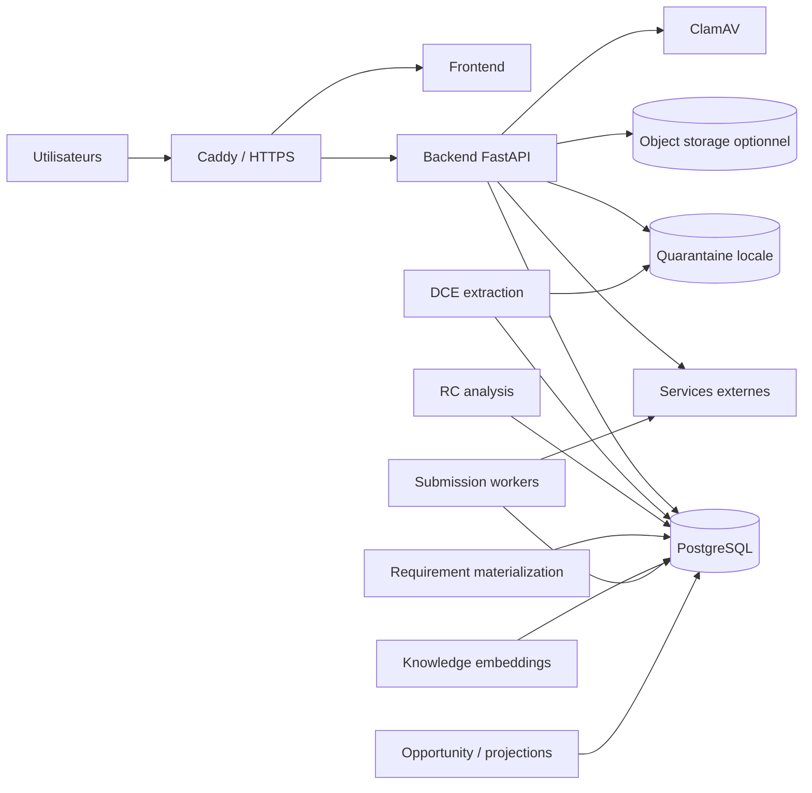

# SMART AO — AUD-02 — Runtime, workers, stockages et flux externes

**Date :** 12 septembre 2026  
**Référence :** `feat/ccap-cctp-risk-register-20260831@b6b05b8`  
**Statut :** TERMINÉ SUR CONFIGURATION — exécution réelle partiellement bloquée  
**Verdict :** topologie préproduction cohérente, orchestration DCE et preuves opératoires incomplètes

## 1. Vue d'ensemble

La configuration préproduction décrit un Data Plane client dédié autour d'un backend FastAPI, d'un frontend, de PostgreSQL, d'une quarantaine documentaire, de ClamAV et de workers spécialisés. La topologie est compatible avec la direction « single-tenant au déploiement, tenant-aware dans l'application ».

## 2. Services de composition préproduction

Treize services sont décrits :

| Service | Rôle | Mode observé |
|---|---|---|
| `caddy` | TLS, reverse proxy, exposition edge | image épinglée par digest |
| `frontend` | application web | image produit |
| `migrate` | migration Alembic avant application | tâche bornée |
| `backend` | API et services applicatifs | service principal |
| `dce-retention-worker` | purge/rétention des objets DCE | worker continu/planifié |
| `dce-rc-analysis-runner` | analyse RC | profil opérateur |
| `dce-requirements-runner` | matérialisation des exigences | profil opérateur |
| `submission-export-webhook-worker` | export vers webhook | worker |
| `submission-export-smtp-worker` | remise/export SMTP | worker |
| `opportunity-event-bus-worker` | émission opportunités | profil opérateur |
| `cockpit-projection-worker` | projection cockpit | profil opérateur |
| `postgres` | base relationnelle | image épinglée par digest |
| `clamav` | analyse antivirus | image épinglée par digest |

La composition prévoit healthchecks, réseaux `edge`/`internal`, rotation des journaux JSON et `no-new-privileges`. La simulation statique `scripts/simulate_staging_deploy.sh --compose-config` réussit. L'activation réelle n'a pas été testée, car le socket du démon Docker est inaccessible dans l'environnement d'audit.

## 3. Processus et workers applicatifs

| Worker Python | Déclenchement / rôle | Persistance | Écart principal |
|---|---|---|---|
| `dce_extraction.py` | extraction d'un document admis | extraction + fragments | invocation one-shot ; orchestration utilisateur non démontrée |
| `dce_analysis.py` | analyse structurée du RC | run + observations + sources | reprise globale non démontrée |
| `dce_requirements.py` | matérialisation déterministe | run + `DceRequirement` | one-shot après analyse |
| `dce_retention.py` | rétention/quarantaine | DB + stockage privé | politique client bout-en-bout non prouvée |
| `knowledge_embeddings.py` | calcul/recalcul embeddings | fragments copiés + vecteurs JSONB | purge et invalidation dérivée à fermer |
| `opportunity_event_bus.py` | émission événements externes | outbox/inbox | provider et SLA non testés |
| `cockpit_projection.py` | projection de lecture | tables de projection | profil opérateur, supervision réelle absente |
| `submission_export_webhook.py` | export via webhook | jobs/preuves locales | accusé tiers et idempotence à qualifier réellement |
| `submission_export_smtp.py` | export via SMTP | jobs/preuves locales | envoi ≠ réception/acceptation |

Les workers DCE critiques ne forment pas encore un pipeline de jobs automatiquement enchaîné, observable dans l'interface avec progression, résultat partiel, retry et reprise. Les états internes fail-closed existent ; l'expérience opérateur et la supervision restent partielles.

## 4. Stockages et propriétaires

| Stockage | Contenu | Propriétaire logique actuel | Qualification |
|---|---|---|---|
| PostgreSQL | autorité métier, événements, projections, sécurité | modules + Platform | modèle riche ; instance réelle non testée |
| quarantaine locale | octets entrants avant admission | DCE/Platform storage | clés privées protégées contre sortie de racine |
| stockage documentaire local/objet | originaux admis | DCE & Document Intelligence | option S3/configuration présente, provider non qualifié |
| JSONB vectoriel | embeddings et métadonnées | Knowledge | baseline locale, capacité et purge à mesurer |
| journaux conteneurs | logs techniques | Platform/Ops | rotation configurée, minimisation/rétention non démontrées |
| sauvegardes | DB + documents + index attendus | Platform/Ops | restauration réelle absente |

## 5. Flux externes

| Flux | Sens | Données possibles | Garde observée | Statut |
|---|---|---|---|---|
| BOAMP | entrant | avis et métadonnées publiques | adaptateur lecture | PARTIEL, fraîcheur réelle non mesurée |
| INSEE | entrant/sortant | identifiants entreprise | configuration optionnelle | NON TESTÉ |
| SMTP | sortant | paquet ou notification | worker dédié | NON TESTÉ |
| webhook export | sortant | export de soumission | worker dédié | NON TESTÉ |
| event bus externe | sortant | événements opportunité | worker/outbox | NON TESTÉ |
| signature callback | entrant | statut/signataire | route et contrat | NON TESTÉ |
| stockage S3 | bidirectionnel | documents et preuves | feature flag/adapter | NON TESTÉ |
| ACME | sortant | certificat/domaine | Caddy | NON TESTÉ |
| mises à jour ClamAV | entrant | signatures antivirus | image/service | NON TESTÉ |
| moteur BGE local | interne | fragments DCE | local par défaut | PARTIEL, benchmark réel vide |

TED n'est pas implémenté comme source native. Aucun fournisseur LLM opérationnel n'a été trouvé dans le runtime audité, ce qui évite un flux de données IA implicite mais laisse le contexte `AI Runtime / Guidance` à créer plus tard.

## 6. Défaillance, idempotence et reprise

Les briques Platform offrent des reçus de commande, événements de domaine, outbox et inbox. Plusieurs agrégats utilisent révision optimiste et commandes idempotentes. L'ingestion DCE échoue fermée pour les tailles, types, antivirus et limites d'extraction.

Les limites sont toutefois opérationnelles :

- pas de preuve d'un superviseur unique qui relance les jobs après crash ;
- profils one-shot à invoquer explicitement pour certaines étapes DCE ;
- pas de mesure de délai de reprise, saturation ou file empoisonnée ;
- pas de test multi-instance de worker ;
- pas de tableau de bord prouvant état partiel et prochaine action ;
- pas de restauration complète DB + fichiers + index.

## 7. Écarts à traiter par gate

| Écart | Gate | Action bornée |
|---|---|---|
| Docker/PostgreSQL non exécutables ici | Gate 0 / PR-A0 | recette locale reproductible et test DB réel |
| pipeline DCE one-shot | Gate A puis tranche verticale | job state/retry seulement après baseline Golden |
| sauvegarde/restauration non prouvée | avant pilote réel | exercice horodaté DB + objets + secrets nécessaires |
| flux fournisseurs non qualifiés | avant données réelles | DATA-FLOW-01 par provider et région |
| journaux/rétention non démontrés | avant pilote | catalogue et tests de purge |
| TED absent | post-Gate A | incrément Opportunity mesuré |

## 8. Preuves

- `ops/docker-compose.preprod.yml`
- `backend/app/bootstrap/application.py`
- `backend/app/bootstrap/production.py`
- `backend/app/workers/`
- `backend/app/platform/events/`
- `backend/app/platform/storage/`
- `scripts/simulate_staging_deploy.sh`
- [SEC-DATA-01](./SMART_AO_PHASE0_SEC-DATA-01_SECURITE_DONNEES_OPS.md)
