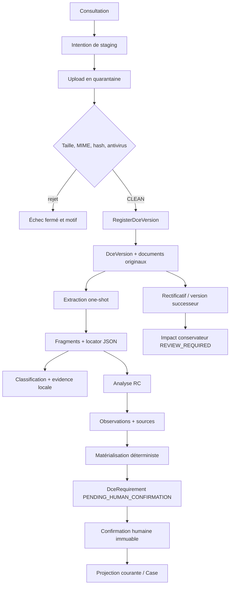

# SMART AO — AUD-05 — Flux DCE jusqu'à l'exigence confirmée

**Date :** 12 septembre 2026  
**Référence :** `feat/ccap-cctp-risk-register-20260831@b6b05b8`  
**Statut :** TERMINÉ  
**Verdict :** chaîne DCE réelle et prudente ; traçabilité multiformat et invalidation transversale encore incomplètes

## 1. Conclusion

V8 ne part pas de zéro. Il possède déjà une chaîne DCE cohérente, qui sépare les octets reçus, leur admission, l'extraction, l'analyse, la matérialisation des exigences et la confirmation humaine. `DceRequirement` et ses confirmations doivent être conservés. La Tranche A doit ajouter les briques probatoires manquantes autour d'eux, sans remplacer brutalement le flux.

## 2. Étapes, responsabilités et preuves

| Étape | Mécanisme actuel | Donnée produite | Statut |
|---|---|---|---|
| créer la consultation | agrégat/service DCE | consultation et tenant | COUVERT |
| ouvrir le staging | commande et reçu | intention d'upload | COUVERT |
| recevoir les octets | streaming vers quarantaine privée | taille, hash, clé privée | COUVERT |
| inspecter | contrôle signature/MIME, taille, ClamAV fail-closed | verdict de scan | COUVERT EN CODE, ClamAV live BLOQUÉ |
| admettre | `RegisterDceVersionHandler` | version, documents, consommation des staged objects | COUVERT EN CODE |
| extraire | `DceExtractionService` + adapter basic/advanced | extraction et fragments | PARTIEL formats |
| classifier | service de classification | classe et preuve locale | PARTIEL |
| analyser le RC | `DceRcAnalysisService` | observations et sources | PARTIEL, RC ciblé |
| matérialiser | `DceRequirementsService` | exigences atomiques | COUVERT pour les observations RC |
| confirmer | `DceRequirementConfirmationService` | historique immuable + current | COUVERT |
| projeter dans l'Affaire | reader Case/DCE | compteurs et liste | COUVERT |
| traiter un rectificatif | impact run conservateur | éléments `REVIEW_REQUIRED` | PARTIEL |

## 3. Invariants déjà utiles

### Admission documentaire

- la quarantaine refuse une clé qui sortirait de sa racine ;
- la taille maximale, le type annoncé et le type inspecté sont contrôlés ;
- un objet non `CLEAN` ne peut pas être admis ;
- l'admission consomme les objets de staging dans la transaction ;
- la version DCE conserve hash de corpus, originaux et prédécesseur.

### Extraction

- les états `COMPLETED`, `REVIEW_REQUIRED`, `UNSUPPORTED`, `REJECTED_LIMIT` et `FAILED_SAFE` empêchent de confondre silence et succès ;
- les fragments portent texte, hash, ordre et locator JSON ;
- l'OCR peut conclure à une revue humaine nécessaire ;
- l'extraction avancée est optionnelle et ne doit pas être présumée active.

### Exigence

- la matérialisation est identifiée par materializer et version ;
- une observation terminée produit une exigence atomique ou un échec explicite ;
- toute nouvelle exigence commence en `PENDING_HUMAN_CONFIRMATION` ;
- la confirmation utilise une révision attendue et crée un successeur immuable ;
- `NOT_APPLICABLE` exige une justification Patron ;
- les décisions de confirmation sont auditées et rattachées à l'acteur.

## 4. Nature exacte de la source actuelle

`DceRequirementSourceRecord` relie une exigence à une observation d'analyse et à des offsets dans un fragment. Cette source est exploitable pour retourner au texte extrait. Elle n'est pas encore le `SourceAnchor` cible :

- pas de type de locator stable par PDF/DOCX/XLSX/texte ;
- pas de page + bounding box probante pour PDF ;
- pas de paragraphe/table/cellule pour DOCX ;
- pas de feuille/cellule/plage pour tableur ;
- pas d'objet réutilisable par plusieurs conclusions ;
- pas de version de parser attachée à une ancre générique.

La migration doit convertir ce qui est établi et laisser `UNKNOWN` ce qui ne peut pas être reconstruit. Une page ou une cellule ne doit jamais être inventée à partir d'un simple offset.

## 5. Confirmation humaine

La confirmation existante satisfait une partie forte de la doctrine : l'IA ou le matérialiseur ne rend pas l'exigence engageante par lui-même. L'autorité s'exerce via la façade applicative, qui résout le périmètre Case côté serveur, applique la politique, contrôle la révision et journalise l'acte.

Gaps :

- la confirmation porte l'exigence, pas encore un graphe explicite `Requirement -> Evidence -> SourceAnchor` ;
- l'applicabilité fine lot/site/option/phase reste partielle ;
- les dépendances des décisions, prix, documents réponse et engagements ne sont pas toutes déclarées ;
- un changement de preuve ne révoque donc pas encore automatiquement tous les usages dépendants.

## 6. Rectificatif et invalidation

Le modèle crée une version successeur et un registre d'impact conservateur. Des exigences de l'ancienne et de la nouvelle version peuvent être marquées `REVIEW_REQUIRED` ou `PENDING_HUMAN_REVIEW`.

La recette REC-03 demande davantage : rouvrir exigences, prix, risques et livrables touchés, puis bloquer une nouvelle autorisation avant dépôt. Le code actuel n'établit pas un graphe de dépendances complet entre ces objets. L'invalidation est donc `PARTIELLE`.

La correction appartient à A4 et aux incréments métier post-A, après création des anchors et Evidence. Elle ne doit pas être codée comme une invalidation globale aveugle : seules les conclusions dont une preuve active a changé doivent être rouvertes, avec une politique conservatrice pour les dépendances inconnues.

## 7. Formats et archives

Le corpus externe observé contient PDF, XLS, XLSX, DOC, DOCX, ODT, ZIP et 7Z. Le manifeste Golden et le pipeline garanti se limitent actuellement surtout à PDF/DOCX/XLSX. Les vieux formats Office, archives imbriquées, fichiers protégés, plans et très gros objets doivent entrer dans le banc Hostile avant toute promesse de couverture.

## 8. Orchestration et UX longue durée

Extraction, analyse RC et matérialisation disposent de runners one-shot distincts. Il manque une preuve bout-en-bout de :

- déclenchement automatique après l'étape précédente ;
- état durable de job accessible à l'utilisateur ;
- résultats partiels utilisables ;
- retry borné et reprise après crash ;
- progression par fichier ;
- impossibilité de présenter « dossier analysé » quand certains fichiers sont illisibles.

Ces besoins ne justifient pas un orchestrateur général pendant A0–A4. Le premier cas Golden qui échoue doit dicter le mécanisme minimal.

## 9. Décision de migration

| Élément actuel | Décision |
|---|---|
| consultation et `DceVersion` | KEEP + ADAPT |
| staged objects/quarantaine | KEEP + QUALIFY |
| extraction/fragments/locators | KEEP |
| classification evidence locale | KEEP distinct |
| analyse RC/observations/sources | KEEP + ADAPT |
| `DceRequirement` | KEEP + ADAPT |
| confirmations immuables | KEEP |
| impact rectificatif | KEEP + EXTEND |
| `SourceAnchor` générique | CREATE en A2 |
| `Evidence` générique | CREATE en A3 |
| liaison/invalidation | ADAPT en A4 |

## 10. Preuves

- `backend/app/modules/dce/application/upload.py`
- `backend/app/modules/dce/application/extraction.py`
- `backend/app/modules/dce/application/analysis.py`
- `backend/app/modules/dce/application/requirements.py`
- `backend/app/modules/dce/application/requirement_confirmation.py`
- `backend/app/modules/dce/application/impact.py`
- `backend/app/modules/dce/application/handlers.py`
- `backend/app/modules/dce/infrastructure/models/`
- `backend/app/workers/dce_extraction.py`
- `backend/app/workers/dce_analysis.py`
- `backend/app/workers/dce_requirements.py`
- [PLAN-A](./SMART_AO_PHASE0_PLAN-A_PR-A0_A4.md)
