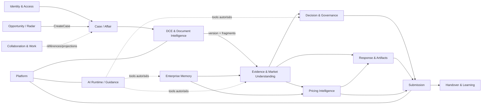

# SMART AO — MAP-01 — Context map V8 vers architecture v3.1

**Date :** 12 septembre 2026  
**Référence :** `feat/ccap-cctp-risk-register-20260831@b6b05b8`  
**Statut :** TERMINÉ  
**Verdict :** chaque objet cible reçoit un propriétaire proposé et une trajectoire ; plusieurs propriétaires ne sont pas encore matérialisés dans le code

## 1. Règles de lecture

- **Propriétaire d'écriture** : seul contexte autorisé à créer ou modifier la source de vérité.
- **Lecteur** : contexte autorisé à consommer un contrat public, un événement ou une projection.
- **Transaction** : effet atomique qui délimite l'autorité.
- **Invalidation** : réaction obligatoire quand la source change.
- Un module V8 peut héberger temporairement plusieurs responsabilités ; la colonne cible décide du futur owner.

## 2. Carte synthétique des contextes

| Contexte cible | Modules V8 principaux | Dépendances autorisées | État |
|---|---|---|---|
| Identity & Access | Platform security, partie de Membership | Platform, Case scope | PARTIEL |
| Opportunity / Radar | Opportunity, MarketWatch | Platform, Case create | PARTIEL |
| Case / Affair | Case | Identity, DCE, Decision projections | COUVERT + ADAPT |
| DCE & Document Intelligence | DCE | Platform storage/jobs | COUVERT + ADAPT |
| Evidence & Market Understanding | partie de DCE/Decision/Knowledge | DCE, Enterprise, Platform | PARTIEL/ABSENT |
| Enterprise Memory | Enterprise | Identity, Platform | PARTIEL |
| Decision & Governance | Decision, PatronAction projection | Evidence, Pricing, Case | PARTIEL |
| Pricing Intelligence | Pricing | Evidence, Enterprise, Case | PARTIEL |
| Response & Artifacts | Preparation | Evidence, Enterprise, Pricing | PARTIEL |
| Submission | Submission | Decision, Response, Pricing, Platform | PARTIEL |
| Collaboration & Work | partie de Membership, PatronAction | tous via références/projections | PARTIEL |
| Handover & Learning | bribes Enterprise/Preparation | Submission, Decision, Pricing | ABSENT comme contexte |
| AI Runtime / Guidance | Knowledge baseline seulement | tous via tools autorisés | ABSENT comme runtime |
| Platform | Platform, bootstrap, workers | aucune règle BTP | COUVERT + ADAPT |

## 3. Ownership par objet critique

| Objet source de vérité | Propriétaire d'écriture cible | Lecteurs autorisés | Module V8 actuel | Transaction d'autorité | Invalidation obligatoire | Trajectoire |
|---|---|---|---|---|---|---|
| Tenant/Organisation | Identity & Access | tous par contexte d'exécution | Platform security | créer/activer organisation | révocation de toutes sessions/partages selon politique | KEEP |
| Identité | Identity & Access | Collaboration, Decision, audit | Platform security | créer/désactiver identité | sessions, délégations et droits recalculés | KEEP |
| Rôle/permission | Identity & Access | toutes policies | Platform security | attribuer/révoquer rôle | accès, recherche, export et contexte IA recalculés | KEEP + ADAPT |
| Délégation/support | Identity & Access | Collaboration, audit | partiel/absent | accorder accès borné et expirant | révocation immédiate + journal | CREATE avant support réel |
| Profil de veille | Opportunity / Radar | utilisateur propriétaire | Opportunity | enregistrer/modifier profil | prochains scans seulement, historique conservé | KEEP |
| Avis source | Opportunity / Radar | Case, utilisateurs | Opportunity/MarketWatch | ingérer avec provenance/fraîcheur | score/rapprochement recalculés | MOVE + ADAPT |
| Opportunité | Opportunity / Radar | Case, Collaboration | Opportunity | qualifier/écarter/suivre | projection et alerte mises à jour | KEEP + ADAPT |
| Affaire | Case / Affair | tous contextes métier | Case | créer/changer phase/responsables | projections aval, jamais leurs vérités internes | KEEP + ADAPT |
| Lot/périmètre | Case / Affair | DCE, Evidence, Pricing, Response | Case, partiel DCE | définir portée de l'Affaire | applicabilités dépendantes à revoir | ADAPT |
| Porte P0–P7 courante | Decision & Governance | Case, Response, Submission | Decision/Case partiel | franchir porte avec décision | porte suivante et autorisations recalculées | CREATE/EXTEND |
| Consultation | DCE & Document Intelligence | Case, Opportunity | DCE | créer consultation | aucune réécriture des versions | KEEP |
| Staged object | DCE & Document Intelligence | antivirus/Platform | DCE | recevoir/rejeter/admettre | suppression selon rétention | KEEP |
| DCE Version | DCE & Document Intelligence | Evidence, Decision, Pricing, Response | DCE | enregistrer/superséder/retirer | preuves et conclusions dépendantes rouvertes | KEEP + ADAPT |
| Document original | DCE & Document Intelligence | Evidence, Response, Submission | DCE | admettre un objet propre | dérivés invalidés si retrait/corruption | KEEP |
| Extraction | DCE & Document Intelligence | Evidence, Knowledge | DCE | publier résultat terminal | fragments/anchors dépendants invalidés par nouvelle exécution versionnée | KEEP |
| Fragment | DCE & Document Intelligence | Evidence, Knowledge | DCE | créer dans une extraction | anchors liés à cette extraction uniquement | KEEP |
| SourceAnchor | Evidence & Market Understanding | tous contextes probatoires | absent, offsets DCE | créer ancre vers source immuable | Evidence actives rouvertes si source retirée | CREATE A2 |
| Evidence générique | Evidence & Market Understanding | Decision, Pricing, Response, Enterprise | absente ; evidence locales distinctes | publier/valider/révoquer preuve | objets dépendants passent en revue | CREATE A3 |
| Exigence DCE | Evidence & Market Understanding | Case, Decision, Pricing, Response | DCE | matérialiser puis confirmer/rejeter | dépendants rouverts si preuve/portée change | KEEP + ADAPT A4 |
| Besoin d'information/MIRP | Evidence & Market Understanding | Pricing, Collaboration, Decision | absent | créer/résoudre/renoncer | readiness prix/décision recalculée | CREATE post-A |
| Inconnu | Evidence & Market Understanding | Decision, Pricing, Collaboration | signaux dispersés | déclarer/résoudre | blocages dépendants recalculés | CREATE post-A |
| Hypothèse | Evidence & Market Understanding | Pricing, Decision, Response | partielle dans Pricing/Decision | proposer/accepter/expirer | conclusions et engagements dépendants rouverts | CREATE/ADAPT post-A |
| Contradiction | Evidence & Market Understanding | Decision, Pricing, Response | analyse DCE partielle | enregistrer/résoudre | objets concernés en revue | ADAPT post-A |
| Risque signalé | Evidence & Market Understanding | Decision | DCE/Decision | publier signal avec preuves | registre de risque à réévaluer | ADAPT |
| Élément Entreprise | Enterprise Memory | Evidence, Pricing, Response, Decision | Enterprise | créer/versionner/valider | usages en revue à expiration/correction | KEEP + EVOLVE |
| Capacité Entreprise | Enterprise Memory | Decision, Response, Collaboration | Enterprise | déclarer/valider capacité | éligibilité et réponses dépendantes rouvertes | KEEP + EVOLVE |
| Partenaire/preuve tierce | Enterprise Memory | Decision, Pricing, Response | partiel Enterprise | enregistrer engagement et preuve | candidature/prix bloqués si preuve expire | CREATE/ADAPT |
| Décision | Decision & Governance | Case, Submission, Collaboration | Decision | décider avec acteur/version/contexte | supersession explicite après changement | KEEP + EXTEND |
| Contexte figé | Decision & Governance | audit, Submission | Decision | figer au moment de décider | immuable ; nouvelle décision si source change | KEEP |
| Risque métier | Decision & Governance | Case, Pricing, Response | Decision | enregistrer/traiter/accepter | décision et readiness recalculées | KEEP + EXTEND |
| Action Patron | Collaboration & Work comme projection | Patron/Decision | PatronAction | créer/assigner/terminer action | projection reconstruite depuis owner | KEEP |
| Scénario de prix | Pricing Intelligence | Decision, Response | Pricing | créer/versionner scénario | publication retirée si hypothèse critique change | KEEP |
| CostBasis/facteur coût | Pricing Intelligence | Decision, Response | Pricing | importer/calculer/valider | scénarios dépendants recalculés | KEEP + REPOSITION |
| Snapshot financier | Pricing Intelligence | Decision Patron seulement | Pricing | publier snapshot | immuable ; nouvelle publication exigée après changement | KEEP |
| Document réponse | Response & Artifacts | Submission, Collaboration | Preparation | créer/versionner/revoir | candidate retirée si document change | KEEP + ALIGN |
| Engagement | Response & Artifacts | Pricing, Decision, Handover | partiel Preparation/Decision | accepter formulation engageante | prix et autorisation à revoir | CREATE/ADAPT |
| Candidate d'offre | Response & Artifacts | Submission, Decision | Preparation/Submission partiel | figer après autorisation | toute modification révoque readiness | ADAPT |
| Manifeste de remise | Submission | Decision, audit, Handover | Submission partiel | figer éléments/canaux/hashes | modification révoque autorisation P5 | ADAPT |
| Tentative/envoi/réception | Submission | Collaboration, audit | Submission | enregistrer chaque étape externe | état suivant seulement avec preuve adéquate | KEEP + EXTEND |
| Reçu tiers | Submission | Decision, Handover, audit | preuve locale partielle | rapprocher au manifeste | écart bloque « accepté » | ADAPT |
| Tâche | Collaboration & Work | Case et owners référencés | Membership | créer/assigner/terminer | readiness via projection, pas écriture étrangère | KEEP + SPLIT |
| Affectation | Collaboration & Work | Case, Decision | Membership | affecter/remplacer/déléguer | droits opérationnels recalculés | KEEP + SPLIT |
| Commentaire/conflit | Collaboration & Work | contexte objet | partiel Membership/Preparation | proposer/résoudre conflit | version validée jamais écrasée | ADAPT |
| Contrat vendu | Handover & Learning | travaux, Enterprise, Decision | absent/Preparation partiel | accepter mise au point/contrat | passation reconstruite sur version acceptée | CREATE post-A |
| Passation | Handover & Learning | équipes chantier | absent | figer dossier de passation | nouvelle version seulement par avenant/écart validé | CREATE post-A |
| REX | Handover & Learning | Enterprise, Opportunity, Pricing | Enterprise partiel | valider un écart contextualisé | référentiel futur modifié seulement après validation | CREATE post-A |
| Prompt/skill version | AI Runtime / Guidance | audit/quality | absent | publier version | bancs Golden obligatoires | CREATE après fondation |
| Appel IA | AI Runtime / Guidance | contexte demandeur, audit minimal | absent | exécuter tool borné | aucun effet critique direct | CREATE après fondation |
| Job async | Platform | contextes demandeurs | Platform/workers | créer/claim/terminer/retry | état exposé et idempotent | ADAPT |
| Event/outbox/inbox | Platform | contextes abonnés | Platform | commit effet + événement | retry idempotent | KEEP |
| Command receipt | Platform | contextes appelants | Platform | enregistrer résultat idempotent | immuable | KEEP |
| Secrets/config | Platform | adapters autorisés | config/ops | provisionner/rotater | redémarrage/rotation contrôlés | ADAPT |
| Backup/restore proof | Platform | Ops/audit | absent comme preuve | sauvegarder/restaurer/vérifier | bloque pilote si périmètre incomplet | CREATE avant pilote |

## 4. Relations directionnelles

Les flèches ne donnent jamais un droit d'écriture sur les tables internes du contexte cible. Chaque appel passe par un contrat applicatif, une commande ou un événement.

## 5. Règles de frontière à ajouter aux tests

1. Aucun module ne peut importer `infrastructure.models` d'un autre module en dehors d'une exception datée.
2. Seul le contexte propriétaire crée les commandes mutantes de son objet.
3. Les projections cross-context sont nommées `Reader`/`Snapshot` et déclarent leur source autoritative.
4. Toute table ajoutée en A2–A4 possède un owner de contexte explicite.
5. Les Evidence locales gardent leurs namespaces et ne sont pas importées comme Evidence générique.
6. Submission ne modifie ni Decision, ni Pricing, ni Response ; il consomme des versions figées.
7. L'AI Runtime n'importe aucun repository métier concret et n'écrit aucune table critique.

## 6. Réponse Gate 0 portée par MAP-01

**Question 2 — chaque objet cible a-t-il un propriétaire d'écriture et une trajectoire ? `OUI AU NIVEAU DU PLAN`, `PARTIEL DANS LE CODE`.** La table ci-dessus fournit l'owner cible, les lecteurs, la transaction et l'invalidation. A2–A4 devront matérialiser ces frontières de manière additive ; les contextes Handover et AI restent différés.

## 7. Preuves

- `backend/app/modules/`
- `backend/app/platform/`
- `backend/app/bootstrap/application.py`
- `backend/tests/architecture/test_application_infrastructure_boundary.py`
- [AUD-01](./SMART_AO_PHASE0_AUD-01_CARTE_REPO.md)
- [MIG-01](./SMART_AO_PHASE0_MIG-01_MATRICE_MIGRATION.md)
