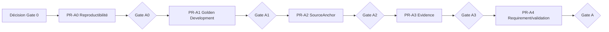

# SMART AO — PLAN-A — Plan exécutable PR-A0 à PR-A4

**Date :** 12 septembre 2026  
**Référence :** `feat/ccap-cctp-risk-register-20260831@b6b05b8`  
**Statut :** PROPOSITION POUR DÉCISION GATE 0 — NON AUTORISÉE  
**Verdict :** autoriser A0 puis A1 seulement ; maintenir A2–A4 en HOLD jusqu'à leurs gates d'entrée

## 1. Règles communes

1. Une PR possède un résultat mesurable et un rollback documenté.
2. Aucune PR A ne renomme ou supprime une Evidence locale, `DceRequirement` ou confirmation historique.
3. Les migrations suivent expand/backfill/dual-read/switch ; aucune contraction en A2–A4.
4. Chaque PR part du même corpus normatif commité et référence son SHA.
5. Toute nouvelle table porte `tenant_id`, timestamps, contraintes et owner de contexte lorsque ces conventions s'appliquent.
6. Les tests DB s'exécutent sur PostgreSQL réel ; SQLite ou SQL offline ne remplace pas ce gate.
7. Le Golden DCE mesure avant/après et conserve les versions parser/règle/modèle.
8. La PR suivante ne démarre pas parce que la précédente est fusionnée : son gate d'entrée doit être signé.

## 2. Séquence de gates

## 3. PR-A0 — Environnement reproductible

### Résultat

Un développeur autorisé peut lancer les commandes canonisées et obtenir un rapport sans hang silencieux : PostgreSQL monte, les migrations s'appliquent, les suites déclarées passent ou échouent avec une classification approuvée.

### Scope minimal

- figer le corpus directeur et ce dossier dans un commit documentaire ;
- documenter version système, `uv`, Node/pnpm, variables et services requis ;
- fournir une recette PostgreSQL locale réelle avec healthcheck ;
- diagnostiquer/réparer le hang de `test_assignment_interactions_routes... [None]` ;
- corriger le double mypy de `test_preparation_snapshot_transmission.py` ;
- classer clairement DB/non-DB/intégration/externe/lent ;
- rendre les commandes CI autoritatives non interactives et bornées ;
- exécuter Alembic sur base vide et sur snapshot anonymisé/représentatif ;
- produire un rapport des tests ignorés machine-lisible ;
- documenter la composition réelle (`application.py`) sans refactor.

### Hors scope

OCR nouveau, changements métier, SourceAnchor, Evidence, refonte de bootstrap, migration destructive, frontend général.

### Migrations

Aucune migration métier. Une correction purement opératoire de test ou configuration est admise. Si une migration existante est fautive, ouvrir une décision Gate ciblée avant modification.

### Vérifications

- `ruff`, `mypy backend/app backend/tests`, Bandit ;
- 75 tests d'architecture ;
- suite non-DB terminée ;
- suite DB sur PostgreSQL terminée ;
- frontend lint/test/typecheck/build ;
- upgrade base vide et base peuplée jusqu'à `20260826_0067` ;
- configuration préproduction et EICAR si ClamAV est dans le gate.

### Rollback

Revenir au commit de configuration/tests ; aucune donnée métier ne change. Conserver les logs de comparaison.

### Gate A0

- zéro commande suspendue ;
- baseline statique verte ;
- résultat terminal pour chaque suite ;
- PostgreSQL réel et migrations reproductibles ;
- blocages externes nommés et exclus explicitement, jamais assimilés à un succès.

## 4. PR-A1 — Golden DCE Development exécutable

### Résultat

Un corpus autorisé hors Git est vérifié par hash, annoté et exécuté par un runner qui produit les métriques par format, métier, type et criticité.

### Scope minimal

- manifeste v2 et schéma d'annotations ;
- loader vers stockage local autorisé, avec chemin configurable ;
- vérification présence/octets/hash/MIME ;
- bancs Development, Qualification et Hostile séparés ;
- premiers cas critiques tirés du corpus autorisé ;
- runner déterministe de la baseline actuelle ;
- rapport JSON + Markdown des métriques et échecs ;
- registre droits/anonymisation ;
- procédure de désaccord expert et gel ;
- tests du validateur et du runner.

### Hors scope

Amélioration du parser pour faire monter les scores, nouvelle stack retrieval, données client non autorisées, exposition de DCE dans Git/CI publique.

### Migrations

Éviter une table produit si des manifestes versionnés suffisent. Si la traçabilité des runs exige PostgreSQL, créer des tables de qualité séparées, additives et sans contenu DCE.

### Rollback

Désactiver le runner et revenir au manifeste précédent. Les octets hors Git restent intacts ; aucune donnée produit n'est migrée.

### Gate A1

- au moins un cas Development autorisé par famille prioritaire disponible ;
- hashes vérifiés ;
- zéro fuite entre Qualification et développement ;
- annotations critiques revues ;
- baseline exécutée deux fois avec résultat déterministe ;
- métriques et inconnues publiées ;
- règle d'arrêt sur régression critique.

## 5. PR-A2 — `SourceAnchor`

### Résultat

Une ancre stable et typée ouvre l'emplacement source pour les formats acceptés, sans modifier les lecteurs historiques.

### Schéma expand proposé

- table `source_anchors` appartenant à Evidence & Market Understanding ;
- identité tenant, DCE version, document, extraction/fragment lorsque pertinent ;
- `anchor_type` fermé (`PDF_SPAN`, `DOCX_BLOCK`, `XLSX_RANGE`, `TEXT_SPAN`) ;
- locator structuré validé selon le type ;
- hash source, parser id/version, dates ;
- unicité/idempotence sur source + locator + parser ;
- pas de valeur géométrique/cellule inventée.

Le nom final et la cardinalité exacte doivent être validés en DEC-GATE avant migration.

### Backfill

1. créer anchors `TEXT_SPAN` seulement lorsque fragment et offsets sont valides ;
2. créer type formaté seulement si le locator existant contient réellement les coordonnées requises ;
3. journaliser `NOT_BACKFILLABLE` par raison ;
4. ne pas bloquer l'ancien flux.

### Compatibilité

Ajouter un reader d'anchor ; conserver `DceRequirementSource` et les locators actuels. Le frontend n'est basculé que pour les cas Golden couverts.

### Rollback

Désactiver le nouveau reader ; garder la table et les données pour analyse. Aucun downgrade destructif.

### Gate A2

- migrations up sur base vide et peuplée ;
- backfill idempotent ;
- 100 % des anchors C1 créés ouvrent l'emplacement annoté dans le banc couvert ;
- rapport des non-backfillables ;
- anciens tests et lecteurs verts ;
- aucun contenu source dupliqué inutilement dans l'ancre.

## 6. PR-A3 — `Evidence` générique

### Résultat

Une preuve réutilisable relie une observation à un `SourceAnchor`, une version, une méthode et une validation éventuelle, sans collision avec les Evidence locales.

### Schéma expand proposé

- table `evidence_items` ou nom approuvé, distinct de `submission_evidence` et `dce_document_classification_evidence` ;
- `source_anchor_id`, DCE/version/document dénormalisés seulement si l'intégrité le justifie ;
- valeur/extrait observé borné, type, méthode, confiance technique ;
- hash, parser/rule/model version ;
- état de validation et acteur quand une validation est nécessaire ;
- statut actif/révoqué/supersédé, sans effacer l'historique.

### Backfill

Créer une Evidence générique uniquement pour les observations RC dont l'ancre et la provenance sont déterministes. Les Evidence locales restent inchangées ; des adapters peuvent les lire sans les convertir.

### Compatibilité

Dual read sur les projections Golden. Aucun consommateur existant n'est forcé de migrer dans cette PR.

### Rollback

Désactiver le nouveau writer/reader. Conserver les lignes additives ; aucune modification de source historique.

### Gate A3

- Evidence→Anchor→octets traversable ;
- version/méthode/hash présents ;
- aucune Evidence critique sans source active ;
- anciens usages `classification` et `submission` sémantiquement inchangés ;
- comparaison Golden sans régression critique ;
- révocation/supersession testées.

## 7. PR-A4 — `DceRequirement`, validation et invalidation

### Résultat

L'exigence existante référence ses Evidence, expose portée/criticité/applicabilité, conserve la confirmation humaine et rouvre les usages dépendants lorsqu'une preuve active change.

### Schéma expand proposé

- liaison Requirement↔Evidence selon cardinalité démontrée ;
- portée lot/site/phase/option, criticité et applicabilité sous forme additive ;
- événement d'invalidation/version de dépendance ;
- projection de statut courant reconstruisible ;
- conservation intégrale des confirmations historiques.

### Backfill

- relier via `DceRequirementSource` et Evidence créées en A3 ;
- valeurs non établies restent `UNKNOWN` ou `REVIEW_REQUIRED` ;
- ne jamais transformer une confirmation historique en validation d'une nouvelle preuve ;
- produire le taux de liaison et les écarts par version DCE.

### Compatibilité

L'API historique reste lisible. Les nouveaux champs sont optionnels jusqu'à fermeture du backfill. Les décisions/prix/documents qui n'ont pas encore de dépendance explicite sont rouverts conservativement lors d'un rectificatif critique.

### Rollback

Désactiver les nouveaux readers/writers et revenir aux projections historiques. Les liens et événements restent conservés. Aucune suppression de confirmations.

### Gate A4 / Gate A

- chaque exigence C1 du jeu possède Evidence et anchor valides ;
- confirmation/rejet exige acteur, révision et version ;
- nouveau rectificatif ne laisse aucune C1 dépendante silencieusement valide ;
- backfill idempotent et rapporté ;
- anciens clients/API compatibles ;
- tests permission/tenant/audit verts ;
- Golden avant/après et rollback réussis sur PostgreSQL peuplé.

## 8. Découpage de taille

Si une PR dépasse la capacité de revue, la diviser en sous-PRs séquentielles `schema`, `backfill`, `reader`, `switch` sous le même identifiant A. Cette division ne change ni l'ordre ni le gate ; elle réduit seulement le risque de revue.

## 9. Gates d'arrêt immédiat

Arrêter une PR si :

- une migration exige de supprimer/renommer une table existante ;
- une ancre est construite avec une position inventée ;
- une Evidence locale change de sens ;
- un backfill modifie une confirmation historique ;
- le corpus Qualification a servi à ajuster le comportement ;
- une régression C1 est masquée par une moyenne ;
- le rollback perd des données ;
- une dépendance cross-context interne nouvelle est introduite.

## 10. Autorisation proposée au propriétaire

| Élément | Décision proposée maintenant |
|---|---|
| PR-A0 | **GO conditionnel** après commit du corpus et validation DEC-GATE |
| PR-A1 | **GO séquentiel** après Gate A0 |
| PR-A2 | **HOLD** jusqu'au Gate A1 et décisions de schéma |
| PR-A3 | **HOLD** jusqu'au Gate A2 |
| PR-A4 | **HOLD** jusqu'au Gate A3 |
| B–I | **HOLD** jusqu'au Gate A |
| pilote réel | **NO-GO** jusqu'aux dossiers sécurité/données/ops/qualité |

## 11. Preuves

- [AUD-03](./SMART_AO_PHASE0_AUD-03_DB_MIGRATIONS.md)
- [AUD-04](./SMART_AO_PHASE0_AUD-04_TESTS_ENVIRONNEMENT.md)
- [AUD-05](./SMART_AO_PHASE0_AUD-05_FLUX_DCE.md)
- [MIG-01](./SMART_AO_PHASE0_MIG-01_MATRICE_MIGRATION.md)
- [QUAL-01](./SMART_AO_PHASE0_QUAL-01_GOLDEN_DCE.md)
- [DEC-GATE](./SMART_AO_PHASE0_DEC-GATE_DECISIONS.md)
