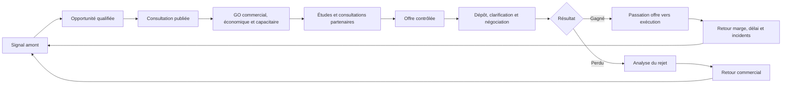

# SMART AO — Cahier des charges métier

**Version de référence : 1.0 — 12 septembre 2026**  
**Statut : socle métier stabilisé pour arbitrage du propriétaire**

Cette version clôt la phase de recherche générale. Elle décrit les problèmes à résoudre, les décisions, les preuves et les résultats attendus dans le langage d’une PME française du BTP. Elle ne définit ni architecture informatique, ni écrans, ni navigation. Les points non établis sont isolés dans le backlog de validation externe au lieu d’être présentés comme des règles acquises.

## 1. Synthèse exécutive

SMART AO doit sécuriser une décision plus large que la simple réponse conforme à un appel d’offres. La question complète du dirigeant est :

> **Cette affaire mérite-t-elle notre effort commercial, pouvons-nous la gagner, la financer, l’exécuter correctement et conserver la marge prévue ?**

La première étude a correctement posé le cœur documentaire : versions du DCE, exigences, applicabilité, preuves, contradictions, GO/NO-GO, prix, engagements, questions à l’acheteur et dépôt. La seconde passe révèle huit extensions indispensables au modèle métier :

1. **anticiper les affaires avant leur publication** et organiser une stratégie commerciale licite et traçable ;
2. **calculer la soutenabilité économique**, notamment la marge à risque et le besoin maximal de trésorerie dans le temps ;
3. **tester la capacité réelle d’exécution** contre le carnet de commandes, les équipes, le matériel, les partenaires et les contraintes calendaires ;
4. **sécuriser fournisseurs, sous-traitants et co-traitants**, y compris la validité et les conditions de leurs offres ;
5. **gérer toute la vie de l’offre après le premier dépôt** : précisions, négociation, offre finale, prolongation et mise au point ;
6. **apprendre de l’attribution ou du rejet** à partir de faits vérifiables ;
7. **transmettre à l’exécution le contrat réellement vendu**, ses hypothèses, ses risques et toutes les promesses de l’offre ;
8. **communiquer avec l’écosystème existant** de l’entreprise sans devenir un nouvel ERP, un logiciel comptable ou un outil complet de chantier.

Le risque le plus grave n’est pas toujours de perdre un marché. Une PME peut gagner une affaire qui consomme trop de trésorerie, surcharge ses équipes, dépend d’un fournisseur non sécurisé, impose des garanties coûteuses, expose des prix fermes à une hausse des intrants ou transforme une promesse commerciale non chiffrée en obligation de chantier. Le GO/NO-GO doit donc devenir une décision **commerciale, administrative, technique, capacitaire, financière et contractuelle**.

La veille concurrentielle confirme que plusieurs fonctions sont déjà courantes : détection, alertes, recherche dans le DCE, synthèse, génération de mémoire, workflow et import des pièces de prix. Spigao relie détection, chiffrage, fournisseurs et outils BTP ; Explain, DoubleTrade et Vecteur Plus investissent fortement l’intelligence commerciale en amont ; Tenderbolt étend son offre au rapprochement BPU–catalogue–ERP/PIM ; Wanao couvre le suivi des rectificatifs et le dépôt ; des ERP BTP couvrent déjà devis, achats, planning, facturation et marge chantier.[^1][^2][^3][^4][^5]

La différenciation défendable de SMART AO doit combiner :

- preuve et applicabilité de chaque conclusion ;
- impact des versions et rectificatifs ;
- décision économique par scénario et dans le temps ;
- capacité réelle d’exécution ;
- interfaces techniques et coûts invisibles ;
- registre des engagements vendus ;
- dossier de passation offre → exécution ;
- boucle d’apprentissage gain/perte/marge réalisée ;
- gouvernance prudente de l’IA, des données et des licences documentaires.

## 2. Méthode, périmètre et force des preuves

Cette version consolide le [rapport métier initial](</home/noor/PROJECTS/BTP/SMART_AO_V8/rapports/SMART_AO_Cahier_des_charges_Metier_Grandes_Lignes_v0.1.md>) et les analyses documentaires menées depuis, en ne conservant ici que les besoins, règles de décision et résultats métier.

Elle repose sur :

- l’inventaire des 379 fichiers sources du corpus [DCE Type](</home/noor/PROJECTS/BTP/DOCUMENTATION/SMART_AO DOCUMENTATION/DCE Type>), complété par l’inspection des archives, soit environ 519 fichiers ou entrées documentaires et plus de 6 000 pages PDF ;
- une lecture détaillée de dossiers hospitaliers, de réhabilitation, de maintenance multi-sites et d’infrastructure routière ;
- des sources officielles françaises et européennes ;
- des fédérations et organismes professionnels du BTP ;
- les pages produit, centres d’aide, webinaires, tarifs et conditions publiés par des éditeurs ;
- quelques avis ou retours tiers, utilisés seulement lorsqu’ils apportent une information identifiable et avec un niveau de confiance faible.

La veille est arrêtée au **11 septembre 2026**. Les faits conjoncturels sont séparés des exigences structurelles.

### 2.1 Échelle utilisée pour les concurrents

| Niveau | Signification dans ce rapport |
|---|---|
| Revendiqué | Affirmation publiée par l’éditeur sur une page commerciale |
| Documenté | Parcours visible dans une aide, un webinaire, une documentation, une démonstration publiée ou des conditions contractuelles |
| Vérifié indépendamment | Fonction testée ou décrite par une source indépendante suffisamment précise |
| Non établi | Information non trouvée ou preuve trop faible ; cela ne signifie pas que la fonction n’existe pas |

Aucun des principaux concurrents français n’a été testé avec un compte client au cours de cette étude. Une référence client publiée par l’éditeur reste une preuve commerciale. Les pourcentages de gain de temps, de ROI ou de taux de succès sont donc attribués à leur auteur et ne sont pas repris comme vérités mesurées.

## 3. Angles morts du document initial

| Angle mort | Pourquoi il est dangereux pour une PME BTP | Correction apportée au cahier des charges |
|---|---|---|
| Affaire avant publication | L’entreprise découvre trop tard le besoin, le décideur, le titulaire sortant et les partenaires possibles | Créer un continuum signal → opportunité → consultation → offre → résultat |
| Attractivité commerciale | Une affaire techniquement compatible peut avoir une probabilité de gain très faible | Intégrer historique acheteur, présence du sortant, relations, concurrence et coût de réponse |
| Besoin en fonds de roulement de l’affaire | Une marge comptable positive peut masquer un pic de trésorerie insoutenable | Construire une courbe mensuelle d’encaissements et décaissements par scénario |
| Coût des garanties et du financement | Retenue, caution, garantie à première demande, mobilisation et frais bancaires diminuent la marge | Chiffrer ces coûts et leur durée avant le GO |
| Charge future de l’entreprise | Les mêmes équipes ou matériels peuvent être promis sur plusieurs affaires | Comparer scénario d’attribution, carnet signé, probabilités et capacités disponibles |
| Validité des offres fournisseurs | Un prix fournisseur peut expirer avant notification ou exclure transport, levage et conditions de site | Enregistrer périmètre, réserves, délai, incoterms, révision et dépendances |
| Risque de défaillance d’un partenaire | Le mandataire ou membre solidaire peut supporter une défaillance d’un cotraitant | Qualifier santé, conformité, capacité, responsabilité et solution de remplacement |
| Marchés privés | Les règles du public ne doivent pas être appliquées mécaniquement aux contrats privés | Maintenir deux cadres avec règles d’applicabilité et pièces contractuelles propres |
| Vie après le premier dépôt | Négociation, BAFO, prolongation et mise au point peuvent modifier le prix et les engagements | Versionner chaque offre et refaire les contrôles d’impact |
| Rejet et attribution | Sans analyse structurée, l’entreprise répète les mêmes erreurs et surestime son taux de succès | Créer un dossier de résultat avec notes, prix, gagnant, motifs et enseignements |
| Passage vers l’exécution | Le conducteur découvre tard une promesse, une réserve ou un coût oublié | Produire un dossier de passation obligatoire avant ouverture du chantier |
| Frontière avec l’ERP | La ressaisie détruit la traçabilité et crée des divergences entre offre et budget chantier | Définir les données à échanger et le système maître de chaque donnée |
| Conjoncture et tension des intrants | Un prix ou un délai historiquement acceptable peut devenir dangereux | Ajouter des signaux économiques datés, ciblés par métier et territoire |
| Confidentialité interne | Marge cible, prix planchers, sinistres et appréciation des partenaires ne doivent pas être visibles par tous | Définir des droits par rôle, affaire et catégorie de donnée |
| Coût complet de la réponse | Mobiliser plusieurs jours d’études sur une faible probabilité de gain a un coût d’opportunité | Suivre effort prévu/réel et valeur attendue de l’affaire |

## 4. Vision métier et cycle complet de l’affaire

### 4.1 Les portes de décision

| Porte | Décision du patron | Condition minimale pour avancer |
|---|---|---|
| P0 — Cibler | Cette opportunité mérite-t-elle une action commerciale ? | Besoin plausible, zone et métier compatibles, acteur et horizon identifiés |
| P1 — Ouvrir l’affaire | Devons-nous investir du temps dans ce DCE ? | Dossier reçu, périmètre et échéance connus, absence d’incompatibilité immédiate |
| P2 — GO de principe | Avons-nous une voie crédible pour candidater et gagner ? | Éligibilité, capacité, partenaires, charge d’étude et intérêt commercial examinés |
| P3 — GO économique | Le marché reste-t-il rentable et finançable selon les scénarios réalistes ? | Marge à risque, trésorerie, garanties, prix et aléas examinés |
| P4 — Autoriser l’offre | Les documents, prix et engagements sont-ils cohérents et réalisables ? | Contrôles critiques levés ou acceptés nominativement |
| P5 — Autoriser le dépôt final | Cette version exacte peut-elle être remise ? | Paquet figé, empreinte, signataire, plateforme et marge de temps validés |
| P6 — Accepter la mise au point | Les changements après classement restent-ils acceptables ? | Impact juridique, économique, technique et capacitaire revalidé |
| P7 — Lancer l’exécution | L’équipe chantier connaît-elle exactement ce qui a été vendu ? | Passation formelle réalisée et risques affectés |

Chaque porte doit pouvoir conclure **GO**, **GO sous conditions**, **ATTENTE**, **NO-GO** ou **ABANDON** avec auteur, date, raisons, hypothèses, preuves et conditions de réexamen.

## 5. Exigences métier par domaine

Le tableau suivant applique le format demandé à chaque domaine ajouté. La criticité signifie : **C1 bloquant**, **C2 majeur**, **C3 utile**.

| Domaine | Problème métier → décision du patron | Conséquence si omission | Données et sources nécessaires | Comportement attendu de SMART AO | Validation humaine | Criticité |
|---|---|---|---|---|---|---|
| Signaux avant publication | Faut-il approcher ce donneur d’ordre maintenant ? | Opportunité manquée ou prospection trop tardive | Délibérations, budgets, études, permis, AMO/MOE, marchés arrivant à terme, presse locale | Relier chaque signal à une opportunité, dater sa source, estimer l’horizon et créer une action commerciale | Commercial ou dirigeant confirme la pertinence et la licéité de l’action | C3 puis C2 |
| Qualification commerciale | Avons-nous une chance et une raison stratégique de répondre ? | Coût de réponse gaspillé ou marché important ignoré | Historique client, attributions, prix, avenants, concurrents, taux de succès, relations | Expliquer les facteurs favorables/défavorables sans transformer une corrélation en certitude | Direction commerciale | C2 |
| Réception du DCE | Le dossier reçu est-il complet et actuel ? | Analyse fausse sur une pièce absente ou obsolète | Avis, liste des pièces, archives, empreintes, rectificatifs, Q/R | Inventorier, versionner, signaler les manques et propager les changements | Chargé d’études | C1 |
| Éligibilité et candidature | Pouvons-nous candidater seuls, groupés ou avec capacités tierces ? | Exclusion ou montage trop risqué | RC, DC1/DC2/DC4/DUME, capacités, exclusions, preuves, pouvoirs | Comparer l’exigence à une preuve valide et proposer les montages possibles à examiner | Administratif, dirigeant, conseil si nécessaire | C1 |
| GO économique | Avons-nous intérêt à gagner ? | Marge insuffisante, pic de trésorerie ou risque disproportionné | Prix, planning, achats, paie, avances, acomptes, garanties, retenues, fiscalité, coûts financiers | Calculer marge et trésorerie par scénario, montrer les hypothèses et seuils de rupture | Dirigeant/DAF | C1 |
| Capacité d’exécution | Pouvons-nous tenir nos promesses au moment prévu ? | Retards, sous-performance, pénalités, sous-traitance d’urgence | Carnet signé, probabilités, équipes, congés, matériel, sites, phasage, astreintes | Afficher conflits de charge et ressources critiques dans le temps | Responsable technique/conducteur | C1 |
| Analyse technique | Que devons-nous réellement exécuter ? | Oubli, non-conformité ou méthode impossible | CCTP, plans, diagnostics, planning, normes citées, réponses acheteur | Structurer exigences et performances par lot/site/phase avec preuve | Expert du corps d’état | C1 |
| Interfaces et frais indirects | Qui paie et réalise les prestations transversales ? | Coût invisible, doublon, litige entre lots | CCTP communs/lot, plans, PGC, DPGF, règlement de chantier | Construire matrice inclus/exclu/coordonné/à confirmer et rattacher chaque point au prix | Études + travaux | C1 |
| Fournisseurs et sous-traitants | Les partenaires sécurisent-ils prix, délai, conformité et capacité ? | Prix expiré, rupture, offre incomplète, partenaire défaillant | Consultations, devis, fiches techniques, conformité, capacité, conditions de paiement | Normaliser les offres sans perdre réserves, comparer périmètres et maintenir alternatives | Achats/études/dirigeant | C1 |
| Cotraitance et groupement | Quel engagement prenons-nous envers les autres membres et l’acheteur ? | Solidarité non maîtrisée, rôle ambigu, réclamation irrégulière | Convention, mandat, répartition, assurances, paiements, responsabilités | Visualiser responsabilités, montants, pouvoirs, dépendances et cas de défaillance | Dirigeant + conseil selon enjeu | C1 |
| Construction de l’offre | Que promettons-nous et comment marquer des points ? | Offre générique, engagement non prouvé ou non chiffré | Critères, trame, preuves entreprise, stratégie, prix, planning | Produire depuis des faits validés, couvrir chaque critère et ouvrir la source | Responsable d’offre | C1 |
| Dépôt | Cette version exacte arrivera-t-elle à temps et au bon format ? | Offre tardive ou techniquement irrecevable | Profil acheteur, formats, certificats, paquet final, débit, preuve de dépôt | Contrôler, figer, signer si requis, réserver une marge et archiver la preuve | Signataire/déposant | C1 |
| Clarification et négociation | Le changement demandé altère-t-il prix, risque ou promesse ? | Acceptation d’une concession dangereuse ou incohérence entre versions | Demande acheteur, offre déposée, BAFO, validité, nouveaux devis | Créer une nouvelle version, comparer et refaire les portes P3 à P5 | Dirigeant + responsables concernés | C1 |
| Attribution ou rejet | Qu’avons-nous gagné, perdu et appris ? | Répétition des erreurs, mauvaise lecture du marché | Notification, notes, classement, motifs, attributaire, montant, données ouvertes | Créer une analyse factuelle, distinguer donnée publique, information demandée et hypothèse | Direction commerciale ; juridique pour recours | C2 |
| Passation vers l’exécution | Que doit connaître le conducteur avant de démarrer ? | Promesse oubliée, budget faux, réserve perdue | Offre finale, contrat, prix, sous-détails, engagements, risques, partenaires | Générer et faire signer un dossier de passation minimal | Études + conducteur + dirigeant | C1 |
| Retour d’expérience | Quelles hypothèses étaient justes et où la marge a-t-elle dérivé ? | Les futurs GO/NO-GO restent mal calibrés | Coûts réels, temps, incidents, achats, pénalités, marge, satisfaction | Réconcilier prévu/réalisé par facteurs sans remplacer l’ERP | DAF/travaux/direction | C2 |
| Veille conjoncturelle | Quelles tensions doivent modifier le prix ou le risque aujourd’hui ? | Prix historique obsolète ou délai fournisseur irréaliste | Indices, enquêtes, prix internes, délais, défaillances, territoires | Alerter seulement si un signal touche le métier, la zone ou le calendrier | Études/achats/dirigeant | C2 |

### 5.1 Justification des domaines ajoutés

| Domaine | Éléments ayant justifié le besoin |
|---|---|
| Intelligence commerciale | Données DECP, TED, Sitadel et finances locales disponibles ; fonctions amont Explain, DoubleTrade, Vecteur Plus et Stotles[^6][^7][^8][^9][^42][^44][^51] |
| Décision économique | Guides officiels sur prix, avances, paiements et marchés privés ; signaux Banque de France, FFB, CAPEB et FNTP[^10][^11][^12][^13][^28][^57][^58] |
| Capacité d’exécution | DCE du corpus imposant phasage, sites occupés, astreintes, délais et moyens ; continuité estimation–exécution visible chez ConWize et les ERP BTP[^37][^48][^52] |
| Interfaces et environnement chantier | Régimes amiante, PPSPS, réseaux, PEMD et REP PMCB ; pièces multi-lots du corpus[^14][^15][^16][^17] |
| Partenaires et groupements | Loi de 1975, vigilance, détachement, règles de capacités tierces et guide des GME[^18][^19][^20][^21][^22] |
| Public/privé | Règles et formulaires DAJ, norme contractuelle privée sur renvoi, guide de trésorerie privé[^23][^24][^26][^28] |
| Offre, engagements et dépôt | Règles de transmission et fonctions de suivi/dépôt des acteurs spécialisés[^4][^29][^41] |
| Après-dépôt et résultat | Procédures avec échanges, information des évincés, secret des affaires et données d’attribution[^29][^30][^31][^6] |
| Passation et retour chantier | Formalisme des différends CCAG, besoins de facturation travaux et continuité offerte par ERP/outils d’estimation[^32][^33][^37][^52][^61] |
| Écosystème | Passerelles et API publiées par Spigao, Sage, EBP, Graneet, Once For All et Provigis[^34][^35][^36][^37][^49][^50] |
| IA, données et licences | Recommandations CNIL/ANSSI, calendrier AI Act et conditions des sources normatives[^27][^63][^64][^65][^66] |

## 6. Intelligence commerciale avant publication

### 6.1 Finalité

L’anticipation ne doit pas produire une masse d’alertes. Elle doit aider l’entreprise à préparer son territoire commercial, identifier les donneurs d’ordre et comprendre quand une action peut améliorer sa probabilité de succès.

Les données ouvertes rendent une partie de cette intelligence possible : les données essentielles de la commande publique décrivent les attributions et certaines modifications ; TED fournit une API de recherche des avis européens ; Sitadel diffuse mensuellement des autorisations d’urbanisme ; les données financières locales permettent d’observer les dépenses d’investissement.[^6][^7][^8][^9]

### 6.2 Objets métier à ajouter

- **signal** : fait public daté, sourcé et géolocalisé ;
- **projet pressenti** : besoin possible avec maturité et horizon ;
- **compte donneur d’ordre** : acheteur, maître d’ouvrage, groupe privé ou prescripteur ;
- **contrat sortant** : titulaire, objet, montant publié, durée et date de renouvellement estimée ;
- **acteur d’influence** : AMO, maître d’œuvre, économiste, bureau d’études, exploitant ou décideur ;
- **action commerciale** : contact, rendez-vous, partenaire à rechercher, démonstration ou veille renforcée ;
- **hypothèse commerciale** : interprétation distincte du fait source.

### 6.3 Garde-fous

SMART AO doit :

- conserver le lien vers la publication d’origine et sa date ;
- marquer toute date de renouvellement calculée comme **estimée** tant qu’elle n’est pas confirmée ;
- distinguer budget voté, autorisation de programme, dépense réalisée et simple annonce politique ;
- éviter toute notation opaque d’une personne ;
- respecter les règles de prospection et de protection des données ;
- ne jamais présenter une relation historique ou une attribution passée comme garantie de résultat ;
- permettre au patron de masquer des comptes, concurrents ou territoires sans valeur pour lui.

### 6.4 Place dans le produit

Le moteur d’anticipation complet n’est pas indispensable au premier produit. Le modèle métier doit néanmoins relier dès le départ une consultation à une opportunité antérieure, à un compte, à des concurrents, à des partenaires et à un résultat. Cette continuité empêchera la future création d’un second silo commercial.

## 7. GO/NO-GO économique et financier

### 7.1 Décision attendue

Le GO économique doit répondre à quatre questions séparées :

1. **Marge** : quel résultat prévisionnel reste-t-il après coûts directs, frais de chantier, frais généraux affectés, risque et financement ?
2. **Trésorerie** : quel montant maximal l’entreprise doit-elle avancer et pendant combien de temps ?
3. **Résistance** : que se passe-t-il si les achats augmentent, le démarrage glisse, le paiement tarde ou la production baisse ?
4. **Valeur attendue** : la probabilité de gain et l’intérêt stratégique justifient-ils le coût de la réponse et la consommation de capacité ?

Le guide DAJ sur le prix distingue notamment prix ferme, actualisation et révision, traite avances, acomptes, retenues, pénalités, variantes et offres anormalement basses.[^10] Les règles d’avance varient selon l’acheteur et la qualité de PME ; les délais maximaux de paiement sont eux aussi liés à la catégorie d’acheteur.[^11] SMART AO doit lire le contrat précis et éviter les valeurs par défaut non justifiées.

### 7.2 Courbe de trésorerie de l’affaire

Le système doit construire, au minimum par mois :

**Décaissements**

- paie chargée et intérim ;
- matériaux, fournitures et énergie ;
- engins, locations, transport et levage ;
- sous-traitants et cotraitants selon leurs propres échéanciers ;
- études, essais, contrôles, assurances et frais bancaires ;
- installation, mobilisation, stocks, préfabrication et acomptes fournisseurs ;
- TVA et autres décaissements pertinents ;
- provisions pour aléas identifiés.

**Encaissements**

- avance et calendrier de remboursement ;
- acomptes ou situations ;
- délai contractuel et délai prudent observé ;
- retenue de garantie ou remplacement par caution ;
- libération des garanties ;
- solde et DGD ;
- révision ou actualisation estimée ;
- paiements directs n’entrant pas dans la trésorerie du titulaire.

Le résultat principal est le **pic de trésorerie négative**, sa date, sa durée et sa cause. Le dirigeant doit pouvoir fixer un plafond d’exposition par affaire et pour le portefeuille complet.

Les retards clients augmentent le risque financier des entreprises ; la Banque de France relie les retards importants à une hausse mesurable de la probabilité de défaillance.[^12] En 2026, la FFB signale encore des délais publics trop longs et des tensions de trésorerie dans le bâtiment.[^13]

### 7.3 Scénarios minimaux

| Scénario | Hypothèses à modifier | Décision produite |
|---|---|---|
| Central | Planning et prix les plus probables | Marge et besoin de trésorerie de référence |
| Tension achats | Hausse ou indisponibilité des ressources critiques | Prix plancher, variante fournisseur ou NO-GO |
| Démarrage tardif | Notification ou ordre de service décalé | Effet de l’actualisation, validité des devis et disponibilité |
| Paiement tardif | Délai prudent supérieur au délai contractuel | Besoin de financement et coût associé |
| Productivité basse | Rendement ou heures dégradés | Marge à risque et seuil de rupture |
| Ressource indisponible | Équipe, engin ou sous-traitant critique absent | Plan de remplacement et surcoût |
| Variante/option | Base, PSE, tranche ou variante activée différemment | Rentabilité propre de chaque combinaison |

Les scénarios ne doivent jamais masquer les hypothèses. Chaque paramètre doit indiquer son origine : DCE, ERP, devis fournisseur, historique interne, indice officiel, estimation utilisateur ou recommandation du système.

### 7.4 Règles de décision

- Une marge positive ne suffit pas si le pic de trésorerie dépasse la capacité autorisée.
- Une avance améliore la trésorerie initiale mais son remboursement doit être simulé.
- Une retenue remplacée par une garantie peut libérer de la trésorerie tout en créant un coût bancaire.
- Un prix révisable protège seulement selon la formule, les indices, la périodicité et la part fixe prévues.
- Un prix fournisseur sans validité jusqu’à la date probable d’achat doit être traité comme une incertitude.
- Les pénalités doivent être simulées selon des événements plausibles sans être automatiquement considérées comme plafonnées.
- Le coût de préparation de l’offre et le coût d’opportunité des équipes doivent entrer dans la décision de poursuite, même s’ils ne figurent pas dans le prix remis.

## 8. Capacité réelle à exécuter

Le plan de charge doit combiner les marchés signés, les travaux probables, les affaires en réponse pondérées par leur probabilité et les contraintes incompressibles : congés, formations, maintenance d’engins, astreintes, compétences rares et déplacements.

### 8.1 Ressources à confronter au calendrier

| Ressource | Points à vérifier |
|---|---|
| Direction et encadrement | Nombre de chantiers simultanés, présence requise, délégations, réunions multi-sites |
| Bureau d’études | Études d’exécution, synthèse, visas, méthodes, plans, DOE et charge avant démarrage |
| Production | Effectifs par qualification, rendement, équipe de nuit/week-end, habilitations, remplacements |
| Matériel | Quantité, localisation, disponibilité, entretien, transport, homologation |
| Partenaires | Capacité réservée, exclusivité éventuelle, dépendance, délai de décision |
| Logistique | Bases vie, stockage, circulation, accès, grutage, livraison, occupation du domaine public |
| Fonctions support | QSE, achats, administratif, facturation, paie, gestion documentaire |

SMART AO doit détecter les doubles promesses. Il doit aussi distinguer une ressource **nommée dans l’offre**, donc potentiellement engagée, d’une ressource générique remplaçable sous conditions.

### 8.2 Risques opérationnels souvent invisibles au GO initial

- démarrage simultané de plusieurs lots ou sites ;
- phasage incertain dépendant d’une autorisation de l’acheteur ou d’un autre lot ;
- intervention en milieu occupé, hospitalier, scolaire, pénitentiaire ou sécurisé ;
- coupure, consignation, travail de nuit, week-end ou astreinte ;
- accès, stationnement, stockage et levage insuffisants ;
- délai d’approvisionnement supérieur au délai contractuel ;
- qualification portée par une seule personne ;
- sous-traitant annoncé mais non réservé ;
- éloignement géographique et temps improductif ;
- climat, intempéries, nappe, pollution, géotechnique ou réseaux existants ;
- volume maximal d’un accord-cadre incompatible avec la capacité, même sans garantie de commande.

## 9. Interfaces techniques et coûts invisibles

Un DCE répartit rarement toutes les prestations sans ambiguïté. Les pertes viennent souvent des limites de lot : alimentation électrique d’un équipement CVC, percements et rebouchages, réservations, supports, calorifuge, régulation, raccordement, essais, levage, protection provisoire, nettoyage, évacuation, synthèse, DOE ou remise en état.

SMART AO doit construire une **matrice d’interfaces** dont chaque ligne contient : prestation, localisation, phase, lot supposé responsable, lot dépendant, texte source, plan source, inclusion au prix, responsable du contrôle et état de clarification.

Les états possibles sont :

- inclus et chiffré ;
- inclus mais coût non localisé ;
- exclu explicitement ;
- fourni par un tiers mais posé ou raccordé par l’entreprise ;
- partagé ou coordonné ;
- contradictoire entre pièces ;
- silencieux ou à confirmer auprès de l’acheteur.

Le contrôle doit traverser les documents. Une prestation décrite dans un CCTP mais absente de la DPGF reste potentiellement due ; une ligne de prix sans description technique doit aussi être expliquée. Le logiciel ne doit jamais déduire automatiquement qu’un silence signifie une exclusion.

### 9.1 Familles transversales à rechercher

| Famille | Exemples de coûts oubliés |
|---|---|
| Installation et logistique | Base vie, branchements, clôtures, signalisation, gardiennage, stockage, manutention, grue |
| Site occupé | Phasage, protections, bruit, poussière, nettoyage quotidien, maintien des accès et réseaux |
| Études | Relevés, notes de calcul, plans d’exécution, synthèse BIM, visas, prototypes et échantillons |
| Sécurité | PPSPS, accueil, consignation, habilitations, moyens d’accès, secours, coordination SPS |
| Environnement | Tri, bennes, traçabilité, filières, diagnostic PEMD, réemploi, REP PMCB |
| Qualité et réception | Autocontrôles, essais, mise en service, formation, OPR, levée des réserves, DOE/DIUO |
| Aléas existants | Amiante, plomb, réseaux, pollution, géotechnique, supports non conformes, diagnostics incomplets |
| Exploitation | Coupures, continuité de service, astreinte, interventions de nuit, autorisations et accès sensibles |

Le PPSPS, les interventions amiante, les DT-DICT, le diagnostic PEMD et la traçabilité des déchets relèvent de régimes distincts ; SMART AO doit identifier les indices d’applicabilité, présenter la source officielle à jour et demander une validation métier.[^14][^15][^16][^17]

## 10. Fournisseurs, sous-traitants et groupements

### 10.1 Consultation et comparaison des partenaires

Une consultation fournisseur ou sous-traitant n’est comparable qu’après normalisation de son périmètre. Chaque proposition doit conserver :

- la version des documents transmise au partenaire ;
- les quantités et postes couverts ;
- les exclusions, réserves et variantes ;
- les marques, performances, fiches techniques et équivalences ;
- les délais d’étude, fabrication, approvisionnement, livraison et pose ;
- la validité du prix et les conditions de révision ;
- le transport, déchargement, levage, emballage, stockage et retours ;
- les conditions de paiement, acompte, garantie et retenue ;
- la disponibilité réellement confirmée ;
- la conformité administrative, sociale, assurantielle et métier.

SMART AO doit présenter une comparaison à périmètre constant et conserver les écarts. Le « moins-disant » apparent peut devenir le plus cher lorsque les accessoires, essais, transport ou risques de délai sont réintégrés.

### 10.2 Sous-traitance

La loi du 31 décembre 1975 organise l’acceptation du sous-traitant, l’agrément de ses conditions de paiement et, dans certaines situations, le paiement direct ou une garantie de paiement.[^18] La décision métier doit répondre à quatre questions :

1. quelle prestation et quel montant sont sous-traités ;
2. le sous-traitant est-il déclaré au bon moment et selon le bon circuit ;
3. ses capacités, assurances et obligations de vigilance sont-elles valides pendant la période utile ;
4. que se passe-t-il s’il refuse, retarde ou défaille ?

Pour les contrats atteignant le seuil légal de vigilance, le donneur d’ordre doit organiser des contrôles à la conclusion puis périodiquement ; le travail détaché ajoute des formalités, notamment SIPSI et carte BTP selon le cas.[^19][^20] Le logiciel doit dater les contrôles, relancer avant échéance et éviter de confondre collecte d’une attestation et validation juridique du montage.

### 10.3 Cotraitance et groupement momentané

Le recours aux capacités d’un autre opérateur est possible dans les conditions prévues par la commande publique. Le groupement conjoint, le groupement solidaire et le rôle du mandataire créent des expositions différentes.[^21][^22]

Avant tout engagement, SMART AO doit produire une fiche de décision indiquant :

- forme du groupement et possibilité de modification ;
- mandataire, étendue du mandat et rémunération ;
- répartition technique et financière ;
- solidarité éventuelle et limite réelle du risque ;
- facturation, paiements, retenues, garanties et avances ;
- propriété des études et confidentialité ;
- responsabilité des erreurs d’interface ;
- remplacement ou défaillance d’un membre ;
- gouvernance des décisions, négociations et réclamations ;
- cohérence entre convention interne et acte d’engagement.

Le patron doit approuver nominativement toute solidarité ou exposition dépassant le seul périmètre de son entreprise.

## 11. Candidature et différences entre marchés publics et privés

### 11.1 Commande publique

Le dossier administratif doit fonctionner comme un **portefeuille de preuves datées**, et non comme un répertoire où l’on reprend le dernier PDF trouvé. Il relie chaque exigence du règlement de consultation à une preuve, son titulaire, sa période de validité, son périmètre et l’autorité qui l’a délivrée.

Le DUME, les formulaires DC et l’expérimentation Passe Marché montrent une tendance à la réutilisation de données et à la candidature simplifiée, mais leur applicabilité dépend de la consultation et du dispositif disponible.[^23][^24][^25] SMART AO doit préparer et contrôler ; la règle du DCE reste prioritaire.

Les contrôles comprennent au minimum : motifs d’exclusion, chiffre d’affaires demandé, références, effectifs, qualifications, moyens, assurances, pouvoirs, capacités de tiers, groupement, sous-traitance déclarée, signature si requise et limitation du nombre de lots. Toute preuve manquante doit être classée en **introuvable**, **expirée**, **inadaptée**, **à obtenir** ou **non exigée**.

### 11.2 Marchés privés

Un marché privé peut incorporer une norme contractuelle, un cahier particulier, des plans, une offre, des conditions générales, un planning ou des documents du maître d’œuvre selon un ordre propre. La norme NF P 03-001 ne s’applique que si le contrat la vise ; son contenu ne peut donc pas être supposé ni librement ingéré sans vérifier les droits d’usage.[^26][^27]

Le logiciel doit demander explicitement :

- qui contracte avec qui et selon quelle chaîne ;
- quelle est la hiérarchie des documents ;
- quels mécanismes régissent acompte, avance, délai de paiement, retenue et garantie ;
- qui valide les situations et à quelle date ;
- quelles pénalités, assurances, réception et garanties s’appliquent ;
- si les travaux relèvent d’une VEFA, d’une sous-traitance, d’un marché d’entreprise générale ou d’un contrat direct ;
- quelles clauses doivent être examinées par le conseil de l’entreprise.

Le guide publié en juillet 2026 par le Médiateur des entreprises confirme l’enjeu spécifique de la trésorerie dans les marchés privés de travaux.[^28]

Le principe directeur est de reconstruire **le contrat réellement proposé**, puis **le contrat réellement accepté**. Les contrats légalement formés obligent les parties ; SMART AO ne peut donc pas importer les habitudes du public ni choisir silencieusement entre devis, bon de commande, cahier particulier, conditions générales, offre négociée et échanges postérieurs.[^71]

| Situation privée | Documents à rapprocher | Risque à rendre visible | Décision humaine attendue |
|---|---|---|---|
| Entreprise en direct avec un maître d’ouvrage professionnel | consultation, devis/offre, commande ou marché, clauses particulières, plans, planning, échanges acceptés | clause non chiffrée, délai de paiement, pénalité, garantie, ordre de priorité incertain | accepter, réserver, négocier ou refuser la clause |
| Lot confié par une entreprise générale | contrat principal utile, sous-traité, périmètre, prix, planning, acceptation et agrément, caution ou délégation | travaux commencés sans protection de paiement, transfert excessif de risque, interfaces oubliées | autoriser le démarrage seulement avec protections vérifiées |
| Promotion, foncière ou VEFA | marché, échéancier, conditions de validation, appels de fonds, retenues, garanties, réception | trésorerie longue, validation en chaîne, solde retardé | valider exposition financière et circuit de paiement |
| Copropriété, particulier ou client assimilé | devis, informations précontractuelles, commande, plans, modifications, procès-verbal de réception | régime protecteur ou formalisme propre au client, travaux supplémentaires non prouvés | faire qualifier le régime et formaliser l’accord |
| Maintenance ou accord-cadre privé | contrat-cadre, bordereau, niveaux de service, bons de commande, astreintes, indexation | volume non garanti, prix durablement exposé, délais incompatibles avec la capacité | fixer hypothèses de volume et seuil de renégociation |

La retenue de garantie d’un marché privé de travaux, lorsqu’elle est contractuellement prévue dans le champ de la loi du 16 juillet 1971, est plafonnée à 5 %, doit être consignée et peut être remplacée par une caution personnelle et solidaire ; sa libération suit le mécanisme impératif de cette loi.[^72] SMART AO doit vérifier les pièces et les dates sans transformer ce contrôle en avis juridique.

La protection inverse doit aussi être examinée : l’article 1799-1 du code civil prévoit, sous ses conditions et exceptions, une garantie du paiement dû à l’entrepreneur au-dessus d’un seuil fixé par décret ; ce seuil est de 12 000 € HT après déduction des arrhes et acomptes versés à la conclusion.[^73][^74] Le dossier privé doit donc faire apparaître financement spécifique, caution éventuelle, exceptions, montant restant garanti et validation juridique avant toute conclusion.

Pour la sous-traitance, l’acceptation du sous-traitant, l’agrément de ses conditions de paiement et la protection par caution ou délégation de paiement constituent des points de décision documentaires majeurs.[^18] Une absence ou une ambiguïté produit une alerte critique et une validation humaine avant engagement.

### 11.3 Formes d’affaires et procédures à distinguer

| Forme | Question décisive pour la PME | Conséquence métier dans SMART AO |
|---|---|---|
| MAPA | Quelles règles particulières l’acheteur a-t-il fixées ? | Lire la consultation sans supposer le formalisme d’un appel d’offres |
| Appel d’offres ouvert | Pouvons-nous remettre candidature et offre complètes dans le même délai ? | Contrôler les deux dossiers avant dépôt |
| Appel d’offres restreint | Sommes-nous sélectionnés avant d’investir dans l’offre ? | Séparer phase candidature et phase offre |
| Procédure avec négociation/dialogue | Qu’est-ce qui peut évoluer et qui autorise les concessions ? | Versionner échanges, solutions, prix et offres finales |
| Accord-cadre à bons de commande | Quel volume minimal, maximal ou sans engagement devons-nous absorber ? | Distinguer valeur probable, plafond de capacité et conditions de commande |
| Accord-cadre multi-attributaire | Comment seront distribués les bons ou remis en concurrence les marchés subséquents ? | Modéliser effort futur, probabilité et règles de classement |
| Marché subséquent | Quelles clauses sont héritées de l’accord-cadre et lesquelles changent ? | Relier les deux dossiers et contrôler les écarts |
| Lots et limitation d’attribution | Quelles combinaisons pouvons-nous gagner et exécuter ? | Simuler prix, capacité et priorité par combinaison de lots |
| Tranches | Quel coût supportons-nous si une tranche optionnelle n’est jamais affermie ou l’est tardivement ? | Séparer rentabilité et validité des prix par tranche |
| PSE, options et variantes | Quelle combinaison sera évaluée, retenue et contractualisée ? | Maintenir exigences, prix et engagements propres à chaque scénario |
| Conception-réalisation ou marché global | Quels risques d’étude, performance et partenaires dépassent notre métier habituel ? | Renforcer revue de responsabilité, groupement, interfaces et coût de conception |
| Marché privé négocié | Quelle version des échanges devient contractuelle ? | Geler l’offre acceptée et établir la hiérarchie convenue |

### 11.4 Situations administratives sensibles

SMART AO doit ouvrir une alerte spécialisée pour : document étranger et traduction, capacité empruntée à un tiers, assurance ne couvrant pas l’activité exacte, décennale potentiellement applicable, changement de structure en cours de procédure, conflit d’intérêts, condamnation ou motif d’exclusion, obligation déclarative particulière et incohérence entre SIRET, signataire, groupement et facturation.

Depuis le 1er janvier 2026, certaines obligations de durabilité peuvent alimenter une interdiction de soumissionner pour les opérateurs concernés ; cette règle doit être qualifiée selon la taille, le statut et la situation réelle de l’entreprise, sans alerter indistinctement toutes les PME.[^67] La jurisprudence récente sur les effets persistants d’un conflit d’intérêts confirme aussi le besoin d’un examen factuel et humain.[^68]

## 12. Production, contrôle et dépôt de l’offre

Le chantier spécialisé [SMART AO — Univers documentaire métier v1.0](/home/noor/PROJECTS/BTP/SMART_AO_V8/rapports/SMART_AO_Univers_documentaire_metier_v1.0.md) précise le catalogue extensible, le registre des documents requis, les informations minimales nécessaires au chiffrage par corps d’état, les preuves externes, les modèles acheteur et le manifeste de remise. Il constitue le référentiel détaillé de la présente section.

### 12.1 Dossier de production

La production doit partir d’une matrice **critère → attente → preuve → réponse → engagement → responsable → coût**. Une réponse élégante mais sans preuve ou sans prix est dangereuse. Une preuve doit être utilisée seulement si elle appartient à l’entreprise ou au partenaire concerné, reste valable et s’applique au marché.

Les documents générés doivent conserver une distinction visible entre :

- fait extrait du DCE ;
- donnée vérifiée de l’entreprise ;
- proposition de rédaction ;
- hypothèse ;
- engagement nécessitant une décision ;
- information manquante.

### 12.2 Registre des engagements

Tout élément promettant un résultat, un moyen, une fréquence, un délai, une personne, un matériel, une marque ou une performance devient une entrée du registre. L’entrée est reliée au texte offert, au coût, au planning, à la preuve de capacité et au futur responsable d’exécution.

Exemples : délai inférieur au délai demandé, taux de réemploi, nombre de réunions, responsable nominatif, stock de secours, intervention sous deux heures, logiciel de suivi, prototype, cadence, véhicule électrique, contrôle supplémentaire ou formation du client.

Avant le dépôt, SMART AO doit détecter :

- un engagement sans coût ni ressource ;
- une personne ou un matériel promis sur deux affaires incompatibles ;
- une valeur différente entre mémoire, planning, AE, DPGF et annexe ;
- une réserve partenaire contredite par le mémoire ;
- une référence ou certification expirée ;
- une variante décrite mais non chiffrée ;
- une donnée inventée ou dont la source ne peut être ouverte.

### 12.3 Dépôt

Le dépôt reste un événement opérationnel à haut risque. Le service public rappelle les règles de transmission électronique et les différences de procédure ; les profils d’acheteur peuvent ajouter leurs contraintes pratiques.[^29]

Le protocole métier doit prévoir :

1. gel de la version autorisée ;
2. inventaire exact des fichiers et contrôle des formats ;
3. signature seulement lorsqu’elle est requise ou décidée ;
4. contrôle antivirus, taille, lisibilité, liens et mots de passe ;
5. désignation d’un déposant et d’un remplaçant ;
6. dépôt assez tôt pour permettre un second essai ;
7. archivage de l’horodatage, du reçu et de l’empreinte du paquet ;
8. rapprochement entre paquet autorisé et paquet effectivement déposé.

Un statut « prêt » est interdit tant qu’un point bloquant subsiste ou qu’une pièce obligatoire n’a pas été contrôlée.

## 13. Clarification, négociation et mise au point

Après le premier dépôt, SMART AO doit traiter chaque échange comme un événement de version : demande de précision, régularisation, audition, négociation, offre finale, prolongation de validité, mise au point ou demande de pièces à l’attributaire pressenti.

Chaque événement déclenche :

- une copie contrôlée de la dernière offre ;
- la date limite et le canal de réponse ;
- une comparaison avant/après ;
- l’identification des concessions ;
- une nouvelle analyse marge, trésorerie, capacité et risque ;
- la validation des personnes autorisées ;
- l’archivage de la réponse et de sa preuve de transmission.

Une baisse de prix doit indiquer sa source : marge réduite, optimisation technique, nouvelle offre partenaire, changement de périmètre ou hypothèse. SMART AO doit refuser de présenter comme une économie certaine ce qui dépend encore d’une dérogation ou d’un accord non obtenu.

## 14. Attribution, rejet et décision de recours

Le résultat clôt une version de l’offre mais ouvre une phase d’apprentissage. Pour une procédure publique, les informations accessibles dépendent de la procédure, du classement et du respect du secret des affaires. Les candidats évincés disposent de voies pour demander certains motifs et caractéristiques ; le logiciel doit préparer les faits et échéances, puis orienter vers un professionnel pour toute décision contentieuse.[^30][^31]

Le dossier de résultat contient :

- notification et date de réception ;
- classement, notes, motifs et commentaires ;
- attributaire et montant lorsque communicables ;
- écart au gagnant et au budget estimé, avec origine de la donnée ;
- points de réponse valorisés ou insuffisants ;
- anomalies factuelles et échéances à examiner ;
- décision de demander des informations, de contester ou de clôturer ;
- enseignements commerciaux, techniques et économiques.

Les données essentielles publiées après attribution peuvent enrichir l’historique, mais elles ne remplacent pas la notification ni le dossier interne de l’affaire.[^6]

## 15. Passation de l’offre vers l’exécution

Le chantier doit recevoir le **contrat vendu**, pas seulement la DPGF. Avant lancement, une réunion de passation valide un dossier minimal :

| Contenu | Décision attendue |
|---|---|
| Pièces contractuelles et ordre de priorité | Quelle version gouverne chaque obligation ? |
| Périmètre et interfaces | Que faisons-nous, que fait chaque tiers, quels points restent ouverts ? |
| Budget d’objectif | Quels coûts, heures, achats et aléas ont construit le prix ? |
| Planning contractuel et planning vendu | Quelles dates, dépendances, marges et jalons sont engagés ? |
| Engagements du mémoire | Qui porte chaque promesse et comment prouver sa réalisation ? |
| Partenaires retenus | Quelles offres, réserves, validités, déclarations et solutions de remplacement ? |
| Risques acceptés | Qui surveille le déclencheur et quelle action est prévue ? |
| Questions et réponses acheteur | Quelles ambiguïtés ont été levées ou subsistent ? |
| Trésorerie et facturation | Quand facturer, quelles pièces fournir, quels contrôles et garanties ? |
| Réclamations potentielles | Quels faits et délais documenter dès le premier jour ? |

Le CCAG Travaux prévoit un formalisme et des délais précis pour certaines réclamations ; perdre les hypothèses et événements de l’offre compromet la défense ultérieure de l’entreprise.[^32][^33]

La passation est close par une acceptation conjointe études–travaux. Les écarts découverts sont affectés, chiffrés et remontés au dirigeant avant qu’ils ne deviennent des habitudes de chantier.

## 16. Retour d’expérience et capital métier

À la clôture ou à des jalons importants, SMART AO rapproche le prévu et le réel : heures, rendements, achats, sous-traitance, aléas, délais, pénalités, révisions, trésorerie, réserves et marge. Il ne refait pas la comptabilité ; il importe les valeurs validées et explique l’écart par cause.

Le capital réutilisable comprend :

- ratios de production avec contexte et plage de validité ;
- prix obtenus, dates, quantités et conditions ;
- risques survenus et mesures efficaces ;
- exigences rencontrées par acheteur, ouvrage et corps d’état ;
- preuves d’entreprise et références autorisées ;
- performance des partenaires ;
- résultats des offres et raisons documentées ;
- erreurs de préparation à ne pas reproduire.

Une donnée historique ne devient jamais une vérité universelle. Elle doit porter métier, région, type d’ouvrage, taille, période, quantité, conditions de site et niveau de confiance. Les appréciations sensibles sur une personne ou un partenaire sont restreintes, factuelles et conservées selon une durée justifiée.

## 17. Frontières de SMART AO dans l’écosystème de la PME

SMART AO doit devenir le système de décision et de preuve de l’affaire. Il ne doit pas dupliquer les outils qui tiennent déjà la comptabilité, les coûts réels, le planning détaillé ou la conformité légale des partenaires.

| Domaine | Système maître attendu | Rôle de SMART AO | Échange indispensable |
|---|---|---|---|
| Comptes, contacts et actions commerciales | CRM, s’il existe | Qualifier l’opportunité et rattacher les signaux | Compte, contact, étape, action, résultat |
| DCE, exigences, décisions et engagements | SMART AO | Tenir la version de référence de l’analyse d’offre | Documents, preuves, décisions, paquet remis |
| Bibliothèque documentaire d’entreprise | GED ou coffre existant | Utiliser une copie maîtrisée et son statut | Identifiant, version, droit d’usage, validité |
| Déboursés, prix de vente et budget | Outil de chiffrage/ERP | Contrôler couverture, hypothèses et risques | Ouvrage, quantité, coût, prix, version |
| Fournisseurs et articles | ERP/PIM/catalogue | Comparer les offres au besoin du DCE | Article, fournisseur, prix, délai, équivalence |
| Facturation, comptabilité et trésorerie réelle | ERP/comptabilité/banque | Simuler avant GO puis rapprocher le réalisé | Échéancier, situations, règlements, coûts |
| Conformité fournisseurs et sous-traitants | Plateforme spécialisée ou GED | Signaler la preuve requise et son échéance | Statut, date, périmètre, lien vers la preuve |
| Signature et profil acheteur | Service de signature/plateforme | Orchestrer le contrôle et archiver la preuve | Paquet, signataire, empreinte, reçu |
| Exécution et planning chantier | ERP/outil travaux | Transmettre le contrat vendu et recevoir les écarts | Budget, engagements, jalons, coûts réels |
| Facturation publique | Chorus Pro | Préparer les données de passation | Identifiants marché, acteurs, échéancier, statut |

Spigao communique déjà avec des outils de chiffrage et de gestion ; Sage relie e-Appel d’Offre à ses produits BTP ; EBP publie une plateforme d’intégration ; Graneet se positionne sur le pilotage économique du chantier.[^34][^35][^36][^37] La capacité d’échange est donc une exigence de marché, même si chaque connecteur particulier doit être priorisé selon les clients réels.

### 17.1 Principes d’échange

- une donnée a un système maître clairement désigné ;
- tout import indique sa date, son origine et la version de l’affaire ;
- un export peut être rapproché de ce qui a été importé dans le système destinataire ;
- la ressaisie reste possible pour une petite entreprise sans intégration ;
- un fichier tableur documenté constitue un premier contrat d’échange acceptable ;
- l’absence d’intégration ne doit jamais conduire à inventer un coût, un paiement ou un statut.

## 18. Acteurs, droits et responsabilités

| Acteur | Décisions et usages principaux | Données sensibles à restreindre |
|---|---|---|
| Dirigeant | GO/NO-GO, marge plancher, trésorerie maximale, solidarité, dépôt final | Marge, prix plancher, risques partenaires, stratégie |
| Commercial | Signaux, comptes, partenaires, probabilité de gain, retour de rejet | Contacts, appréciations et stratégie de compte |
| Responsable d’offre | Organisation de la réponse, critères, engagements et validations | Ensemble de l’affaire selon délégation |
| Chargé d’études/prix | Analyse, consultations, déboursés, variantes, interfaces | Prix d’achat, coefficients et marges selon droit |
| Expert métier | Validation des exigences, solutions, normes et rendements | Documents de son lot et commentaires internes |
| Administratif | Candidature, attestations, pouvoirs, dépôt | Données personnelles, fiscales, sociales et bancaires |
| Acheteur/approvisionneur | Consultation et comparaison des partenaires | Prix et performance des fournisseurs |
| Conducteur de travaux | Revue de constructibilité et dossier de passation | Budget d’objectif et engagements attribués |
| DAF/comptable | Trésorerie, garanties, délais de paiement, retour financier | Données bancaires et portefeuille complet |
| Conseil externe | Question juridique ciblée avec dossier figé | Seulement les pièces nécessaires au mandat |
| Auditeur/lecture | Contrôle sans modification | Accès limité, journalisé et éventuellement expurgé |

Une même personne peut cumuler plusieurs rôles dans une TPE. Le modèle de responsabilité doit néanmoins conserver qui a proposé, qui a contrôlé et qui a décidé. Les délégations, absences et remplacements doivent être explicites avant l’échéance.

## 19. Veille concurrentielle et écosystème

### 19.1 Concurrents directs et adjacents

| Acteur | Couverture documentée ou revendiquée | Force apparente | Limite de preuve ou espace non établi |
|---|---|---|---|
| Spigao | Veille public/privé, DCE, DPGF/BPU, mémoire, consultations partenaires, BI, passerelles vers chiffrage et gestion | Couverture BTP très large de la détection au chantier | Profondeur du raisonnement économique, de la preuve et de la passation à vérifier en essai réel[^1][^34][^38] |
| Explain | Signaux amont, budgets, délibérations, marchés, concurrents, DCE, scoring et réponse | Intelligence commerciale publique et continuité territoire → marché → réponse | Fonctions de chiffrage BTP, capacité chantier et interfaces techniques non établies publiquement[^2][^39] |
| Tenderbolt | Analyse DCE, GO/NO-GO, matrice de conformité, rédaction sourcée, questionnaires et rapprochement RFQ/BPU-catalogue | Travail collaboratif et connexion aux sources de connaissance | Adaptation réglementaire française BTP et passage à l’exécution à vérifier[^3][^40] |
| Wanao / Sendao | Veille, DCE, rectificatifs, organisation de réponse, reporting, signature et dépôt assisté | Maîtrise du dernier kilomètre et suivi des évolutions | Analyse économique/capacitaire et capital de chantier non établis[^4][^41] |
| DoubleTrade | Renouvellements, projets, délibérations, attributions, DCE, CRM/API et analyse de marché | Détection amont, profondeur de données et pilotage commercial | Production technique/prix et passation chantier moins visibles[^42][^43] |
| Vecteur Plus | Signaux publics/privés, projets BTP avant publication, renouvellements, attributions et qualification humaine | Prospection BTP et anticipation | Réponse complète, contrôle de prix et exécution non établis[^5][^44] |
| Airchitect | Analyse/rédaction de pièces techniques et fonctions IA annoncées pour AO/chiffrage | Positionnement BTP et ergonomie récente | Produit AO annoncé en bêta et références publiques limitées ; preuves à renforcer[^45][^46] |
| Sage e-AO / e-Tarif | Veille, import vers gestion BTP et tarifs de fabricants/distributeurs | Continuité avec chiffrage/facturation et prix articles | Gouvernance des exigences et décision multidimensionnelle non établies[^35][^47] |
| EBP, Graneet, Onaya | Devis, déboursés, achats, planning, facturation, trésorerie et marge chantier selon produit | Systèmes déjà proches de la réalité économique | DCE, preuve et réponse réglementaire hors cœur principal[^36][^37][^48] |
| Once For All / Provigis | Collecte, contrôle et diffusion de conformité fournisseurs/sous-traitants | Réseau de conformité et pièces légales | Analyse d’affaire, prix et offre hors périmètre[^49][^50] |

#### Niveau de preuve atteint par acteur

| Acteur | Revendiqué | Documenté publiquement | Vérifié indépendamment dans cette étude | Points contractuels, sécurité ou intégration visibles |
|---|---|---|---|---|
| Spigao | Oui | Oui : webinaires, parcours fournisseurs, connexions et CGU | Non | Abonnement lié notamment au territoire/volume selon l’offre ; passerelles BTP publiées[^34][^38][^69] |
| Explain | Oui | Oui : modules, cas d’usage et tarifs | Non | Hébergement souverain et absence d’entraînement annoncés par l’éditeur ; offres segmentées par volume[^2][^54] |
| Tenderbolt | Oui | Oui : pages fonctionnelles RFQ/analyse et page légale | Non | Hébergement européen, SSO, connecteurs et API revendiqués ; conditions à vérifier au contrat[^3][^40] |
| Wanao | Oui | Oui : parcours DCE, démonstration et Sendao | Non | Signature/dépôt, rectificatifs et reporting publiés[^4][^41] |
| DoubleTrade | Oui | Oui : parcours anticipation, détection, BI et CRM | Non | API/intégration CRM publiée ; profondeur du modèle d’offre non testée[^42][^43] |
| Vecteur Plus | Oui | Partiel : méthodologie commerciale décrite | Non | Intervention humaine et volumes annoncés ; contrat et API non évalués[^5][^44] |
| Airchitect | Oui | Partiel : pages produit et articles | Non | Hébergement européen revendiqué ; maturité AO encore à éprouver[^45][^46] |
| Once For All | Oui | Oui : offre conformité et contrat-cadre public | Non | Cadre de service et diffusion documentaire publiés[^49][^70] |
| ERP BTP étudiés | Oui | Oui : fonctions produit et certaines API | Non | Continuité coûts–achats–facturation documentée selon l’éditeur[^35][^36][^37][^48] |

L’absence de vérification indépendante signifie que l’étude ne peut conclure sur précision, disponibilité, temps réel, taux d’erreur ou aptitude à traiter les dossiers hostiles. Elle ne signifie pas que la fonction est absente.

### 19.2 Repères internationaux et substituts

Stotles illustre une approche de vente au secteur public fondée sur les signaux d’achat, échéances de contrats, dépenses, titulaires et contacts.[^51] ConWize relie pipeline d’appels d’offres, chiffrage, offres de sous-traitants, coûts indirects et transfert du budget gagné vers l’exécution.[^52] Les plateformes de construction nord-américaines rapprochent détection de projets, invitation à soumissionner, takeoff, estimation et gestion de chantier.[^53]

Ces offres ne prouvent pas leur conformité au droit français. Elles montrent cependant que l’utilisateur attend une continuité commerciale et économique, pas un simple lecteur de PDF.

### 19.3 Tarifs publics observés

Les prix sont datés du 11 septembre 2026, hors taxes lorsqu’indiqué, et ne sont que des repères :

| Offre | Prix public observé | Prudence |
|---|---:|---|
| Explain Réponse Pro | 299 €/mois, 36 réponses/an | Page tarifaire éditeur[^54] |
| Explain Réponse Plus | 499 €/mois, 70 réponses/an | Page tarifaire éditeur[^54] |
| Explain Réponse Business | 699 €/mois, 100 réponses/an | Page tarifaire éditeur[^54] |
| Spigao via offre partenaire FFB | 990 €/an pour 3 départements ; 1 200 €/an pour 8 | Offre partenaire pouvant différer du tarif général[^55] |
| EBP Bâtiment ACTIV | 453,60 €/an affichés | ERP adjacent, niveau d’entrée et conditions à vérifier[^36] |
| Once For All Attestation Légale | à partir de 449 €/an affichés | Service de conformité adjacent[^49] |

Tenderbolt, DoubleTrade, Vecteur Plus, Wanao, Graneet et plusieurs offres entreprise fonctionnent sur devis. SMART AO ne doit pas construire son positionnement sur des prix non publics obtenus par estimation.

## 20. Ce qui est devenu standard et les espaces encore défendables

### 20.1 Fonctions devenues courantes

- recherche et alertes sur les consultations ;
- centralisation ou prévisualisation du DCE ;
- résumé et recherche conversationnelle ;
- extraction de critères et exigences ;
- génération assistée de réponses et mémoires ;
- workflow, tâches, dates limites et tableaux de bord ;
- import ou traitement de DPGF/BPU ;
- bibliothèque de contenus et de preuves ;
- suivi des rectificatifs ;
- premiers scores GO/NO-GO.

Ces fonctions restent nécessaires, mais aucune ne suffit seule à différencier durablement SMART AO.

### 20.2 Espaces de différenciation prioritaires

| Espace | Valeur métier défendable | Preuve attendue chez SMART AO |
|---|---|---|
| Graphe preuve–exigence–applicabilité | Empêche une réponse correcte en apparence mais fondée sur une mauvaise pièce | Toute conclusion critique ouvre sa source exacte et explique où elle s’applique |
| Impact des rectificatifs | Évite qu’une modification tardive invalide prix, planning ou mémoire | Liste des objets touchés et revalidation ciblée |
| GO marge–trésorerie–capacité | Évite de gagner un marché économiquement dangereux | Scénarios, pic de trésorerie, ressource critique et décision signée |
| Interfaces multi-lots | Rend visibles les coûts qui circulent entre métiers | Matrice d’interface reliée au prix et aux questions |
| Comparaison fidèle des partenaires | Protège contre prix incomplets et délais non engagés | Réserves conservées, comparaison à périmètre constant, validité visible |
| Registre des engagements | Empêche les promesses gratuites ou irréalisables | Chaque promesse a coût, responsable, preuve et destination chantier |
| Passation offre–exécution | Préserve la marge et la position contractuelle après l’attribution | Dossier accepté par études et travaux avant lancement |
| Boucle prévu–réalisé | Améliore les futurs prix et GO à partir des chantiers | Écart expliqué par cause et contexte, sans généralisation automatique |
| Public/privé explicitement séparés | Évite d’appliquer une règle dans le mauvais contrat | Cadre applicable affiché et source juridique contextualisée |
| Abstention maîtrisée de l’IA | Évite le faux sentiment de complétude | Incertitude visible, source absente signalée, validation humaine obligatoire |

### 20.3 Positionnement proposé

> **SMART AO est le poste de commandement métier qui permet à une PME BTP de choisir les bonnes affaires, construire une offre prouvée et rentable, déposer la bonne version, puis transmettre au chantier exactement ce qui a été vendu.**

Ce positionnement place la fiabilité de la décision avant la quantité de texte généré. Il demeure compatible avec les ERP, outils de chiffrage, CRM, GED et plateformes de conformité que le client possède déjà.

## 21. Matrice de couverture du cycle complet

Cette matrice sert de contrôle de complétude. Chaque ligne doit être couverte par un processus, un responsable et une preuve ; une case vide devient une décision de périmètre explicite.

| Étape | Décision propriétaire | Risque principal | Acteurs | Marché | Documents/données | Preuve de sortie |
|---|---|---|---|---|---|---|
| Signal amont | Commercial : créer une opportunité ? | Fausse alerte, action tardive | Commercial, dirigeant | Public/privé | Budget, délibération, permis, presse, contrat sortant | Signal sourcé + horizon qualifié |
| Qualification compte | Direction : investir commercialement ? | Faible chance ou conflit | Commercial, direction | Public/privé | Historique, attributions, acteurs, CRM | Motifs favorables/défavorables |
| Réception consultation | Responsable offre : dossier analysable ? | Pièce ou rectificatif manquant | Offre, administratif | Public/privé | Avis, RC/consultation, liste des pièces | Inventaire versionné et écarts |
| Candidature | Dirigeant : seul, groupé, tiers, abandon ? | Exclusion ou engagement excessif | Administratif, direction, partenaires | Surtout public | RC, DUME/DC, attestations, capacités | Matrice exigence–preuve validée |
| GO de principe | Direction : engager les études ? | Effort gaspillé | Commercial, études, direction | Public/privé | Critères, délai, concurrence, charge | Décision et conditions |
| Analyse technique | Expert : solution réalisable ? | Non-conformité ou oubli | Études, méthodes, travaux | Public/privé | CCTP, plans, diagnostics, normes | Exigences applicables sourcées |
| Interfaces | Études/travaux : qui fait quoi ? | Coût invisible | Tous lots, partenaires | Public/privé | Pièces communes, CCTP, plans, DPGF | Matrice d’interface chiffrée |
| Consultations | Achats : quelle offre partenaire retenir ? | Prix incomplet ou expiré | Achats, études, partenaire | Public/privé | RFQ, devis, fiches, réserves | Comparatif à périmètre constant |
| Chiffrage | Direction : quel prix et quelle marge ? | Oubli, incohérence, prix fragile | Études, DAF, direction | Public/privé | Quantités, déboursés, frais, aléas | Contrôle couverture + scénario |
| Capacité/trésorerie | Direction : pouvons-nous gagner maintenant ? | Surcharge ou BFR insoutenable | Travaux, DAF, direction | Public/privé | Carnet, ressources, échéancier | P3 signé et seuils visibles |
| Offre technique | Responsable offre : réponse probante ? | Texte générique, promesse gratuite | Offre, experts | Public/privé | Critères, preuves, solution, prix | Couverture critère et engagements |
| Contrôle final | Signataire : autoriser cette version ? | Contradiction ou pièce invalide | Offre, admin, direction | Public/privé | Paquet complet | P4 signée + anomalies acceptées |
| Dépôt/remise | Déposant : transmission réussie ? | Retard, mauvais paquet | Admin, signataire | Public/privé | Fichiers, plateforme, reçu | Empreinte + preuve de remise |
| Clarification/BAFO | Direction : quelle concession accepter ? | Marge ou périmètre dégradé | Direction, offre, études | Selon procédure/contrat | Demande, offre précédente, devis | Comparaison et nouvelle validation |
| Attribution/rejet | Direction : accepter, demander, contester ? | Perdre un droit ou mal apprendre | Direction, commercial, conseil | Surtout public | Notification, notes, motifs, DECP | Décision datée et dossier résultat |
| Passation | Travaux : accepter le contrat vendu ? | Engagement oublié | Études, travaux, DAF | Public/privé | Offre finale, marché, budget | Procès-verbal de passation |
| Exécution/REX | Direction : que corriger pour l’avenir ? | Répéter la dérive | Travaux, DAF, études | Public/privé | Réel ERP/chantier, incidents | Écarts causés et données requalifiées |

### 21.1 Axes de filtrage obligatoires

Chaque exigence, risque ou engagement doit pouvoir être filtré par : affaire, version, marché public/privé, lot, corps d’état, bâtiment/ouvrage, site, zone, phase, option/tranche/PSE/variante, responsable, criticité, échéance, état de validation et source.

La portée doit autoriser les cas complexes : exigence commune à tous les lots, exigence propre à un seul équipement, règle valable uniquement pendant les travaux, option activable séparément, bâtiment occupé différent d’un bâtiment neuf ou prescription locale contredisant une règle générale.

## 22. Cas hostiles et scénarios extrêmes

SMART AO doit être évalué sur des dossiers qui cherchent ses limites, pas seulement sur un marché simple et bien rédigé.

1. **Rectificatif tardif** : nouveau DPGF deux heures avant l’échéance, ligne ajoutée et mémoire inchangé. Le système identifie la différence, invalide le statut prêt et exige une nouvelle autorisation.
2. **Archive imbriquée et pièce illisible** : des plans sont dans plusieurs ZIP, un scan est retourné et un fichier est corrompu. Le système inventorie tout, signale l’illisible et n’affirme pas avoir analysé le dossier complet.
3. **Contradiction entre pièces** : délai de huit semaines au CCAP, dix au planning et six dans un cadre de mémoire. Le système présente les trois sources, l’ordre contractuel possible et ouvre une décision.
4. **Multi-sites avec règles différentes** : hôpital, école et logement dans un même accord-cadre. Les exigences communes et locales restent séparées.
5. **Accord-cadre sans volume garanti** : montant maximal élevé, commandes incertaines et délai d’intervention court. La capacité maximale et la valeur attendue sont évaluées séparément.
6. **Prix ferme, achat lointain** : équipement importé livrable dans neuf mois, devis valable trente jours. Le GO reste conditionnel tant qu’un mécanisme de couverture ou un prix prudent n’est pas validé.
7. **Cotraitant défaillant** : groupement solidaire et membre fragile. Le scénario mesure l’exposition du mandataire et prévoit une solution de remplacement.
8. **Offre anormalement attractive** : prix inférieur au seuil interne après négociation. Le logiciel montre l’origine de l’écart et empêche une validation par simple baisse uniforme.
9. **Exigence de marque** : le CCTP cite un produit et l’entreprise propose un équivalent. Les performances, preuves, procédure de validation et risque de refus sont explicités, conformément au cadre applicable aux spécifications techniques.[^56]
10. **Amiante découvert ou diagnostic incomplet** : le système ne propose pas une méthode générique ; il identifie le régime potentiel, le manque et la décision spécialisée.[^14]
11. **Norme sous licence** : une pièce cite une norme non fournie. SMART AO crée une tâche d’accès licite et interdit de reconstituer le texte depuis une source non autorisée.[^27]
12. **Question sans réponse** : un coût majeur dépend d’une clarification restée ouverte. Le chiffrage porte une hypothèse visible et le signataire l’accepte ou abandonne.
13. **Fausse preuve IA** : une certification est mentionnée dans un ancien mémoire mais absente du coffre actuel. Elle est bloquée jusqu’à preuve valide.
14. **Dépôt réussi du mauvais paquet** : le reçu existe mais l’empreinte diffère de la version autorisée. L’incident est critique.
15. **Offre gagnée et modifiée à la mise au point** : le délai est réduit. La capacité et la trésorerie sont recalculées avant acceptation.

## 23. Veille réglementaire, documentaire et conjoncturelle

### 23.1 Séparer le structurel du conjoncturel

| Type | Exemples | Traitement |
|---|---|---|
| Structurel | Loi sous-traitance, règles de candidature, hiérarchie contractuelle, obligations de sécurité, protection des données | Règle versionnée, date d’effet, champ d’application, source officielle, revue juridique |
| Document contractuel | Clause particulière, réponse de l’acheteur, ordre des pièces, délai, pénalité, formule de prix | Prime sur la règle générique pour l’affaire, avec contrôle de contradiction |
| Conjoncturel | Indice de coût, délai de câble, taux de défaillance, carnet de commandes, tension de recrutement | Signal daté, durée de pertinence courte, segment et territoire |
| Interne | Rendement réel, délai fournisseur constaté, sinistre, marge réalisée | Source interne validée, contexte et confidentialité |

### 23.2 Photographie économique au 11 septembre 2026

Les travaux publics connaissent sur janvier–juillet 2026 un recul de 7,4 % des travaux en euros constants et de 25,5 % des marchés conclus, tandis que l’indice de coûts TP01 progresse de 4,2 % sur un an selon la FNTP.[^57] La CAPEB décrit au deuxième trimestre 2026 un treizième trimestre consécutif de baisse de l’activité artisanale du bâtiment et des tensions d’emploi et de défaillances.[^58] La FFB signale une trésorerie dégradée, des délais de paiement publics persistants et un niveau élevé de défaillances.[^13]

Ces chiffres ne deviennent pas des coefficients automatiques. Ils justifient des scénarios plus prudents sur la probabilité de gain, les délais de paiement, le coût des intrants et la solidité des partenaires. Les indices BT et TP officiels doivent être rattachés à la formule contractuelle réellement citée, jamais utilisés comme une hausse générale arbitraire.[^59]

### 23.3 Registre de veille

Chaque règle ou signal vivant doit conserver : propriétaire, source primaire, date de publication, date d’effet, champ, affaires potentiellement touchées, dernière revue et prochaine échéance. Une modification déclenche une analyse d’impact, pas une mise à jour silencieuse.

Les thèmes suivis comprennent :

- seuils et procédures de commande publique ;
- formulaires, DUME, données essentielles et profils acheteurs ;
- CCAG, guides DAJ, prix, avances, facturation et paiements ;
- droit de la sous-traitance, vigilance, détachement et carte BTP ;
- santé-sécurité, amiante, réseaux, déchets, REP PMCB et PEMD ;
- accessibilité, RE2020 et attestations de fin de travaux lorsque pertinentes ;
- facturation électronique et Chorus Pro ;
- indices BT/TP, enquêtes de conjoncture et tensions d’approvisionnement ;
- protection des données, sécurité de l’IA et calendrier du règlement européen sur l’IA.

La réforme de facturation électronique commence pour la réception par toutes les entreprises le 1er septembre 2026, tandis que l’émission des PME et microentreprises suit le 1er septembre 2027 ; les marchés publics restent liés à Chorus Pro.[^60][^61] La loi de simplification de 2026 et l’expérimentation Passe Marché montrent aussi que les circuits de candidature et plateformes continueront d’évoluer.[^25][^62]

## 24. Gouvernance de l’IA, des données et des documents

L’IA assiste l’extraction, le rapprochement, la recherche, la rédaction et la détection d’incohérences. Elle ne décide pas seule d’un GO, d’un prix, d’une conformité réglementaire, d’une signature, d’un dépôt, d’une concession ou d’un recours.

### 24.1 Exigences non négociables

- chaque fait critique renvoie à une source consultable et à son emplacement ;
- l’incertitude, le document absent et l’échec de lecture sont visibles ;
- un contenu généré n’entre pas dans l’offre sans validation ;
- les données client ne servent pas à entraîner un modèle sans base claire, information et accord approprié ;
- le rôle juridique de chaque fournisseur est qualifié et contractualisé ;
- les journaux permettent de reconstruire import, extraction, modification, validation et export ;
- les secrets d’affaires sont séparés par affaire, client, rôle et besoin d’en connaître ;
- la durée de conservation et la suppression sont configurées selon la finalité ;
- les licences et conditions d’utilisation sont respectées, notamment pour les normes et bases documentaires.

La CNIL recommande d’encadrer finalités, données, rôles et maîtrise des sorties avant le déploiement d’une IA générative ; l’ANSSI publie des recommandations de sécurité spécifiques à ces systèmes.[^63][^64][^65] Le calendrier du règlement européen sur l’IA doit être suivi à partir de la qualification réelle des usages de SMART AO, sans déclarer par défaut le produit « conforme » ou « à haut risque ».[^66]

### 24.2 Règle d’abstention

Lorsque la confiance est insuffisante, SMART AO doit répondre : **non établi**, expliquer pourquoi et proposer l’action la plus courte pour lever le doute. Cette abstention vaut mieux qu’une synthèse fluide qui cache une pièce manquante.

## 25. Priorisation métier

### P0 — Socle qui doit protéger la première offre réelle

- ingestion complète, inventaire, versions et rectificatifs ;
- classification des pièces et portée lot/site/phase ;
- exigences sourcées, contradictions et questions ;
- candidature et portefeuille de preuves ;
- analyse technique, interfaces et couverture DPGF ;
- registre des risques, hypothèses et engagements ;
- GO/NO-GO avec marge, trésorerie et capacité simplifiées mais explicites ;
- production contrôlée, paquet final, dépôt et preuve ;
- rôles, validation, audit, confidentialité et abstention IA ;
- dossier minimal de passation vers l’exécution.

### P1 — Valeur forte après sécurisation du socle

- comparaison structurée fournisseurs/sous-traitants ;
- groupements et capacités tierces ;
- scénarios économiques complets et portefeuille de charge ;
- clarification, négociation, offre finale et mise au point ;
- analyse attribution/rejet ;
- import/export avec chiffrage et ERP par fichiers documentés ;
- retour prévu/réalisé ;
- veille réglementaire avec impact sur les affaires.

### P2 — Extension commerciale et écosystème

- signaux avant publication, renouvellements, budgets et projets ;
- connaissance comptes, concurrents et partenaires ;
- connecteurs directs CRM, ERP, GED, conformité, signature et Chorus ;
- analyses de portefeuille, territoires et stratégie commerciale ;
- enrichissements spécialisés par corps d’état.

L’ordre ne signifie pas que l’amont et le retour chantier sont secondaires dans le modèle. Ils sont conçus dès maintenant, mais un produit crédible doit d’abord sécuriser une offre complète avec des données réelles avant d’élargir les sources et connecteurs.

## 26. Critères d’acceptation métier

Le produit ne sera pas jugé sur une démonstration fluide, mais sur des résultats reproductibles dans les DCE réels du corpus.

| Test | Résultat acceptable |
|---|---|
| Complétude documentaire | 100 % des fichiers et entrées d’archives inventoriés ; échecs et formats non lus explicitement listés |
| Traçabilité | 100 % des exigences C1, chiffres et engagements critiques ouvrent la pièce, la version et l’emplacement source |
| Portée | Un expert peut confirmer ou corriger lot, site, phase, option et applicabilité sans modifier le texte source |
| Rectificatif | Toute pièce remplacée déclenche la liste des exigences, prix, risques, questions et livrables potentiellement touchés |
| Contradiction | Les valeurs incompatibles restent visibles ; aucune n’est choisie silencieusement |
| Candidature | Chaque exigence obligatoire possède une preuve valide, une action ou un blocage accepté nominativement |
| Couverture prix | Toute prestation détectée est reliée à une ligne, un déboursé, une inclusion justifiée, une question ou un risque accepté |
| Trésorerie | Le pic négatif, sa date et ses hypothèses peuvent être recalculés après changement d’avance, paiement ou planning |
| Capacité | Une ressource critique promise simultanément sur deux scénarios d’attribution produit une alerte explicable |
| Partenaires | La comparaison conserve exclusions, validité et délai ; elle ne classe pas seulement par total |
| Engagements | Toute promesse mesurable de l’offre finale est affectée à un responsable et transmise au chantier |
| Offre finale | Le paquet déposé peut être rapproché bit à bit du paquet autorisé et de son reçu |
| IA | Une question sans preuve suffisante aboutit à « non établi » ; aucune référence ou certification n’est créée |
| Passation | Le conducteur retrouve prix, hypothèses, risques et engagements sans relire seul l’ensemble du DCE |
| Retour d’expérience | Un écart réel enrichit les futurs dossiers avec contexte, validation et niveau de confiance |

Les seuils de qualité précis seront étalonnés sur un jeu représentatif de dossiers : un dossier simple par lot, un dossier multi-lots, un accord-cadre multi-sites, une réhabilitation en site occupé, une infrastructure, un dossier avec nombreux rectificatifs et un marché privé.

## 27. Décisions de périmètre à prendre par le propriétaire de SMART AO

Ces décisions déterminent le service rendu et la responsabilité métier. Elles restent **OUVERTES** jusqu’à arbitrage explicite du propriétaire ; la recommandation prépare la décision sans la remplacer.

| ID | Décision | Options principales | Bénéfice de l’option recommandée | Risque ou renoncement | Dépendances avant décision | Recommandation | Statut |
|---|---|---|---|---|---|---|---|
| DEC-01 | Client initial | artisan/TPE ; PME mono-métier ; PME multi-métiers ; entreprise générale ; bureau d’études | besoin récurrent, rôles de validation identifiables et dossiers assez complexes pour démontrer la valeur | marché initial moins large | entretiens dirigeant, études, administratif et travaux | PME BTP de 10 à 100 personnes répondant régulièrement, avec un pilote mono-métier et un pilote multi-métiers | OUVERT |
| DEC-02 | Cycle initial vendu | DCE → dépôt ; opportunité → dépôt ; opportunité → chantier | concentre la première promesse sur l’élimination, le prix et le contrat vendu, tout en assurant la passation | l’amont commercial et le REX complet arrivent plus tard | recettes sur DCE réels et test de passation conducteur | DCE → dépôt, décision GO/NO-GO et passation minimale | OUVERT |
| DEC-03 | Public et privé | simultané ; public d’abord ; privé d’abord | le cadre est qualifié dès l’entrée, sans prétendre appliquer les mêmes règles | couverture privée limitée tant que le corpus n’est pas validé | corpus privé anonymisé et revue juriste | reconnaître les deux dès le départ ; garantir le public puis ouvrir le privé après validation | OUVERT |
| DEC-04 | Profondeur du chiffrage | calcul complet ; contrôle d’un chiffrage importé ; seule complétude documentaire | apporte de la valeur sans remplacer prématurément les outils de devis et déboursés | dépendance aux imports et aux pratiques existantes | pilotes Excel/ERP et validation MIRP | contrôler et compléter un chiffrage importé, avec rapprochement des pièces | OUVERT |
| DEC-05 | Dépôt | paquet contrôlé ; assistance guidée ; dépôt automatique | réduit le risque de mauvais fichier et conserve une preuve sans porter trop tôt la responsabilité du canal | geste final encore humain | essais multi-profils, signature, pannes, copies de sauvegarde | préparer, contrôler, autoriser et prouver ; automatiser seulement plateforme par plateforme | OUVERT |
| DEC-06 | Veille amont | sources ouvertes ; fournisseur spécialisé ; agrégation propre exhaustive | apprend le besoin à faible coût et évite de reconstruire immédiatement un métier déjà couvert | couverture initiale moins exhaustive | mesure rappel/précision et coûts fournisseurs | sources ouvertes ciblées, puis connecteur spécialisé si la valeur est démontrée | OUVERT |
| DEC-07 | Normes et contenus payants | licence SMART AO ; licence client ; simple référencement | respecte les droits et permet une traçabilité source par source | couverture dépendante des licences disponibles | audit contractuel AFNOR/CSTB/bases de prix/fabricants | utiliser seulement les contenus dont le droit d’usage est prouvé ; référencer les autres | OUVERT |
| DEC-08 | Limite juridique | conseil intégré ; détection et dossier préparé ; simple avertissement | aide concrètement sans faire décider l’outil à la place d’un juriste | une partie des cas reste en attente d’expert | protocole d’escalade et panel juridique | détecter, citer, expliquer l’enjeu et préparer les pièces ; juriste pour l’applicabilité sensible | OUVERT |
| DEC-09 | Données et IA | service mutualisé ; options selon sensibilité ; environnement dédié systématique | adapte confidentialité, localisation, sous-traitance et coût au dossier réel | offre et exploitation plus complexes | analyse de risques, contrats fournisseurs, besoins clients | définir des niveaux de sensibilité et faire découler la solution retenue de chaque niveau | OUVERT |
| DEC-10 | Valeur mesurée | temps gagné ; taux de succès ; risques et marge protégée ; combinaison | évite d’optimiser le volume de réponses au détriment de la rentabilité | mesure plus exigeante et besoin de données après chantier | consentement client, données avant/après, règles d’attribution causale | tableau combiné : temps, erreurs évitées, NO-GO justifiés, marge à risque et qualité de passation | OUVERT |

## 28. Registre de validation externe

Trois statuts s’appliquent à toute affirmation importante : **ÉTABLI** lorsqu’une source officielle, le corpus ou plusieurs faits concordants la soutiennent ; **HYPOTHÈSE MÉTIER** lorsqu’elle est plausible mais doit être testée ; **VALIDATION EXTERNE** lorsqu’un expert, un contrat, une licence ou un essai réel est indispensable.

| ID | Sujet à valider | Statut actuel | Pourquoi la v1.0 ne peut pas conclure | Validateur ou preuve attendue | Livrable de clôture | Échéance métier |
|---|---|---|---|---|---|---|
| VAL-01 | Règles actives de commande publique | ÉTABLI sous réserve de veille | les textes évoluent et chaque DCE précise la règle | juriste commande publique + registre daté | règles validées, exceptions et date de revue | avant mise en service puis veille |
| VAL-02 | Marchés privés et hiérarchie contractuelle | VALIDATION EXTERNE | corpus actuel presque entièrement public | juriste construction + 15 dossiers privés diversifiés | matrice B2B, sous-traitance, VEFA, copropriété/particulier | avant promesse de couverture privée |
| VAL-03 | MIRP par corps d’état | HYPOTHÈSE MÉTIER | aucune liste universelle ne suffit à déclarer un prix fiable | métreurs et conducteurs GO, VRD, électricité, CVC, second œuvre | MIRP corrigées et cas de dérogation | avant contrôle de prix garanti |
| VAL-04 | Modèle marge–trésorerie | HYPOTHÈSE MÉTIER | fiscalité, garanties et pratiques varient selon l’entreprise | DAF BTP + affaires réelles | modèle de calcul, hypothèses et seuils | avant GO financier commercialisé |
| VAL-05 | Assurances, qualifications et diagnostics | VALIDATION EXTERNE | applicabilité liée à l’activité et à l’opération | assureur/courtier, QSE, spécialistes | règles d’orientation et cas d’escalade | avant blocages automatiques |
| VAL-06 | Dépôt et preuve de remise | HYPOTHÈSE MÉTIER | comportements réels diffèrent selon les profils acheteurs | essais supervisés sur plusieurs plateformes et incidents | protocole par canal et limites | avant toute automatisation |
| VAL-07 | Formats anciens, protégés et plans lourds | HYPOTHÈSE MÉTIER | certains XLS, macros, DWG/IFC et PDF graphiques restent partiellement inspectés | banc d’essai représentatif + experts métier | taux de lecture et règle d’abstention | avant annonce de formats garantis |
| VAL-08 | Performance IA | VALIDATION EXTERNE | aucune mesure indépendante commune aux outils trouvés | jeu de référence annoté par deux experts | rappel, précision, désaccords et seuils d’abstention | avant engagement qualité |
| VAL-09 | Concurrents | HYPOTHÈSE MÉTIER | fonctions et gains proviennent surtout des éditeurs | essais comparatifs réels et contrats | fiche vérifiée par produit | avant positionnement commercial final |
| VAL-10 | Licences documentaires | VALIDATION EXTERNE | le droit dépend de chaque source et contrat | AFNOR, CSTB, éditeurs, conseil PI | matrice des usages permis | avant ingestion de contenu payant |
| VAL-11 | Confidentialité, RGPD et fournisseurs IA | VALIDATION EXTERNE | dépend des flux et prestataires finalement retenus | DPO, RSSI, contrats et analyse d’impact si nécessaire | politique par niveau de sensibilité | avant pilote contenant des données réelles |
| VAL-12 | Valeur pour la PME et passation chantier | HYPOTHÈSE MÉTIER | les bénéfices doivent être observés sur des affaires terminées | dirigeants, études, travaux, administratif | bilan avant/après et causes d’écart | pendant les pilotes puis chaque trimestre |

Les points non clos restent dans ce registre. Ils ne rouvrent pas la recherche générale : chaque ligne possède une preuve de sortie et une échéance liée à une promesse métier.

## 29. Cohérence avec l’univers documentaire métier v1.0

| Notion | Sens commun retenu | Diagnostic | Action de stabilisation |
|---|---|---|---|
| Exigence | obligation, attente ou donnée demandée, conservée avec son texte source et sa portée | Cohérent | définition commune ci-dessous |
| Preuve | élément vérifiable qui soutient une conclusion, une capacité, une conformité ou une remise | Cohérent | conserver source, version, titulaire et date |
| Engagement | promesse de l’offre ou obligation acceptée qui devra être tenue et transmise | Duplication utile | relier au coût, responsable et phase |
| Phase | moment auquel une pièce ou une action devient applicable | Cohérent | vocabulaire commun : candidature, offre, attributaire, préparation, exécution, réception/DOE |
| Criticité | conséquence métier d’une erreur ou absence | Divergence résolue | adopter C1 élimination/prix/engagement majeur, C2 décision requise, C3 information |
| Document tiers | preuve émise ou détenue par une autorité, un assureur, un client ou autre tiers que SMART AO ne peut fabriquer | Duplication utile | employer « preuve tierce » comme terme principal |
| Blocage | impossibilité de franchir une porte sans pièce, décision ou dérogation nominative | Cohérent | toujours indiquer cause, responsable et levée attendue |
| Validation | décision humaine nommée attestant qu’un résultat peut être utilisé pour l’étape suivante | Cohérent | distinguer validation et simple lecture |
| Applicabilité | portée réelle d’une exigence selon affaire, lot, site, phase, option, rôle et cadre | Cohérent | aucune application par mot-clé seul |
| MIRP | minimum d’informations requises pour établir un prix défendable | Duplication utile | niveaux R, C, P1, P2, P3 conservés |
| Emplacement du glossaire à terme | définitions aujourd’hui répétées dans les deux documents pour qu’ils restent autonomes | Décision nécessaire après recettes | conserver la duplication en v1.0 ; décider d’un référentiel unique seulement si l’usage révèle des dérives |

### 29.1 Définitions de référence

- **Exigence** : élément demandé, imposé ou nécessaire, avec sa formulation source, son applicabilité et sa criticité.
- **Preuve** : document, passage, donnée, calcul, validation ou reçu vérifiable qui permet de défendre une conclusion.
- **Engagement** : promesse mesurable ou obligation acceptée dans l’offre ou le contrat ; il doit porter un coût, une phase et un responsable lorsqu’ils existent.
- **Blocage** : état empêchant la poursuite normale jusqu’à fourniture d’une preuve, correction ou dérogation décidée par la personne autorisée.
- **Validation** : acte humain nominatif qui accepte un résultat, une hypothèse ou une dérogation pour une étape déterminée.
- **Applicabilité** : réponse prouvée à « cette règle concerne-t-elle cette entreprise, cette affaire, ce lot, ce site, cette option et cette phase ? ».

La duplication restante est volontaire : le présent document porte la décision d’entreprise ; l’univers documentaire porte la pièce, sa provenance, son état et son emploi. Leur fusion sera décidée seulement après les recettes métier.

## 30. Catalogue de recettes métier

Une recette est réussie lorsqu’un professionnel peut constater le résultat sans connaître la technique employée. Les scénarios suivants forment le noyau d’acceptation de la v1.0.

| ID | Situation initiale | Résultat métier attendu | Conclusion interdite | Décision ou blocage attendu | Validateur |
|---|---|---|---|---|---|
| REC-01 | ZIP contenant des sous-archives et un fichier illisible | inventaire complet, fichier illisible nommé et conséquences listées | « dossier complet » | blocage si la pièce peut porter prix ou remise | chargé d’études |
| REC-02 | RC annonce une pièce absente | écart annoncé/reçu avec source et question proposée | inventer ou ignorer la pièce | demander ou accepter le risque nominativement | responsable offre |
| REC-03 | rectificatif remplace BPU et CCTP | exigences, prix, risques et livrables touchés sont rouverts | conserver silencieusement l’ancienne conclusion | nouvelle validation avant dépôt | chargé d’études + dirigeant si prix |
| REC-04 | deux pièces donnent des délais différents | les deux valeurs et leur hiérarchie possible restent visibles | choisir la valeur la plus probable | question ou validation contractuelle | responsable offre |
| REC-05 | obligation cachée dans un CCTP | elle rejoint le registre avec page, lot, phase et criticité | limiter la recherche au RC | blocage si omission éliminatoire ou coûteuse | expert du lot |
| REC-06 | exigence réservée à une PSE ou un site | la portée reste limitée à cette option ou ce site | généraliser à toute l’offre | confirmation si portée ambiguë | chargé d’études |
| REC-07 | attestation expirée ou activité mal couverte | état exact, titulaire et démarche d’obtention | fabriquer, corriger ou déclarer valide | remplacement ou validation assureur | administratif/assureur |
| REC-08 | groupement avec capacité empruntée | preuve du tiers, rôle, engagement et signatures nécessaires reliés | attribuer la capacité sans engagement prouvé | blocage jusqu’aux preuves | responsable candidature |
| REC-09 | prix saisi dans deux pièces avec totaux différents | écart localisé et valeur source de chaque total | harmoniser sans décision | correction puis double validation | métreur + direction |
| REC-10 | donnée MIRP P1 absente | impossibilité de défendre le poste expliquée par la cause | produire un prix « prêt » | question, hypothèse approuvée ou NO-GO | expert du lot |
| REC-11 | diagnostic amiante limité à certaines zones | limites d’investigation et zones non couvertes visibles dans le prix | conclure « absence d’amiante » | provision, question ou réserve | expert amiante/QSE |
| REC-12 | plan lourd sans texte exploitable | document déclaré non interprété et inspection requise | conclure à partir de l’absence de texte | contrôle visuel/métier | métreur |
| REC-13 | devis fournisseur moins cher avec exclusions | comparaison prix, exclusions, validité, délai et interfaces | classer seulement par total | choix partenaire justifié | acheteur/études |
| REC-14 | sous-traitant privé sans preuve de protection du paiement | acceptation, agrément et garantie/délégation examinés | déclarer la chaîne sécurisée | blocage avant engagement | dirigeant/juriste |
| REC-15 | planning exige une ressource déjà engagée | conflit daté et scénarios d’attribution visibles | considérer chaque affaire isolément | arbitrage capacité ou NO-GO | travaux + dirigeant |
| REC-16 | marge positive mais pic de trésorerie excessif | montant, date, durée et cause du pic présentés | recommander GO sur la seule marge | arbitrage DAF/dirigeant | DAF |
| REC-17 | offre négociée change prix et délai | nouvelle version complète, concessions et impacts rapprochés | mélanger les versions | nouvelle autorisation de l’offre | dirigeant |
| REC-18 | marché privé cite NF P 03-001 | citation et version identifiées, accès licite vérifié | appliquer la norme parce que le marché est privé | revue des clauses et droits | responsable contrat/juriste |
| REC-19 | devis, commande et CGV se contredisent | ordre contractuel non établi signalé, textes opposés rapprochés | choisir automatiquement les CGV ou la commande | mise au point écrite | dirigeant/juriste |
| REC-20 | retenue privée de 7 % stipulée | clause signalée face au plafond légal applicable à confirmer | accepter la clause comme normale | validation juridique avant signature | juriste |
| REC-21 | mémoire promet astreinte et délai sans coût | engagement transmis, charge et responsable manquants visibles | laisser la promesse hors chiffrage | chiffrer, modifier ou faire accepter | études + travaux |
| REC-22 | modèle Excel protégé imposé | formules, feuilles et cellules non autorisées préservées ; échec visible | livrer une copie altérée silencieusement | reprise manuelle ou blocage | responsable offre |
| REC-23 | nouveau dépôt avant échéance | paquet complet autorisé, version et empreinte distinctes | envoyer seulement les fichiers modifiés si règle contraire | autorisation puis reçu conservé | signataire |
| REC-24 | échantillon physique exigé | objet, lieu, heure, responsable et récépissé suivis | déclarer complet sur les seuls fichiers | blocage jusqu’à preuve de remise | responsable offre |
| REC-25 | affaire gagnée avec mise au point | contrat final comparé à l’offre, écarts de prix/délai/engagements validés | transmettre la seule offre initiale | acceptation puis dossier chantier | direction + travaux |
| REC-26 | affaire perdue | motifs établis séparés des suppositions, pièces accessibles | inventer la cause de perte | validation du REX | commercial + études |
| REC-27 | retour chantier contredit un rendement type | écart contextualisé et validé avant réemploi | remplacer automatiquement le référentiel | décision de capitalisation | conducteur + métreur |
| REC-28 | question sans preuve suffisante | réponse « non établi », sources manquantes et personne à consulter | citation, certification ou conformité inventée | escalade humaine | expert désigné |

Ces recettes devront être exécutées sur les six familles du corpus, un dossier hostile et un corpus privé dédié. Une recette ne réussit pas si le bon résultat est obtenu sans preuve consultable ou si un blocage peut être levé anonymement.

## 31. Conclusion métier

SMART AO doit protéger la PME contre trois erreurs : **répondre à une affaire qu’elle ne devrait pas gagner, déposer une offre incohérente, puis exécuter un contrat différent de celui qu’elle croit avoir vendu**.

Le cœur du produit n’est donc pas la génération d’un mémoire. C’est une chaîne de décisions prouvées qui relie opportunité, DCE, éligibilité, technique, prix, trésorerie, capacité, partenaires, engagements, dépôt, résultat et chantier. L’IA accélère cette chaîne à condition de citer, d’expliquer, de s’abstenir et de laisser les décisions économiques et contractuelles aux responsables désignés.

Le premier succès mesurable sera atteint lorsqu’un dirigeant pourra ouvrir une affaire et comprendre, en quelques minutes, ce qui est certain, ce qui manque, ce qui peut lui coûter de l’argent, qui doit décider et quelle preuve permet de défendre la décision.

La recherche générale est close avec cette v1.0. Les travaux suivants partent des recettes, des arbitrages DEC et des validations VAL ; une nouvelle veille large ne sera ouverte qu’en présence d’un changement réglementaire, d’un corpus nouveau ou d’un échec de recette inexpliqué.

## Sources

[^1]: Spigao, [Logiciel d’appels d’offres pour le BTP](https://www.spigao.com/), pages produit consultées le 11 septembre 2026.
[^2]: Explain, [Plateforme Explain](https://explain.fr/plateforme) et [site produit](https://www.explain.fr/), consultés le 11 septembre 2026.
[^3]: Tenderbolt, [Plateforme IA pour appels d’offres](https://www.tenderbolt.ai/fr) et [analyse des consultations](https://www.tenderbolt.ai/fr/features/analysis), consultés le 11 septembre 2026.
[^4]: Wanao, [Solution de gestion des appels d’offres](https://wanao.com/) et [prévisualisation, recherche et analyse du DCE](https://wanao.com/nos-solutions/logiciel-de-gestion-des-appels-doffres-publics/dce-previsualisation-recherches-et-analyse/), consultés le 11 septembre 2026.
[^5]: Vecteur Plus, [Intelligence commerciale](https://www.vecteurplus.com/), chiffres et fonctions revendiqués par l’éditeur, consultés le 11 septembre 2026.
[^6]: data.gouv.fr, [API des données essentielles de la commande publique](https://www.data.gouv.fr/datasets/api-decp) et [jeu consolidé](https://www.data.gouv.fr/datasets/donnees-essentielles-de-la-commande-publique-consolidees-format-tabulaire), consultés le 11 septembre 2026.
[^7]: Office des publications de l’Union européenne, [TED Search API](https://docs.ted.europa.eu/api/latest/search.html), documentation consultée le 11 septembre 2026.
[^8]: data.gouv.fr, [Base Sitadel des permis et autorisations d’urbanisme](https://www.data.gouv.fr/en/datasets/base-des-permis-de-construire-et-autres-autorisations-durbanisme-sitadel/), consultée le 11 septembre 2026.
[^9]: Direction générale des collectivités locales, [Ouverture des données financières des collectivités locales](https://www.collectivites-locales.gouv.fr/gerer-les-finances-publiques-locales/dematerialisation-des-comptes-locaux-et-open-data/ouverture-des-donnees-financieres-des-collectivites-locales), consultée le 11 septembre 2026.
[^10]: DAJ/OECP, [Guide pratique « Le prix dans les marchés publics », version 2023](https://www.economie.gouv.fr/daj/publication-de-la-version-2023-du-guide-pratique-de-loecp-le-prix-dans-les-marches-publics), consulté le 11 septembre 2026.
[^11]: Médiateur des entreprises, [Les outils de trésorerie dans les marchés publics](https://www.economie.gouv.fr/mediateur-des-entreprises/les-outils-de-tresorerie-dans-les-marches-publics), consulté le 11 septembre 2026.
[^12]: Banque de France, [Les retards de paiement des clients impactent-ils la probabilité de défaillance des entreprises ?](https://www.banque-france.fr/fr/publications-et-statistiques/publications/les-retards-de-paiement-des-clients-impactent-ils-la-probabilite-de-defaillance-des-entreprises), consulté le 11 septembre 2026.
[^13]: Fédération française du bâtiment, [Conférence de presse, juin 2026](https://www.ffbatiment.fr/actualites-batiment/presse/conf-de-presse-juin-2026), consultée le 11 septembre 2026.
[^14]: INRS, [Amiante : réglementation](https://www.inrs.fr/risques/amiante/reglementation.html), consultée le 11 septembre 2026.
[^15]: Prévention BTP, [Préparer et rédiger un PPSPS](https://www.preventionbtp.fr/ressources/focus/preparer-et-rediger-un-ppsps_enms6LD9xfvPJW9g2kEcNA), consulté le 11 septembre 2026.
[^16]: INERIS, [Guide d’application de la réglementation relative aux travaux à proximité des réseaux](https://www.reseaux-et-canalisations.ineris.fr/gu-presentation/userfile?path=%2Ffichiers%2FGuides_techniques%2FFascicule1.pdf), consulté le 11 septembre 2026.
[^17]: Ministère de la Transition écologique, [Diagnostic produits, équipements, matériaux et déchets — PEMD](https://www.ecologie.gouv.fr/politiques-publiques/diagnostic-produits-equipements-materiaux-dechets-pemd) et [REP PMCB](https://www.ecologie.gouv.fr/politiques-publiques/produits-materiaux-construction-du-secteur-du-batiment-pmcb), consultés le 11 septembre 2026.
[^18]: Légifrance, [Loi n° 75-1334 du 31 décembre 1975 relative à la sous-traitance](https://www.legifrance.gouv.fr/loda/id/LEGITEXT000006068498/2018-07-10/), version consultée le 11 septembre 2026.
[^19]: Ministère du Travail, [Responsabilité du maître d’ouvrage ou du donneur d’ordre en matière de lutte contre le travail illégal](https://travail-emploi.gouv.fr/la-responsabilite-du-maitre-douvrage-ou-du-donneur-dordre-en-matiere-de-lutte-contre-le-travail-illegal), consulté le 11 septembre 2026.
[^20]: Ministère du Travail, [Formalités préalables au détachement de salariés en France](https://travail-emploi.gouv.fr/employeurs-vos-formalites-prealables-obligatoires-pour-detacher-des-salaries-en-france), consulté le 11 septembre 2026.
[^21]: Légifrance, [Code de la commande publique, capacités d’autres opérateurs et groupements](https://www.legifrance.gouv.fr/codes/section_lc/LEGITEXT000037701019/LEGISCTA000037724004/2026-02-22), version consultée le 11 septembre 2026.
[^22]: Direction des achats de l’État, [Guide pratique des groupements momentanés d’entreprises](https://www.economie.gouv.fr/files/files/directions_services/dae/doc/gme.pdf), consulté le 11 septembre 2026.
[^23]: DAJ, [Document unique de marché européen — DUME](https://www.economie.gouv.fr/daj/document-unique-de-marche-europeen-dume), consulté le 11 septembre 2026.
[^24]: DAJ, [Formulaires de déclaration du candidat](https://www.economie.gouv.fr/daj/les-formulaires-de-declaration-du-candidat), consultés le 11 septembre 2026.
[^25]: DAJ, [Lancement de Passe Marché, dispositif de candidature simplifiée](https://www.economie.gouv.fr/daj/la-daj-lance-passe-marche-un-nouveau-dispositif-de-candidature-simplifiee-aux-marches-publics), consulté le 11 septembre 2026.
[^26]: Fédération française du bâtiment, [Présentation de la révision 2026 de la NF P 03-001](https://www.ffbatiment.fr/pdf/%7BDAA5C1B6-E28A-45E1-A207-086C49E5DEA2%7D), consultée le 11 septembre 2026.
[^27]: AFNOR, [Questions fréquentes sur les normes](https://www.afnor.org/normes/faq/) ; Batipedia/CSTB, [conditions générales d’utilisation](https://www.batipedia.com/document/conditions/cgu.pdf), consultées le 11 septembre 2026.
[^28]: Médiateur des entreprises, [Guide pratique pour améliorer la trésorerie dans les marchés privés de travaux](https://www.economie.gouv.fr/mediateur-des-entreprises/guide-pratique-ameliorer-la-tresorerie-dans-les-marches-prives-de-travaux), publié le 7 juillet 2026.
[^29]: Service Public Entreprendre, [Répondre au marché : dépôt et transmission de l’offre](https://entreprendre.service-public.fr/vosdroits/F32106), consulté le 11 septembre 2026.
[^30]: DAJ, [L’achèvement de la procédure : information des candidats évincés](https://www.economie.gouv.fr/files/files/directions_services/daj/marches_publics/conseil_acheteurs/fiches-techniques/mise-en-oeuvre-procedure/achevement-procedure-2020.pdf), consulté le 11 septembre 2026.
[^31]: DAJ, [Vade-mecum sur l’accès aux documents administratifs en matière de marchés publics](https://www.economie.gouv.fr/files/files/directions_services/daj/media-document/Vade-mecum_march%C3%A9s.pdf), consulté le 11 septembre 2026.
[^32]: Légifrance, [CCAG Travaux, article 55 — différends et litiges](https://www.legifrance.gouv.fr/loda/article_lc/LEGIARTI000043315640), version consultée le 11 septembre 2026.
[^33]: DAJ, [Guide d’utilisation des CCAG](https://www.economie.gouv.fr/daj/guide-dutilisation-des-ccag), consulté le 11 septembre 2026.
[^34]: Spigao, [Connexion avec Excel](https://www.spigao.com/services-connectes/excel/), [intégration avec QDV](https://www.spigao.com/webinaires/spigao-qdv/) et plaquette des services connectés, consultés le 11 septembre 2026.
[^35]: Sage, [Sage e-Appel d’Offre](https://www.sage.com/fr-fr/produits/sage-e-appel-offre/), consulté le 11 septembre 2026.
[^36]: EBP, [Logiciel Devis & Facturation Bâtiment](https://www.ebp.com/logiciel-devis-facture-batiment/) et [espace développeurs](https://developpeurs.ebp.com/), tarifs et fonctions consultés le 11 septembre 2026.
[^37]: Graneet, [ERP de gestion pour les entreprises du BTP](https://www.graneet.com/fr) et [fonction chiffrage/devis](https://www.graneet.com/fr/fonctionnalite/chiffrage-devis), consultés le 11 septembre 2026.
[^38]: Spigao, [Émettre et analyser des consultations fournisseurs et sous-traitants](https://www.spigao.com/blog/emettre-et-analyser-des-consultations-fournisseurs-et-sous-traitants-en-quelques-clics/) et [connexion Batigest](https://www.spigao.com/webinaires/replay-webinaire-spigao-batigest/), consultés le 11 septembre 2026.
[^39]: Explain, [Solution pour le BTP](https://www.explain.fr/btp) et [outil marchés](https://www.explain.fr/outil-marches), consultés le 11 septembre 2026.
[^40]: Tenderbolt, [Réponse aux bordereaux de prix et RFQ](https://www.tenderbolt.ai/fr/features/rfq) et [informations légales](https://www.tenderbolt.ai/fr/legal), consultés le 11 septembre 2026.
[^41]: Wanao, [Sendao, réponse dématérialisée aux marchés publics](https://wanao.com/nos-solutions/reponse-dematerialisee-aux-marches-publics/) et [demande de démonstration Wanao Web](https://wanao.com/demande-de-demonstration-de-wanao-web/), consultés le 11 septembre 2026.
[^42]: DoubleTrade, [Anticiper les appels d’offres](https://www.doubletrade.com/solution/anticiper-les-appels-doffres/) et [pilotage de l’activité marché public](https://www.doubletrade.com/solution/pilotage-activite-marche-public/), consultés le 11 septembre 2026.
[^43]: DoubleTrade, [Détecter les offres en cours](https://www.doubletrade.com/solution/detecter-les-offres-en-cours/), [intégration CRM](https://www.doubletrade.com/integration-crm/) et [sélection des appels d’offres](https://www.doubletrade.com/solution/selectionner-les-appels-doffres/), consultés le 11 septembre 2026.
[^44]: Vecteur Plus, [Prescription BTP](https://www.vecteurplus.com/prescription-btp/), fonctions et chiffres revendiqués par l’éditeur, consultés le 11 septembre 2026.
[^45]: Airchitect, [Plateforme Airchitect](https://www.airchitect.fr/) et [solution entreprises BTP](https://www.airchitect.fr/solutions/entreprises-btp), consultées le 11 septembre 2026.
[^46]: Airchitect, [Mémoire technique et appels d’offres BTP](https://www.airchitect.fr/blog/memoire-technique-appel-offres-btp), page éditeur consultée le 11 septembre 2026.
[^47]: Sage, [Sage e-Tarif](https://www.sage.com/fr-fr/produits/sage-e-tarif/), consulté le 11 septembre 2026.
[^48]: Onaya, [Onaya V8 : nouveautés](https://extranet.onaya.com/Bienvenue/V8-zoom-sur-les-nouveautes-Onaya), consulté le 11 septembre 2026.
[^49]: Once For All, [Plateforme de conformité BTP](https://onceforall.fr/) et [Attestation Légale](https://onceforall.fr/solutions/conformite/attestation-legale-par-once-for-all/), consultées le 11 septembre 2026.
[^50]: Provigis, [Documentation de l’API Provigis](https://api.provigis.com/api/), consultée le 11 septembre 2026.
[^51]: Stotles, [Public-sector sales intelligence](https://www.stotles.com/), [buying signals](https://help.stotles.com/find-buying-signals) et [supplier intelligence](https://help.stotles.com/supplier-intelligence), consultés le 11 septembre 2026.
[^52]: ConWize, [Construction bidding and estimating software](https://conwize.io/) et [centre d’aide](https://help.conwize.io/), consultés le 11 septembre 2026.
[^53]: ConstructConnect, [Construction bidding software comparison for 2026](https://www.constructconnect.com/blog/best-construction-bidding-software-for-contractors-in-2026), comparaison publiée par un éditeur du secteur, consultée le 11 septembre 2026.
[^54]: Explain, [Tarifs](https://explain.fr/tarifs), consultés le 11 septembre 2026.
[^55]: Spigao/FFB, [Offre e-BTP](https://info.spigao.com/e-btp), tarif partenaire consulté le 11 septembre 2026.
[^56]: DAJ, [Précisions de la CJUE sur les spécifications techniques et les marques](https://www.economie.gouv.fr/daj/lettre-de-la-daj-la-cjue-precise-les-conditions-dans-lesquelles-un-pouvoir-adjudicateur-peut), consulté le 11 septembre 2026.
[^57]: FNTP, [Conjoncture mensuelle, bulletin du 7 septembre 2026](https://www.fntp.fr/conjoncture-mensuelle/), consulté le 11 septembre 2026.
[^58]: CAPEB, [Bâtiment : une reprise toujours introuvable](https://www.capeb.fr/actualites/batiment-face-a-une-reprise-toujours-introuvable-la-capeb-appelle-a-un-veritable-sursaut-pour-les-entreprises-artisanales), publié le 2 septembre 2026.
[^59]: INSEE, [Indices de coûts de production dans la construction — juin 2026](https://www.insee.fr/en/statistiques/9036547), consultés le 11 septembre 2026.
[^60]: Ministère de l’Économie, [Tout savoir sur la facturation électronique pour les entreprises](https://www.economie.gouv.fr/tout-savoir-sur-la-facturation-electronique-pour-les-entreprises), consulté le 11 septembre 2026.
[^61]: Service Public Entreprendre, [Facturation dans un marché public](https://entreprendre.service-public.fr/vosdroits/F23386) ; Chorus Pro, [spécifications externes et marchés de travaux](https://portail.chorus-pro.gouv.fr/aife_documentation?id=kb_article_view&sysparm_article=KB0011471), consultés le 11 septembre 2026.
[^62]: Ministère de l’Économie, [Loi de simplification de la vie économique : changements pour les entreprises](https://www.economie.gouv.fr/actualites/loi-de-simplification-de-la-vie-economique-ce-qui-change-pour-les-entreprises), consulté le 11 septembre 2026.
[^63]: CNIL, [Comment déployer une IA générative : premières précisions](https://www.cnil.fr/fr/comment-deployer-une-ia-generative-la-cnil-apporte-de-premieres-precisions), consulté le 11 septembre 2026.
[^64]: CNIL, [Questions-réponses sur l’utilisation d’un système d’IA générative](https://www.cnil.fr/fr/les-questions-reponses-de-la-cnil-sur-lutilisation-dun-systeme-dia-generative), consulté le 11 septembre 2026.
[^65]: CNIL, [Qualifier juridiquement les fournisseurs de systèmes d’IA](https://www.cnil.fr/fr/determiner-la-qualification-juridique-des-fournisseurs-de-systemes-dia) ; ANSSI, [Recommandations de sécurité pour un système d’IA générative](https://messervices.cyber.gouv.fr/guides/recommandations-de-securite-pour-un-systeme-dia-generative), consultés le 11 septembre 2026.
[^66]: Commission européenne, [EU AI Act implementation timeline](https://ai-act-service-desk.ec.europa.eu/en/ai-act/eu-ai-act-implementation-timeline), consultée le 11 septembre 2026.
[^67]: DAJ, [Nouvelle interdiction de soumissionner liée à certaines obligations de durabilité](https://www.economie.gouv.fr/daj/lettre-de-la-daj-une-nouvelle-interdiction-de-soumissionner-pour-les-operateurs-economiques-qui), consultée le 11 septembre 2026.
[^68]: DAJ, [Effets persistants d’un conflit d’intérêts et exclusion d’un candidat](https://www.economie.gouv.fr/daj/les-effets-persistants-dun-conflit-dinteret-peuvent-creer-lobligation-pour-lacheteur-dexclure-un-candidat), consulté le 11 septembre 2026.
[^69]: Spigao, [Conditions générales d’utilisation](https://btp.spigao.com/Pages/cgu.aspx), consultées le 11 septembre 2026.
[^70]: Once For All, [Contrat-cadre de services 2026](https://onceforall.fr/wp-content/uploads/Contrat-cadre-de-service-MSA-GC-OFA_2026-01.pdf), consulté le 11 septembre 2026.
[^71]: Légifrance, [Code civil, article 1103 — force obligatoire du contrat](https://www.legifrance.gouv.fr/codes/article_lc/LEGIARTI000032040777/2026-04-27), version consultée le 12 septembre 2026.
[^72]: Légifrance, [Loi n° 71-584 du 16 juillet 1971 relative aux retenues de garantie dans les marchés de travaux](https://www.legifrance.gouv.fr/loda/id/JORFTEXT000000687670), version en vigueur consultée le 12 septembre 2026.
[^73]: Légifrance, [Code civil, article 1799-1 — garantie de paiement de l’entrepreneur](https://www.legifrance.gouv.fr/codes/article_lc/LEGIARTI000027645885/2024-09-01), version en vigueur consultée le 12 septembre 2026.
[^74]: Légifrance, [Décret n° 99-658 du 30 juillet 1999 fixant le seuil de garantie de paiement](https://www.legifrance.gouv.fr/loda/id/JORFTEXT000000578018/2024-04-21), version en vigueur consultée le 12 septembre 2026.
